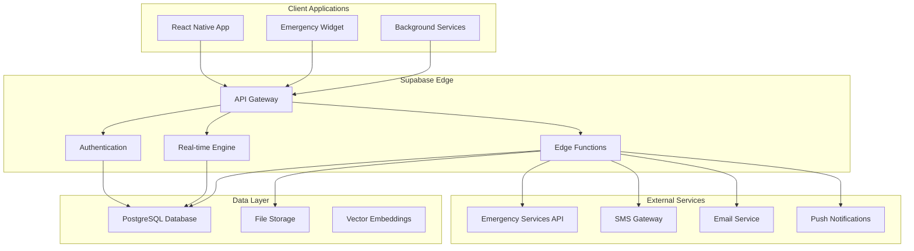

# Backend Architecture

<Info>
**Supabase-Powered Safety Platform:** Shelther's backend leverages Supabase's comprehensive platform to provide real-time emergency features, secure data management, and scalable infrastructure for safety-critical applications.
</Info>

## Backend Architecture Overview

Shelther's backend architecture is built on Supabase, providing a complete Backend-as-a-Service solution optimized for safety applications:

<CardGroup cols={2}>
  <Card title="PostgreSQL Database" icon="database">
    ACID-compliant database with PostGIS for location queries and Row Level Security for privacy
  </Card>
  <Card title="Real-time Engine" icon="bolt">
    WebSocket-based subscriptions for instant emergency alerts and location sharing
  </Card>
  <Card title="Edge Functions" icon="server">
    Serverless compute for emergency processing, integrations, and business logic
  </Card>
  <Card title="Authentication & Storage" icon="shield">
    JWT-based auth with MFA support and secure file storage for evidence collection
  </Card>
</CardGroup>

## Supabase Platform Components

### Core Services Architecture



### Database Architecture

<Steps>
  <Step title="PostgreSQL 15+ with Extensions">
    ACID-compliant database with PostGIS for spatial queries and advanced indexing for performance
  </Step>
  <Step title="Row Level Security (RLS)">
    Database-level security ensuring users can only access their own data and authorized shared data
  </Step>
  <Step title="Real-time Triggers">
    Database triggers that power real-time subscriptions for emergency alerts and location updates
  </Step>
  <Step title="Automated Backups">
    Point-in-time recovery with cross-region replication for disaster recovery
  </Step>
</Steps>

## Database Schema Design

### Core Safety Tables

<CodeGroup>
```sql User Management Schema
-- Core user table with privacy controls
CREATE TABLE users (
  id UUID DEFAULT gen_random_uuid() PRIMARY KEY,
  email VARCHAR UNIQUE NOT NULL,
  phone_number VARCHAR,
  full_name VARCHAR,
  created_at TIMESTAMP WITH TIME ZONE DEFAULT NOW(),
  updated_at TIMESTAMP WITH TIME ZONE DEFAULT NOW(),
  last_seen TIMESTAMP WITH TIME ZONE DEFAULT NOW(),
  privacy_settings JSONB DEFAULT '{
    "location_sharing": "contacts_only",
    "data_retention_days": 90,
    "anonymous_reporting": true
  }'::jsonb,
  emergency_settings JSONB DEFAULT '{
    "auto_escalation_minutes": 15,
    "silent_alarm_enabled": true,
    "location_precision": "exact"
  }'::jsonb
);

-- Safety profiles with emergency preferences
CREATE TABLE safety_profiles (
  id UUID DEFAULT gen_random_uuid() PRIMARY KEY,
  user_id UUID REFERENCES users(id) ON DELETE CASCADE,
  emergency_contacts JSONB DEFAULT '[]'::jsonb,
  safety_zones JSONB DEFAULT '[]'::jsonb,
  check_in_preferences JSONB DEFAULT '{
    "default_interval_minutes": 60,
    "safe_hours_start": "06:00",
    "safe_hours_end": "22:00"
  }'::jsonb,
  trigger_preferences JSONB DEFAULT '{
    "shake_sensitivity": "medium",
    "voice_activation": true,
    "button_sequence": "volume_power",
    "duress_code": null
  }'::jsonb,
  created_at TIMESTAMP WITH TIME ZONE DEFAULT NOW(),
  updated_at TIMESTAMP WITH TIME ZONE DEFAULT NOW()
);

-- Emergency contact relationships
CREATE TABLE emergency_contacts (
  id UUID DEFAULT gen_random_uuid() PRIMARY KEY,
  user_id UUID REFERENCES users(id) ON DELETE CASCADE,
  contact_user_id UUID REFERENCES users(id) ON DELETE CASCADE,
  contact_name VARCHAR NOT NULL,
  contact_phone VARCHAR NOT NULL,
  contact_email VARCHAR,
  relationship VARCHAR NOT NULL,
  priority_level INTEGER DEFAULT 1 CHECK (priority_level BETWEEN 1 AND 5),
  notification_preferences JSONB DEFAULT '{
    "sms": true,
    "email": true,
    "push": true,
    "call": false
  }'::jsonb,
  verification_status VARCHAR DEFAULT 'pending' CHECK (
    verification_status IN ('pending', 'verified', 'declined')
  ),
  verification_token VARCHAR,
  verified_at TIMESTAMP WITH TIME ZONE,
  created_at TIMESTAMP WITH TIME ZONE DEFAULT NOW()
);
```

```sql Location and Emergency Schema
-- Location tracking with privacy controls
CREATE TABLE location_updates (
  id UUID DEFAULT gen_random_uuid() PRIMARY KEY,
  user_id UUID REFERENCES users(id) ON DELETE CASCADE,
  latitude DECIMAL(10, 8) NOT NULL,
  longitude DECIMAL(11, 8) NOT NULL,
  accuracy REAL,
  altitude REAL,
  heading REAL,
  speed REAL,
  address TEXT,
  geolocation GEOGRAPHY(POINT, 4326),
  battery_level INTEGER CHECK (battery_level BETWEEN 0 AND 100),
  is_emergency BOOLEAN DEFAULT FALSE,
  is_background BOOLEAN DEFAULT FALSE,
  session_id UUID,
  timestamp TIMESTAMP WITH TIME ZONE DEFAULT NOW(),
  expires_at TIMESTAMP WITH TIME ZONE DEFAULT (NOW() + INTERVAL '24 hours')
);

-- Emergency alerts with escalation tracking
CREATE TABLE emergency_alerts (
  id UUID DEFAULT gen_random_uuid() PRIMARY KEY,
  user_id UUID REFERENCES users(id) ON DELETE CASCADE,
  alert_type VARCHAR NOT NULL CHECK (
    alert_type IN ('manual', 'automated', 'duress', 'check_in_missed', 'panic')
  ),
  trigger_method VARCHAR CHECK (
    trigger_method IN ('button', 'shake', 'voice', 'widget', 'auto_detection')
  ),
  status VARCHAR DEFAULT 'active' CHECK (
    status IN ('active', 'acknowledged', 'resolved', 'false_alarm', 'escalated')
  ),
  severity VARCHAR DEFAULT 'high' CHECK (
    severity IN ('low', 'medium', 'high', 'critical')
  ),
  location_id UUID REFERENCES location_updates(id),
  message TEXT,
  evidence_urls JSONB DEFAULT '[]'::jsonb,
  contacted_authorities BOOLEAN DEFAULT FALSE,
  escalation_level INTEGER DEFAULT 1 CHECK (escalation_level BETWEEN 1 AND 5),
  escalation_history JSONB DEFAULT '[]'::jsonb,
  resolved_at TIMESTAMP WITH TIME ZONE,
  created_at TIMESTAMP WITH TIME ZONE DEFAULT NOW(),
  updated_at TIMESTAMP WITH TIME ZONE DEFAULT NOW()
);

-- Check-in system for proactive safety
CREATE TABLE check_ins (
  id UUID DEFAULT gen_random_uuid() PRIMARY KEY,
  user_id UUID REFERENCES users(id) ON DELETE CASCADE,
  scheduled_time TIMESTAMP WITH TIME ZONE NOT NULL,
  actual_time TIMESTAMP WITH TIME ZONE,
  status VARCHAR DEFAULT 'pending' CHECK (
    status IN ('pending', 'completed', 'missed', 'late', 'cancelled')
  ),
  location_id UUID REFERENCES location_updates(id),
  activity_type VARCHAR,
  notes TEXT,
  grace_period_minutes INTEGER DEFAULT 15,
  auto_created BOOLEAN DEFAULT FALSE,
  reminder_sent BOOLEAN DEFAULT FALSE,
  escalation_triggered BOOLEAN DEFAULT FALSE,
  created_at TIMESTAMP WITH TIME ZONE DEFAULT NOW()
);
```
</CodeGroup>

### Advanced Schema Features

<Accordion title="Spatial Data with PostGIS">
**Geographic Capabilities:**
- Location-based queries with sub-meter accuracy
- Geofencing for safety zones and venue boundaries
- Distance calculations for emergency contact proximity
- Route analysis for journey monitoring

```sql
-- Enable PostGIS extension
CREATE EXTENSION IF NOT EXISTS "postgis";

-- Add spatial indexes for performance
CREATE INDEX idx_location_updates_geolocation 
  ON location_updates USING GIST (geolocation);

-- Safety zones with geofencing
CREATE TABLE safety_zones (
  id UUID DEFAULT gen_random_uuid() PRIMARY KEY,
  user_id UUID REFERENCES users(id) ON DELETE CASCADE,
  name VARCHAR NOT NULL,
  zone_type VARCHAR CHECK (zone_type IN ('home', 'work', 'safe_space', 'restricted')),
  boundary GEOGRAPHY(POLYGON, 4326) NOT NULL,
  radius_meters INTEGER,
  entry_notification BOOLEAN DEFAULT TRUE,
  exit_notification BOOLEAN DEFAULT TRUE,
  created_at TIMESTAMP WITH TIME ZONE DEFAULT NOW()
);

-- Spatial query examples
SELECT * FROM safety_zones 
WHERE ST_Contains(boundary, ST_SetSRID(ST_MakePoint(-74.0060, 40.7128), 4326));
```
</Accordion>

<Accordion title="Time-Series Optimization">
**Performance for Location Data:**
- Automatic data partitioning by time
- Efficient querying of location history
- Optimized storage for high-frequency updates
- Automated cleanup of expired data

```sql
-- Partition location_updates by month
CREATE TABLE location_updates_y2024m01 PARTITION OF location_updates
  FOR VALUES FROM ('2024-01-01') TO ('2024-02-01');

-- Automatic cleanup function
CREATE OR REPLACE FUNCTION cleanup_expired_locations()
RETURNS void AS $$
BEGIN
  DELETE FROM location_updates 
  WHERE expires_at < NOW() 
    AND is_emergency = FALSE;
END;
$$ LANGUAGE plpgsql;

-- Schedule cleanup every hour
SELECT cron.schedule('location-cleanup', '0 * * * *', 'SELECT cleanup_expired_locations();');
```
</Accordion>

## Row Level Security (RLS) Implementation

### Security Policies

<Note>
**Privacy by Default:** All tables implement RLS policies ensuring users can only access their own data, with carefully controlled sharing mechanisms for emergency contacts and safety features.
</Note>

<CodeGroup>
```sql User Data Security
-- Enable RLS on all tables
ALTER TABLE users ENABLE ROW LEVEL SECURITY;
ALTER TABLE safety_profiles ENABLE ROW LEVEL SECURITY;
ALTER TABLE emergency_contacts ENABLE ROW LEVEL SECURITY;
ALTER TABLE location_updates ENABLE ROW LEVEL SECURITY;
ALTER TABLE emergency_alerts ENABLE ROW LEVEL SECURITY;

-- Users can only access their own data
CREATE POLICY "Users can access own data" ON users
  FOR ALL USING (auth.uid() = id);

CREATE POLICY "Users can manage own safety profile" ON safety_profiles
  FOR ALL USING (auth.uid() = user_id);

CREATE POLICY "Users can manage own emergency contacts" ON emergency_contacts
  FOR ALL USING (auth.uid() = user_id);
```

```sql Shared Data Security
-- Emergency contacts can view user's location during emergencies
CREATE POLICY "Emergency contacts can view shared locations" ON location_updates
  FOR SELECT USING (
    auth.uid() IN (
      SELECT contact_user_id FROM emergency_contacts 
      WHERE user_id = location_updates.user_id 
        AND verification_status = 'verified'
    )
    AND (
      is_emergency = TRUE 
      OR EXISTS (
        SELECT 1 FROM location_shares 
        WHERE user_id = location_updates.user_id 
          AND shared_with_user_id = auth.uid()
          AND expires_at > NOW()
      )
    )
  );

-- Emergency alerts visible to verified contacts
CREATE POLICY "Contacts can view emergency alerts" ON emergency_alerts
  FOR SELECT USING (
    auth.uid() = user_id 
    OR auth.uid() IN (
      SELECT contact_user_id FROM emergency_contacts 
      WHERE user_id = emergency_alerts.user_id 
        AND verification_status = 'verified'
    )
  );
```
</CodeGroup>

### Dynamic Permissions

<Steps>
  <Step title="User-Controlled Sharing">
    Users can grant temporary location access to specific contacts with configurable expiration
  </Step>
  <Step title="Emergency Override">
    Automatic permission escalation during active emergency alerts for verified contacts
  </Step>
  <Step title="Granular Control">
    Different permission levels for location precision, history access, and alert visibility
  </Step>
  <Step title="Audit Trail">
    Complete logging of permission changes and data access for security monitoring
  </Step>
</Steps>

## Real-time Features

### Real-time Subscriptions

<CardGroup cols={2}>
  <Card title="Emergency Alerts" icon="bell">
    Instant notification to emergency contacts when alerts are triggered
  </Card>
  <Card title="Location Sharing" icon="map-pin">
    Real-time location updates for authorized contacts during active sessions
  </Card>
  <Card title="Check-in Status" icon="clock">
    Live updates on check-in completion and missed check-in alerts
  </Card>
  <Card title="Contact Responses" icon="message">
    Real-time acknowledgment and response tracking from emergency contacts
  </Card>
</CardGroup>

<CodeGroup>
```typescript Real-time Client Setup
import { supabase } from './supabase-client';

// Emergency alert subscription
export const subscribeToEmergencyAlerts = (userId: string, callback: (alert: EmergencyAlert) => void) => {
  return supabase
    .channel('emergency-alerts')
    .on(
      'postgres_changes',
      {
        event: 'INSERT',
        schema: 'public',
        table: 'emergency_alerts',
        filter: `user_id=eq.${userId}`,
      },
      (payload) => {
        callback(payload.new as EmergencyAlert);
      }
    )
    .on(
      'postgres_changes',
      {
        event: 'UPDATE',
        schema: 'public',
        table: 'emergency_alerts',
        filter: `user_id=eq.${userId}`,
      },
      (payload) => {
        callback(payload.new as EmergencyAlert);
      }
    )
    .subscribe();
};

// Location sharing subscription with battery optimization
export const subscribeToLocationUpdates = (
  userId: string, 
  callback: (location: LocationUpdate) => void,
  options: { highFrequency: boolean } = { highFrequency: false }
) => {
  const channel = supabase.channel('location-updates', {
    config: {
      // Optimize update frequency based on battery/emergency status
      throttle: options.highFrequency ? 0 : 1000,
    }
  });

  return channel
    .on(
      'postgres_changes',
      {
        event: 'INSERT',
        schema: 'public',
        table: 'location_updates',
        filter: `user_id=eq.${userId}`,
      },
      (payload) => {
        callback(payload.new as LocationUpdate);
      }
    )
    .subscribe();
};
```

```sql Real-time Database Functions
-- Function to notify emergency contacts
CREATE OR REPLACE FUNCTION notify_emergency_contacts()
RETURNS TRIGGER AS $$
DECLARE
  contact_record RECORD;
  notification_payload JSONB;
BEGIN
  -- Build notification payload
  notification_payload := jsonb_build_object(
    'alert_id', NEW.id,
    'user_id', NEW.user_id,
    'alert_type', NEW.alert_type,
    'severity', NEW.severity,
    'location', (
      SELECT jsonb_build_object(
        'latitude', latitude,
        'longitude', longitude,
        'address', address,
        'timestamp', timestamp
      )
      FROM location_updates 
      WHERE id = NEW.location_id
    ),
    'timestamp', NEW.created_at
  );

  -- Notify all verified emergency contacts
  FOR contact_record IN 
    SELECT * FROM emergency_contacts 
    WHERE user_id = NEW.user_id 
      AND verification_status = 'verified'
    ORDER BY priority_level ASC
  LOOP
    -- Send real-time notification
    PERFORM pg_notify(
      'emergency_alert_' || contact_record.contact_user_id::text,
      notification_payload::text
    );
  END LOOP;

  RETURN NEW;
END;
$$ LANGUAGE plpgsql;

-- Trigger for emergency alerts
CREATE TRIGGER trigger_notify_emergency_contacts
  AFTER INSERT ON emergency_alerts
  FOR EACH ROW
  EXECUTE FUNCTION notify_emergency_contacts();
```
</CodeGroup>

### Performance Optimization

<Accordion title="Real-time Performance Tuning">
**Connection Management:**
- Connection pooling with pgBouncer for high concurrency
- Automatic connection cleanup for inactive sessions
- Rate limiting to prevent subscription abuse
- Regional distribution for low latency

**Subscription Optimization:**
- Filtered subscriptions to reduce unnecessary traffic
- Batched updates for non-critical real-time data
- Automatic subscription cleanup
- Client-side deduplication

**Battery-Aware Updates:**
```typescript
export const createBatteryAwareSubscription = (
  userId: string,
  batteryLevel: number
) => {
  const updateInterval = batteryLevel > 50 ? 1000 : 
                        batteryLevel > 20 ? 5000 : 
                        15000; // Reduce frequency on low battery

  return supabase
    .channel('location-updates', {
      config: { throttle: updateInterval }
    })
    .subscribe();
};
```
</Accordion>

## Edge Functions

### Serverless Business Logic

<CardGroup cols={3}>
  <Card title="Emergency Processing" icon="zap">
    Immediate alert processing, contact notification, and escalation logic
  </Card>
  <Card title="Third-party Integrations" icon="link">
    SMS, email, emergency services, and mapping service integrations
  </Card>
  <Card title="AI & Analytics" icon="brain">
    Anomaly detection, risk assessment, and safety insights processing
  </Card>
</CardGroup>

<CodeGroup>
```typescript Emergency Alert Function
// supabase/functions/emergency-alert/index.ts
import { serve } from 'https://deno.land/std@0.168.0/http/server.ts';
import { createClient } from 'https://esm.sh/@supabase/supabase-js@2.38.0';

interface EmergencyRequest {
  userId: string;
  alertType: 'manual' | 'automated' | 'duress';
  location: {
    latitude: number;
    longitude: number;
    accuracy?: number;
  };
  triggerMethod: string;
  evidence?: string[];
}

serve(async (req) => {
  try {
    const { userId, alertType, location, triggerMethod, evidence }: EmergencyRequest = 
      await req.json();

    const supabase = createClient(
      Deno.env.get('SUPABASE_URL')!,
      Deno.env.get('SUPABASE_SERVICE_ROLE_KEY')!
    );

    // 1. Create location record
    const { data: locationData, error: locationError } = await supabase
      .from('location_updates')
      .insert({
        user_id: userId,
        latitude: location.latitude,
        longitude: location.longitude,
        accuracy: location.accuracy,
        is_emergency: true,
        geolocation: `POINT(${location.longitude} ${location.latitude})`
      })
      .select()
      .single();

    if (locationError) throw locationError;

    // 2. Create emergency alert
    const { data: alertData, error: alertError } = await supabase
      .from('emergency_alerts')
      .insert({
        user_id: userId,
        alert_type: alertType,
        trigger_method: triggerMethod,
        location_id: locationData.id,
        evidence_urls: evidence || [],
        status: 'active',
        severity: alertType === 'duress' ? 'critical' : 'high'
      })
      .select()
      .single();

    if (alertError) throw alertError;

    // 3. Get emergency contacts
    const { data: contacts } = await supabase
      .from('emergency_contacts')
      .select('*')
      .eq('user_id', userId)
      .eq('verification_status', 'verified')
      .order('priority_level');

    // 4. Send notifications in parallel
    const notificationPromises = contacts?.map(contact => 
      sendEmergencyNotification(contact, alertData, locationData)
    ) || [];

    await Promise.allSettled(notificationPromises);

    // 5. Schedule escalation
    await scheduleEscalation(alertData.id, userId);

    return new Response(
      JSON.stringify({ 
        success: true, 
        alertId: alertData.id,
        contactsNotified: contacts?.length || 0
      }),
      { headers: { 'Content-Type': 'application/json' } }
    );

  } catch (error) {
    console.error('Emergency alert error:', error);
    return new Response(
      JSON.stringify({ success: false, error: error.message }),
      { status: 500, headers: { 'Content-Type': 'application/json' } }
    );
  }
});

async function sendEmergencyNotification(
  contact: any, 
  alert: any, 
  location: any
) {
  const notificationData = {
    contactPhone: contact.contact_phone,
    contactEmail: contact.contact_email,
    userName: contact.contact_name,
    alertType: alert.alert_type,
    location: {
      latitude: location.latitude,
      longitude: location.longitude,
      address: location.address
    },
    timestamp: alert.created_at
  };

  // Send SMS if enabled
  if (contact.notification_preferences.sms) {
    await sendSMS(notificationData);
  }

  // Send email if enabled
  if (contact.notification_preferences.email) {
    await sendEmail(notificationData);
  }

  // Send push notification if user has app
  if (contact.contact_user_id && contact.notification_preferences.push) {
    await sendPushNotification(contact.contact_user_id, notificationData);
  }
}
```

```typescript Location Analytics Function
// supabase/functions/location-analytics/index.ts
import { serve } from 'https://deno.land/std@0.168.0/http/server.ts';

interface LocationAnalysisRequest {
  userId: string;
  locationHistory: LocationUpdate[];
  timeWindow: number; // hours
}

serve(async (req) => {
  try {
    const { userId, locationHistory, timeWindow }: LocationAnalysisRequest = 
      await req.json();

    // Analyze movement patterns for anomaly detection
    const analysis = await analyzeLocationPatterns(locationHistory, timeWindow);
    
    // Risk assessment based on location and time
    const riskAssessment = await calculateRiskScore(locationHistory);
    
    // Safety recommendations
    const recommendations = await generateSafetyRecommendations(
      analysis, 
      riskAssessment
    );

    return new Response(JSON.stringify({
      success: true,
      analysis: {
        movementPattern: analysis.pattern,
        anomaliesDetected: analysis.anomalies,
        riskScore: riskAssessment.score,
        riskFactors: riskAssessment.factors,
        recommendations: recommendations
      }
    }), {
      headers: { 'Content-Type': 'application/json' }
    });

  } catch (error) {
    return new Response(JSON.stringify({ 
      success: false, 
      error: error.message 
    }), {
      status: 500,
      headers: { 'Content-Type': 'application/json' }
    });
  }
});

async function analyzeLocationPatterns(locations: LocationUpdate[], timeWindow: number) {
  // Implementation for pattern analysis
  // - Speed anomalies
  // - Route deviations
  // - Unusual stop patterns
  // - Time-of-day irregularities
  
  return {
    pattern: 'normal',
    anomalies: [],
    confidence: 0.95
  };
}
```
</CodeGroup>

### Edge Function Deployment

<Steps>
  <Step title="Function Development">
    TypeScript/Deno functions with comprehensive error handling and logging
  </Step>
  <Step title="Testing Strategy">
    Local testing with Supabase CLI and automated integration tests
  </Step>
  <Step title="Deployment Pipeline">
    Automated deployment via GitHub Actions with environment promotion
  </Step>
  <Step title="Monitoring">
    Function performance monitoring with alerting for safety-critical functions
  </Step>
</Steps>

## API Design & Performance

### RESTful API Structure

<Accordion title="API Endpoint Organization">
**Authentication Endpoints:**
- `POST /auth/signup` - User registration with verification
- `POST /auth/signin` - Authentication with MFA support
- `POST /auth/refresh` - Token refresh and session management
- `POST /auth/signout` - Secure session termination

**Safety Management:**
- `POST /emergency/alert` - Trigger emergency alert
- `GET /emergency/alerts` - Retrieve alert history
- `PUT /emergency/alerts/{id}` - Update alert status
- `DELETE /emergency/alerts/{id}` - Cancel alert

**Location Services:**
- `POST /location/share` - Start location sharing session
- `GET /location/history` - Retrieve location history
- `PUT /location/update` - Manual location update
- `DELETE /location/share/{id}` - Stop sharing session

**Contact Management:**
- `POST /contacts/emergency` - Add emergency contact
- `GET /contacts/emergency` - List emergency contacts
- `PUT /contacts/{id}/verify` - Verify contact relationship
- `DELETE /contacts/{id}` - Remove emergency contact
</Accordion>

### Performance Optimization

<CardGroup cols={2}>
  <Card title="Query Optimization" icon="database">
    Strategic indexing, query caching, and connection pooling for sub-100ms responses
  </Card>
  <Card title="Caching Strategy" icon="clock">
    Multi-layer caching with Redis for frequently accessed safety data
  </Card>
  <Card title="Rate Limiting" icon="shield">
    Intelligent rate limiting with emergency bypass for safety-critical operations
  </Card>
  <Card title="Monitoring" icon="chart-line">
    Real-time performance monitoring with automatic scaling and alerting
  </Card>
</CardGroup>

<CodeGroup>
```sql Performance Indexes
-- Critical indexes for emergency response
CREATE INDEX CONCURRENTLY idx_emergency_alerts_user_status 
  ON emergency_alerts(user_id, status, created_at DESC);

CREATE INDEX CONCURRENTLY idx_location_updates_user_emergency 
  ON location_updates(user_id, is_emergency, timestamp DESC);

CREATE INDEX CONCURRENTLY idx_emergency_contacts_user_verified 
  ON emergency_contacts(user_id, verification_status, priority_level);

-- Spatial indexes for location queries
CREATE INDEX CONCURRENTLY idx_location_geolocation_gist 
  ON location_updates USING GIST(geolocation);

-- Partial indexes for active sessions
CREATE INDEX CONCURRENTLY idx_location_shares_active 
  ON location_shares(user_id, shared_with_user_id) 
  WHERE expires_at > NOW();
```

```typescript API Performance Configuration
// Database connection pooling
export const supabaseConfig = {
  db: {
    pooling: {
      min: 10,
      max: 100,
      acquireTimeoutMillis: 60000,
      createTimeoutMillis: 30000,
      destroyTimeoutMillis: 5000,
      idleTimeoutMillis: 30000,
      reapIntervalMillis: 1000,
    }
  },
  auth: {
    persistSession: true,
    autoRefreshToken: true,
    detectSessionInUrl: false
  },
  realtime: {
    params: {
      eventsPerSecond: 10,
      timeout: 30000
    }
  }
};

// Emergency bypass for rate limiting
export const emergencyRateLimit = {
  normal: { requests: 100, window: '15m' },
  emergency: { requests: 1000, window: '15m' }, // Higher limits during emergencies
  detection: (request: Request) => {
    return request.headers.get('x-emergency-context') === 'true';
  }
};
```
</CodeGroup>

## Monitoring & Observability

### Health Monitoring

<Note>
**24/7 Safety Monitoring:** All safety-critical components are monitored continuously with automatic alerting for any degradation that could impact emergency response capabilities.
</Note>

<Steps>
  <Step title="Database Health">
    Connection pool monitoring, query performance tracking, and replication lag alerts
  </Step>
  <Step title="Real-time Performance">
    Message delivery latency, subscription health, and connection stability monitoring
  </Step>
  <Step title="Edge Function Metrics">
    Function execution time, error rates, and cold start performance tracking
  </Step>
  <Step title="Emergency Response SLA">
    End-to-end alert processing time with automatic escalation for SLA breaches
  </Step>
</Steps>

### Logging Strategy

<CodeGroup>
```typescript Structured Logging
interface EmergencyLogEvent {
  timestamp: string;
  level: 'info' | 'warn' | 'error' | 'critical';
  event_type: 'alert_triggered' | 'contact_notified' | 'escalation_started';
  user_id: string;
  alert_id?: string;
  processing_time_ms: number;
  success: boolean;
  error_details?: string;
  metadata: {
    trigger_method?: string;
    notification_channels?: string[];
    location_accuracy?: number;
  };
}

export const logEmergencyEvent = (event: EmergencyLogEvent) => {
  // Structure logs for easy querying and alerting
  console.log(JSON.stringify({
    ...event,
    service: 'shelther-backend',
    environment: Deno.env.get('ENVIRONMENT'),
    instance_id: Deno.env.get('INSTANCE_ID')
  }));
};

// Usage in edge functions
await logEmergencyEvent({
  timestamp: new Date().toISOString(),
  level: 'info',
  event_type: 'alert_triggered',
  user_id: userId,
  alert_id: alertData.id,
  processing_time_ms: Date.now() - startTime,
  success: true,
  metadata: {
    trigger_method: triggerMethod,
    location_accuracy: location.accuracy
  }
});
```
</CodeGroup>

## Security Implementation

### Authentication & Authorization

<CardGroup cols={2}>
  <Card title="JWT Security" icon="key">
    Short-lived access tokens with secure refresh token rotation and automatic revocation
  </Card>
  <Card title="MFA Support" icon="smartphone">
    Time-based OTP and SMS verification with emergency bypass codes
  </Card>
  <Card title="Session Management" icon="clock">
    Device-specific sessions with anomaly detection and automatic security responses
  </Card>
  <Card title="Emergency Access" icon="unlock">
    Special authentication flows for emergency situations with enhanced security logging
  </Card>
</CardGroup>

### Data Encryption

<Accordion title="Encryption at Rest and in Transit">
**Database Encryption:**
- AES-256 encryption for all data at rest
- Transparent data encryption (TDE) for database files
- Encrypted backups with separate key management
- Field-level encryption for sensitive data

**Transport Security:**
- TLS 1.3 for all client-server communications
- Certificate pinning for mobile applications
- HSTS enforcement with long-duration policies
- Perfect Forward Secrecy (PFS) support

**Application-Level Encryption:**
```typescript
import { createCipheriv, createDecipheriv, randomBytes } from 'crypto';

export class FieldEncryption {
  private static readonly algorithm = 'aes-256-gcm';
  private static readonly keyLength = 32;
  
  static encrypt(text: string, key: Buffer): string {
    const iv = randomBytes(16);
    const cipher = createCipheriv(this.algorithm, key, iv);
    
    let encrypted = cipher.update(text, 'utf8', 'hex');
    encrypted += cipher.final('hex');
    
    const authTag = cipher.getAuthTag();
    
    return iv.toString('hex') + ':' + authTag.toString('hex') + ':' + encrypted;
  }
  
  static decrypt(encryptedText: string, key: Buffer): string {
    const parts = encryptedText.split(':');
    const iv = Buffer.from(parts[0], 'hex');
    const authTag = Buffer.from(parts[1], 'hex');
    const encrypted = parts[2];
    
    const decipher = createDecipheriv(this.algorithm, key, iv);
    decipher.setAuthTag(authTag);
    
    let decrypted = decipher.update(encrypted, 'hex', 'utf8');
    decrypted += decipher.final('utf8');
    
    return decrypted;
  }
}
```
</Accordion>

## Backup & Disaster Recovery

### Backup Strategy

<Steps>
  <Step title="Continuous Backups">
    Point-in-time recovery with 24-hour retention and hourly incremental backups
  </Step>
  <Step title="Cross-Region Replication">
    Real-time replication to secondary regions with automatic failover capabilities
  </Step>
  <Step title="Data Validation">
    Automated backup integrity checks and recovery testing procedures
  </Step>
  <Step title="Emergency Procedures">
    Documented manual recovery processes for catastrophic failure scenarios
  </Step>
</Steps>

### Business Continuity

<Warning>
**Safety-Critical Recovery:** Recovery procedures prioritize safety features first, ensuring emergency capabilities are restored within minutes of any system failure.
</Warning>

Recovery Priority Order:
1. **Authentication & User Access** (Target: 2 minutes)
2. **Emergency Alert System** (Target: 3 minutes)  
3. **Real-time Location Services** (Target: 5 minutes)
4. **Contact Management** (Target: 10 minutes)
5. **Historical Data & Analytics** (Target: 30 minutes)

---

## Next Steps

<CardGroup cols={3}>
  <Card title="Data Flow Architecture" icon="workflow" href="/architecture/data-flow">
    Learn how data flows through the system during normal and emergency operations
  </Card>
  <Card title="Security Design" icon="shield" href="/architecture/security-design">
    Deep dive into security architecture and privacy protection measures
  </Card>
  <Card title="Database Schema" icon="database" href="/architecture/database-schema">
    Complete database schema reference with relationship diagrams
  </Card>
</CardGroup>

<Info>
**Implementation Ready:** This backend architecture provides a complete foundation for building safety-critical applications. All components are designed for reliability, security, and performance at scale.
</Info>