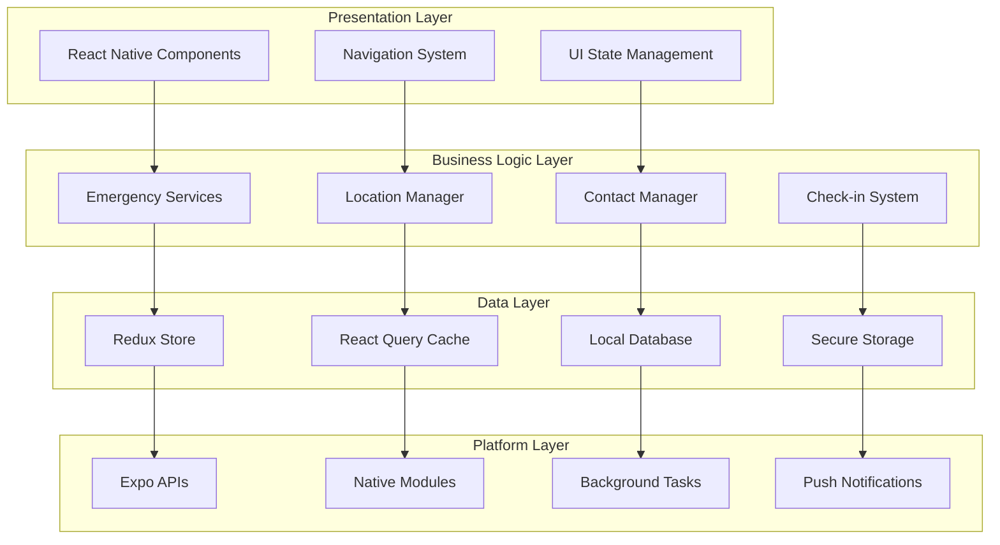

# Client Architecture

<Info>
**Safety-First Client Design:** The client architecture prioritizes reliability, offline functionality, and instant response times for emergency situations while maintaining excellent user experience.
</Info>

## Architecture Overview

Shelther's client architecture follows a layered approach optimized for safety applications:



## Project Structure

### Recommended Directory Organization

<CodeGroup>
```bash Complete Project Structure
src/
├── components/           # Reusable UI components
│   ├── ui/              # Basic UI components (buttons, inputs)
│   ├── safety/          # Safety-specific components
│   ├── forms/           # Form components with validation
│   └── navigation/      # Navigation-related components
├── screens/             # Screen components
│   ├── auth/           # Authentication screens
│   ├── main/           # Main app screens
│   ├── emergency/      # Emergency-related screens
│   ├── settings/       # Settings and preferences
│   └── onboarding/     # First-time user experience
├── services/           # Business logic and API calls
│   ├── supabase/       # Database operations
│   ├── location/       # Location services
│   ├── emergency/      # Emergency system logic
│   ├── notifications/  # Push notification handling
│   └── offline/        # Offline data management
├── hooks/              # Custom React hooks
│   ├── useLocation.ts  # Location tracking hook
│   ├── useEmergency.ts # Emergency state management
│   └── useContacts.ts  # Contact management
├── store/              # State management
│   ├── slices/         # Redux Toolkit slices
│   ├── selectors/      # Reusable selectors
│   └── middleware/     # Custom middleware
├── types/              # TypeScript type definitions
│   ├── api.ts          # API response types
│   ├── safety.ts       # Safety-related types
│   └── navigation.ts   # Navigation types
├── utils/              # Utility functions
│   ├── validation.ts   # Input validation
│   ├── formatting.ts   # Data formatting
│   └── constants.ts    # App constants
├── config/             # Configuration files
│   ├── environment.ts  # Environment management
│   ├── permissions.ts  # Permission handling
│   └── theme.ts        # UI theme configuration
└── test/               # Test utilities and mocks
    ├── mocks/          # Mock data and services
    ├── utils/          # Test helper functions
    └── setup.ts        # Test configuration
```
</CodeGroup>

## State Management Architecture

### Redux Toolkit Implementation

<CodeGroup>
```typescript Store Configuration
// src/store/index.ts
import { configureStore } from '@reduxjs/toolkit';
import { persistStore, persistReducer } from 'redux-persist';
import AsyncStorage from '@react-native-async-storage/async-storage';
import { encryptTransform } from 'redux-persist-transform-encrypt';

// Import slices
import emergencySlice from './slices/emergencySlice';
import locationSlice from './slices/locationSlice';
import contactsSlice from './slices/contactsSlice';
import authSlice from './slices/authSlice';
import settingsSlice from './slices/settingsSlice';

// Encryption for sensitive data
const encryptor = encryptTransform({
  secretKey: 'shelther-safety-key',
  onError: (error) => {
    console.error('Redux persist encryption error:', error);
  },
});

// Persist configuration
const persistConfig = {
  key: 'root',
  storage: AsyncStorage,
  transforms: [encryptor],
  whitelist: ['auth', 'settings', 'contacts'], // Only persist necessary data
  blacklist: ['emergency', 'location'], // Never persist sensitive real-time data
};

const rootReducer = combineReducers({
  emergency: emergencySlice.reducer,
  location: locationSlice.reducer,
  contacts: contactsSlice.reducer,
  auth: authSlice.reducer,
  settings: settingsSlice.reducer,
});

const persistedReducer = persistReducer(persistConfig, rootReducer);

export const store = configureStore({
  reducer: persistedReducer,
  middleware: (getDefaultMiddleware) =>
    getDefaultMiddleware({
      serializableCheck: {
        ignoredActions: [
          'persist/PERSIST',
          'persist/REHYDRATE',
          'persist/PAUSE',
          'persist/PURGE',
          'persist/REGISTER',
        ],
      },
    }).concat([
      // Custom middleware for safety logging
      emergencyLoggingMiddleware,
      locationTrackingMiddleware,
    ]),
  devTools: __DEV__,
});

export const persistor = persistStore(store);
export type RootState = ReturnType<typeof store.getState>;
export type AppDispatch = typeof store.dispatch;
```

```typescript Emergency State Slice
// src/store/slices/emergencySlice.ts
import { createSlice, createAsyncThunk, PayloadAction } from '@reduxjs/toolkit';
import { EmergencyAlert, EmergencyState } from '../../types/safety';
import { EmergencyService } from '../../services/emergency/EmergencyService';

interface EmergencySliceState {
  activeAlert: EmergencyAlert | null;
  alertHistory: EmergencyAlert[];
  isTriggering: boolean;
  lastTriggerAttempt: string | null;
  escalationLevel: number;
  contactResponses: Record<string, ContactResponse>;
  offlineAlerts: EmergencyAlert[];
}

const initialState: EmergencySliceState = {
  activeAlert: null,
  alertHistory: [],
  isTriggering: false,
  lastTriggerAttempt: null,
  escalationLevel: 0,
  contactResponses: {},
  offlineAlerts: [],
};

// Async thunks for emergency operations
export const triggerEmergency = createAsyncThunk(
  'emergency/trigger',
  async (params: {
    type: EmergencyAlert['alert_type'];
    location?: Location;
    message?: string;
  }) => {
    try {
      const alert = await EmergencyService.triggerEmergency(
        params.type,
        params.location,
        params.message
      );
      return alert;
    } catch (error) {
      // Store offline if network unavailable
      const offlineAlert: EmergencyAlert = {
        id: `offline-${Date.now()}`,
        user_id: 'current-user',
        alert_type: params.type,
        status: 'active',
        location: params.location,
        message: params.message,
        evidence: {},
        contacts_notified: [],
        contact_responses: {},
        triggered_at: new Date().toISOString(),
      };
      throw { offline: true, alert: offlineAlert };
    }
  }
);

export const resolveEmergency = createAsyncThunk(
  'emergency/resolve',
  async (alertId: string) => {
    await EmergencyService.resolveEmergency(alertId);
    return alertId;
  }
);

const emergencySlice = createSlice({
  name: 'emergency',
  initialState,
  reducers: {
    updateContactResponse: (state, action: PayloadAction<{
      alertId: string;
      contactId: string;
      response: ContactResponse;
    }>) => {
      const { alertId, contactId, response } = action.payload;
      if (state.activeAlert?.id === alertId) {
        state.contactResponses[contactId] = response;
      }
    },
    incrementEscalationLevel: (state) => {
      state.escalationLevel += 1;
    },
    resetEmergencyState: (state) => {
      state.activeAlert = null;
      state.isTriggering = false;
      state.escalationLevel = 0;
      state.contactResponses = {};
    },
    addOfflineAlert: (state, action: PayloadAction<EmergencyAlert>) => {
      state.offlineAlerts.push(action.payload);
    },
    removeOfflineAlert: (state, action: PayloadAction<string>) => {
      state.offlineAlerts = state.offlineAlerts.filter(
        alert => alert.id !== action.payload
      );
    },
  },
  extraReducers: (builder) => {
    builder
      .addCase(triggerEmergency.pending, (state) => {
        state.isTriggering = true;
        state.lastTriggerAttempt = new Date().toISOString();
      })
      .addCase(triggerEmergency.fulfilled, (state, action) => {
        state.isTriggering = false;
        state.activeAlert = action.payload;
        state.alertHistory.unshift(action.payload);
        state.escalationLevel = 1;
      })
      .addCase(triggerEmergency.rejected, (state, action) => {
        state.isTriggering = false;
        // Handle offline scenario
        if (action.error.offline) {
          state.offlineAlerts.push(action.error.alert);
        }
      })
      .addCase(resolveEmergency.fulfilled, (state, action) => {
        if (state.activeAlert?.id === action.payload) {
          state.activeAlert = null;
          state.escalationLevel = 0;
          state.contactResponses = {};
        }
      });
  },
});

export const {
  updateContactResponse,
  incrementEscalationLevel,
  resetEmergencyState,
  addOfflineAlert,
  removeOfflineAlert,
} = emergencySlice.actions;

export default emergencySlice;
```
</CodeGroup>

### React Query for Server State

<CodeGroup>
```typescript Server State Management
// src/hooks/queries/useEmergencyQueries.ts
import { useQuery, useMutation, useQueryClient } from '@tanstack/react-query';
import { EmergencyService } from '../../services/emergency/EmergencyService';
import { useAppSelector } from '../redux';

export const useActiveEmergencies = () => {
  const userId = useAppSelector(state => state.auth.user?.id);
  
  return useQuery({
    queryKey: ['emergencies', 'active', userId],
    queryFn: () => EmergencyService.getActiveEmergencies(userId!),
    enabled: !!userId,
    refetchInterval: 30000, // Refetch every 30 seconds
    staleTime: 0, // Always consider stale for safety data
    retry: (failureCount, error) => {
      // More aggressive retries for emergency data
      return failureCount < 5;
    },
  });
};

export const useEmergencyMutation = () => {
  const queryClient = useQueryClient();
  
  return useMutation({
    mutationFn: EmergencyService.triggerEmergency,
    onSuccess: (data) => {
      // Invalidate and refetch emergency queries
      queryClient.invalidateQueries({ queryKey: ['emergencies'] });
      
      // Optimistically update the cache
      queryClient.setQueryData(['emergencies', 'active'], (old: any) => {
        return old ? [data, ...old] : [data];
      });
    },
    onError: (error) => {
      console.error('Emergency trigger failed:', error);
      // Handle offline storage here
    },
  });
};

export const useEmergencySubscription = (userId: string) => {
  const queryClient = useQueryClient();
  
  React.useEffect(() => {
    const subscription = EmergencyService.subscribeToEmergencyUpdates(
      userId,
      (alert) => {
        // Update React Query cache with real-time data
        queryClient.setQueryData(['emergencies', 'active', userId], (old: any) => {
          if (!old) return [alert];
          
          const existingIndex = old.findIndex((a: any) => a.id === alert.id);
          if (existingIndex >= 0) {
            const updated = [...old];
            updated[existingIndex] = alert;
            return updated;
          }
          return [alert, ...old];
        });
      }
    );
    
    return () => {
      subscription.unsubscribe();
    };
  }, [userId, queryClient]);
};
```
</CodeGroup>

## Component Architecture

### Safety-Specific Components

<CardGroup cols={2}>
  <Card title="Emergency Components" icon="exclamation-triangle">
    Emergency button, alert displays, contact notification UI, and escalation interfaces
  </Card>
  <Card title="Location Components" icon="map-pin">
    Location sharing controls, map displays, geofence management, and tracking indicators
  </Card>
  <Card title="Contact Components" icon="users">
    Emergency contact management, verification flows, and communication preferences
  </Card>
  <Card title="Check-in Components" icon="clock">
    Scheduled check-in interfaces, reminder displays, and status indicators
  </Card>
</CardGroup>

<CodeGroup>
```tsx Emergency Button Component
// src/components/safety/EmergencyButton.tsx
import React, { useState, useRef, useCallback } from 'react';
import {
  View,
  Text,
  StyleSheet,
  Animated,
  PanResponder,
  Vibration,
} from 'react-native';
import { useAppDispatch, useAppSelector } from '../../hooks/redux';
import { triggerEmergency } from '../../store/slices/emergencySlice';
import { useLocation } from '../../hooks/useLocation';

interface EmergencyButtonProps {
  size?: number;
  holdDuration?: number;
  onEmergencyTriggered?: () => void;
}

export const EmergencyButton: React.FC<EmergencyButtonProps> = ({
  size = 200,
  holdDuration = 3000,
  onEmergencyTriggered,
}) => {
  const dispatch = useAppDispatch();
  const { currentLocation } = useLocation();
  const { isTriggering } = useAppSelector(state => state.emergency);
  
  const [progress, setProgress] = useState(0);
  const [isPressed, setIsPressed] = useState(false);
  
  const progressAnim = useRef(new Animated.Value(0)).current;
  const scaleAnim = useRef(new Animated.Value(1)).current;
  const progressTimer = useRef<NodeJS.Timeout | null>(null);

  const handleEmergencyTrigger = useCallback(async () => {
    try {
      Vibration.vibrate([0, 100, 100, 100]); // Success pattern
      
      await dispatch(triggerEmergency({
        type: 'manual',
        location: currentLocation,
        message: 'Emergency triggered via app button'
      })).unwrap();
      
      onEmergencyTriggered?.();
    } catch (error) {
      console.error('Emergency trigger failed:', error);
      Vibration.vibrate(1000); // Error pattern
    }
  }, [dispatch, currentLocation, onEmergencyTriggered]);

  const panResponder = PanResponder.create({
    onStartShouldSetPanResponder: () => !isTriggering,
    onMoveShouldSetPanResponder: () => false,
    
    onPanResponderGrant: () => {
      setIsPressed(true);
      setProgress(0);
      
      Vibration.vibrate(50); // Initial feedback
      
      // Scale animation
      Animated.spring(scaleAnim, {
        toValue: 0.95,
        useNativeDriver: true,
      }).start();
      
      // Progress animation
      Animated.timing(progressAnim, {
        toValue: 1,
        duration: holdDuration,
        useNativeDriver: false,
      }).start(({ finished }) => {
        if (finished && isPressed) {
          handleEmergencyTrigger();
        }
      });
      
      // Progress updates
      const startTime = Date.now();
      progressTimer.current = setInterval(() => {
        const elapsed = Date.now() - startTime;
        const newProgress = Math.min(elapsed / holdDuration, 1);
        setProgress(newProgress);
        
        // Haptic feedback at milestones
        if (newProgress >= 0.5 && newProgress < 0.52) {
          Vibration.vibrate(25);
        }
        if (newProgress >= 0.8 && newProgress < 0.82) {
          Vibration.vibrate(25);
        }
        
        if (newProgress >= 1) {
          clearInterval(progressTimer.current!);
        }
      }, 50);
    },
    
    onPanResponderRelease: () => {
      setIsPressed(false);
      setProgress(0);
      
      // Reset animations
      Animated.spring(scaleAnim, {
        toValue: 1,
        useNativeDriver: true,
      }).start();
      
      progressAnim.stopAnimation();
      progressAnim.setValue(0);
      
      if (progressTimer.current) {
        clearInterval(progressTimer.current);
        progressTimer.current = null;
      }
    },
  });

  const progressPercentage = Math.round(progress * 100);

  return (
    <View style={styles.container}>
      <Animated.View
        style={[
          styles.buttonContainer,
          {
            width: size,
            height: size,
            transform: [{ scale: scaleAnim }],
          },
        ]}
        {...panResponder.panHandlers}
      >
        <View style={[styles.button, { width: size, height: size }]}>
          {/* Progress indicator */}
          {isPressed && (
            <Animated.View
              style={[
                styles.progressFill,
                {
                  height: progressAnim.interpolate({
                    inputRange: [0, 1],
                    outputRange: [0, size],
                  }),
                },
              ]}
            />
          )}
          
          {/* Button content */}
          <View style={styles.content}>
            <Text style={[styles.sosText, { fontSize: size * 0.15 }]}>
              SOS
            </Text>
            <Text style={[styles.instructionText, { fontSize: size * 0.08 }]}>
              {isTriggering 
                ? 'SENDING...' 
                : isPressed 
                  ? `${progressPercentage}%` 
                  : 'HOLD'
              }
            </Text>
          </View>
        </View>
      </Animated.View>
      
      <Text style={styles.helpText}>
        {isTriggering 
          ? 'Sending emergency alert...'
          : isPressed 
            ? 'Keep holding to trigger emergency alert' 
            : 'Press and hold to activate emergency'
        }
      </Text>
    </View>
  );
};

const styles = StyleSheet.create({
  container: {
    alignItems: 'center',
    justifyContent: 'center',
  },
  buttonContainer: {
    borderRadius: 1000,
    elevation: 10,
    shadowColor: '#FF4757',
    shadowOffset: { width: 0, height: 4 },
    shadowOpacity: 0.3,
    shadowRadius: 8,
  },
  button: {
    borderRadius: 1000,
    backgroundColor: '#FF4757',
    justifyContent: 'center',
    alignItems: 'center',
    position: 'relative',
    overflow: 'hidden',
  },
  progressFill: {
    position: 'absolute',
    bottom: 0,
    left: 0,
    right: 0,
    backgroundColor: 'rgba(255, 255, 255, 0.3)',
    borderRadius: 1000,
  },
  content: {
    alignItems: 'center',
    justifyContent: 'center',
    zIndex: 1,
  },
  sosText: {
    color: 'white',
    fontWeight: 'bold',
    letterSpacing: 2,
  },
  instructionText: {
    color: 'rgba(255, 255, 255, 0.9)',
    fontWeight: '600',
    marginTop: 4,
  },
  helpText: {
    marginTop: 20,
    fontSize: 16,
    color: '#666',
    textAlign: 'center',
    fontWeight: '500',
    maxWidth: 300,
  },
});
```
</CodeGroup>

## Background Services Architecture

### Location Tracking Service

<CodeGroup>
```typescript Background Location Service
// src/services/location/BackgroundLocationService.ts
import * as Location from 'expo-location';
import * as TaskManager from 'expo-task-manager';
import { store } from '../../store';
import { updateLocation } from '../../store/slices/locationSlice';
import { checkForEmergencyConditions } from '../emergency/EmergencyDetectionService';

const BACKGROUND_LOCATION_TASK = 'background-location-task';

TaskManager.defineTask(BACKGROUND_LOCATION_TASK, ({ data, error }) => {
  if (error) {
    console.error('Background location task error:', error);
    return;
  }

  if (data) {
    const { locations } = data as { locations: Location.LocationObject[] };
    
    locations.forEach(async (location) => {
      // Update Redux store
      store.dispatch(updateLocation({
        latitude: location.coords.latitude,
        longitude: location.coords.longitude,
        accuracy: location.coords.accuracy || 0,
        timestamp: new Date(location.timestamp).toISOString(),
        speed: location.coords.speed || 0,
        heading: location.coords.heading || 0,
      }));

      // Check for emergency conditions
      const emergencyDetected = await checkForEmergencyConditions(location);
      if (emergencyDetected) {
        // Trigger automatic emergency alert
        store.dispatch(triggerEmergency({
          type: 'automatic',
          location: {
            latitude: location.coords.latitude,
            longitude: location.coords.longitude,
            accuracy: location.coords.accuracy || 0,
          },
          message: 'Automatic emergency detected via location monitoring'
        }));
      }

      // Store location update in database
      await storeLocationUpdate(location);
    });
  }
});

export class BackgroundLocationService {
  private static isActive = false;
  
  static async startBackgroundTracking(): Promise<void> {
    if (this.isActive) {
      console.log('Background location tracking already active');
      return;
    }

    try {
      // Request permissions
      const { status } = await Location.requestBackgroundPermissionsAsync();
      if (status !== 'granted') {
        throw new Error('Background location permission not granted');
      }

      // Get current battery optimization settings
      const batteryLevel = await this.getBatteryLevel();
      const locationOptions = this.getLocationOptionsForBattery(batteryLevel);

      // Start background location updates
      await Location.startLocationUpdatesAsync(BACKGROUND_LOCATION_TASK, {
        accuracy: locationOptions.accuracy,
        timeInterval: locationOptions.timeInterval,
        distanceInterval: locationOptions.distanceInterval,
        showsBackgroundLocationIndicator: true,
        foregroundService: {
          notificationTitle: 'Shelther Safety Monitoring',
          notificationBody: 'Location monitoring active for your safety',
          notificationColor: '#FF5A5A',
        },
      });

      this.isActive = true;
      console.log('Background location tracking started');
    } catch (error) {
      console.error('Failed to start background location tracking:', error);
      throw error;
    }
  }

  static async stopBackgroundTracking(): Promise<void> {
    try {
      await Location.stopLocationUpdatesAsync(BACKGROUND_LOCATION_TASK);
      this.isActive = false;
      console.log('Background location tracking stopped');
    } catch (error) {
      console.error('Failed to stop background location tracking:', error);
    }
  }

  private static async getBatteryLevel(): Promise<number> {
    // Note: Implement battery level detection
    return 100; // Default to full battery
  }

  private static getLocationOptionsForBattery(batteryLevel: number) {
    if (batteryLevel > 50) {
      return {
        accuracy: Location.Accuracy.High,
        timeInterval: 30000,      // 30 seconds
        distanceInterval: 50,     // 50 meters
      };
    } else if (batteryLevel > 20) {
      return {
        accuracy: Location.Accuracy.Balanced,
        timeInterval: 120000,     // 2 minutes
        distanceInterval: 100,    // 100 meters
      };
    } else {
      return {
        accuracy: Location.Accuracy.Low,
        timeInterval: 300000,     // 5 minutes
        distanceInterval: 200,    // 200 meters
      };
    }
  }

  static isBackgroundTrackingActive(): boolean {
    return this.isActive;
  }
}

async function storeLocationUpdate(location: Location.LocationObject): Promise<void> {
  try {
    // Store in local database for offline access
    await storeLocationLocally(location);
    
    // Sync with server when online
    await syncLocationWithServer(location);
  } catch (error) {
    console.error('Failed to store location update:', error);
  }
}
```
</CodeGroup>

## Offline Capabilities

### Offline Data Management

<Steps>
  <Step title="Local Database">
    SQLite database for storing critical safety data, emergency contacts, and location history offline
  </Step>
  <Step title="Sync Queue">
    Queue system for storing actions performed offline and syncing when connection returns
  </Step>
  <Step title="Conflict Resolution">
    Smart merge strategies for handling data conflicts between local and server state
  </Step>
  <Step title="Emergency Fallbacks">
    SMS and local alerts when internet connectivity is unavailable
  </Step>
</Steps>

<CodeGroup>
```typescript Offline Storage Service
// src/services/offline/OfflineStorageService.ts
import * as SQLite from 'expo-sqlite';
import { EmergencyAlert, LocationUpdate, Contact } from '../../types/safety';

export class OfflineStorageService {
  private static db: SQLite.SQLiteDatabase;

  static async initialize(): Promise<void> {
    this.db = await SQLite.openDatabaseAsync('shelther_offline.db');
    
    await this.createTables();
    await this.setupIndexes();
  }

  private static async createTables(): Promise<void> {
    // Emergency alerts table
    await this.db.execAsync(`
      CREATE TABLE IF NOT EXISTS emergency_alerts (
        id TEXT PRIMARY KEY,
        user_id TEXT NOT NULL,
        alert_type TEXT NOT NULL,
        status TEXT NOT NULL,
        latitude REAL,
        longitude REAL,
        accuracy REAL,
        message TEXT,
        evidence TEXT,
        contacts_notified TEXT,
        triggered_at TEXT NOT NULL,
        synced INTEGER DEFAULT 0,
        created_at TEXT DEFAULT CURRENT_TIMESTAMP
      );
    `);

    // Location updates table
    await this.db.execAsync(`
      CREATE TABLE IF NOT EXISTS location_updates (
        id TEXT PRIMARY KEY,
        user_id TEXT NOT NULL,
        latitude REAL NOT NULL,
        longitude REAL NOT NULL,
        accuracy REAL,
        speed REAL,
        heading REAL,
        battery_level INTEGER,
        is_emergency INTEGER DEFAULT 0,
        timestamp TEXT NOT NULL,
        synced INTEGER DEFAULT 0,
        created_at TEXT DEFAULT CURRENT_TIMESTAMP
      );
    `);

    // Emergency contacts table
    await this.db.execAsync(`
      CREATE TABLE IF NOT EXISTS emergency_contacts (
        id TEXT PRIMARY KEY,
        user_id TEXT NOT NULL,
        name TEXT NOT NULL,
        phone_number TEXT NOT NULL,
        email TEXT,
        relationship TEXT,
        priority INTEGER DEFAULT 1,
        verified INTEGER DEFAULT 0,
        created_at TEXT DEFAULT CURRENT_TIMESTAMP
      );
    `);

    // Sync queue for offline actions
    await this.db.execAsync(`
      CREATE TABLE IF NOT EXISTS sync_queue (
        id INTEGER PRIMARY KEY AUTOINCREMENT,
        action_type TEXT NOT NULL,
        table_name TEXT NOT NULL,
        record_id TEXT NOT NULL,
        data TEXT NOT NULL,
        created_at TEXT DEFAULT CURRENT_TIMESTAMP
      );
    `);
  }

  private static async setupIndexes(): Promise<void> {
    await this.db.execAsync(`
      CREATE INDEX IF NOT EXISTS idx_emergency_alerts_user_time 
      ON emergency_alerts(user_id, triggered_at DESC);
    `);
    
    await this.db.execAsync(`
      CREATE INDEX IF NOT EXISTS idx_location_updates_user_time 
      ON location_updates(user_id, timestamp DESC);
    `);
    
    await this.db.execAsync(`
      CREATE INDEX IF NOT EXISTS idx_sync_queue_created 
      ON sync_queue(created_at ASC);
    `);
  }

  // Emergency alert operations
  static async storeEmergencyAlert(alert: EmergencyAlert): Promise<void> {
    await this.db.runAsync(
      `INSERT OR REPLACE INTO emergency_alerts 
       (id, user_id, alert_type, status, latitude, longitude, accuracy, 
        message, evidence, contacts_notified, triggered_at) 
       VALUES (?, ?, ?, ?, ?, ?, ?, ?, ?, ?, ?)`,
      [
        alert.id,
        alert.user_id,
        alert.alert_type,
        alert.status,
        alert.location?.latitude || null,
        alert.location?.longitude || null,
        alert.location?.accuracy || null,
        alert.message || null,
        JSON.stringify(alert.evidence),
        JSON.stringify(alert.contacts_notified),
        alert.triggered_at,
      ]
    );
  }

  static async getUnsyncdEmergencyAlerts(): Promise<EmergencyAlert[]> {
    const result = await this.db.getAllAsync(
      'SELECT * FROM emergency_alerts WHERE synced = 0 ORDER BY triggered_at DESC'
    );
    
    return result.map((row: any) => ({
      id: row.id,
      user_id: row.user_id,
      alert_type: row.alert_type,
      status: row.status,
      location: row.latitude ? {
        latitude: row.latitude,
        longitude: row.longitude,
        accuracy: row.accuracy,
      } : undefined,
      message: row.message,
      evidence: JSON.parse(row.evidence || '{}'),
      contacts_notified: JSON.parse(row.contacts_notified || '[]'),
      contact_responses: {},
      triggered_at: row.triggered_at,
    }));
  }

  static async markEmergencyAlertSynced(alertId: string): Promise<void> {
    await this.db.runAsync(
      'UPDATE emergency_alerts SET synced = 1 WHERE id = ?',
      [alertId]
    );
  }

  // Location update operations
  static async storeLocationUpdate(location: LocationUpdate): Promise<void> {
    await this.db.runAsync(
      `INSERT INTO location_updates 
       (id, user_id, latitude, longitude, accuracy, speed, heading, 
        battery_level, is_emergency, timestamp) 
       VALUES (?, ?, ?, ?, ?, ?, ?, ?, ?, ?)`,
      [
        location.id,
        location.user_id,
        location.latitude,
        location.longitude,
        location.accuracy,
        location.speed || null,
        location.heading || null,
        location.battery_level || null,
        location.is_emergency ? 1 : 0,
        location.timestamp,
      ]
    );
  }

  static async getRecentLocationUpdates(
    userId: string, 
    limit: number = 100
  ): Promise<LocationUpdate[]> {
    const result = await this.db.getAllAsync(
      `SELECT * FROM location_updates 
       WHERE user_id = ? 
       ORDER BY timestamp DESC 
       LIMIT ?`,
      [userId, limit]
    );
    
    return result.map((row: any) => ({
      id: row.id,
      user_id: row.user_id,
      latitude: row.latitude,
      longitude: row.longitude,
      accuracy: row.accuracy,
      speed: row.speed,
      heading: row.heading,
      battery_level: row.battery_level,
      is_emergency: row.is_emergency === 1,
      timestamp: row.timestamp,
    }));
  }

  // Emergency contacts operations
  static async storeEmergencyContact(contact: Contact): Promise<void> {
    await this.db.runAsync(
      `INSERT OR REPLACE INTO emergency_contacts 
       (id, user_id, name, phone_number, email, relationship, priority, verified) 
       VALUES (?, ?, ?, ?, ?, ?, ?, ?)`,
      [
        contact.id,
        contact.user_id,
        contact.name,
        contact.phone_number,
        contact.email || null,
        contact.relationship,
        contact.priority,
        contact.verified ? 1 : 0,
      ]
    );
  }

  static async getEmergencyContacts(userId: string): Promise<Contact[]> {
    const result = await this.db.getAllAsync(
      `SELECT * FROM emergency_contacts 
       WHERE user_id = ? 
       ORDER BY priority ASC`,
      [userId]
    );
    
    return result.map((row: any) => ({
      id: row.id,
      user_id: row.user_id,
      name: row.name,
      phone_number: row.phone_number,
      email: row.email,
      relationship: row.relationship,
      priority: row.priority,
      verified: row.verified === 1,
    }));
  }

  // Sync queue operations
  static async addToSyncQueue(
    actionType: string,
    tableName: string,
    recordId: string,
    data: any
  ): Promise<void> {
    await this.db.runAsync(
      `INSERT INTO sync_queue (action_type, table_name, record_id, data) 
       VALUES (?, ?, ?, ?)`,
      [actionType, tableName, recordId, JSON.stringify(data)]
    );
  }

  static async getSyncQueue(): Promise<Array<{
    id: number;
    actionType: string;
    tableName: string;
    recordId: string;
    data: any;
    createdAt: string;
  }>> {
    const result = await this.db.getAllAsync(
      'SELECT * FROM sync_queue ORDER BY created_at ASC'
    );
    
    return result.map((row: any) => ({
      id: row.id,
      actionType: row.action_type,
      tableName: row.table_name,
      recordId: row.record_id,
      data: JSON.parse(row.data),
      createdAt: row.created_at,
    }));
  }

  static async removeSyncQueueItem(id: number): Promise<void> {
    await this.db.runAsync('DELETE FROM sync_queue WHERE id = ?', [id]);
  }

  // Database maintenance
  static async cleanupOldData(): Promise<void> {
    const thirtyDaysAgo = new Date();
    thirtyDaysAgo.setDate(thirtyDaysAgo.getDate() - 30);
    const cutoffDate = thirtyDaysAgo.toISOString();

    // Keep emergency alerts longer (90 days)
    const ninetyDaysAgo = new Date();
    ninetyDaysAgo.setDate(ninetyDaysAgo.getDate() - 90);
    const emergencyCutoff = ninetyDaysAgo.toISOString();

    await this.db.runAsync(
      'DELETE FROM location_updates WHERE timestamp < ? AND synced = 1',
      [cutoffDate]
    );

    await this.db.runAsync(
      'DELETE FROM emergency_alerts WHERE triggered_at < ? AND synced = 1',
      [emergencyCutoff]
    );

    await this.db.runAsync(
      'DELETE FROM sync_queue WHERE created_at < ?',
      [cutoffDate]
    );
  }
}
```
</CodeGroup>

## Performance Optimization

### Memory Management

<Accordion title="Memory Optimization Strategies">
**Component Optimization:**
- Memoization with React.memo for expensive components
- useMemo and useCallback for expensive calculations
- Lazy loading for non-critical screens
- Image optimization and caching

**State Management:**
- Selective Redux subscriptions to prevent unnecessary re-renders
- Normalization of state shape to reduce memory usage
- Cleanup of old state data and listeners
- Efficient selector patterns

**Network Optimization:**
- Request deduplication and caching
- Background sync with exponential backoff
- Compression and payload optimization
- Connection pooling and reuse
</Accordion>

<CodeGroup>
```typescript Performance Monitoring
// src/utils/performance/PerformanceMonitor.ts
import { InteractionManager } from 'react-native';

export class PerformanceMonitor {
  private static timers: Map<string, number> = new Map();
  private static measurements: Array<{
    name: string;
    duration: number;
    timestamp: number;
  }> = [];

  static startTimer(name: string): void {
    this.timers.set(name, Date.now());
  }

  static endTimer(name: string): number {
    const startTime = this.timers.get(name);
    if (!startTime) {
      console.warn(`Timer '${name}' was not started`);
      return 0;
    }

    const duration = Date.now() - startTime;
    this.timers.delete(name);

    this.measurements.push({
      name,
      duration,
      timestamp: Date.now(),
    });

    // Log slow operations
    if (duration > this.getThreshold(name)) {
      console.warn(`Slow operation detected: ${name} took ${duration}ms`);
    }

    return duration;
  }

  static measureAsync<T>(name: string, fn: () => Promise<T>): Promise<T> {
    return new Promise((resolve, reject) => {
      this.startTimer(name);
      
      fn()
        .then((result) => {
          this.endTimer(name);
          resolve(result);
        })
        .catch((error) => {
          this.endTimer(name);
          reject(error);
        });
    });
  }

  static measureInteraction<T>(name: string, fn: () => T): void {
    InteractionManager.runAfterInteractions(() => {
      this.startTimer(name);
      fn();
      this.endTimer(name);
    });
  }

  private static getThreshold(name: string): number {
    const thresholds = {
      'emergency_trigger': 2000,    // 2 seconds
      'location_update': 1000,      // 1 second
      'contact_notification': 3000, // 3 seconds
      'database_query': 500,        // 500ms
      'component_render': 100,      // 100ms
    };

    return thresholds[name] || 5000; // Default 5 seconds
  }

  static getAverageTime(name: string): number {
    const relevantMeasurements = this.measurements.filter(m => m.name === name);
    if (relevantMeasurements.length === 0) return 0;

    const total = relevantMeasurements.reduce((sum, m) => sum + m.duration, 0);
    return total / relevantMeasurements.length;
  }

  static getRecentMeasurements(limit: number = 50): typeof this.measurements {
    return this.measurements.slice(-limit);
  }

  static clearMeasurements(): void {
    this.measurements = [];
    this.timers.clear();
  }
}

// Usage example
export const measureEmergencyTrigger = (fn: () => Promise<void>) => {
  return PerformanceMonitor.measureAsync('emergency_trigger', fn);
};
```
</CodeGroup>

---

## Best Practices Summary

<Warning>
**Safety-Critical Considerations:** Always prioritize reliability and offline functionality over performance optimizations. Emergency features must work consistently even in degraded conditions.
</Warning>

<CardGroup cols={2}>
  <Card title="State Management" icon="layers">
    Use Redux for global safety state, React Query for server state, and local state for UI-only data
  </Card>
  <Card title="Offline First" icon="wifi-slash">
    Design all safety features to work offline with intelligent sync strategies
  </Card>
  <Card title="Performance" icon="zap">
    Monitor performance with safety-specific thresholds and optimize battery usage
  </Card>
  <Card title="Error Handling" icon="shield">
    Implement comprehensive error boundaries and fallback mechanisms
  </Card>
</CardGroup>

<Note>
**Next Steps:** With the client architecture in place, proceed to [Backend Architecture](/architecture/backend-architecture) to understand how the client integrates with Supabase services.
</Note>