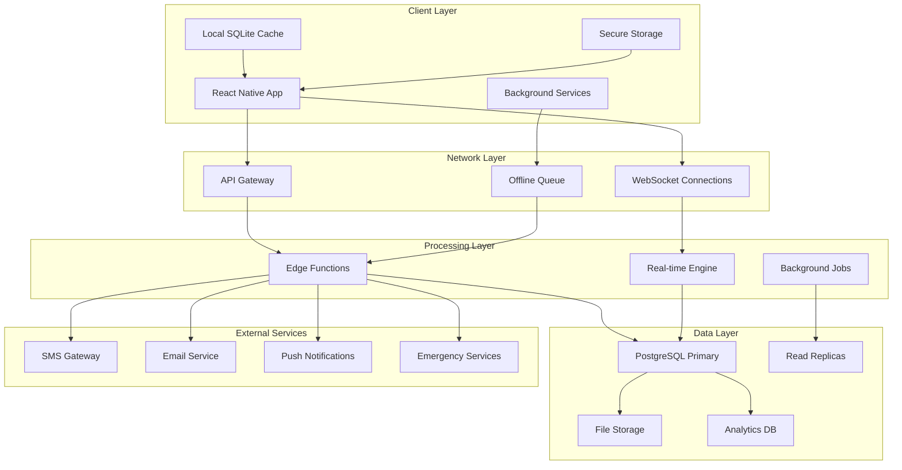
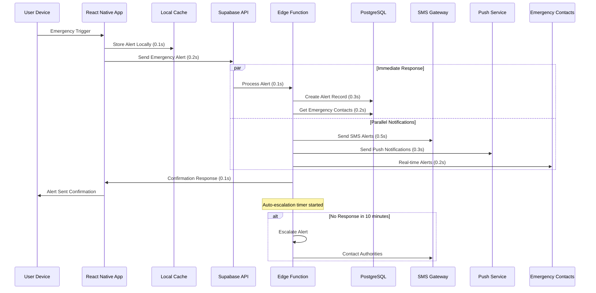

# Data Flow Architecture

<Info>
**Safety-First Data Flow:** Shelther's data architecture prioritizes emergency scenarios with sub-second response times while maintaining efficient normal operations and robust offline capabilities.
</Info>

## Data Flow Overview

Shelther implements multiple data flow patterns optimized for different scenarios and performance requirements:

<CardGroup cols={2}>
  <Card title="Normal Operations" icon="refresh">
    Efficient background synchronization with battery optimization and privacy controls
  </Card>
  <Card title="Emergency Flows" icon="zap">
    Ultra-fast emergency data processing with parallel notification and fallback mechanisms
  </Card>
  <Card title="Real-time Sync" icon="broadcast-tower">
    WebSocket-based live updates for location sharing and contact coordination
  </Card>
  <Card title="Offline Support" icon="wifi-slash">
    Local data persistence with intelligent sync when connectivity is restored
  </Card>
</CardGroup>

## High-Level Data Flow Architecture



## Normal Operation Data Flows

### User Authentication Flow

<Steps>
  <Step title="Initial Authentication">
    User credentials verified against Supabase Auth with optional MFA challenge
  </Step>
  <Step title="Session Establishment">
    JWT tokens issued with device fingerprinting and secure storage
  </Step>
  <Step title="Profile Synchronization">
    User preferences, contacts, and safety settings synchronized from database
  </Step>
  <Step title="Real-time Setup">
    WebSocket connections established for emergency alerts and location sharing
  </Step>
</Steps>

<CodeGroup>
```typescript Authentication Data Flow
// 1. User initiates authentication
export const authenticateUser = async (credentials: AuthCredentials) => {
  try {
    // Local validation
    const validationResult = validateCredentials(credentials);
    if (!validationResult.valid) {
      throw new Error(validationResult.error);
    }

    // Network authentication
    const { data, error } = await supabase.auth.signInWithPassword({
      email: credentials.email,
      password: credentials.password,
    });

    if (error) throw error;

    // Store session securely
    await SecureStore.setItemAsync('user_session', JSON.stringify(data.session));
    
    // Sync user data
    await syncUserProfile(data.user.id);
    
    // Establish real-time connections
    await setupRealTimeSubscriptions(data.user.id);
    
    return { success: true, user: data.user };
  } catch (error) {
    await logAuthenticationError(error, credentials.email);
    throw error;
  }
};

// 2. Profile synchronization
const syncUserProfile = async (userId: string) => {
  const [profile, contacts, preferences] = await Promise.all([
    supabase.from('safety_profiles').select('*').eq('user_id', userId).single(),
    supabase.from('emergency_contacts').select('*').eq('user_id', userId),
    supabase.from('user_preferences').select('*').eq('user_id', userId).single(),
  ]);

  // Cache locally for offline access
  await AsyncStorage.setItem('user_profile', JSON.stringify(profile.data));
  await AsyncStorage.setItem('emergency_contacts', JSON.stringify(contacts.data));
  await AsyncStorage.setItem('user_preferences', JSON.stringify(preferences.data));
};

// 3. Real-time subscription setup
const setupRealTimeSubscriptions = async (userId: string) => {
  // Emergency alerts subscription
  const alertsChannel = supabase
    .channel('emergency-alerts')
    .on('postgres_changes', {
      event: 'INSERT',
      schema: 'public',
      table: 'emergency_alerts',
      filter: `user_id=eq.${userId}`,
    }, handleEmergencyAlert)
    .subscribe();

  // Contact verification updates
  const contactsChannel = supabase
    .channel('contact-updates')
    .on('postgres_changes', {
      event: 'UPDATE',
      schema: 'public',
      table: 'emergency_contacts',
      filter: `user_id=eq.${userId}`,
    }, handleContactUpdate)
    .subscribe();

  // Store channel references for cleanup
  await AsyncStorage.setItem('active_channels', JSON.stringify([
    alertsChannel.topic,
    contactsChannel.topic
  ]));
};
```
</CodeGroup>

### Location Tracking Flow

<Accordion title="Adaptive Location Collection">
**Battery-Aware Tracking:**
- High accuracy mode: GPS + Network every 30 seconds
- Medium mode: Network-based every 2 minutes  
- Low battery mode: Significant location changes only
- Emergency override: Maximum accuracy regardless of battery

**Privacy-Controlled Sharing:**
- User-defined sharing permissions per contact
- Automatic expiration of location sharing sessions
- Precision control (exact, approximate, city-level)
- Real-time revocation capabilities

**Intelligent Caching:**
- Local SQLite storage for offline access
- Automatic cleanup of expired location data
- Compression for historical location data
- Smart sync prioritization
</Accordion>

<CodeGroup>
```typescript Location Data Flow
// Location collection with adaptive precision
export class LocationManager {
  private static updateIntervals = {
    high: 30000,      // 30 seconds
    medium: 120000,   // 2 minutes  
    low: 300000,      // 5 minutes
    emergency: 5000   // 5 seconds
  };

  static async startLocationTracking(mode: 'high' | 'medium' | 'low' | 'emergency') {
    const interval = this.updateIntervals[mode];
    
    const locationOptions: LocationOptions = {
      accuracy: mode === 'emergency' ? Location.Accuracy.BestForNavigation : 
                mode === 'high' ? Location.Accuracy.High :
                Location.Accuracy.Balanced,
      timeInterval: interval,
      distanceInterval: mode === 'low' ? 100 : 50, // meters
    };

    // Request background permissions
    const { status } = await Location.requestBackgroundPermissionsAsync();
    if (status !== 'granted') {
      throw new Error('Background location permission required');
    }

    // Start location updates
    await Location.startLocationUpdatesAsync('background-location-task', {
      accuracy: locationOptions.accuracy,
      timeInterval: locationOptions.timeInterval,
      distanceInterval: locationOptions.distanceInterval,
      foregroundService: {
        notificationTitle: 'Shelther Safety Monitoring',
        notificationBody: 'Keeping you safe in the background',
        notificationColor: '#FF5A5A',
      },
    });
  }

  // Process and sync location updates
  static async processLocationUpdate(location: LocationData) {
    try {
      // Apply privacy precision settings
      const processedLocation = await this.applyPrivacySettings(location);
      
      // Store locally first (for offline access)
      await this.storeLocationLocally(processedLocation);
      
      // Sync to server if online
      if (await NetInfo.fetch().then(state => state.isConnected)) {
        await this.syncLocationToServer(processedLocation);
      } else {
        await this.queueForOfflineSync(processedLocation);
      }

      // Update real-time subscribers
      await this.notifyLocationSubscribers(processedLocation);
      
    } catch (error) {
      console.error('Location processing error:', error);
      await this.handleLocationError(error, location);
    }
  }

  private static async applyPrivacySettings(location: LocationData): Promise<LocationData> {
    const preferences = await AsyncStorage.getItem('privacy_preferences');
    const privacy = preferences ? JSON.parse(preferences) : { precision: 'exact' };
    
    switch (privacy.locationPrecision) {
      case 'approximate':
        return {
          ...location,
          latitude: Math.round(location.latitude * 100) / 100,
          longitude: Math.round(location.longitude * 100) / 100,
        };
      case 'city_only':
        return {
          ...location,
          latitude: Math.round(location.latitude * 10) / 10,
          longitude: Math.round(location.longitude * 10) / 10,
        };
      default:
        return location;
    }
  }
}

// Real-time location sharing
export const shareLocationWithContact = async (
  contactId: string, 
  duration: number,
  precision: 'exact' | 'approximate' = 'exact'
) => {
  const expiresAt = new Date(Date.now() + duration * 60000); // duration in minutes
  
  // Create sharing session
  const { data: shareSession, error } = await supabase
    .from('location_shares')
    .insert({
      user_id: await getCurrentUserId(),
      shared_with_user_id: contactId,
      precision_level: precision,
      expires_at: expiresAt.toISOString(),
      permissions: {
        real_time: true,
        history: false,
        notifications: true
      }
    })
    .select()
    .single();

  if (error) throw error;

  // Set up real-time location broadcasting
  const broadcastChannel = supabase.channel(`location-share-${shareSession.id}`);
  
  // Start sending location updates
  const locationUpdateInterval = setInterval(async () => {
    const currentLocation = await Location.getCurrentPositionAsync({
      accuracy: Location.Accuracy.High
    });
    
    await broadcastChannel.send({
      type: 'broadcast',
      event: 'location_update',
      payload: {
        share_id: shareSession.id,
        location: currentLocation.coords,
        timestamp: new Date().toISOString()
      }
    });
  }, 10000); // Every 10 seconds

  // Clean up when sharing expires
  setTimeout(() => {
    clearInterval(locationUpdateInterval);
    broadcastChannel.unsubscribe();
  }, duration * 60000);

  return shareSession;
};
```
</CodeGroup>

## Emergency Data Flow

### Critical Alert Processing

<Note>
**Sub-3-Second Response:** Emergency alerts are processed with highest priority, targeting end-to-end delivery within 3 seconds through parallel processing and optimized data paths.
</Note>



<CodeGroup>
```typescript Emergency Alert Data Flow
// Emergency alert trigger with maximum speed optimization
export const triggerEmergencyAlert = async (
  alertData: EmergencyAlertRequest
): Promise<EmergencyAlertResponse> => {
  const startTime = Date.now();
  
  try {
    // 1. Immediate local storage (0.1s target)
    const localAlertId = await storeEmergencyAlertLocally(alertData);
    
    // 2. Parallel network and local processing
    const [serverResponse, locationData] = await Promise.all([
      // Network emergency processing
      sendEmergencyAlertToServer(alertData),
      // Get current location with high accuracy
      getCurrentLocationForEmergency(),
    ]);

    // 3. Update local storage with server response
    await updateLocalAlert(localAlertId, {
      serverId: serverResponse.alertId,
      status: 'active',
      timestamp: serverResponse.timestamp,
      location: locationData
    });

    // 4. Log performance metrics
    const processingTime = Date.now() - startTime;
    await logEmergencyMetrics({
      alert_id: serverResponse.alertId,
      processing_time_ms: processingTime,
      success: true,
      local_storage_time: 100, // Target: &lt;100ms
      network_time: processingTime - 100
    });

    return {
      success: true,
      alertId: serverResponse.alertId,
      processingTime,
      contactsNotified: serverResponse.contactsNotified,
      location: locationData
    };

  } catch (error) {
    // Emergency error handling - never let alerts fail silently
    const processingTime = Date.now() - startTime;
    
    // Store error for later retry
    await storeFailedAlert(alertData, error);
    
    // Attempt fallback notification methods
    await attemptFallbackNotifications(alertData);
    
    await logEmergencyError({
      error: error.message,
      processing_time_ms: processingTime,
      alert_data: alertData,
      fallback_attempted: true
    });

    throw new EmergencyProcessingError(
      'Emergency alert processing failed',
      error,
      { processingTime, alertData }
    );
  }
};

// High-speed server-side emergency processing
const sendEmergencyAlertToServer = async (
  alertData: EmergencyAlertRequest
): Promise<{ alertId: string; timestamp: string; contactsNotified: number }> => {
  
  // Use dedicated emergency endpoint with highest priority
  const response = await fetch('/edge/emergency-alert', {
    method: 'POST',
    headers: {
      'Content-Type': 'application/json',
      'X-Priority': 'emergency',
      'X-Request-Timeout': '5000', // 5 second timeout for emergencies
      'Authorization': `Bearer ${await getEmergencyToken()}`
    },
    body: JSON.stringify({
      ...alertData,
      timestamp: new Date().toISOString(),
      client_version: APP_VERSION,
      processing_start: Date.now()
    })
  });

  if (!response.ok) {
    throw new Error(`Emergency alert failed: ${response.status} ${response.statusText}`);
  }

  return response.json();
};

// Location acquisition optimized for emergencies
const getCurrentLocationForEmergency = async (): Promise<LocationData> => {
  try {
    // Use highest accuracy with longer timeout for emergencies
    const location = await Location.getCurrentPositionAsync({
      accuracy: Location.Accuracy.BestForNavigation,
      maximumAge: 5000,     // Accept 5-second old location
      timeout: 10000,       // 10 second timeout
    });

    return {
      latitude: location.coords.latitude,
      longitude: location.coords.longitude,
      accuracy: location.coords.accuracy,
      altitude: location.coords.altitude,
      heading: location.coords.heading,
      speed: location.coords.speed,
      timestamp: new Date(location.timestamp).toISOString()
    };
  } catch (error) {
    // Fallback to cached location if GPS fails
    const cachedLocation = await getCachedLocation();
    if (cachedLocation) {
      return {
        ...cachedLocation,
        accuracy: null, // Mark as potentially inaccurate
        is_cached: true
      };
    }
    throw new Error('Unable to acquire location for emergency');
  }
};
```

```typescript Emergency Notification Pipeline
// Parallel notification processing for maximum speed
export class EmergencyNotificationPipeline {
  static async processEmergencyAlert(alert: EmergencyAlert): Promise<NotificationResults> {
    const startTime = Date.now();
    
    // Get all verified emergency contacts
    const contacts = await this.getEmergencyContacts(alert.user_id);
    
    // Process notifications in parallel for speed
    const notificationPromises = contacts.map(contact => 
      this.sendContactNotification(contact, alert)
    );
    
    // Wait for all notifications to complete or timeout
    const results = await Promise.allSettled(notificationPromises);
    
    // Process results and handle failures
    const successful = results.filter(r => r.status === 'fulfilled').length;
    const failed = results.filter(r => r.status === 'rejected');
    
    // Log notification results
    await this.logNotificationMetrics({
      alert_id: alert.id,
      total_contacts: contacts.length,
      successful_notifications: successful,
      failed_notifications: failed.length,
      processing_time_ms: Date.now() - startTime
    });
    
    // If critical number of notifications failed, escalate
    if (failed.length > contacts.length * 0.5) {
      await this.escalateNotificationFailure(alert, failed);
    }
    
    return {
      total_sent: successful,
      total_failed: failed.length,
      contacts_reached: contacts.slice(0, successful),
      processing_time: Date.now() - startTime
    };
  }

  private static async sendContactNotification(
    contact: EmergencyContact, 
    alert: EmergencyAlert
  ): Promise<ContactNotificationResult> {
    const notificationData = {
      contact,
      alert,
      location: await this.getAlertLocation(alert.location_id),
      timestamp: alert.created_at
    };

    // Send multiple notification types in parallel
    const notificationAttempts = await Promise.allSettled([
      // SMS notification (highest priority)
      contact.notification_preferences.sms ? 
        this.sendSMSNotification(notificationData) : 
        Promise.resolve(null),
      
      // Push notification (if contact has app)
      contact.contact_user_id && contact.notification_preferences.push ?
        this.sendPushNotification(notificationData) :
        Promise.resolve(null),
        
      // Email notification
      contact.notification_preferences.email ?
        this.sendEmailNotification(notificationData) :
        Promise.resolve(null),
        
      // Voice call (for critical alerts)
      alert.severity === 'critical' && contact.notification_preferences.call ?
        this.initiateVoiceCall(notificationData) :
        Promise.resolve(null)
    ]);

    // Determine overall success
    const successfulAttempts = notificationAttempts.filter(
      attempt => attempt.status === 'fulfilled' && attempt.value !== null
    ).length;

    return {
      contact_id: contact.id,
      success: successfulAttempts > 0,
      methods_attempted: notificationAttempts.length,
      methods_successful: successfulAttempts,
      attempts: notificationAttempts
    };
  }

  private static async sendSMSNotification(
    data: NotificationData
  ): Promise<SMSResult> {
    const messageBody = this.formatEmergencyMessage(data);
    
    // Use Twilio or similar SMS service
    const smsResponse = await fetch('/edge/send-sms', {
      method: 'POST',
      headers: { 'Content-Type': 'application/json' },
      body: JSON.stringify({
        to: data.contact.contact_phone,
        body: messageBody,
        priority: 'emergency'
      })
    });

    if (!smsResponse.ok) {
      throw new Error(`SMS sending failed: ${smsResponse.statusText}`);
    }

    return smsResponse.json();
  }

  private static formatEmergencyMessage(data: NotificationData): string {
    const { alert, location, contact } = data;
    
    const locationText = location ? 
      `Location: https://maps.google.com/maps?q=${location.latitude},${location.longitude}` :
      'Location: Not available';
    
    return `🚨 EMERGENCY ALERT 🚨
${contact.contact_name} has triggered an emergency alert.

${locationText}

Time: ${new Date(alert.created_at).toLocaleString()}

This is an automated message from Shelther Safety. Reply "HELP" for assistance or visit https://shelther.app/emergency/${alert.id}`;
  }
}
```
</CodeGroup>

### Emergency Escalation Flow

<Steps>
  <Step title="Initial Alert (0-3 seconds)">
    Emergency contacts notified via SMS, push notifications, and email simultaneously
  </Step>
  <Step title="First Escalation (10 minutes)">
    If no contact acknowledgment, secondary contacts notified and alert escalated
  </Step>
  <Step title="Authority Notification (20 minutes)">
    Emergency services contacted if no response from personal contacts
  </Step>
  <Step title="Continuous Monitoring">
    Location tracking continues until alert is manually resolved or authorities respond
  </Step>
</Steps>

## Real-time Data Synchronization

### WebSocket Connection Management

<CardGroup cols={2}>
  <Card title="Connection Resilience" icon="shield">
    Automatic reconnection with exponential backoff and connection health monitoring
  </Card>
  <Card title="Message Ordering" icon="sort">
    Guaranteed message delivery order with sequence numbering and acknowledgments
  </Card>
  <Card title="Subscription Management" icon="settings">
    Dynamic subscription management based on user activity and battery status
  </Card>
  <Card title="Conflict Resolution" icon="merge">
    Intelligent conflict resolution for concurrent data modifications
  </Card>
</CardGroup>

<CodeGroup>
```typescript Real-time Connection Manager
export class RealTimeConnectionManager {
  private static reconnectAttempts = 0;
  private static maxReconnectAttempts = 5;
  private static baseReconnectDelay = 1000; // 1 second
  
  static async establishConnection(userId: string): Promise<RealtimeChannel[]> {
    try {
      // Create prioritized channel subscriptions
      const channels = await Promise.all([
        this.createEmergencyChannel(userId),      // Highest priority
        this.createLocationChannel(userId),       // High priority  
        this.createContactChannel(userId),        // Medium priority
        this.createGeneralChannel(userId)         // Normal priority
      ]);

      // Monitor connection health
      this.startConnectionHealthMonitoring(channels);
      
      // Reset reconnect counter on successful connection
      this.reconnectAttempts = 0;
      
      return channels;
    } catch (error) {
      await this.handleConnectionError(error, userId);
      throw error;
    }
  }

  private static async createEmergencyChannel(userId: string): Promise<RealtimeChannel> {
    const channel = supabase.channel(`emergency-${userId}`, {
      config: {
        presence: { key: userId },
        private: true,
        throttle: 0 // No throttling for emergency data
      }
    });

    return channel
      .on('postgres_changes', {
        event: 'INSERT',
        schema: 'public',
        table: 'emergency_alerts',
        filter: `user_id=eq.${userId}`
      }, this.handleEmergencyAlert)
      .on('postgres_changes', {
        event: 'UPDATE', 
        schema: 'public',
        table: 'emergency_alerts',
        filter: `user_id=eq.${userId}`
      }, this.handleEmergencyUpdate)
      .on('broadcast', { event: 'emergency_response' }, this.handleEmergencyResponse)
      .subscribe(async (status) => {
        if (status === 'SUBSCRIBED') {
          console.log('Emergency channel connected');
          await this.syncPendingEmergencyData();
        } else if (status === 'CHANNEL_ERROR') {
          await this.handleChannelError('emergency', userId);
        }
      });
  }

  private static async handleConnectionError(error: Error, userId: string) {
    this.reconnectAttempts++;
    
    const shouldReconnect = this.reconnectAttempts <= this.maxReconnectAttempts;
    const delay = Math.min(
      this.baseReconnectDelay * Math.pow(2, this.reconnectAttempts),
      30000 // Max 30 seconds
    );

    await logRealTimeError({
      error: error.message,
      user_id: userId,
      reconnect_attempt: this.reconnectAttempts,
      will_retry: shouldReconnect,
      delay_ms: delay
    });

    if (shouldReconnect) {
      setTimeout(() => this.establishConnection(userId), delay);
    } else {
      // Switch to polling mode if real-time fails permanently
      await this.fallbackToPolling(userId);
    }
  }

  private static async fallbackToPolling(userId: string) {
    console.warn('Real-time connection failed, switching to polling mode');
    
    // Poll for emergency alerts every 5 seconds
    const emergencyPoll = setInterval(async () => {
      try {
        const alerts = await supabase
          .from('emergency_alerts')
          .select('*')
          .eq('user_id', userId)
          .eq('status', 'active')
          .gte('created_at', new Date(Date.now() - 300000).toISOString()); // Last 5 minutes

        alerts.data?.forEach(alert => this.handleEmergencyAlert({ new: alert }));
      } catch (error) {
        console.error('Emergency polling error:', error);
      }
    }, 5000);

    // Store polling interval for cleanup
    await AsyncStorage.setItem('emergency_poll_interval', String(emergencyPoll));
  }

  private static async syncPendingEmergencyData() {
    // Sync any emergency data that was queued while offline
    const pendingData = await AsyncStorage.getItem('pending_emergency_data');
    if (pendingData) {
      const data = JSON.parse(pendingData);
      for (const item of data) {
        try {
          await this.processQueuedEmergencyData(item);
        } catch (error) {
          console.error('Failed to sync pending emergency data:', error);
        }
      }
      await AsyncStorage.removeItem('pending_emergency_data');
    }
  }
}
```
</CodeGroup>

### Data Conflict Resolution

<Accordion title="Conflict Resolution Strategies">
**Last-Writer-Wins (Default):**
- Most recent timestamp takes precedence
- Used for non-critical preference updates
- Simple and fast resolution

**Emergency-First Priority:**
- Emergency data always overrides non-emergency data
- Safety-critical information cannot be overwritten
- Manual intervention required for conflicts

**User-Controlled Resolution:**
- Present conflict options to user
- Used for important but non-critical data
- Maintains user agency over their data

**Automatic Merge:**
- Intelligent merging for compatible changes
- Used for contact list updates and preferences
- Maintains data integrity while accepting changes
</Accordion>

## Offline Data Management

### Local Data Architecture

<Note>
**Offline-First Safety:** All critical safety features work offline with intelligent synchronization when connectivity is restored, ensuring protection even in areas with poor network coverage.
</Note>

<Steps>
  <Step title="Critical Data Caching">
    Emergency contacts, safety preferences, and recent location data stored locally with encryption
  </Step>
  <Step title="Intelligent Sync Queue">
    Prioritized synchronization queue with emergency data processed first
  </Step>
  <Step title="Conflict Detection">
    Client-side conflict detection with automated resolution for most scenarios
  </Step>
  <Step title="Background Sync">
    Automatic synchronization when connectivity is restored with minimal user disruption
  </Step>
</Steps>

<CodeGroup>
```typescript Offline Data Management
export class OfflineDataManager {
  private static readonly CACHE_TABLES = {
    emergency_contacts: { priority: 1, encryption: true },
    safety_profiles: { priority: 1, encryption: true },
    location_updates: { priority: 2, encryption: true, retention: '7 days' },
    emergency_alerts: { priority: 1, encryption: true, retention: '30 days' },
    check_ins: { priority: 3, encryption: false, retention: '14 days' },
    venues: { priority: 4, encryption: false, retention: '30 days' }
  };

  static async initializeOfflineStorage(): Promise<void> {
    try {
      // Initialize SQLite database for offline storage
      const db = await SQLite.openDatabaseAsync('shelther_offline.db');
      
      // Create tables for offline data
      await this.createOfflineTables(db);
      
      // Set up encryption for sensitive tables
      await this.initializeEncryption(db);
      
      // Load initial data for offline access
      await this.loadCriticalDataForOffline(db);
      
      console.log('Offline storage initialized successfully');
    } catch (error) {
      console.error('Failed to initialize offline storage:', error);
      throw new OfflineStorageError('Offline storage initialization failed', error);
    }
  }

  static async queueForSync(
    table: string, 
    operation: 'INSERT' | 'UPDATE' | 'DELETE',
    data: any,
    priority: number = 3
  ): Promise<void> {
    const syncItem = {
      id: generateUUID(),
      table,
      operation,
      data,
      priority,
      timestamp: new Date().toISOString(),
      retry_count: 0,
      max_retries: 5
    };

    // Store in offline sync queue
    const db = await SQLite.openDatabaseAsync('shelther_offline.db');
    await db.runAsync(
      'INSERT INTO sync_queue (id, table_name, operation, data, priority, timestamp, retry_count) VALUES (?, ?, ?, ?, ?, ?, ?)',
      [syncItem.id, table, operation, JSON.stringify(data), priority, syncItem.timestamp, 0]
    );

    // Attempt immediate sync if online
    if (await this.isOnline()) {
      await this.processSyncQueue();
    }
  }

  static async processSyncQueue(): Promise<SyncResult> {
    const db = await SQLite.openDatabaseAsync('shelther_offline.db');
    
    // Get pending sync items ordered by priority and timestamp
    const pendingItems = await db.getAllAsync(`
      SELECT * FROM sync_queue 
      WHERE retry_count < max_retries 
      ORDER BY priority ASC, timestamp ASC
      LIMIT 50
    `);

    const results: SyncResult = {
      processed: 0,
      succeeded: 0,
      failed: 0,
      errors: []
    };

    for (const item of pendingItems) {
      try {
        await this.syncSingleItem(item);
        
        // Remove from queue on success
        await db.runAsync('DELETE FROM sync_queue WHERE id = ?', [item.id]);
        
        results.succeeded++;
      } catch (error) {
        // Increment retry count
        await db.runAsync(
          'UPDATE sync_queue SET retry_count = retry_count + 1, last_error = ? WHERE id = ?',
          [error.message, item.id]
        );
        
        results.failed++;
        results.errors.push({
          item_id: item.id,
          error: error.message,
          retry_count: item.retry_count + 1
        });
        
        // Log sync error for monitoring
        await logSyncError({
          item_id: item.id,
          table: item.table_name,
          operation: item.operation,
          error: error.message,
          retry_count: item.retry_count + 1
        });
      }
      
      results.processed++;
    }

    // Clean up items that have exceeded max retries
    await db.runAsync(
      'DELETE FROM sync_queue WHERE retry_count >= max_retries AND priority > 1'
    );

    return results;
  }

  private static async syncSingleItem(item: any): Promise<void> {
    const { table_name, operation, data } = item;
    const parsedData = JSON.parse(data);

    switch (operation) {
      case 'INSERT':
        const { error: insertError } = await supabase
          .from(table_name)
          .insert(parsedData);
        if (insertError) throw insertError;
        break;

      case 'UPDATE':
        const { error: updateError } = await supabase
          .from(table_name)
          .update(parsedData)
          .eq('id', parsedData.id);
        if (updateError) throw updateError;
        break;

      case 'DELETE':
        const { error: deleteError } = await supabase
          .from(table_name)
          .delete()
          .eq('id', parsedData.id);
        if (deleteError) throw deleteError;
        break;

      default:
        throw new Error(`Unknown sync operation: ${operation}`);
    }
  }

  // Emergency data access when offline
  static async getEmergencyContactsOffline(): Promise<EmergencyContact[]> {
    const db = await SQLite.openDatabaseAsync('shelther_offline.db');
    const contacts = await db.getAllAsync(
      'SELECT * FROM emergency_contacts_cache WHERE verification_status = ? ORDER BY priority_level',
      ['verified']
    );

    return contacts.map(contact => ({
      ...contact,
      notification_preferences: JSON.parse(contact.notification_preferences)
    }));
  }

  static async triggerEmergencyOffline(alertData: EmergencyAlertRequest): Promise<string> {
    const alertId = generateUUID();
    const timestamp = new Date().toISOString();

    // Store emergency alert locally
    const db = await SQLite.openDatabaseAsync('shelther_offline.db');
    await db.runAsync(
      'INSERT INTO emergency_alerts_cache (id, user_id, alert_type, trigger_method, status, created_at, is_offline) VALUES (?, ?, ?, ?, ?, ?, ?)',
      [alertId, alertData.userId, alertData.alertType, alertData.triggerMethod, 'active', timestamp, 1]
    );

    // Queue for sync when online
    await this.queueForSync('emergency_alerts', 'INSERT', {
      id: alertId,
      user_id: alertData.userId,
      alert_type: alertData.alertType,
      trigger_method: alertData.triggerMethod,
      status: 'active',
      created_at: timestamp
    }, 1); // Highest priority

    // Attempt local notifications (SMS fallback if available)
    try {
      await this.attemptOfflineNotifications(alertData, alertId);
    } catch (error) {
      console.warn('Offline notifications failed:', error);
    }

    return alertId;
  }
}
```
</CodeGroup>

## Performance Optimization

### Data Access Patterns

<CardGroup cols={3}>
  <Card title="Read Optimization" icon="search">
    Strategic caching, query optimization, and read replicas for fast data access
  </Card>
  <Card title="Write Optimization" icon="edit">
    Batched writes, async processing, and optimistic updates for smooth user experience
  </Card>
  <Card title="Network Efficiency" icon="wifi">
    Request deduplication, compression, and intelligent batching to minimize network usage
  </Card>
</CardGroup>

### Performance Monitoring

<Steps>
  <Step title="Real-time Metrics">
    Monitor data flow performance with real-time dashboards and automated alerts
  </Step>
  <Step title="User Experience Tracking">
    Track user-perceived performance with custom metrics and optimization targets
  </Step>
  <Step title="Battery Impact Analysis">
    Monitor and optimize battery usage patterns for different data flow scenarios
  </Step>
  <Step title="Network Usage Optimization">
    Analyze and reduce data transfer with compression and intelligent caching
  </Step>
</Steps>

---

## Next Steps

<CardGroup cols={3}>
  <Card title="Security Design" icon="shield" href="/architecture/security-design">
    Learn about security architecture and privacy protection throughout the data flow
  </Card>
  <Card title="Database Schema" icon="database" href="/architecture/database-schema">
    Explore the complete database schema with relationships and optimizations
  </Card>
  <Card title="Offline Capabilities" icon="wifi-slash" href="/architecture/offline-capabilities">
    Deep dive into offline functionality and synchronization strategies
  </Card>
</CardGroup>

<Warning>
**Performance Targets:** All data flows are optimized for safety-critical performance with emergency alerts targeting sub-3-second end-to-end delivery and offline capabilities maintaining full safety functionality.
</Warning>