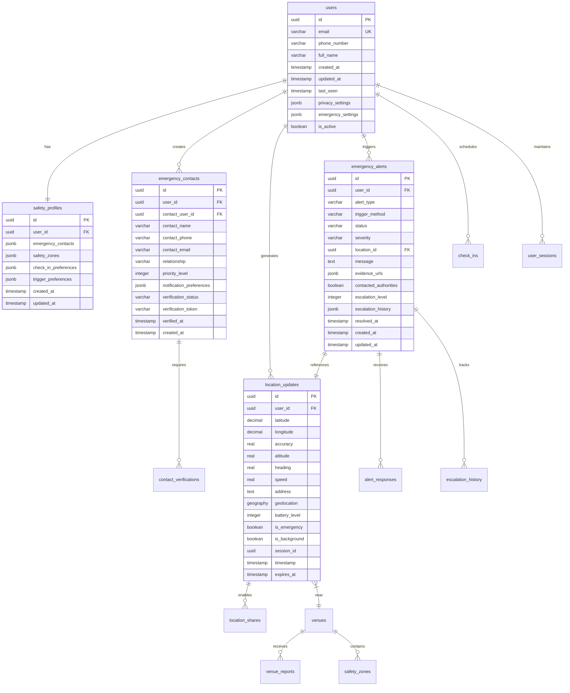

# Database Schema & Data Models

<Info>
**Safety-Optimized Database Design:** Shelther's PostgreSQL schema is designed for safety-critical applications with ACID compliance, spatial data support, real-time capabilities, and comprehensive audit trails.
</Info>

## Schema Overview

The database architecture supports safety-first principles with normalized data structures, efficient indexing, and robust security:

<CardGroup cols={2}>
  <Card title="User & Identity Management" icon="users">
    User accounts, profiles, authentication, and privacy settings
  </Card>
  <Card title="Safety & Emergency System" icon="bell">
    Emergency contacts, alerts, check-ins, and escalation workflows
  </Card>
  <Card title="Location & Geospatial" icon="map">
    Location tracking, geofencing, venue data, and spatial queries
  </Card>
  <Card title="Security & Audit" icon="shield">
    Session management, audit logging, and security event tracking
  </Card>
</CardGroup>

## Database Architecture Diagram



## Core Tables

### User Management Schema

<CodeGroup>
```sql Users & Authentication
-- Core user table with privacy and emergency settings
CREATE TABLE users (
  id UUID DEFAULT gen_random_uuid() PRIMARY KEY,
  email VARCHAR(255) UNIQUE NOT NULL,
  phone_number VARCHAR(20),
  full_name VARCHAR(255),
  created_at TIMESTAMP WITH TIME ZONE DEFAULT NOW(),
  updated_at TIMESTAMP WITH TIME ZONE DEFAULT NOW(),
  last_seen TIMESTAMP WITH TIME ZONE DEFAULT NOW(),
  
  -- Privacy settings as JSON for flexibility
  privacy_settings JSONB DEFAULT '{
    "location_sharing": "contacts_only",
    "data_retention_days": 90,
    "location_precision": "exact",
    "anonymous_reporting": true,
    "public_profile": false
  }'::jsonb,
  
  -- Emergency-specific settings
  emergency_settings JSONB DEFAULT '{
    "auto_escalation_minutes": 15,
    "silent_alarm_enabled": true,
    "voice_activation": true,
    "shake_sensitivity": "medium",
    "emergency_bypass_enabled": false
  }'::jsonb,
  
  -- Account status
  is_active BOOLEAN DEFAULT TRUE,
  is_verified BOOLEAN DEFAULT FALSE,
  verification_token VARCHAR(255),
  
  -- Audit fields
  created_by UUID,
  updated_by UUID,
  
  CONSTRAINT valid_email CHECK (email ~* '^[A-Za-z0-9._%+-]+@[A-Za-z0-9.-]+\.[A-Za-z]{2,}$'),
  CONSTRAINT valid_phone CHECK (phone_number ~* '^\+?[1-9]\d{1,14}$' OR phone_number IS NULL)
);

-- User safety profiles
CREATE TABLE safety_profiles (
  id UUID DEFAULT gen_random_uuid() PRIMARY KEY,
  user_id UUID NOT NULL REFERENCES users(id) ON DELETE CASCADE,
  
  -- Emergency contact references (denormalized for performance)
  emergency_contacts JSONB DEFAULT '[]'::jsonb,
  
  -- User-defined safety zones
  safety_zones JSONB DEFAULT '[]'::jsonb,
  
  -- Check-in preferences and schedules
  check_in_preferences JSONB DEFAULT '{
    "default_interval_minutes": 60,
    "safe_hours_start": "06:00",
    "safe_hours_end": "22:00",
    "automatic_check_ins": true,
    "missed_checkin_escalation": true
  }'::jsonb,
  
  -- Emergency trigger preferences
  trigger_preferences JSONB DEFAULT '{
    "shake_enabled": true,
    "shake_sensitivity": "medium",
    "voice_activation": true,
    "voice_commands": ["help", "emergency", "call for help"],
    "button_sequence": "volume_power",
    "duress_code": null,
    "silent_mode_available": true
  }'::jsonb,
  
  created_at TIMESTAMP WITH TIME ZONE DEFAULT NOW(),
  updated_at TIMESTAMP WITH TIME ZONE DEFAULT NOW(),
  
  CONSTRAINT one_profile_per_user UNIQUE(user_id)
);

-- User sessions for security tracking
CREATE TABLE user_sessions (
  id UUID DEFAULT gen_random_uuid() PRIMARY KEY,
  user_id UUID NOT NULL REFERENCES users(id) ON DELETE CASCADE,
  session_token VARCHAR(255) UNIQUE NOT NULL,
  device_info JSONB,
  ip_address INET,
  user_agent TEXT,
  created_at TIMESTAMP WITH TIME ZONE DEFAULT NOW(),
  expires_at TIMESTAMP WITH TIME ZONE NOT NULL,
  last_activity TIMESTAMP WITH TIME ZONE DEFAULT NOW(),
  is_active BOOLEAN DEFAULT TRUE,
  is_emergency_session BOOLEAN DEFAULT FALSE,
  
  CONSTRAINT valid_session_duration CHECK (expires_at > created_at)
);
```

```sql Emergency Contact Management
-- Emergency contacts with verification system
CREATE TABLE emergency_contacts (
  id UUID DEFAULT gen_random_uuid() PRIMARY KEY,
  user_id UUID NOT NULL REFERENCES users(id) ON DELETE CASCADE,
  
  -- Contact can be another app user or external contact
  contact_user_id UUID REFERENCES users(id) ON DELETE SET NULL,
  
  -- Contact information
  contact_name VARCHAR(255) NOT NULL,
  contact_phone VARCHAR(20) NOT NULL,
  contact_email VARCHAR(255),
  relationship VARCHAR(100) NOT NULL,
  
  -- Priority and notification settings
  priority_level INTEGER DEFAULT 1 CHECK (priority_level BETWEEN 1 AND 5),
  
  notification_preferences JSONB DEFAULT '{
    "sms": true,
    "email": true,
    "push": true,
    "call": false,
    "emergency_only": false
  }'::jsonb,
  
  -- Verification system
  verification_status VARCHAR(20) DEFAULT 'pending' CHECK (
    verification_status IN ('pending', 'verified', 'declined', 'blocked')
  ),
  verification_token VARCHAR(255),
  verification_code VARCHAR(10),
  verified_at TIMESTAMP WITH TIME ZONE,
  verification_expires_at TIMESTAMP WITH TIME ZONE,
  
  -- Two-way contact permissions
  can_view_location BOOLEAN DEFAULT FALSE,
  can_receive_checkins BOOLEAN DEFAULT TRUE,
  can_trigger_wellness_check BOOLEAN DEFAULT FALSE,
  
  created_at TIMESTAMP WITH TIME ZONE DEFAULT NOW(),
  updated_at TIMESTAMP WITH TIME ZONE DEFAULT NOW(),
  
  CONSTRAINT valid_contact_phone CHECK (contact_phone ~* '^\+?[1-9]\d{1,14}$'),
  CONSTRAINT valid_contact_email CHECK (
    contact_email IS NULL OR 
    contact_email ~* '^[A-Za-z0-9._%+-]+@[A-Za-z0-9.-]+\.[A-Za-z]{2,}$'
  ),
  CONSTRAINT no_self_contact CHECK (user_id != contact_user_id)
);

-- Contact verification tracking
CREATE TABLE contact_verifications (
  id UUID DEFAULT gen_random_uuid() PRIMARY KEY,
  emergency_contact_id UUID NOT NULL REFERENCES emergency_contacts(id) ON DELETE CASCADE,
  verification_method VARCHAR(20) NOT NULL CHECK (
    verification_method IN ('sms', 'email', 'phone_call', 'in_person', 'app_notification')
  ),
  verification_code VARCHAR(10),
  verification_attempts INTEGER DEFAULT 0,
  max_attempts INTEGER DEFAULT 3,
  sent_at TIMESTAMP WITH TIME ZONE DEFAULT NOW(),
  verified_at TIMESTAMP WITH TIME ZONE,
  expires_at TIMESTAMP WITH TIME ZONE NOT NULL,
  status VARCHAR(20) DEFAULT 'pending' CHECK (
    status IN ('pending', 'verified', 'expired', 'failed', 'blocked')
  ),
  
  CONSTRAINT valid_verification_window CHECK (expires_at > sent_at)
);
```
</CodeGroup>

### Emergency & Safety Schema

<CodeGroup>
```sql Emergency Alert System
-- Emergency alerts with comprehensive tracking
CREATE TABLE emergency_alerts (
  id UUID DEFAULT gen_random_uuid() PRIMARY KEY,
  user_id UUID NOT NULL REFERENCES users(id) ON DELETE CASCADE,
  
  -- Alert classification
  alert_type VARCHAR(50) NOT NULL CHECK (
    alert_type IN ('manual', 'automated', 'duress', 'check_in_missed', 'panic', 'wellness_check')
  ),
  trigger_method VARCHAR(50) CHECK (
    trigger_method IN ('button', 'shake', 'voice', 'widget', 'auto_detection', 'schedule', 'contact_initiated')
  ),
  
  -- Alert status and severity
  status VARCHAR(20) DEFAULT 'active' CHECK (
    status IN ('active', 'acknowledged', 'resolved', 'false_alarm', 'escalated', 'expired')
  ),
  severity VARCHAR(20) DEFAULT 'high' CHECK (
    severity IN ('low', 'medium', 'high', 'critical')
  ),
  
  -- Location and context
  location_id UUID REFERENCES location_updates(id),
  message TEXT,
  additional_context JSONB,
  
  -- Evidence collection
  evidence_urls JSONB DEFAULT '[]'::jsonb,
  audio_evidence_url TEXT,
  photo_evidence_urls JSONB DEFAULT '[]'::jsonb,
  video_evidence_url TEXT,
  
  -- Emergency response tracking
  contacted_authorities BOOLEAN DEFAULT FALSE,
  authority_reference_number VARCHAR(255),
  escalation_level INTEGER DEFAULT 1 CHECK (escalation_level BETWEEN 1 AND 5),
  
  -- Escalation history and timeline
  escalation_history JSONB DEFAULT '[]'::jsonb,
  response_timeline JSONB DEFAULT '[]'::jsonb,
  
  -- Resolution
  resolved_at TIMESTAMP WITH TIME ZONE,
  resolved_by UUID REFERENCES users(id),
  resolution_reason TEXT,
  
  -- Timestamps
  created_at TIMESTAMP WITH TIME ZONE DEFAULT NOW(),
  updated_at TIMESTAMP WITH TIME ZONE DEFAULT NOW(),
  
  -- Performance tracking
  processing_time_ms INTEGER,
  notification_sent_at TIMESTAMP WITH TIME ZONE,
  first_response_at TIMESTAMP WITH TIME ZONE
);

-- Emergency alert responses from contacts
CREATE TABLE alert_responses (
  id UUID DEFAULT gen_random_uuid() PRIMARY KEY,
  alert_id UUID NOT NULL REFERENCES emergency_alerts(id) ON DELETE CASCADE,
  responder_contact_id UUID REFERENCES emergency_contacts(id) ON DELETE SET NULL,
  responder_user_id UUID REFERENCES users(id) ON DELETE SET NULL,
  
  response_type VARCHAR(20) NOT NULL CHECK (
    response_type IN ('acknowledged', 'en_route', 'arrived', 'safe', 'need_help', 'false_alarm', 'unable_to_help')
  ),
  response_method VARCHAR(20) CHECK (
    response_method IN ('app', 'sms', 'phone_call', 'email', 'in_person')
  ),
  
  response_message TEXT,
  responder_location JSONB,
  estimated_arrival_time TIMESTAMP WITH TIME ZONE,
  
  created_at TIMESTAMP WITH TIME ZONE DEFAULT NOW(),
  
  CONSTRAINT responder_identity_required CHECK (
    responder_contact_id IS NOT NULL OR responder_user_id IS NOT NULL
  )
);

-- Escalation tracking
CREATE TABLE escalation_history (
  id UUID DEFAULT gen_random_uuid() PRIMARY KEY,
  alert_id UUID NOT NULL REFERENCES emergency_alerts(id) ON DELETE CASCADE,
  escalation_level INTEGER NOT NULL CHECK (escalation_level BETWEEN 1 AND 5),
  escalation_trigger VARCHAR(50) NOT NULL,
  escalation_reason TEXT,
  escalated_to JSONB, -- Array of contacts/authorities notified
  escalated_at TIMESTAMP WITH TIME ZONE DEFAULT NOW(),
  escalation_response JSONB,
  response_time_minutes INTEGER
);
```

```sql Check-in System
-- Scheduled and ad-hoc check-ins
CREATE TABLE check_ins (
  id UUID DEFAULT gen_random_uuid() PRIMARY KEY,
  user_id UUID NOT NULL REFERENCES users(id) ON DELETE CASCADE,
  
  -- Check-in scheduling
  scheduled_time TIMESTAMP WITH TIME ZONE NOT NULL,
  check_in_type VARCHAR(20) DEFAULT 'scheduled' CHECK (
    check_in_type IN ('scheduled', 'manual', 'automatic', 'location_based', 'emergency_followup')
  ),
  
  -- Check-in completion
  actual_time TIMESTAMP WITH TIME ZONE,
  status VARCHAR(20) DEFAULT 'pending' CHECK (
    status IN ('pending', 'completed', 'missed', 'late', 'cancelled', 'overridden')
  ),
  
  -- Context and location
  location_id UUID REFERENCES location_updates(id),
  activity_type VARCHAR(100),
  activity_description TEXT,
  planned_duration_minutes INTEGER,
  
  -- Check-in content
  notes TEXT,
  mood_rating INTEGER CHECK (mood_rating BETWEEN 1 AND 5),
  safety_feeling INTEGER CHECK (safety_feeling BETWEEN 1 AND 5),
  
  -- Notification and escalation settings
  grace_period_minutes INTEGER DEFAULT 15,
  notify_contacts JSONB DEFAULT '[]'::jsonb, -- Specific contacts to notify
  auto_created BOOLEAN DEFAULT FALSE,
  
  -- Tracking and follow-up
  reminder_sent BOOLEAN DEFAULT FALSE,
  reminder_sent_at TIMESTAMP WITH TIME ZONE,
  escalation_triggered BOOLEAN DEFAULT FALSE,
  escalation_triggered_at TIMESTAMP WITH TIME ZONE,
  
  created_at TIMESTAMP WITH TIME ZONE DEFAULT NOW(),
  updated_at TIMESTAMP WITH TIME ZONE DEFAULT NOW(),
  
  CONSTRAINT reasonable_grace_period CHECK (grace_period_minutes BETWEEN 0 AND 1440), -- Max 24 hours
  CONSTRAINT valid_planned_duration CHECK (planned_duration_minutes > 0)
);

-- Wellness checks initiated by contacts
CREATE TABLE wellness_checks (
  id UUID DEFAULT gen_random_uuid() PRIMARY KEY,
  target_user_id UUID NOT NULL REFERENCES users(id) ON DELETE CASCADE,
  initiated_by_contact_id UUID REFERENCES emergency_contacts(id) ON DELETE SET NULL,
  initiated_by_user_id UUID REFERENCES users(id) ON DELETE SET NULL,
  
  check_type VARCHAR(20) DEFAULT 'standard' CHECK (
    check_type IN ('standard', 'urgent', 'follow_up', 'scheduled')
  ),
  
  reason TEXT,
  concern_level VARCHAR(20) DEFAULT 'low' CHECK (
    concern_level IN ('low', 'medium', 'high', 'critical')
  ),
  
  -- Response tracking
  user_response VARCHAR(20) CHECK (
    user_response IN ('safe', 'need_help', 'busy', 'ignored', 'unavailable')
  ),
  response_time_minutes INTEGER,
  response_message TEXT,
  responded_at TIMESTAMP WITH TIME ZONE,
  
  -- Escalation if no response
  escalation_minutes INTEGER DEFAULT 60,
  escalation_triggered BOOLEAN DEFAULT FALSE,
  escalation_triggered_at TIMESTAMP WITH TIME ZONE,
  
  created_at TIMESTAMP WITH TIME ZONE DEFAULT NOW(),
  resolved_at TIMESTAMP WITH TIME ZONE,
  
  CONSTRAINT initiator_required CHECK (
    initiated_by_contact_id IS NOT NULL OR initiated_by_user_id IS NOT NULL
  )
);
```
</CodeGroup>

### Location & Geospatial Schema

<CodeGroup>
```sql Location Tracking
-- Location updates with spatial support
CREATE TABLE location_updates (
  id UUID DEFAULT gen_random_uuid() PRIMARY KEY,
  user_id UUID NOT NULL REFERENCES users(id) ON DELETE CASCADE,
  
  -- Precise location data
  latitude DECIMAL(10, 8) NOT NULL,
  longitude DECIMAL(11, 8) NOT NULL,
  accuracy REAL, -- Accuracy in meters
  altitude REAL, -- Altitude in meters
  heading REAL, -- Direction in degrees (0-359)
  speed REAL, -- Speed in m/s
  
  -- Reverse geocoded address
  address TEXT,
  city VARCHAR(100),
  state VARCHAR(100),
  country VARCHAR(100),
  postal_code VARCHAR(20),
  
  -- PostGIS spatial column for efficient spatial queries
  geolocation GEOGRAPHY(POINT, 4326),
  
  -- Device and context information
  battery_level INTEGER CHECK (battery_level BETWEEN 0 AND 100),
  device_id VARCHAR(255),
  app_version VARCHAR(20),
  
  -- Location context
  is_emergency BOOLEAN DEFAULT FALSE,
  is_background BOOLEAN DEFAULT FALSE,
  is_manual BOOLEAN DEFAULT FALSE,
  location_method VARCHAR(20) CHECK (
    location_method IN ('gps', 'network', 'passive', 'manual', 'cached')
  ),
  
  -- Session and sharing
  session_id UUID,
  sharing_session_id UUID,
  
  -- Data lifecycle
  timestamp TIMESTAMP WITH TIME ZONE DEFAULT NOW(),
  expires_at TIMESTAMP WITH TIME ZONE DEFAULT (NOW() + INTERVAL '24 hours'),
  
  -- Privacy and processing flags
  precision_level VARCHAR(20) DEFAULT 'exact' CHECK (
    precision_level IN ('exact', 'approximate', 'city_only')
  ),
  is_processed BOOLEAN DEFAULT FALSE,
  processing_metadata JSONB,
  
  CONSTRAINT valid_coordinates CHECK (
    latitude BETWEEN -90 AND 90 AND 
    longitude BETWEEN -180 AND 180
  ),
  CONSTRAINT valid_accuracy CHECK (accuracy IS NULL OR accuracy >= 0),
  CONSTRAINT valid_heading CHECK (heading IS NULL OR (heading >= 0 AND heading < 360))
);

-- Location sharing sessions
CREATE TABLE location_shares (
  id UUID DEFAULT gen_random_uuid() PRIMARY KEY,
  user_id UUID NOT NULL REFERENCES users(id) ON DELETE CASCADE,
  shared_with_user_id UUID NOT NULL REFERENCES users(id) ON DELETE CASCADE,
  
  -- Sharing configuration
  share_type VARCHAR(20) DEFAULT 'temporary' CHECK (
    share_type IN ('temporary', 'continuous', 'emergency_only', 'check_in_based')
  ),
  precision_level VARCHAR(20) DEFAULT 'exact' CHECK (
    precision_level IN ('exact', 'approximate', 'city_only')
  ),
  
  -- Permissions and features
  permissions JSONB DEFAULT '{
    "real_time": true,
    "history": false,
    "notifications": true,
    "check_ins": false
  }'::jsonb,
  
  -- Time limits
  created_at TIMESTAMP WITH TIME ZONE DEFAULT NOW(),
  expires_at TIMESTAMP WITH TIME ZONE,
  auto_extend BOOLEAN DEFAULT FALSE,
  
  -- Status tracking
  is_active BOOLEAN DEFAULT TRUE,
  last_location_shared TIMESTAMP WITH TIME ZONE,
  share_count INTEGER DEFAULT 0,
  
  CONSTRAINT no_self_sharing CHECK (user_id != shared_with_user_id),
  CONSTRAINT valid_expiry CHECK (expires_at IS NULL OR expires_at > created_at)
);

-- Geographic venues and points of interest
CREATE TABLE venues (
  id UUID DEFAULT gen_random_uuid() PRIMARY KEY,
  
  -- Basic venue information
  name VARCHAR(255) NOT NULL,
  venue_type VARCHAR(100), -- restaurant, bar, hotel, etc.
  description TEXT,
  
  -- Location data
  latitude DECIMAL(10, 8) NOT NULL,
  longitude DECIMAL(11, 8) NOT NULL,
  geolocation GEOGRAPHY(POINT, 4326),
  
  -- Address information
  address TEXT,
  city VARCHAR(100),
  state VARCHAR(100),
  country VARCHAR(100),
  postal_code VARCHAR(20),
  
  -- Safety information
  safety_rating REAL CHECK (safety_rating BETWEEN 0 AND 5),
  safety_features JSONB DEFAULT '{
    "security_cameras": false,
    "security_staff": false,
    "well_lit": false,
    "busy_area": false,
    "verified_safe": false
  }'::jsonb,
  
  -- Verification and moderation
  verification_status VARCHAR(20) DEFAULT 'unverified' CHECK (
    verification_status IN ('unverified', 'pending', 'verified', 'flagged', 'removed')
  ),
  verified_by UUID REFERENCES users(id),
  verified_at TIMESTAMP WITH TIME ZONE,
  
  -- Metadata
  created_at TIMESTAMP WITH TIME ZONE DEFAULT NOW(),
  updated_at TIMESTAMP WITH TIME ZONE DEFAULT NOW(),
  last_safety_update TIMESTAMP WITH TIME ZONE,
  
  CONSTRAINT valid_venue_coordinates CHECK (
    latitude BETWEEN -90 AND 90 AND 
    longitude BETWEEN -180 AND 180
  )
);

-- User-reported venue safety information
CREATE TABLE venue_reports (
  id UUID DEFAULT gen_random_uuid() PRIMARY KEY,
  venue_id UUID NOT NULL REFERENCES venues(id) ON DELETE CASCADE,
  user_id UUID NOT NULL REFERENCES users(id) ON DELETE CASCADE,
  
  -- Report content
  report_type VARCHAR(20) NOT NULL CHECK (
    report_type IN ('safety_concern', 'positive_experience', 'incident', 'verification', 'update')
  ),
  safety_rating INTEGER CHECK (safety_rating BETWEEN 1 AND 5),
  description TEXT NOT NULL,
  
  -- Incident details (if applicable)
  incident_type VARCHAR(50),
  incident_severity VARCHAR(20) CHECK (
    incident_severity IN ('low', 'medium', 'high', 'critical')
  ),
  authorities_contacted BOOLEAN DEFAULT FALSE,
  
  -- Anonymous reporting option
  is_anonymous BOOLEAN DEFAULT FALSE,
  
  -- Moderation
  moderation_status VARCHAR(20) DEFAULT 'pending' CHECK (
    moderation_status IN ('pending', 'approved', 'flagged', 'removed')
  ),
  moderated_by UUID REFERENCES users(id),
  moderated_at TIMESTAMP WITH TIME ZONE,
  moderation_reason TEXT,
  
  created_at TIMESTAMP WITH TIME ZONE DEFAULT NOW(),
  
  CONSTRAINT anonymous_or_user CHECK (
    (is_anonymous = TRUE AND user_id IS NOT NULL) OR 
    (is_anonymous = FALSE AND user_id IS NOT NULL)
  )
);
```

```sql Safety Zones & Geofencing
-- User-defined safety zones
CREATE TABLE safety_zones (
  id UUID DEFAULT gen_random_uuid() PRIMARY KEY,
  user_id UUID NOT NULL REFERENCES users(id) ON DELETE CASCADE,
  
  -- Zone identification
  name VARCHAR(255) NOT NULL,
  zone_type VARCHAR(50) CHECK (
    zone_type IN ('home', 'work', 'safe_space', 'restricted', 'custom')
  ),
  description TEXT,
  
  -- Geographic definition
  center_latitude DECIMAL(10, 8) NOT NULL,
  center_longitude DECIMAL(11, 8) NOT NULL,
  radius_meters INTEGER NOT NULL CHECK (radius_meters > 0),
  
  -- Alternative polygon boundary (for complex shapes)
  boundary GEOGRAPHY(POLYGON, 4326),
  
  -- Zone behavior
  entry_notification BOOLEAN DEFAULT TRUE,
  exit_notification BOOLEAN DEFAULT TRUE,
  notify_contacts JSONB DEFAULT '[]'::jsonb,
  
  -- Time-based activation
  active_hours JSONB DEFAULT '{
    "all_day": true,
    "start_time": null,
    "end_time": null,
    "days_of_week": ["monday", "tuesday", "wednesday", "thursday", "friday", "saturday", "sunday"]
  }'::jsonb,
  
  -- Status
  is_active BOOLEAN DEFAULT TRUE,
  created_at TIMESTAMP WITH TIME ZONE DEFAULT NOW(),
  updated_at TIMESTAMP WITH TIME ZONE DEFAULT NOW(),
  
  CONSTRAINT valid_zone_center CHECK (
    center_latitude BETWEEN -90 AND 90 AND 
    center_longitude BETWEEN -180 AND 180
  ),
  CONSTRAINT reasonable_radius CHECK (radius_meters BETWEEN 10 AND 100000) -- 10m to 100km
);

-- Zone entry/exit events
CREATE TABLE zone_events (
  id UUID DEFAULT gen_random_uuid() PRIMARY KEY,
  user_id UUID NOT NULL REFERENCES users(id) ON DELETE CASCADE,
  safety_zone_id UUID NOT NULL REFERENCES safety_zones(id) ON DELETE CASCADE,
  location_id UUID REFERENCES location_updates(id),
  
  event_type VARCHAR(10) NOT NULL CHECK (event_type IN ('entry', 'exit')),
  
  -- Event context
  triggered_at TIMESTAMP WITH TIME ZONE DEFAULT NOW(),
  notification_sent BOOLEAN DEFAULT FALSE,
  contacts_notified JSONB DEFAULT '[]'::jsonb,
  
  -- Additional context
  notes TEXT,
  manual_override BOOLEAN DEFAULT FALSE
);
```
</CodeGroup>

### Security & Audit Schema

<CodeGroup>
```sql Security & Audit Logging
-- Comprehensive security audit log
CREATE TABLE security_audit_log (
  id UUID DEFAULT gen_random_uuid() PRIMARY KEY,
  
  -- Event identification
  event_type VARCHAR(100) NOT NULL,
  event_category VARCHAR(50) NOT NULL CHECK (
    event_category IN ('authentication', 'authorization', 'data_access', 'emergency', 'system', 'privacy')
  ),
  severity VARCHAR(20) DEFAULT 'info' CHECK (
    severity IN ('debug', 'info', 'warning', 'error', 'critical')
  ),
  
  -- Context
  user_id UUID REFERENCES users(id) ON DELETE SET NULL,
  session_id UUID,
  target_user_id UUID REFERENCES users(id) ON DELETE SET NULL,
  
  -- Request context
  ip_address INET,
  user_agent TEXT,
  request_id VARCHAR(255),
  endpoint VARCHAR(255),
  http_method VARCHAR(10),
  
  -- Event details
  event_details JSONB,
  before_state JSONB,
  after_state JSONB,
  
  -- System context
  application_version VARCHAR(20),
  database_version VARCHAR(20),
  environment VARCHAR(20),
  
  -- Timestamps
  timestamp TIMESTAMP WITH TIME ZONE DEFAULT NOW(),
  processed_at TIMESTAMP WITH TIME ZONE,
  
  -- Investigation tracking
  investigation_status VARCHAR(20) DEFAULT 'none' CHECK (
    investigation_status IN ('none', 'flagged', 'investigating', 'resolved', 'false_positive')
  ),
  investigated_by UUID REFERENCES users(id),
  investigation_notes TEXT
);

-- Performance and error monitoring
CREATE TABLE system_events (
  id UUID DEFAULT gen_random_uuid() PRIMARY KEY,
  
  -- Event classification
  event_type VARCHAR(50) NOT NULL,
  component VARCHAR(50) NOT NULL,
  severity VARCHAR(20) DEFAULT 'info' CHECK (
    severity IN ('debug', 'info', 'warning', 'error', 'critical')
  ),
  
  -- Performance metrics
  duration_ms INTEGER,
  memory_usage_mb INTEGER,
  cpu_usage_percent REAL,
  
  -- Error details
  error_message TEXT,
  error_code VARCHAR(50),
  stack_trace TEXT,
  
  -- Context
  user_id UUID REFERENCES users(id) ON DELETE SET NULL,
  session_id VARCHAR(255),
  request_id VARCHAR(255),
  
  -- System state
  system_metrics JSONB,
  environment VARCHAR(20),
  version VARCHAR(20),
  
  timestamp TIMESTAMP WITH TIME ZONE DEFAULT NOW(),
  
  -- Alerting
  alert_sent BOOLEAN DEFAULT FALSE,
  alert_sent_at TIMESTAMP WITH TIME ZONE,
  resolved BOOLEAN DEFAULT FALSE,
  resolved_at TIMESTAMP WITH TIME ZONE
);

-- Data privacy and consent tracking
CREATE TABLE privacy_consent (
  id UUID DEFAULT gen_random_uuid() PRIMARY KEY,
  user_id UUID NOT NULL REFERENCES users(id) ON DELETE CASCADE,
  
  -- Consent details
  consent_type VARCHAR(50) NOT NULL,
  consent_version VARCHAR(20) NOT NULL,
  consent_given BOOLEAN NOT NULL,
  consent_text TEXT,
  
  -- Legal basis
  legal_basis VARCHAR(50) CHECK (
    legal_basis IN ('consent', 'contract', 'legal_obligation', 'vital_interests', 'public_task', 'legitimate_interests')
  ),
  
  -- Metadata
  given_at TIMESTAMP WITH TIME ZONE DEFAULT NOW(),
  expires_at TIMESTAMP WITH TIME ZONE,
  withdrawn_at TIMESTAMP WITH TIME ZONE,
  
  -- Context
  ip_address INET,
  user_agent TEXT,
  consent_method VARCHAR(50), -- app, web, email, etc.
  
  -- Processing tracking
  data_processed BOOLEAN DEFAULT FALSE,
  processing_purpose TEXT,
  retention_period_days INTEGER
);

-- Data deletion and retention tracking
CREATE TABLE data_deletion_log (
  id UUID DEFAULT gen_random_uuid() PRIMARY KEY,
  user_id UUID, -- Can be NULL after deletion
  
  -- Deletion details
  deletion_type VARCHAR(20) NOT NULL CHECK (
    deletion_type IN ('user_requested', 'automatic_retention', 'legal_requirement', 'account_closure')
  ),
  deletion_scope VARCHAR(20) NOT NULL CHECK (
    deletion_scope IN ('complete', 'partial', 'anonymization')
  ),
  
  -- What was deleted
  tables_affected JSONB,
  records_deleted INTEGER,
  data_size_mb REAL,
  
  -- Verification
  deletion_verification_hash VARCHAR(255),
  verification_method VARCHAR(50),
  
  -- Legal and compliance
  legal_basis TEXT,
  retention_period_expired BOOLEAN DEFAULT FALSE,
  
  -- Processing details
  initiated_by UUID REFERENCES users(id),
  processed_by VARCHAR(100), -- system component
  deletion_started_at TIMESTAMP WITH TIME ZONE DEFAULT NOW(),
  deletion_completed_at TIMESTAMP WITH TIME ZONE,
  
  -- Recovery information (if applicable)
  recovery_possible BOOLEAN DEFAULT FALSE,
  recovery_deadline TIMESTAMP WITH TIME ZONE,
  recovery_instructions TEXT
);
```
</CodeGroup>

## Database Indexes & Performance

### Critical Indexes for Safety Performance

<Note>
**Performance-Critical Indexes:** These indexes ensure sub-second response times for emergency operations and location queries.
</Note>

<CodeGroup>
```sql Primary Performance Indexes
-- Emergency alert performance indexes
CREATE INDEX CONCURRENTLY idx_emergency_alerts_user_status_time 
  ON emergency_alerts(user_id, status, created_at DESC);

CREATE INDEX CONCURRENTLY idx_emergency_alerts_active 
  ON emergency_alerts(status, severity, created_at DESC) 
  WHERE status = 'active';

CREATE INDEX CONCURRENTLY idx_emergency_alerts_escalation 
  ON emergency_alerts(escalation_level, created_at) 
  WHERE status = 'active';

-- Location query optimization
CREATE INDEX CONCURRENTLY idx_location_updates_user_time 
  ON location_updates(user_id, timestamp DESC);

CREATE INDEX CONCURRENTLY idx_location_updates_emergency 
  ON location_updates(user_id, is_emergency, timestamp DESC) 
  WHERE is_emergency = TRUE;

CREATE INDEX CONCURRENTLY idx_location_updates_spatial 
  ON location_updates USING GIST(geolocation);

CREATE INDEX CONCURRENTLY idx_location_updates_battery 
  ON location_updates(battery_level, timestamp) 
  WHERE battery_level < 20;

-- Emergency contact performance
CREATE INDEX CONCURRENTLY idx_emergency_contacts_user_priority 
  ON emergency_contacts(user_id, priority_level, verification_status) 
  WHERE verification_status = 'verified';

CREATE INDEX CONCURRENTLY idx_emergency_contacts_verified 
  ON emergency_contacts(user_id, verification_status, created_at) 
  WHERE verification_status = 'verified';

-- Check-in system performance
CREATE INDEX CONCURRENTLY idx_check_ins_user_status_time 
  ON check_ins(user_id, status, scheduled_time DESC);

CREATE INDEX CONCURRENTLY idx_check_ins_pending 
  ON check_ins(scheduled_time, status) 
  WHERE status = 'pending';

CREATE INDEX CONCURRENTLY idx_check_ins_missed 
  ON check_ins(user_id, status, scheduled_time) 
  WHERE status = 'missed';
```

```sql Spatial and Geofencing Indexes
-- Venue and location spatial queries
CREATE INDEX CONCURRENTLY idx_venues_location 
  ON venues USING GIST(geolocation);

CREATE INDEX CONCURRENTLY idx_venues_safety_rating 
  ON venues(safety_rating DESC, verification_status) 
  WHERE verification_status = 'verified';

-- Safety zone performance
CREATE INDEX CONCURRENTLY idx_safety_zones_user_active 
  ON safety_zones(user_id, is_active, zone_type) 
  WHERE is_active = TRUE;

CREATE INDEX CONCURRENTLY idx_safety_zones_boundary 
  ON safety_zones USING GIST(boundary) 
  WHERE boundary IS NOT NULL;

-- Zone events for activity tracking
CREATE INDEX CONCURRENTLY idx_zone_events_user_time 
  ON zone_events(user_id, triggered_at DESC);

CREATE INDEX CONCURRENTLY idx_zone_events_zone_type 
  ON zone_events(safety_zone_id, event_type, triggered_at DESC);
```

```sql Security and Audit Indexes
-- Security monitoring indexes
CREATE INDEX CONCURRENTLY idx_security_audit_user_time 
  ON security_audit_log(user_id, timestamp DESC);

CREATE INDEX CONCURRENTLY idx_security_audit_category_severity 
  ON security_audit_log(event_category, severity, timestamp DESC);

CREATE INDEX CONCURRENTLY idx_security_audit_investigation 
  ON security_audit_log(investigation_status, timestamp) 
  WHERE investigation_status != 'none';

-- Session management
CREATE INDEX CONCURRENTLY idx_user_sessions_active 
  ON user_sessions(user_id, is_active, expires_at) 
  WHERE is_active = TRUE;

CREATE INDEX CONCURRENTLY idx_user_sessions_cleanup 
  ON user_sessions(expires_at, is_active) 
  WHERE is_active = TRUE;

-- Performance monitoring
CREATE INDEX CONCURRENTLY idx_system_events_component_time 
  ON system_events(component, timestamp DESC);

CREATE INDEX CONCURRENTLY idx_system_events_errors 
  ON system_events(severity, timestamp DESC) 
  WHERE severity IN ('error', 'critical');
```
</CodeGroup>

## Database Triggers & Functions

### Automated Data Management

<CodeGroup>
```sql Real-time Notification Triggers
-- Trigger for emergency alert notifications
CREATE OR REPLACE FUNCTION notify_emergency_contacts()
RETURNS TRIGGER AS $$
DECLARE
  contact_record RECORD;
  notification_payload JSONB;
BEGIN
  -- Only process for new emergency alerts
  IF TG_OP = 'INSERT' AND NEW.status = 'active' THEN
    
    -- Build notification payload
    notification_payload := jsonb_build_object(
      'alert_id', NEW.id,
      'user_id', NEW.user_id,
      'alert_type', NEW.alert_type,
      'severity', NEW.severity,
      'trigger_method', NEW.trigger_method,
      'location', (
        SELECT jsonb_build_object(
          'latitude', latitude,
          'longitude', longitude,
          'address', address,
          'timestamp', timestamp
        )
        FROM location_updates 
        WHERE id = NEW.location_id
      ),
      'timestamp', NEW.created_at
    );

    -- Notify all verified emergency contacts
    FOR contact_record IN 
      SELECT * FROM emergency_contacts 
      WHERE user_id = NEW.user_id 
        AND verification_status = 'verified'
      ORDER BY priority_level ASC
    LOOP
      -- Send real-time notification via pg_notify
      PERFORM pg_notify(
        'emergency_alert_' || contact_record.contact_user_id::text,
        notification_payload::text
      );
      
      -- Log notification attempt
      INSERT INTO alert_responses (
        alert_id, 
        responder_contact_id, 
        response_type, 
        response_method,
        created_at
      ) VALUES (
        NEW.id,
        contact_record.id,
        'notification_sent',
        'real_time',
        NOW()
      );
    END LOOP;

    -- Schedule escalation if no response
    INSERT INTO escalation_history (
      alert_id,
      escalation_level,
      escalation_trigger,
      escalation_reason,
      escalated_at
    ) VALUES (
      NEW.id,
      1,
      'auto_schedule',
      'Initial alert created, escalation scheduled',
      NOW() + INTERVAL '15 minutes'
    );
  END IF;

  RETURN NEW;
END;
$$ LANGUAGE plpgsql;

CREATE TRIGGER trigger_notify_emergency_contacts
  AFTER INSERT ON emergency_alerts
  FOR EACH ROW
  EXECUTE FUNCTION notify_emergency_contacts();

-- Trigger for location-based safety zones
CREATE OR REPLACE FUNCTION check_safety_zones()
RETURNS TRIGGER AS $$
DECLARE
  zone_record RECORD;
  user_location GEOGRAPHY;
BEGIN
  -- Create geography point from coordinates
  user_location := ST_SetSRID(ST_MakePoint(NEW.longitude, NEW.latitude), 4326)::geography;
  
  -- Check all active safety zones for this user
  FOR zone_record IN
    SELECT * FROM safety_zones 
    WHERE user_id = NEW.user_id 
      AND is_active = TRUE
  LOOP
    -- Check if location is within zone
    IF ST_DWithin(
      user_location,
      ST_SetSRID(ST_MakePoint(zone_record.center_longitude, zone_record.center_latitude), 4326)::geography,
      zone_record.radius_meters
    ) THEN
      -- Check if this is a new entry (no recent entry event)
      IF NOT EXISTS (
        SELECT 1 FROM zone_events 
        WHERE user_id = NEW.user_id 
          AND safety_zone_id = zone_record.id 
          AND event_type = 'entry'
          AND triggered_at > NOW() - INTERVAL '5 minutes'
      ) THEN
        -- Create zone entry event
        INSERT INTO zone_events (
          user_id,
          safety_zone_id,
          location_id,
          event_type,
          triggered_at,
          notification_sent
        ) VALUES (
          NEW.user_id,
          zone_record.id,
          NEW.id,
          'entry',
          NOW(),
          zone_record.entry_notification
        );
        
        -- Send notification if enabled
        IF zone_record.entry_notification THEN
          PERFORM pg_notify(
            'zone_event_' || NEW.user_id::text,
            jsonb_build_object(
              'event_type', 'zone_entry',
              'zone_name', zone_record.name,
              'zone_type', zone_record.zone_type,
              'location_id', NEW.id,
              'timestamp', NOW()
            )::text
          );
        END IF;
      END IF;
    END IF;
  END LOOP;

  RETURN NEW;
END;
$$ LANGUAGE plpgsql;

CREATE TRIGGER trigger_check_safety_zones
  AFTER INSERT ON location_updates
  FOR EACH ROW
  EXECUTE FUNCTION check_safety_zones();
```

```sql Data Lifecycle Management
-- Automatic data cleanup function
CREATE OR REPLACE FUNCTION cleanup_expired_data()
RETURNS void AS $$
BEGIN
  -- Clean up expired location updates (non-emergency)
  DELETE FROM location_updates 
  WHERE expires_at < NOW() 
    AND is_emergency = FALSE;
    
  -- Clean up old audit logs (keep 1 year)
  DELETE FROM security_audit_log 
  WHERE timestamp < NOW() - INTERVAL '1 year'
    AND severity NOT IN ('error', 'critical');
    
  -- Clean up expired sessions
  UPDATE user_sessions 
  SET is_active = FALSE 
  WHERE expires_at < NOW() 
    AND is_active = TRUE;
    
  -- Clean up old system events (keep 6 months)
  DELETE FROM system_events 
  WHERE timestamp < NOW() - INTERVAL '6 months'
    AND severity NOT IN ('error', 'critical');
    
  -- Log cleanup completion
  INSERT INTO system_events (
    event_type,
    component,
    event_details,
    timestamp
  ) VALUES (
    'data_cleanup_completed',
    'database_maintenance',
    jsonb_build_object('cleanup_timestamp', NOW()),
    NOW()
  );
END;
$$ LANGUAGE plpgsql;

-- Schedule regular cleanup (requires pg_cron extension)
SELECT cron.schedule('cleanup-expired-data', '0 2 * * *', 'SELECT cleanup_expired_data();');

-- User data retention enforcement
CREATE OR REPLACE FUNCTION enforce_user_data_retention()
RETURNS void AS $$
DECLARE
  user_record RECORD;
  retention_days INTEGER;
BEGIN
  -- Process each user's retention preferences
  FOR user_record IN 
    SELECT id, privacy_settings FROM users 
    WHERE is_active = TRUE
  LOOP
    retention_days := COALESCE(
      (user_record.privacy_settings->>'data_retention_days')::INTEGER, 
      90
    );
    
    -- Clean up user's old location data
    DELETE FROM location_updates 
    WHERE user_id = user_record.id 
      AND timestamp < NOW() - (retention_days || ' days')::INTERVAL
      AND is_emergency = FALSE;
      
    -- Clean up old check-ins
    DELETE FROM check_ins 
    WHERE user_id = user_record.id 
      AND created_at < NOW() - (retention_days || ' days')::INTERVAL
      AND status IN ('completed', 'cancelled');
  END LOOP;
END;
$$ LANGUAGE plpgsql;

-- Schedule retention enforcement
SELECT cron.schedule('enforce-data-retention', '0 3 * * 0', 'SELECT enforce_user_data_retention();');
```
</CodeGroup>

## Row Level Security (RLS) Policies

### Comprehensive Data Protection

<CodeGroup>
```sql User Data Isolation
-- Enable RLS on all user tables
ALTER TABLE users ENABLE ROW LEVEL SECURITY;
ALTER TABLE safety_profiles ENABLE ROW LEVEL SECURITY;
ALTER TABLE emergency_contacts ENABLE ROW LEVEL SECURITY;
ALTER TABLE emergency_alerts ENABLE ROW LEVEL SECURITY;
ALTER TABLE location_updates ENABLE ROW LEVEL SECURITY;

-- Users can only access their own data
CREATE POLICY "users_own_data" ON users
  FOR ALL USING (auth.uid() = id);

CREATE POLICY "safety_profiles_own_data" ON safety_profiles
  FOR ALL USING (auth.uid() = user_id);

-- Emergency contacts with sharing logic
CREATE POLICY "emergency_contacts_own_data" ON emergency_contacts
  FOR ALL USING (auth.uid() = user_id);

CREATE POLICY "emergency_contacts_view_verified" ON emergency_contacts
  FOR SELECT USING (
    auth.uid() = contact_user_id 
    AND verification_status = 'verified'
  );
```

```sql Emergency Data Sharing
-- Emergency alerts: user and verified contacts can view
CREATE POLICY "emergency_alerts_user_access" ON emergency_alerts
  FOR ALL USING (auth.uid() = user_id);

CREATE POLICY "emergency_alerts_contact_view" ON emergency_alerts
  FOR SELECT USING (
    auth.uid() IN (
      SELECT contact_user_id FROM emergency_contacts 
      WHERE user_id = emergency_alerts.user_id 
        AND verification_status = 'verified'
    )
  );

-- Location data with privacy controls
CREATE POLICY "location_updates_own_data" ON location_updates
  FOR ALL USING (auth.uid() = user_id);

CREATE POLICY "location_updates_shared_access" ON location_updates
  FOR SELECT USING (
    auth.uid() IN (
      SELECT shared_with_user_id FROM location_shares 
      WHERE user_id = location_updates.user_id 
        AND is_active = TRUE
        AND (expires_at IS NULL OR expires_at > NOW())
    )
  );

CREATE POLICY "location_updates_emergency_access" ON location_updates
  FOR SELECT USING (
    is_emergency = TRUE 
    AND auth.uid() IN (
      SELECT contact_user_id FROM emergency_contacts 
      WHERE user_id = location_updates.user_id 
        AND verification_status = 'verified'
    )
  );
```
</CodeGroup>

---

## Next Steps

<CardGroup cols={3}>
  <Card title="User Model" icon="user" href="/architecture/user-model">
    Detailed user data model with authentication and profile management
  </Card>
  <Card title="Emergency Model" icon="bell" href="/architecture/emergency-model">
    Emergency alert system data model and workflows
  </Card>
  <Card title="Location Model" icon="map-pin" href="/architecture/location-model">
    Location tracking and geospatial data architecture
  </Card>
</CardGroup>

<Info>
**Schema Evolution:** This database schema supports versioned migrations and backward compatibility. All safety-critical data is preserved during schema updates with comprehensive backup and rollback procedures.
</Info>