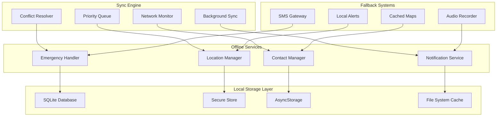
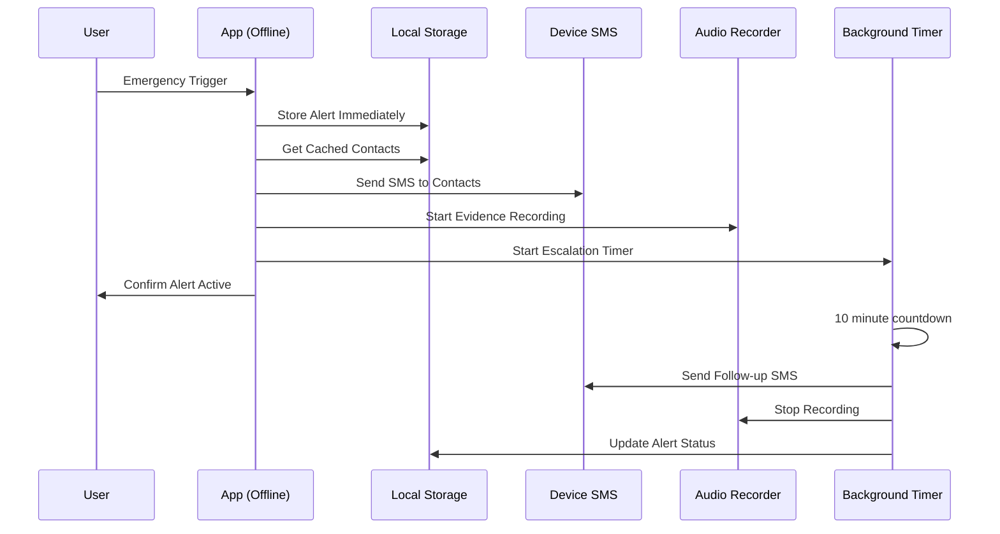

# Offline Capabilities & Synchronization

<Info>
**Safety Never Goes Offline:** Shelther's offline-first architecture ensures critical safety features work seamlessly without internet connectivity, with intelligent synchronization when connection is restored.
</Info>

## Offline-First Architecture

Shelther implements a robust offline-first approach where all core safety features operate locally, with cloud synchronization as an enhancement rather than a requirement:

<CardGroup cols={2}>
  <Card title="Local-First Operation" icon="hard-drive">
    All emergency features work without internet connectivity using local data and processing
  </Card>
  <Card title="Intelligent Sync" icon="refresh">
    Seamless data synchronization when connectivity returns with conflict resolution
  </Card>
  <Card title="Battery Optimization" icon="battery">
    Offline operations optimized for minimal battery drain during extended periods
  </Card>
  <Card title="Emergency Priority" icon="bell">
    Emergency data always takes precedence in synchronization and conflict resolution
  </Card>
</CardGroup>

## Offline Architecture Overview



## Local Data Storage Strategy

### Multi-Tier Storage Architecture

<Steps>
  <Step title="Critical Safety Data">
    Emergency contacts, user preferences, and safety protocols stored in encrypted SQLite with immediate access
  </Step>
  <Step title="Cached Network Data">
    Recently synchronized data cached locally with intelligent expiration and refresh policies
  </Step>
  <Step title="Temporary Session Data">
    Active emergency sessions and real-time data stored with automatic cleanup
  </Step>
  <Step title="Media and Evidence">
    Emergency photos, audio recordings, and other evidence stored locally with background upload
  </Step>
</Steps>

<CodeGroup>
```typescript Local Database Schema
// SQLite schema for offline-first operation
export const OfflineSchema = {
  // Critical user data - always available offline
  users: `
    CREATE TABLE IF NOT EXISTS users_cache (
      id TEXT PRIMARY KEY,
      email TEXT NOT NULL,
      full_name TEXT,
      phone_number TEXT,
      emergency_settings TEXT, -- JSON blob
      privacy_settings TEXT,   -- JSON blob
      last_sync DATETIME DEFAULT CURRENT_TIMESTAMP,
      is_dirty INTEGER DEFAULT 0
    )
  `,

  // Emergency contacts - essential for offline emergencies
  emergency_contacts: `
    CREATE TABLE IF NOT EXISTS emergency_contacts_cache (
      id TEXT PRIMARY KEY,
      user_id TEXT NOT NULL,
      contact_name TEXT NOT NULL,
      contact_phone TEXT NOT NULL,
      contact_email TEXT,
      relationship TEXT NOT NULL,
      priority_level INTEGER DEFAULT 1,
      verification_status TEXT DEFAULT 'verified',
      notification_preferences TEXT, -- JSON blob
      last_sync DATETIME DEFAULT CURRENT_TIMESTAMP,
      is_dirty INTEGER DEFAULT 0,
      FOREIGN KEY (user_id) REFERENCES users_cache (id)
    )
  `,

  // Location data for emergency context
  location_cache: `
    CREATE TABLE IF NOT EXISTS location_cache (
      id TEXT PRIMARY KEY,
      user_id TEXT NOT NULL,
      latitude REAL NOT NULL,
      longitude REAL NOT NULL,
      accuracy REAL,
      address TEXT,
      timestamp DATETIME DEFAULT CURRENT_TIMESTAMP,
      is_emergency INTEGER DEFAULT 0,
      sync_status TEXT DEFAULT 'pending', -- pending, synced, failed
      retry_count INTEGER DEFAULT 0,
      FOREIGN KEY (user_id) REFERENCES users_cache (id)
    )
  `,

  // Emergency alerts - critical for offline operation
  emergency_alerts_cache: `
    CREATE TABLE IF NOT EXISTS emergency_alerts_cache (
      id TEXT PRIMARY KEY,
      user_id TEXT NOT NULL,
      alert_type TEXT NOT NULL,
      trigger_method TEXT,
      status TEXT DEFAULT 'active',
      severity TEXT DEFAULT 'high',
      location_id TEXT,
      message TEXT,
      evidence_paths TEXT, -- JSON array of local file paths
      created_at DATETIME DEFAULT CURRENT_TIMESTAMP,
      sync_status TEXT DEFAULT 'pending',
      contacts_notified TEXT, -- JSON array of contacted users
      is_offline_created INTEGER DEFAULT 0,
      FOREIGN KEY (user_id) REFERENCES users_cache (id),
      FOREIGN KEY (location_id) REFERENCES location_cache (id)
    )
  `,

  // Sync queue for managing offline operations
  sync_queue: `
    CREATE TABLE IF NOT EXISTS sync_queue (
      id TEXT PRIMARY KEY,
      table_name TEXT NOT NULL,
      operation TEXT NOT NULL, -- INSERT, UPDATE, DELETE
      record_id TEXT NOT NULL,
      data TEXT, -- JSON blob of the record
      priority INTEGER DEFAULT 3, -- 1=emergency, 2=safety, 3=normal
      timestamp DATETIME DEFAULT CURRENT_TIMESTAMP,
      retry_count INTEGER DEFAULT 0,
      max_retries INTEGER DEFAULT 5,
      last_error TEXT,
      sync_status TEXT DEFAULT 'pending' -- pending, syncing, completed, failed
    )
  `,

  // Cached venue data for offline safety checks
  venues_cache: `
    CREATE TABLE IF NOT EXISTS venues_cache (
      id TEXT PRIMARY KEY,
      name TEXT NOT NULL,
      latitude REAL NOT NULL,
      longitude REAL NOT NULL,
      address TEXT,
      safety_rating REAL,
      safety_features TEXT, -- JSON blob
      last_updated DATETIME,
      cache_expiry DATETIME,
      is_verified INTEGER DEFAULT 0
    )
  `
};

// Initialize offline database
export class OfflineDatabase {
  private static db: SQLite.SQLiteDatabase | null = null;

  static async initialize(): Promise<void> {
    try {
      this.db = await SQLite.openDatabaseAsync('shelther_offline.db', {
        enableChangeListener: true
      });

      // Create all tables
      for (const [tableName, schema] of Object.entries(OfflineSchema)) {
        await this.db.execAsync(schema);
      }

      // Create indexes for performance
      await this.createIndexes();

      // Set up triggers for automatic sync queue management
      await this.createSyncTriggers();

      console.log('Offline database initialized successfully');
    } catch (error) {
      console.error('Failed to initialize offline database:', error);
      throw new OfflineDatabaseError('Database initialization failed', error);
    }
  }

  private static async createIndexes(): Promise<void> {
    if (!this.db) return;

    const indexes = [
      'CREATE INDEX IF NOT EXISTS idx_emergency_contacts_user ON emergency_contacts_cache(user_id, priority_level)',
      'CREATE INDEX IF NOT EXISTS idx_location_cache_user_time ON location_cache(user_id, timestamp DESC)',
      'CREATE INDEX IF NOT EXISTS idx_emergency_alerts_user_status ON emergency_alerts_cache(user_id, status)',
      'CREATE INDEX IF NOT EXISTS idx_sync_queue_priority ON sync_queue(priority, timestamp)',
      'CREATE INDEX IF NOT EXISTS idx_venues_location ON venues_cache(latitude, longitude)',
    ];

    for (const indexQuery of indexes) {
      await this.db.execAsync(indexQuery);
    }
  }

  private static async createSyncTriggers(): Promise<void> {
    if (!this.db) return;

    // Trigger to auto-add records to sync queue when modified
    const syncTrigger = `
      CREATE TRIGGER IF NOT EXISTS auto_sync_emergency_contacts
      AFTER UPDATE ON emergency_contacts_cache
      WHEN NEW.is_dirty = 1
      BEGIN
        INSERT INTO sync_queue (table_name, operation, record_id, data, priority)
        VALUES ('emergency_contacts', 'UPDATE', NEW.id, 
                json_object('id', NEW.id, 'contact_name', NEW.contact_name, 
                           'contact_phone', NEW.contact_phone, 'contact_email', NEW.contact_email), 2);
      END;
    `;

    await this.db.execAsync(syncTrigger);
  }
}
```

```typescript Offline Emergency Handler
export class OfflineEmergencyHandler {
  static async triggerOfflineEmergency(
    alertData: OfflineEmergencyRequest
  ): Promise<OfflineEmergencyResult> {
    try {
      const startTime = Date.now();
      const alertId = generateUUID();

      // 1. Store emergency alert locally immediately
      await this.storeEmergencyAlertOffline(alertId, alertData);

      // 2. Get cached emergency contacts
      const emergencyContacts = await this.getOfflineEmergencyContacts(alertData.userId);
      
      if (emergencyContacts.length === 0) {
        throw new Error('No emergency contacts available offline');
      }

      // 3. Capture current location
      const location = await this.getCachedOrCurrentLocation(alertData.userId);
      
      // 4. Store location for emergency context
      const locationId = await this.storeLocationOffline(alertData.userId, location, true);

      // 5. Update alert with location
      await this.updateOfflineAlert(alertId, { location_id: locationId });

      // 6. Attempt offline notifications
      const notificationResults = await this.sendOfflineNotifications(
        emergencyContacts,
        alertData,
        location
      );

      // 7. Store evidence if available
      if (alertData.evidence) {
        await this.storeEvidenceOffline(alertId, alertData.evidence);
      }

      // 8. Queue everything for sync when online
      await this.queueEmergencyForSync(alertId, alertData, location, notificationResults);

      const processingTime = Date.now() - startTime;

      return {
        success: true,
        alertId,
        processingTime,
        contactsNotified: notificationResults.attempted,
        contactsReached: notificationResults.successful,
        location,
        isOffline: true,
        syncStatus: 'queued'
      };

    } catch (error) {
      console.error('Offline emergency processing failed:', error);
      
      // Even if processing fails, ensure basic alert is stored
      await this.storeFailsafeAlert(alertData);
      
      throw new OfflineEmergencyError(
        'Offline emergency processing failed',
        error,
        { alertData }
      );
    }
  }

  private static async sendOfflineNotifications(
    contacts: CachedEmergencyContact[],
    alertData: OfflineEmergencyRequest,
    location: LocationData
  ): Promise<OfflineNotificationResult> {
    const results = {
      attempted: 0,
      successful: 0,
      failed: 0,
      methods: [] as NotificationMethod[]
    };

    for (const contact of contacts.slice(0, 3)) { // Limit to top 3 for offline
      try {
        // Attempt SMS if available (works without internet)
        if (await this.isSMSAvailable()) {
          const smsResult = await this.sendOfflineSMS(contact, alertData, location);
          results.methods.push({
            contact_id: contact.id,
            method: 'sms',
            success: smsResult.success,
            error: smsResult.error
          });
          
          if (smsResult.success) {
            results.successful++;
          } else {
            results.failed++;
          }
        }

        // Store notification attempt for sync
        await this.storeNotificationAttempt(contact.id, alertData.alertId, 'offline');
        
        results.attempted++;
      } catch (error) {
        console.error(`Failed to notify contact ${contact.id} offline:`, error);
        results.failed++;
      }
    }

    // Local device alert as fallback
    await this.triggerLocalAlert(alertData);

    return results;
  }

  private static async sendOfflineSMS(
    contact: CachedEmergencyContact,
    alertData: OfflineEmergencyRequest,
    location: LocationData
  ): Promise<SMSResult> {
    try {
      // Use device SMS capability (works without internet)
      const message = this.formatOfflineEmergencyMessage(contact, alertData, location);
      
      const result = await SMS.sendSMSAsync(
        [contact.contact_phone],
        message
      );

      return {
        success: result.result === 'sent',
        messageId: null, // No ID available for direct SMS
        error: result.result !== 'sent' ? 'SMS sending failed' : null
      };
    } catch (error) {
      return {
        success: false,
        messageId: null,
        error: error.message
      };
    }
  }

  private static formatOfflineEmergencyMessage(
    contact: CachedEmergencyContact,
    alertData: OfflineEmergencyRequest,
    location: LocationData
  ): string {
    const locationText = location ? 
      `Location: ${location.latitude.toFixed(6)}, ${location.longitude.toFixed(6)}` :
      'Location: Not available';

    return `🚨 EMERGENCY ALERT 🚨
${contact.contact_name} has triggered an emergency alert.

${locationText}

Time: ${new Date().toLocaleString()}

This is an automated message from Shelther Safety. App is currently offline - please respond via SMS or call immediately.`;
  }

  private static async triggerLocalAlert(alertData: OfflineEmergencyRequest): Promise<void> {
    try {
      // Trigger device alarm
      await Haptics.notificationAsync(Haptics.NotificationFeedbackType.Error);
      
      // Show persistent notification
      await Notifications.scheduleNotificationAsync({
        content: {
          title: '🚨 Emergency Alert Active',
          body: 'Emergency alert has been triggered. App will sync when connection returns.',
          sound: true,
          priority: Notifications.AndroidNotificationPriority.MAX,
          sticky: true,
        },
        trigger: null, // Immediate
      });

      // Keep screen on for emergency
      await KeepAwake.activateKeepAwake();
      
      // Start emergency countdown
      await this.startEmergencyCountdown(alertData.alertId);
      
    } catch (error) {
      console.error('Failed to trigger local alert:', error);
    }
  }
}
```
</CodeGroup>

## Intelligent Synchronization Engine

### Sync Priority System

<Note>
**Emergency-First Sync:** When connectivity returns, emergency data syncs first with highest priority, followed by safety-related data, then general app data.
</Note>

<CardGroup cols={4}>
  <Card title="Priority 1: Emergency" icon="bell">
    Active emergency alerts, evidence, and emergency contact updates
  </Card>
  <Card title="Priority 2: Safety" icon="shield">
    Location updates, check-ins, and safety preference changes
  </Card>
  <Card title="Priority 3: General" icon="settings">
    Profile updates, app preferences, and non-critical data
  </Card>
  <Card title="Priority 4: Analytics" icon="chart">
    Usage analytics, performance metrics, and optimization data
  </Card>
</CardGroup>

<CodeGroup>
```typescript Intelligent Sync Engine
export class SyncEngine {
  private static readonly SYNC_PRIORITIES = {
    EMERGENCY: 1,
    SAFETY: 2,
    GENERAL: 3,
    ANALYTICS: 4
  };

  private static readonly SYNC_BATCH_SIZES = {
    [this.SYNC_PRIORITIES.EMERGENCY]: 1,    // Process immediately
    [this.SYNC_PRIORITIES.SAFETY]: 5,      // Small batches
    [this.SYNC_PRIORITIES.GENERAL]: 20,    // Medium batches
    [this.SYNC_PRIORITIES.ANALYTICS]: 50   // Large batches
  };

  static async startSyncProcess(): Promise<SyncResult> {
    try {
      // Check network connectivity
      const networkState = await NetInfo.fetch();
      if (!networkState.isConnected) {
        return { success: false, reason: 'No network connectivity' };
      }

      console.log('Starting intelligent sync process...');
      
      // Get sync queue ordered by priority
      const syncQueue = await this.getSyncQueue();
      
      if (syncQueue.length === 0) {
        return { success: true, message: 'No data to sync' };
      }

      // Group by priority and process in order
      const priorityGroups = this.groupByPriority(syncQueue);
      const results = {
        totalItems: syncQueue.length,
        processed: 0,
        succeeded: 0,
        failed: 0,
        errors: [] as SyncError[]
      };

      // Process each priority level
      for (const priority of [1, 2, 3, 4]) {
        const items = priorityGroups[priority] || [];
        if (items.length === 0) continue;

        console.log(`Syncing ${items.length} items with priority ${priority}`);
        
        const priorityResult = await this.syncPriorityGroup(priority, items);
        
        results.processed += priorityResult.processed;
        results.succeeded += priorityResult.succeeded;
        results.failed += priorityResult.failed;
        results.errors.push(...priorityResult.errors);

        // For emergency priority, wait for completion before moving on
        if (priority === this.SYNC_PRIORITIES.EMERGENCY && priorityResult.failed > 0) {
          console.warn('Emergency sync failed, retrying...');
          await this.retryEmergencySync(items);
        }
      }

      // Clean up completed sync items
      await this.cleanupCompletedSync();

      // Update last sync timestamp
      await AsyncStorage.setItem('last_sync_timestamp', new Date().toISOString());

      return {
        success: true,
        results,
        syncTimestamp: new Date().toISOString()
      };

    } catch (error) {
      console.error('Sync process failed:', error);
      return {
        success: false,
        reason: error.message,
        error
      };
    }
  }

  private static async syncPriorityGroup(
    priority: number,
    items: SyncQueueItem[]
  ): Promise<PriorityGroupResult> {
    const batchSize = this.SYNC_BATCH_SIZES[priority];
    const results = {
      processed: 0,
      succeeded: 0,
      failed: 0,
      errors: [] as SyncError[]
    };

    // Process in batches
    for (let i = 0; i < items.length; i += batchSize) {
      const batch = items.slice(i, i + batchSize);
      
      // For emergency priority, process serially; others can be parallel
      if (priority === this.SYNC_PRIORITIES.EMERGENCY) {
        for (const item of batch) {
          try {
            await this.syncSingleItem(item);
            results.succeeded++;
          } catch (error) {
            results.failed++;
            results.errors.push({
              item_id: item.id,
              error: error.message,
              priority,
              retry_count: item.retry_count
            });
          }
          results.processed++;
        }
      } else {
        // Parallel processing for non-emergency items
        const batchResults = await Promise.allSettled(
          batch.map(item => this.syncSingleItem(item))
        );

        batchResults.forEach((result, index) => {
          if (result.status === 'fulfilled') {
            results.succeeded++;
          } else {
            results.failed++;
            results.errors.push({
              item_id: batch[index].id,
              error: result.reason?.message || 'Unknown error',
              priority,
              retry_count: batch[index].retry_count
            });
          }
          results.processed++;
        });
      }

      // Small delay between batches to avoid overwhelming the server
      if (i + batchSize < items.length) {
        await new Promise(resolve => setTimeout(resolve, 100));
      }
    }

    return results;
  }

  private static async syncSingleItem(item: SyncQueueItem): Promise<void> {
    try {
      const { table_name, operation, data } = item;
      const parsedData = typeof data === 'string' ? JSON.parse(data) : data;

      // Add sync metadata
      const syncData = {
        ...parsedData,
        sync_timestamp: new Date().toISOString(),
        client_version: APP_VERSION,
        sync_source: 'offline_queue'
      };

      let result;
      switch (operation) {
        case 'INSERT':
          result = await supabase.from(table_name).insert(syncData);
          break;
        case 'UPDATE':
          result = await supabase
            .from(table_name)
            .update(syncData)
            .eq('id', parsedData.id);
          break;
        case 'DELETE':
          result = await supabase
            .from(table_name)
            .delete()
            .eq('id', parsedData.id);
          break;
        default:
          throw new Error(`Unknown operation: ${operation}`);
      }

      if (result.error) {
        throw new Error(`Supabase error: ${result.error.message}`);
      }

      // Mark as completed in sync queue
      await this.markSyncCompleted(item.id);

      // Update local cache with server response
      if (result.data && operation !== 'DELETE') {
        await this.updateLocalCache(table_name, result.data[0]);
      }

    } catch (error) {
      // Increment retry count
      await this.incrementRetryCount(item.id, error.message);
      throw error;
    }
  }

  // Emergency sync retry with exponential backoff
  private static async retryEmergencySync(items: SyncQueueItem[]): Promise<void> {
    const maxRetries = 5;
    const baseDelay = 1000; // 1 second

    for (const item of items) {
      if (item.retry_count >= maxRetries) {
        console.error(`Emergency item ${item.id} exceeded max retries`);
        continue;
      }

      const delay = baseDelay * Math.pow(2, item.retry_count);
      await new Promise(resolve => setTimeout(resolve, delay));

      try {
        await this.syncSingleItem(item);
        console.log(`Emergency item ${item.id} synced successfully on retry`);
      } catch (error) {
        console.error(`Emergency item ${item.id} failed retry ${item.retry_count + 1}:`, error);
      }
    }
  }
}
```

```typescript Conflict Resolution System
export class ConflictResolver {
  static async resolveConflicts(
    localData: any,
    serverData: any,
    tableName: string
  ): Promise<ConflictResolution> {
    
    // Emergency data always wins (safety first)
    if (this.isEmergencyData(tableName, localData, serverData)) {
      return await this.resolveEmergencyConflict(localData, serverData);
    }

    // Use last-writer-wins for most data
    if (this.isSimpleConflict(localData, serverData)) {
      return this.resolveByTimestamp(localData, serverData);
    }

    // Complex conflicts require intelligent merging
    return await this.resolveComplexConflict(localData, serverData, tableName);
  }

  private static async resolveEmergencyConflict(
    localData: any,
    serverData: any
  ): Promise<ConflictResolution> {
    // Emergency data resolution rules:
    // 1. Most recent emergency alert wins
    // 2. Emergency contact additions are merged
    // 3. Active emergencies cannot be overwritten by older data

    if (localData.status === 'active' && serverData.status === 'resolved') {
      // Local active emergency takes precedence
      return {
        resolution: 'use_local',
        reason: 'Active emergency cannot be overwritten',
        merged_data: localData
      };
    }

    if (serverData.severity === 'critical' && localData.severity !== 'critical') {
      // Critical emergencies from server take precedence
      return {
        resolution: 'use_server',
        reason: 'Critical emergency status from server',
        merged_data: serverData
      };
    }

    // Default to most recent for emergency data
    return this.resolveByTimestamp(localData, serverData);
  }

  private static resolveByTimestamp(
    localData: any,
    serverData: any
  ): ConflictResolution {
    const localTime = new Date(localData.updated_at || localData.created_at);
    const serverTime = new Date(serverData.updated_at || serverData.created_at);

    if (localTime > serverTime) {
      return {
        resolution: 'use_local',
        reason: 'Local data is more recent',
        merged_data: localData
      };
    } else {
      return {
        resolution: 'use_server',
        reason: 'Server data is more recent',
        merged_data: serverData
      };
    }
  }

  private static async resolveComplexConflict(
    localData: any,
    serverData: any,
    tableName: string
  ): Promise<ConflictResolution> {
    switch (tableName) {
      case 'emergency_contacts':
        return this.mergeEmergencyContacts(localData, serverData);
      
      case 'safety_profiles':
        return this.mergeSafetyProfiles(localData, serverData);
        
      case 'location_updates':
        return this.resolveLocationConflict(localData, serverData);
        
      default:
        return this.resolveByTimestamp(localData, serverData);
    }
  }

  private static mergeEmergencyContacts(
    localData: any,
    serverData: any
  ): ConflictResolution {
    // Merge contact lists intelligently
    const mergedContacts = {
      ...serverData,
      // Preserve local verification status if more recent
      verification_status: localData.verification_status || serverData.verification_status,
      // Merge notification preferences
      notification_preferences: {
        ...serverData.notification_preferences,
        ...localData.notification_preferences
      },
      // Use most recent update timestamp
      updated_at: new Date(Math.max(
        new Date(localData.updated_at).getTime(),
        new Date(serverData.updated_at).getTime()
      )).toISOString()
    };

    return {
      resolution: 'merge',
      reason: 'Merged emergency contact data',
      merged_data: mergedContacts
    };
  }

  private static mergeSafetyProfiles(
    localData: any,
    serverData: any
  ): ConflictResolution {
    // Safety profiles can be intelligently merged
    const merged = {
      ...serverData,
      // Preserve local emergency settings if newer
      emergency_settings: this.mergeTimestampedObject(
        localData.emergency_settings,
        serverData.emergency_settings
      ),
      // Merge safety zones
      safety_zones: this.mergeSafetyZones(
        localData.safety_zones || [],
        serverData.safety_zones || []
      ),
      updated_at: new Date().toISOString()
    };

    return {
      resolution: 'merge',
      reason: 'Intelligent merge of safety profile',
      merged_data: merged
    };
  }
}
```
</CodeGroup>

## Battery-Optimized Offline Operations

### Power Management Strategy

<Steps>
  <Step title="Adaptive Monitoring">
    Adjust location tracking frequency and sync intervals based on battery level
  </Step>
  <Step title="Background Task Optimization">
    Minimize background processing while maintaining safety functionality
  </Step>
  <Step title="Emergency Override">
    Emergency situations bypass all battery optimizations for maximum functionality
  </Step>
  <Step title="Intelligent Scheduling">
    Schedule non-critical operations during charging periods
  </Step>
</Steps>

<Accordion title="Battery Level Adaptations">
**High Battery (&gt;50%):**
- Location updates every 30 seconds
- Full sync every 5 minutes when online
- Real-time notifications enabled
- Background media processing active

**Medium Battery (20-50%):**
- Location updates every 2 minutes
- Sync every 15 minutes when online
- Reduced notification polling
- Deferred non-emergency media processing

**Low Battery (&lt;20%):**
- Location updates every 5 minutes
- Sync only when user opens app
- Emergency-only notifications
- All non-critical background tasks paused

**Critical Battery (&lt;10%):**
- Location updates only during emergencies
- Manual sync only
- Emergency alerts only
- All optimization features disabled

```typescript
export const BatteryOptimizer = {
  async getBatteryLevel(): Promise<number> {
    const batteryLevel = await Battery.getBatteryLevelAsync();
    return Math.round(batteryLevel * 100);
  },

  async getOptimizationLevel(batteryLevel: number): Promise<OptimizationLevel> {
    if (batteryLevel > 50) return 'normal';
    if (batteryLevel > 20) return 'balanced';
    if (batteryLevel > 10) return 'power_saver';
    return 'emergency_only';
  },

  async applyOptimizations(level: OptimizationLevel): Promise<void> {
    const configs = {
      normal: {
        locationInterval: 30000,
        syncInterval: 300000,
        backgroundTasks: true,
        realTimeUpdates: true
      },
      balanced: {
        locationInterval: 120000,
        syncInterval: 900000,
        backgroundTasks: true,
        realTimeUpdates: false
      },
      power_saver: {
        locationInterval: 300000,
        syncInterval: -1, // Manual only
        backgroundTasks: false,
        realTimeUpdates: false
      },
      emergency_only: {
        locationInterval: -1, // Emergency only
        syncInterval: -1,
        backgroundTasks: false,
        realTimeUpdates: false
      }
    };

    await this.applyConfig(configs[level]);
  }
};
```
</Accordion>

## Emergency Offline Features

### Offline Emergency Capabilities

<CardGroup cols={2}>
  <Card title="Local Emergency Processing" icon="bell">
    Complete emergency alert processing without internet connectivity
  </Card>
  <Card title="SMS Fallback" icon="message">
    Direct SMS notifications to emergency contacts using device capabilities
  </Card>
  <Card title="Evidence Collection" icon="camera">
    Audio, photo, and video evidence stored locally for later upload
  </Card>
  <Card title="Emergency Countdown" icon="clock">
    Automated escalation timers that work entirely offline
  </Card>
</CardGroup>

### Offline Emergency Flow



<CodeGroup>
```typescript Offline Emergency Features
export class OfflineEmergencyFeatures {
  // Complete offline emergency processing
  static async handleOfflineEmergency(request: EmergencyRequest): Promise<OfflineEmergencyResponse> {
    const emergencyId = generateUUID();
    
    try {
      // 1. Immediate local storage
      const alert = await this.createOfflineAlert(emergencyId, request);
      
      // 2. Get cached emergency contacts
      const contacts = await this.getCachedEmergencyContacts(request.userId);
      
      // 3. Send SMS notifications immediately
      const smsResults = await this.sendEmergencySMSOffline(contacts, alert);
      
      // 4. Start evidence collection
      const evidenceSession = await this.startEvidenceCollection(emergencyId);
      
      // 5. Set up escalation timer
      const escalationTimer = await this.setupOfflineEscalation(emergencyId, contacts);
      
      // 6. Create persistent notification
      await this.createEmergencyNotification(emergencyId);
      
      // 7. Keep device awake
      await KeepAwake.activateKeepAwake();

      return {
        emergencyId,
        status: 'active_offline',
        contactsNotified: smsResults.successful,
        evidenceSessionId: evidenceSession.id,
        escalationTimerId: escalationTimer.id,
        estimatedSyncTime: await this.estimateNextSync()
      };
      
    } catch (error) {
      // Failsafe: even if everything else fails, create basic alert
      await this.createFailsafeAlert(emergencyId, request);
      throw new OfflineEmergencyError('Offline emergency processing failed', error);
    }
  }

  // SMS-based emergency notifications
  private static async sendEmergencySMSOffline(
    contacts: CachedContact[],
    alert: OfflineAlert
  ): Promise<SMSNotificationResult> {
    const results = {
      attempted: 0,
      successful: 0,
      failed: 0,
      errors: [] as string[]
    };

    // Sort contacts by priority
    const sortedContacts = contacts.sort((a, b) => a.priority_level - b.priority_level);
    
    // Notify top 3 contacts to avoid SMS spam
    for (const contact of sortedContacts.slice(0, 3)) {
      try {
        const message = this.formatEmergencySMS(contact, alert);
        
        const smsResult = await SMS.sendSMSAsync([contact.contact_phone], message);
        
        results.attempted++;
        
        if (smsResult.result === 'sent') {
          results.successful++;
          
          // Log successful notification locally
          await this.logOfflineNotification(contact.id, alert.id, 'sms', 'sent');
        } else {
          results.failed++;
          results.errors.push(`SMS to ${contact.contact_name} failed: ${smsResult.result}`);
          
          await this.logOfflineNotification(contact.id, alert.id, 'sms', 'failed', smsResult.result);
        }
        
      } catch (error) {
        results.failed++;
        results.errors.push(`SMS to ${contact.contact_name} error: ${error.message}`);
        
        await this.logOfflineNotification(contact.id, alert.id, 'sms', 'error', error.message);
      }
    }

    return results;
  }

  // Evidence collection in offline mode
  private static async startEvidenceCollection(emergencyId: string): Promise<EvidenceSession> {
    const sessionId = generateUUID();
    const evidenceDir = `${FileSystem.documentDirectory}emergency_evidence/${emergencyId}/`;
    
    // Create evidence directory
    await FileSystem.makeDirectoryAsync(evidenceDir, { intermediates: true });
    
    const session = {
      id: sessionId,
      emergency_id: emergencyId,
      evidence_dir: evidenceDir,
      created_at: new Date().toISOString(),
      status: 'active',
      collected_evidence: [] as EvidenceFile[]
    };

    // Start automatic audio recording
    try {
      const audioRecording = await Audio.Recording.createAsync(
        Audio.RecordingOptionsPresets.HIGH_QUALITY,
        undefined,
        1000 // 1 second updates
      );
      
      session.audio_recording = {
        recording: audioRecording.recording,
        file_path: `${evidenceDir}emergency_audio_${Date.now()}.m4a`,
        started_at: new Date().toISOString()
      };
      
    } catch (error) {
      console.warn('Failed to start audio recording:', error);
    }

    // Store session locally
    await AsyncStorage.setItem(`evidence_session_${sessionId}`, JSON.stringify(session));
    
    return session;
  }

  // Offline escalation system
  private static async setupOfflineEscalation(
    emergencyId: string,
    contacts: CachedContact[]
  ): Promise<EscalationTimer> {
    const timerId = generateUUID();
    
    // Schedule escalation background task
    await BackgroundTask.define(timerId, async () => {
      try {
        // After 10 minutes, send follow-up SMS
        await new Promise(resolve => setTimeout(resolve, 10 * 60 * 1000));
        
        const followUpMessage = `🚨 EMERGENCY FOLLOW-UP 🚨
The emergency alert sent 10 minutes ago is still active. Please respond immediately or call emergency services.

Emergency ID: ${emergencyId}
Time: ${new Date().toLocaleString()}

If this is resolved, please reply "RESOLVED ${emergencyId}"`;

        // Send follow-up to all contacts
        for (const contact of contacts) {
          try {
            await SMS.sendSMSAsync([contact.contact_phone], followUpMessage);
          } catch (error) {
            console.error(`Follow-up SMS failed for ${contact.contact_name}:`, error);
          }
        }
        
        // Schedule final escalation (20 minutes total)
        setTimeout(async () => {
          await this.finalEscalation(emergencyId, contacts);
        }, 10 * 60 * 1000);
        
      } catch (error) {
        console.error('Escalation timer failed:', error);
      }
    });

    const timer = {
      id: timerId,
      emergency_id: emergencyId,
      created_at: new Date().toISOString(),
      escalation_intervals: [10, 20], // minutes
      status: 'active'
    };

    await AsyncStorage.setItem(`escalation_timer_${timerId}`, JSON.stringify(timer));
    
    return timer;
  }

  // Format emergency SMS for offline sending
  private static formatEmergencySMS(contact: CachedContact, alert: OfflineAlert): string {
    const locationText = alert.location ? 
      `📍 Location: https://maps.google.com/maps?q=${alert.location.latitude},${alert.location.longitude}` :
      '📍 Location: Not available';

    return `🚨 EMERGENCY ALERT 🚨
${contact.contact_name} has triggered an emergency alert.

${locationText}

⏰ Time: ${new Date(alert.created_at).toLocaleString()}

📱 Status: App offline - please respond via SMS or call immediately.

Emergency ID: ${alert.id}

This is an automated message from Shelther Safety.`;
  }
}
```
</CodeGroup>

## Performance Optimization

### Offline Performance Targets

<Note>
**Performance SLAs for Offline Mode:** Emergency features must respond within 2 seconds even in offline mode, with local storage operations completing in under 100ms.
</Note>

| Operation | Target Time | Fallback Strategy |
|-----------|-------------|-------------------|
| **Emergency Alert Creation** | &lt;2 seconds | Immediate local storage + async processing |
| **Contact Retrieval** | &lt;100ms | Cached contacts with SQLite indexing |
| **Location Capture** | &lt;3 seconds | Cached location if GPS unavailable |
| **Evidence Collection Start** | &lt;1 second | Pre-allocated storage space |
| **SMS Notification** | &lt;5 seconds | Queue for retry if device SMS fails |

### Database Performance Optimization

<Steps>
  <Step title="Strategic Indexing">
    Critical indexes on frequently accessed offline data with compound indexes for complex queries
  </Step>
  <Step title="Query Optimization">
    Optimized SQL queries with prepared statements and connection pooling
  </Step>
  <Step title="Data Pruning">
    Automatic cleanup of old offline data with configurable retention policies
  </Step>
  <Step title="Compression">
    Efficient storage of historical data with background compression
  </Step>
</Steps>

---

## Next Steps

<CardGroup cols={3}>
  <Card title="Database Schema" icon="database" href="/architecture/database-schema">
    Complete database schema with offline table specifications
  </Card>
  <Card title="Emergency Model" icon="bell" href="/architecture/emergency-model">
    Detailed emergency data model and offline emergency workflows
  </Card>
  <Card title="Location Model" icon="map-pin" href="/architecture/location-model">
    Location data architecture with offline caching strategies
  </Card>
</CardGroup>

<Warning>
**Testing Offline Features:** All offline capabilities should be thoroughly tested in airplane mode and poor network conditions to ensure reliability during real emergencies.
</Warning>