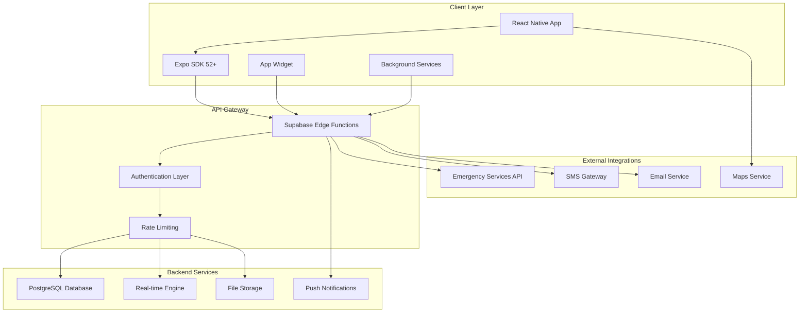

# System Architecture Overview

<Info>
**Safety-First Architecture:** Shelther's architecture prioritizes reliability, security, and offline capabilities to ensure protection when users need it most. Every component is designed with emergency scenarios in mind.
</Info>

## Architecture Principles

Shelther's architecture follows these core principles for safety-critical applications:

<CardGroup cols={2}>
  <Card title="Offline-First Design" icon="wifi-slash">
    Core safety features work without internet connectivity, with intelligent sync when connected
  </Card>
  <Card title="Real-time Reliability" icon="bolt">
    Sub-second emergency alert delivery with multiple fallback mechanisms
  </Card>
  <Card title="Privacy by Design" icon="shield">
    End-to-end encryption and minimal data collection with user-controlled sharing
  </Card>
  <Card title="Battery Optimization" icon="battery-half">
    Adaptive algorithms that extend battery life while maintaining safety monitoring
  </Card>
</CardGroup>

## High-Level System Design



## Technology Stack Overview

### Modern Mobile Development

<Steps>
  <Step title="React Native 0.74+">
    Cross-platform mobile development with native performance and New Architecture support
  </Step>
  <Step title="Expo SDK 52+">
    Managed workflow with enhanced background services, security features, and development tools
  </Step>
  <Step title="TypeScript">
    Type-safe development reducing runtime errors critical in safety applications
  </Step>
  <Step title="Redux Toolkit">
    Predictable state management for complex safety workflows and offline data synchronization
  </Step>
</Steps>

### Backend-as-a-Service Platform

<CardGroup cols={3}>
  <Card title="Supabase Core" icon="database">
    PostgreSQL database with Row Level Security, real-time subscriptions, and auto-generated APIs
  </Card>
  <Card title="Authentication" icon="key">
    JWT-based auth with MFA support, social logins, and emergency bypass mechanisms
  </Card>
  <Card title="Edge Functions" icon="server">
    Server-side logic for emergency processing, integrations, and background tasks
  </Card>
</CardGroup>

## Core Components Architecture

### Client-Side Architecture

<CodeGroup>
```typescript Application Structure
// Core application layers
├── App Layer
│   ├── Navigation (Expo Router)
│   ├── State Management (Redux Toolkit)
│   ├── Error Boundaries
│   └── Security Context
├── Feature Layer
│   ├── Emergency System
│   ├── Location Services
│   ├── Contact Management
│   └── Check-in System
├── Service Layer
│   ├── Supabase Client
│   ├── Location Manager
│   ├── Notification Handler
│   └── Offline Storage
└── Platform Layer
    ├── Device APIs (Location, Camera, Sensors)
    ├── Push Notifications
    ├── Background Tasks
    └── Secure Storage
```

```typescript Safety-Critical Components
// Emergency system architecture
EmergencySystem: {
  triggers: [
    'PhysicalButtons',    // Volume + Power combination
    'VoiceActivation',    // "Hey Shelther, emergency"
    'ShakeGesture',       // Configurable shake pattern
    'AutoDetection',      // AI-powered anomaly detection
    'WidgetPress'         // Home screen widget
  ],
  processing: [
    'LocationCapture',    // Immediate GPS + network location
    'ContactNotification', // Parallel SMS + push notifications
    'EvidenceCollection', // Audio/photo/video capture
    'EscalationProtocol'  // Auto-escalation if no response
  ],
  fallbacks: [
    'OfflineStorage',     // Store alerts when offline
    'SMSFallback',        // SMS when data unavailable
    'LocalAudioAlert',    // Device alarm as last resort
    'ManualCancel'        // Emergency cancellation method
  ]
}
```
</CodeGroup>

### Real-Time Data Flow

<Accordion title="Emergency Alert Flow">
**Trigger Phase (0-3 seconds):**
1. User activates emergency trigger
2. App captures current location with high accuracy
3. Local storage backup created immediately
4. UI provides immediate feedback and countdown

**Processing Phase (3-10 seconds):**
1. Alert record created in Supabase database
2. Real-time notification sent to subscribed contacts
3. SMS/email fallback notifications triggered
4. Evidence collection begins (audio/photo if configured)

**Escalation Phase (10+ seconds):**
1. Contact acknowledgment tracking
2. Auto-escalation if no response within timeframe
3. Emergency services notification (where available)
4. Continuous location updates until resolved
</Accordion>

<Accordion title="Location Sharing Flow">
**Activation:**
1. User initiates location sharing with specific contacts
2. Permission-based access control applied
3. Real-time subscription established
4. Battery optimization algorithm activated

**Real-time Updates:**
1. Location captured at optimized intervals
2. Data encrypted before transmission
3. Real-time updates pushed to authorized contacts
4. Offline queueing if connectivity lost

**Privacy Controls:**
1. Automatic expiration based on user settings
2. Granular permission management
3. Location precision controls (exact vs approximate)
4. Instant revocation capabilities
</Accordion>

## Data Architecture

### Database Design Philosophy

<Note>
**Privacy-First Database Design:** All tables implement Row Level Security (RLS) ensuring users can only access their own data, with carefully designed sharing mechanisms for emergency contacts.
</Note>

<CodeGroup>
```sql Core Safety Tables
-- User management with privacy controls
users (id, email, phone_number, full_name, created_at)
user_profiles (user_id, emergency_contacts, safety_preferences)

-- Location and emergency data
location_updates (id, user_id, location, accuracy, is_emergency)
emergency_alerts (id, user_id, alert_type, status, location, evidence)
check_ins (id, user_id, scheduled_time, status, location)

-- Sharing and permissions
location_shares (id, user_id, shared_with_user_id, permissions, expires_at)
contact_verifications (id, user_id, contact_id, verification_status)

-- Community safety data
venues (id, name, location, safety_rating, verified)
venue_reports (id, venue_id, user_id, report_type, description)
```

```sql Real-time Subscriptions
-- Tables enabled for real-time updates
ALTER PUBLICATION supabase_realtime ADD TABLE location_updates;
ALTER PUBLICATION supabase_realtime ADD TABLE emergency_alerts;
ALTER PUBLICATION supabase_realtime ADD TABLE check_ins;
ALTER PUBLICATION supabase_realtime ADD TABLE location_shares;

-- Subscription filters for privacy
ROW LEVEL SECURITY policies ensure:
- Users only receive updates for their own data
- Emergency contacts receive updates during active sharing
- No unauthorized access to sensitive location data
```
</CodeGroup>

### Offline-First Data Strategy

<Steps>
  <Step title="Local Storage Layer">
    Critical safety data stored locally using SQLite with encryption for offline access
  </Step>
  <Step title="Synchronization Engine">
    Intelligent sync that prioritizes emergency data and handles conflict resolution
  </Step>
  <Step title="Cache Management">
    Strategic caching of maps, contact data, and venue information for offline use
  </Step>
  <Step title="Conflict Resolution">
    Server-side logic for handling data conflicts with safety data taking precedence
  </Step>
</Steps>

## Security Architecture

### Defense in Depth Strategy

<CardGroup cols={2}>
  <Card title="Transport Security" icon="lock">
    TLS 1.3 encryption for all communications with certificate pinning and HSTS enforcement
  </Card>
  <Card title="Authentication Security" icon="fingerprint">
    JWT with short expiration, refresh token rotation, and biometric authentication
  </Card>
  <Card title="Data Encryption" icon="shield">
    AES-256 encryption for local storage with hardware-backed keystore integration
  </Card>
  <Card title="API Security" icon="server">
    Rate limiting, request signing, and comprehensive input validation
  </Card>
</CardGroup>

### Privacy Architecture

<CodeGroup>
```typescript Privacy Controls
interface PrivacySettings {
  locationPrecision: 'exact' | 'approximate' | 'city_only';
  dataRetention: {
    locationHistory: number; // days
    checkInHistory: number;  // days
    emergencyHistory: number; // days (minimum 30 for safety)
  };
  sharing: {
    defaultContactPermissions: ContactPermission[];
    anonymousReporting: boolean;
    publicVenueReviews: boolean;
  };
  analytics: {
    usageAnalytics: boolean;
    crashReporting: boolean;
    performanceMonitoring: boolean;
  };
}

// Location precision implementation
function applyLocationPrecision(
  location: Location, 
  precision: 'exact' | 'approximate' | 'city_only'
): Location {
  switch (precision) {
    case 'exact':
      return location; // Full precision for emergency use
    case 'approximate':
      return {
        ...location,
        latitude: Math.round(location.latitude * 100) / 100,   // ~1km accuracy
        longitude: Math.round(location.longitude * 100) / 100,
      };
    case 'city_only':
      return {
        ...location,
        latitude: Math.round(location.latitude * 10) / 10,     // ~10km accuracy
        longitude: Math.round(location.longitude * 10) / 10,
      };
  }
}
```
</CodeGroup>

## Performance Architecture

### Battery Optimization Strategy

<Accordion title="Adaptive Performance Management">
**Normal Battery (&gt;50%):**
- Location updates every 30 seconds with 50m accuracy
- Real-time subscriptions fully active
- All background tasks enabled
- Normal UI animations and transitions

**Medium Battery (20-50%):**
- Location updates every 2 minutes with 100m accuracy
- Reduced background sync frequency
- Non-essential animations disabled
- Connection pooling optimized

**Low Battery (&lt;20%):**
- Location updates every 5 minutes with 200m accuracy
- Critical-only background tasks
- Minimal UI updates
- Emergency-only network requests
- Low power mode notification to user

**Emergency Override:**
- Battery restrictions bypassed during active emergencies
- Maximum accuracy location updates
- All communication channels activated
- User notified of battery impact
</Accordion>

### Network Optimization

<Steps>
  <Step title="Request Batching">
    Non-critical requests batched to reduce radio wake-ups and improve battery life
  </Step>
  <Step title="Intelligent Caching">
    Aggressive caching of static data (venues, maps) with smart cache invalidation
  </Step>
  <Step title="Compression">
    GZIP compression for all API requests with optimized payload sizes
  </Step>
  <Step title="Connection Pooling">
    HTTP/2 connection reuse with proper connection lifecycle management
  </Step>
</Steps>

## Scalability Considerations

### Horizontal Scaling Architecture

<CardGroup cols={3}>
  <Card title="Database Scaling" icon="database">
    PostgreSQL read replicas with connection pooling and automated failover
  </Card>
  <Card title="Real-time Scaling" icon="broadcast-tower">
    Supabase real-time clustering with geographic distribution
  </Card>
  <Card title="Edge Functions" icon="globe">
    Serverless edge computing for low-latency emergency processing
  </Card>
</CardGroup>

### Performance Metrics

<Note>
**Target Performance SLAs:**
- Emergency alert processing: &lt;3 seconds end-to-end
- Location update propagation: &lt;1 second to contacts
- App startup time: &lt;2 seconds cold start
- Database query response: &lt;100ms for critical operations
- Real-time message delivery: &lt;500ms average latency
</Note>

## Monitoring and Observability

### Health Monitoring

<CodeGroup>
```typescript System Health Metrics
interface SystemHealth {
  database: {
    connectionPool: number;
    queryPerformance: number;
    replicationLag: number;
  };
  realtime: {
    activeConnections: number;
    messageLatency: number;
    subscriptionHealth: boolean;
  };
  emergency: {
    alertProcessingTime: number;
    notificationDeliveryRate: number;
    escalationSuccess: number;
  };
  client: {
    crashRate: number;
    batteryUsage: number;
    locationAccuracy: number;
  };
}
```

```typescript Emergency System Monitoring
// Critical safety metrics monitored 24/7
const emergencyMetrics = {
  alertResponse: {
    trigger_to_db: '< 1 second',
    db_to_contacts: '< 2 seconds',
    total_delivery: '< 3 seconds'
  },
  reliability: {
    alert_success_rate: '> 99.9%',
    notification_delivery: '> 99.5%',
    location_accuracy: '> 95% within 10m'
  },
  availability: {
    system_uptime: '> 99.95%',
    database_availability: '> 99.9%',
    realtime_availability: '> 99.8%'
  }
};
```
</CodeGroup>

## Disaster Recovery

### Business Continuity Planning

<Steps>
  <Step title="Multi-Region Deployment">
    Primary and backup regions with automatic failover for critical safety services
  </Step>
  <Step title="Data Backup Strategy">
    Continuous backup with point-in-time recovery and cross-region replication
  </Step>
  <Step title="Emergency Protocols">
    Manual override systems and emergency contact procedures for system failures
  </Step>
  <Step title="Recovery Testing">
    Regular disaster recovery drills and automated failover testing
  </Step>
</Steps>

## Future Architecture Considerations

### Planned Enhancements

<CardGroup cols={2}>
  <Card title="AI Integration" icon="brain">
    On-device machine learning for behavioral pattern analysis and threat detection
  </Card>
  <Card title="IoT Integration" icon="wifi">
    Smart home and wearable device integration for comprehensive safety monitoring
  </Card>
  <Card title="Blockchain Security" icon="cube">
    Decentralized emergency contact verification and tamper-proof audit trails
  </Card>
  <Card title="Edge Computing" icon="microchip">
    Local processing capabilities for ultra-low latency emergency detection
  </Card>
</CardGroup>

---

## Next Steps

<Note>
**Deep Dive Sections:** Each component of this architecture is detailed in the following sections. Start with the areas most relevant to your implementation needs.
</Note>

<CardGroup cols={3}>
  <Card title="Tech Stack Details" icon="layers" href="/architecture/tech-stack">
    Detailed breakdown of technologies, versions, and implementation decisions
  </Card>
  <Card title="Client Architecture" icon="mobile" href="/architecture/client-architecture">
    React Native app structure, state management, and offline capabilities
  </Card>
  <Card title="Backend Architecture" icon="server" href="/architecture/backend-architecture">
    Supabase configuration, database design, and server-side processing
  </Card>
</CardGroup>

<Warning>
**Implementation Order:** For new implementations, start with the [Tech Stack guide](/architecture/tech-stack) to understand technology decisions, then proceed to [Client Architecture](/architecture/client-architecture) and [Backend Architecture](/architecture/backend-architecture) for detailed implementation guidance.
</Warning>