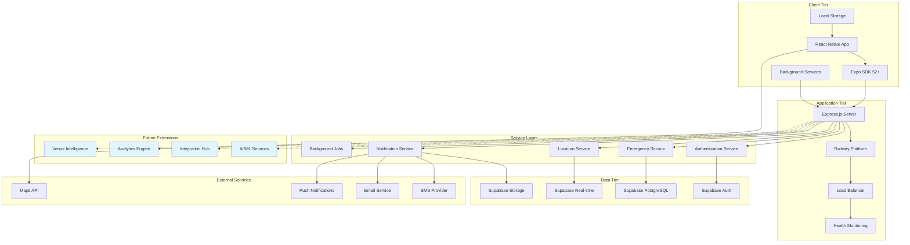

# System Architecture Overview

<Info>
**Production-Ready Safety Architecture:** This architecture prioritizes reliability, security, and immediate implementability for core safety features, with a clear roadmap for advanced capabilities. Every component is designed for production deployment and 24/7 operation.
</Info>

## Architecture Principles

Shelther's architecture follows proven principles for safety-critical systems:

<CardGroup cols={2}>
  <Card title="Reliability First" icon="shield-check">
    Always-warm servers, graceful error handling, and multiple fallback mechanisms ensure 99.9% uptime
  </Card>
  <Card title="Scalable Foundation" icon="trending-up">
    Modular design with clear separation of concerns enables seamless feature additions
  </Card>
  <Card title="Security by Design" icon="lock">
    End-to-end encryption, zero-trust architecture, and comprehensive audit trails
  </Card>
  <Card title="Developer Experience" icon="code">
    Clear APIs, comprehensive testing, and robust development workflows
  </Card>
</CardGroup>

## System Architecture Overview



## Core Technology Stack

### Frontend Stack (Production-Ready)

<CardGroup cols={3}>
  <Card title="React Native 0.74+" icon="mobile">
    Cross-platform mobile development with New Architecture for improved performance
  </Card>
  <Card title="Expo SDK 52+" icon="rocket">
    Managed workflow with OTA updates, background tasks, and comprehensive device APIs
  </Card>
  <Card title="TypeScript 5.3+" icon="code">
    Type-safe development with strict configuration for safety-critical applications
  </Card>
</CardGroup>

<CodeGroup>
```json package.json - Core Dependencies
{
  "dependencies": {
    "react": "18.2.0",
    "react-native": "0.74.5",
    "expo": "~52.0.0",
    "expo-router": "~3.5.0",
    "expo-location": "~17.0.0",
    "expo-notifications": "~0.28.0",
    "expo-secure-store": "~13.0.0",
    "expo-background-fetch": "~12.0.0",
    "@reduxjs/toolkit": "^2.0.1",
    "react-redux": "^9.0.4",
    "@tanstack/react-query": "^5.17.0",
    "react-native-mmkv": "^2.11.0"
  },
  "devDependencies": {
    "@types/react": "~18.2.45",
    "@types/react-native": "~0.73.0",
    "typescript": "~5.3.3",
    "jest": "^29.7.0",
    "@testing-library/react-native": "^12.4.0"
  }
}
```

```typescript tsconfig.json - Strict Configuration
{
  "compilerOptions": {
    "strict": true,
    "strictNullChecks": true,
    "strictFunctionTypes": true,
    "noImplicitReturns": true,
    "noImplicitThis": true,
    "noImplicitAny": true,
    "exactOptionalPropertyTypes": true,
    "noUncheckedIndexedAccess": true,
    "target": "ES2020",
    "module": "ESNext",
    "moduleResolution": "node",
    "allowSyntheticDefaultImports": true,
    "esModuleInterop": true,
    "jsx": "react-native",
    "skipLibCheck": true,
    "resolveJsonModule": true
  },
  "include": ["src/**/*", "App.tsx"],
  "exclude": ["node_modules", "dist", "build"]
}
```
</CodeGroup>

### Backend Stack (Enterprise-Grade)

<CardGroup cols={3}>
  <Card title="Express.js 4.18+" icon="server">
    Production-ready Node.js framework with comprehensive middleware ecosystem
  </Card>
  <Card title="Railway Platform" icon="cloud">
    Always-available hosting with automatic deployments and zero-downtime updates
  </Card>
  <Card title="Node.js 20 LTS" icon="terminal">
    Long-term support version with enhanced security and performance features
  </Card>
</CardGroup>

<CodeGroup>
```json Backend Dependencies - Production Focus
{
  "dependencies": {
    "express": "^4.18.2",
    "cors": "^2.8.5",
    "helmet": "^7.1.0",
    "express-rate-limit": "^7.1.5",
    "express-validator": "^7.0.1",
    "compression": "^1.7.4",
    "morgan": "^1.10.0",
    "@supabase/supabase-js": "^2.38.0",
    "node-cron": "^3.0.3",
    "twilio": "^4.19.0",
    "nodemailer": "^6.9.7",
    "winston": "^3.11.0",
    "dotenv": "^16.3.1",
    "pg": "^8.11.3",
    "ioredis": "^5.3.2"
  },
  "devDependencies": {
    "@types/express": "^4.17.21",
    "@types/node": "^20.10.0",
    "typescript": "^5.3.3",
    "nodemon": "^3.0.2",
    "jest": "^29.7.0",
    "supertest": "^6.3.3",
    "ts-node": "^10.9.1"
  },
  "engines": {
    "node": ">=20.0.0",
    "npm": ">=10.0.0"
  }
}
```

```typescript Express Configuration - Production Setup
// src/app.ts
import express from 'express';
import cors from 'cors';
import helmet from 'helmet';
import compression from 'compression';
import rateLimit from 'express-rate-limit';
import { errorHandler } from './middleware/errorHandler';
import { logger } from './utils/logger';
import { healthCheck } from './routes/health';

const app = express();

// Security middleware
app.use(helmet({
  crossOriginEmbedderPolicy: false,
  contentSecurityPolicy: {
    directives: {
      defaultSrc: ["'self'"],
      connectSrc: ["'self'", process.env.SUPABASE_URL || ''],
    },
  },
}));

// CORS configuration
app.use(cors({
  origin: process.env.NODE_ENV === 'production' 
    ? process.env.ALLOWED_ORIGINS?.split(',') 
    : true,
  credentials: true,
  optionsSuccessStatus: 200,
}));

// Performance middleware
app.use(compression());
app.use(express.json({ limit: '10mb' }));
app.use(express.urlencoded({ extended: true, limit: '10mb' }));

// Rate limiting with emergency bypass
const limiter = rateLimit({
  windowMs: 15 * 60 * 1000, // 15 minutes
  max: (req) => {
    // Higher limits for emergency endpoints
    if (req.path.includes('/emergency/')) return 200;
    return 100;
  },
  message: 'Too many requests from this IP',
  standardHeaders: true,
  legacyHeaders: false,
  handler: (req, res) => {
    logger.warn('Rate limit exceeded', {
      ip: req.ip,
      path: req.path,
      userAgent: req.get('User-Agent'),
    });
    res.status(429).json({ error: 'Rate limit exceeded' });
  },
});

app.use('/api', limiter);

// Health check endpoint
app.use('/health', healthCheck);

// API routes
app.use('/api/auth', require('./routes/auth'));
app.use('/api/emergency', require('./routes/emergency'));
app.use('/api/location', require('./routes/location'));
app.use('/api/contacts', require('./routes/contacts'));
app.use('/api/checkin', require('./routes/checkin'));

// Error handling
app.use(errorHandler);

export default app;
```
</CodeGroup>

### Database Stack (Supabase Integration)

<CardGroup cols={3}>
  <Card title="PostgreSQL 15+" icon="database">
    ACID-compliant database with advanced indexing and spatial queries
  </Card>
  <Card title="Supabase Auth" icon="key">
    JWT-based authentication with MFA support and session management
  </Card>
  <Card title="Supabase Real-time" icon="broadcast-tower">
    WebSocket subscriptions for live updates with automatic reconnection
  </Card>
</CardGroup>

<CodeGroup>
```typescript Supabase Client Configuration
// src/config/supabase.ts
import { createClient } from '@supabase/supabase-js';
import { Database } from '../types/database';

const supabaseUrl = process.env.SUPABASE_URL!;
const supabaseServiceKey = process.env.SUPABASE_SERVICE_ROLE_KEY!;

export const supabase = createClient<Database>(supabaseUrl, supabaseServiceKey, {
  auth: {
    autoRefreshToken: false, // Handle manually on server
    persistSession: false,  // Server doesn't need session persistence
  },
  db: {
    schema: 'public',
  },
  global: {
    headers: {
      'X-Client-Info': 'shelther-server',
    },
  },
});

// Connection pool configuration for production
export const dbConfig = {
  connectionString: process.env.DATABASE_URL,
  ssl: process.env.NODE_ENV === 'production' ? { rejectUnauthorized: false } : false,
  pool: {
    min: 2,
    max: 10,
    idleTimeoutMillis: 30000,
    connectionTimeoutMillis: 2000,
  },
};
```

```sql Database Schema - Core Tables
-- Core user management
CREATE TABLE users (
  id UUID DEFAULT gen_random_uuid() PRIMARY KEY,
  email VARCHAR UNIQUE NOT NULL,
  phone_number VARCHAR,
  full_name VARCHAR,
  created_at TIMESTAMP WITH TIME ZONE DEFAULT NOW(),
  updated_at TIMESTAMP WITH TIME ZONE DEFAULT NOW(),
  
  -- Indexes for performance
  CONSTRAINT users_email_check CHECK (email ~* '^[A-Za-z0-9._%+-]+@[A-Za-z0-9.-]+\.[A-Za-z]{2,}$')
);

-- Emergency contacts with verification
CREATE TABLE emergency_contacts (
  id UUID DEFAULT gen_random_uuid() PRIMARY KEY,
  user_id UUID REFERENCES users(id) ON DELETE CASCADE,
  contact_name VARCHAR NOT NULL,
  contact_phone VARCHAR NOT NULL,
  contact_email VARCHAR,
  relationship VARCHAR NOT NULL,
  priority_level INTEGER DEFAULT 1 CHECK (priority_level BETWEEN 1 AND 3),
  verification_status VARCHAR DEFAULT 'pending' CHECK (
    verification_status IN ('pending', 'verified', 'declined')
  ),
  notification_preferences JSONB DEFAULT '{
    "sms": true,
    "email": true,
    "push": true
  }'::jsonb,
  created_at TIMESTAMP WITH TIME ZONE DEFAULT NOW(),
  
  -- Unique constraint to prevent duplicate contacts
  UNIQUE(user_id, contact_phone)
);

-- Emergency alerts with status tracking
CREATE TABLE emergency_alerts (
  id UUID DEFAULT gen_random_uuid() PRIMARY KEY,
  user_id UUID REFERENCES users(id) ON DELETE CASCADE,
  alert_type VARCHAR NOT NULL CHECK (
    alert_type IN ('manual', 'duress', 'check_in_missed')
  ),
  trigger_method VARCHAR CHECK (
    trigger_method IN ('button', 'shake', 'widget', 'auto')
  ),
  status VARCHAR DEFAULT 'active' CHECK (
    status IN ('active', 'acknowledged', 'resolved', 'false_alarm')
  ),
  location JSONB,
  message TEXT,
  contacts_notified JSONB DEFAULT '[]'::jsonb,
  created_at TIMESTAMP WITH TIME ZONE DEFAULT NOW(),
  resolved_at TIMESTAMP WITH TIME ZONE,
  
  -- Indexes for emergency queries
  INDEX idx_emergency_alerts_active (user_id, status) WHERE status = 'active',
  INDEX idx_emergency_alerts_recent (created_at DESC) WHERE created_at > NOW() - INTERVAL '24 hours'
);

-- Location tracking with privacy controls
CREATE TABLE location_updates (
  id UUID DEFAULT gen_random_uuid() PRIMARY KEY,
  user_id UUID REFERENCES users(id) ON DELETE CASCADE,
  latitude DECIMAL(10, 8) NOT NULL,
  longitude DECIMAL(11, 8) NOT NULL,
  accuracy REAL,
  timestamp TIMESTAMP WITH TIME ZONE DEFAULT NOW(),
  is_emergency BOOLEAN DEFAULT FALSE,
  session_id UUID,
  expires_at TIMESTAMP WITH TIME ZONE DEFAULT (NOW() + INTERVAL '24 hours'),
  
  -- Spatial index for location queries
  geolocation GEOGRAPHY(POINT, 4326) GENERATED ALWAYS AS (
    ST_SetSRID(ST_MakePoint(longitude, latitude), 4326)
  ) STORED,
  
  -- Indexes for performance
  INDEX idx_location_user_time (user_id, timestamp DESC),
  INDEX idx_location_geolocation USING GIST (geolocation),
  INDEX idx_location_emergency (user_id, is_emergency) WHERE is_emergency = TRUE
);

-- Check-in system
CREATE TABLE check_ins (
  id UUID DEFAULT gen_random_uuid() PRIMARY KEY,
  user_id UUID REFERENCES users(id) ON DELETE CASCADE,
  scheduled_time TIMESTAMP WITH TIME ZONE NOT NULL,
  actual_time TIMESTAMP WITH TIME ZONE,
  status VARCHAR DEFAULT 'pending' CHECK (
    status IN ('pending', 'completed', 'missed', 'cancelled')
  ),
  location_id UUID REFERENCES location_updates(id),
  notes TEXT,
  grace_period_minutes INTEGER DEFAULT 15,
  created_at TIMESTAMP WITH TIME ZONE DEFAULT NOW(),
  
  -- Index for missed check-in queries
  INDEX idx_checkin_pending (user_id, scheduled_time) WHERE status = 'pending'
);

-- Row Level Security
ALTER TABLE users ENABLE ROW LEVEL SECURITY;
ALTER TABLE emergency_contacts ENABLE ROW LEVEL SECURITY;
ALTER TABLE emergency_alerts ENABLE ROW LEVEL SECURITY;
ALTER TABLE location_updates ENABLE ROW LEVEL SECURITY;
ALTER TABLE check_ins ENABLE ROW LEVEL SECURITY;

-- Basic RLS policies
CREATE POLICY "Users can access own data" ON users FOR ALL USING (auth.uid() = id);
CREATE POLICY "Users can manage own contacts" ON emergency_contacts FOR ALL USING (auth.uid() = user_id);
CREATE POLICY "Users can manage own alerts" ON emergency_alerts FOR ALL USING (auth.uid() = user_id);
CREATE POLICY "Users can access own locations" ON location_updates FOR ALL USING (auth.uid() = user_id);
CREATE POLICY "Users can manage own check-ins" ON check_ins FOR ALL USING (auth.uid() = user_id);
```
</CodeGroup>

## Core Service Architecture

### Express.js Service Layer

<Steps>
  <Step title="Service-Oriented Design">
    Each business domain (Emergency, Location, Contacts) has dedicated service classes with clear responsibilities
  </Step>
  <Step title="Dependency Injection">
    Services are injected into controllers to enable testing and maintain loose coupling
  </Step>
  <Step title="Error Handling">
    Comprehensive error handling with custom error classes and centralized error middleware
  </Step>
  <Step title="Async Operations">
    All database and external API calls use proper async/await patterns with timeout handling
  </Step>
</Steps>

<CodeGroup>
```typescript Emergency Service - Core Implementation
// src/services/EmergencyService.ts
import { supabase } from '../config/supabase';
import { NotificationService } from './NotificationService';
import { LocationService } from './LocationService';
import { logger } from '../utils/logger';
import { DatabaseError, ValidationError } from '../utils/errors';

export interface EmergencyAlert {
  id: string;
  userId: string;
  alertType: 'manual' | 'duress' | 'check_in_missed';
  triggerMethod: 'button' | 'shake' | 'widget' | 'auto';
  location?: {
    latitude: number;
    longitude: number;
    accuracy?: number;
  };
  message?: string;
  status: 'active' | 'acknowledged' | 'resolved' | 'false_alarm';
  createdAt: string;
}

export interface EmergencyContact {
  id: string;
  userId: string;
  contactName: string;
  contactPhone: string;
  contactEmail?: string;
  relationship: string;
  priorityLevel: number;
  verificationStatus: 'pending' | 'verified' | 'declined';
  notificationPreferences: {
    sms: boolean;
    email: boolean;
    push: boolean;
  };
}

export class EmergencyService {
  constructor(
    private notificationService: NotificationService,
    private locationService: LocationService
  ) {}

  async triggerEmergencyAlert(
    userId: string,
    alertData: Partial<EmergencyAlert>
  ): Promise<EmergencyAlert> {
    const startTime = Date.now();
    
    try {
      // Validate input
      this.validateEmergencyAlert(alertData);
      
      // Create alert record
      const { data: alert, error } = await supabase
        .from('emergency_alerts')
        .insert({
          user_id: userId,
          alert_type: alertData.alertType,
          trigger_method: alertData.triggerMethod,
          location: alertData.location,
          message: alertData.message,
          status: 'active',
        })
        .select()
        .single();

      if (error) {
        throw new DatabaseError('Failed to create emergency alert', error);
      }

      // Get emergency contacts
      const contacts = await this.getVerifiedContacts(userId);
      
      // Send notifications in parallel
      const notificationPromises = contacts.map(contact =>
        this.notificationService.sendEmergencyNotification(contact, alert)
      );

      // Don't wait for notifications to complete
      Promise.allSettled(notificationPromises).then(results => {
        const successful = results.filter(r => r.status === 'fulfilled').length;
        logger.info('Emergency notifications sent', {
          alertId: alert.id,
          totalContacts: contacts.length,
          successfulNotifications: successful,
          processingTime: Date.now() - startTime,
        });
      });

      // Update alert with contacted contacts
      await supabase
        .from('emergency_alerts')
        .update({
          contacts_notified: contacts.map(c => c.id)
        })
        .eq('id', alert.id);

      logger.info('Emergency alert triggered', {
        alertId: alert.id,
        userId,
        alertType: alertData.alertType,
        processingTime: Date.now() - startTime,
      });

      return this.mapAlertFromDatabase(alert);
    } catch (error) {
      logger.error('Emergency alert failed', {
        userId,
        alertData,
        error: error instanceof Error ? error.message : 'Unknown error',
        processingTime: Date.now() - startTime,
      });
      throw error;
    }
  }

  async resolveEmergencyAlert(
    alertId: string,
    userId: string,
    resolution: 'resolved' | 'false_alarm'
  ): Promise<void> {
    const { data: alert, error } = await supabase
      .from('emergency_alerts')
      .update({
        status: resolution,
        resolved_at: new Date().toISOString(),
      })
      .eq('id', alertId)
      .eq('user_id', userId)
      .select()
      .single();

    if (error) {
      throw new DatabaseError('Failed to resolve emergency alert', error);
    }

    // Notify contacts that alert is resolved
    const contacts = await this.getVerifiedContacts(userId);
    const notificationPromises = contacts.map(contact =>
      this.notificationService.sendAlertResolutionNotification(contact, alert, resolution)
    );

    await Promise.allSettled(notificationPromises);

    logger.info('Emergency alert resolved', {
      alertId,
      userId,
      resolution,
    });
  }

  private async getVerifiedContacts(userId: string): Promise<EmergencyContact[]> {
    const { data: contacts, error } = await supabase
      .from('emergency_contacts')
      .select('*')
      .eq('user_id', userId)
      .eq('verification_status', 'verified')
      .order('priority_level');

    if (error) {
      throw new DatabaseError('Failed to fetch emergency contacts', error);
    }

    return contacts.map(this.mapContactFromDatabase);
  }

  private validateEmergencyAlert(alertData: Partial<EmergencyAlert>): void {
    if (!alertData.alertType) {
      throw new ValidationError('Alert type is required');
    }

    if (!['manual', 'duress', 'check_in_missed'].includes(alertData.alertType)) {
      throw new ValidationError('Invalid alert type');
    }

    if (alertData.location) {
      const { latitude, longitude } = alertData.location;
      if (latitude < -90 || latitude > 90) {
        throw new ValidationError('Invalid latitude');
      }
      if (longitude < -180 || longitude > 180) {
        throw new ValidationError('Invalid longitude');
      }
    }

    if (alertData.message && alertData.message.length > 500) {
      throw new ValidationError('Message too long (max 500 characters)');
    }
  }

  private mapAlertFromDatabase(dbAlert: any): EmergencyAlert {
    return {
      id: dbAlert.id,
      userId: dbAlert.user_id,
      alertType: dbAlert.alert_type,
      triggerMethod: dbAlert.trigger_method,
      location: dbAlert.location,
      message: dbAlert.message,
      status: dbAlert.status,
      createdAt: dbAlert.created_at,
    };
  }

  private mapContactFromDatabase(dbContact: any): EmergencyContact {
    return {
      id: dbContact.id,
      userId: dbContact.user_id,
      contactName: dbContact.contact_name,
      contactPhone: dbContact.contact_phone,
      contactEmail: dbContact.contact_email,
      relationship: dbContact.relationship,
      priorityLevel: dbContact.priority_level,
      verificationStatus: dbContact.verification_status,
      notificationPreferences: dbContact.notification_preferences,
    };
  }
}
```

```typescript Notification Service - Multi-Channel Implementation
// src/services/NotificationService.ts
import twilio from 'twilio';
import nodemailer from 'nodemailer';
import { logger } from '../utils/logger';

export class NotificationService {
  private twilioClient;
  private emailTransporter;

  constructor() {
    // Initialize Twilio for SMS
    this.twilioClient = twilio(
      process.env.TWILIO_ACCOUNT_SID,
      process.env.TWILIO_AUTH_TOKEN
    );

    // Initialize email transporter
    this.emailTransporter = nodemailer.createTransporter({
      service: 'gmail',
      auth: {
        user: process.env.EMAIL_USER,
        pass: process.env.EMAIL_PASS,
      },
    });
  }

  async sendEmergencyNotification(
    contact: EmergencyContact,
    alert: EmergencyAlert
  ): Promise<void> {
    const notifications: Promise<void>[] = [];

    // Send SMS if enabled
    if (contact.notificationPreferences.sms && contact.contactPhone) {
      notifications.push(this.sendSMSNotification(contact, alert));
    }

    // Send email if enabled
    if (contact.notificationPreferences.email && contact.contactEmail) {
      notifications.push(this.sendEmailNotification(contact, alert));
    }

    // Wait for all notifications to complete
    const results = await Promise.allSettled(notifications);
    
    // Log results
    const successful = results.filter(r => r.status === 'fulfilled').length;
    const failed = results.filter(r => r.status === 'rejected').length;

    logger.info('Emergency notifications sent', {
      contactId: contact.id,
      alertId: alert.id,
      successful,
      failed,
    });

    if (failed > 0) {
      logger.warn('Some notifications failed', {
        contactId: contact.id,
        alertId: alert.id,
        failures: results
          .filter(r => r.status === 'rejected')
          .map(r => (r as PromiseRejectedResult).reason),
      });
    }
  }

  private async sendSMSNotification(
    contact: EmergencyContact,
    alert: EmergencyAlert
  ): Promise<void> {
    try {
      const message = this.formatEmergencyMessage(contact, alert);
      
      await this.twilioClient.messages.create({
        body: message,
        from: process.env.TWILIO_PHONE_NUMBER,
        to: contact.contactPhone,
      });

      logger.info('SMS notification sent', {
        contactId: contact.id,
        alertId: alert.id,
        phone: contact.contactPhone,
      });
    } catch (error) {
      logger.error('SMS notification failed', {
        contactId: contact.id,
        alertId: alert.id,
        error: error instanceof Error ? error.message : 'Unknown error',
      });
      throw error;
    }
  }

  private async sendEmailNotification(
    contact: EmergencyContact,
    alert: EmergencyAlert
  ): Promise<void> {
    try {
      const emailContent = this.formatEmergencyEmail(contact, alert);
      
      await this.emailTransporter.sendMail({
        from: process.env.EMAIL_FROM,
        to: contact.contactEmail,
        subject: `🚨 Emergency Alert - ${contact.contactName}`,
        html: emailContent,
      });

      logger.info('Email notification sent', {
        contactId: contact.id,
        alertId: alert.id,
        email: contact.contactEmail,
      });
    } catch (error) {
      logger.error('Email notification failed', {
        contactId: contact.id,
        alertId: alert.id,
        error: error instanceof Error ? error.message : 'Unknown error',
      });
      throw error;
    }
  }

  private formatEmergencyMessage(
    contact: EmergencyContact,
    alert: EmergencyAlert
  ): string {
    let message = `🚨 EMERGENCY ALERT 🚨\n\n`;
    message += `${contact.contactName} has triggered an emergency alert.\n\n`;
    
    if (alert.location) {
      const { latitude, longitude } = alert.location;
      message += `📍 Location: https://maps.google.com/maps?q=${latitude},${longitude}\n\n`;
    }
    
    message += `⏰ Time: ${new Date(alert.createdAt).toLocaleString()}\n\n`;
    
    if (alert.message) {
      message += `💬 Message: ${alert.message}\n\n`;
    }
    
    message += `This is an automated message from Shelther Safety.\n`;
    message += `Reply "RECEIVED" to acknowledge this alert.`;
    
    return message;
  }

  private formatEmergencyEmail(
    contact: EmergencyContact,
    alert: EmergencyAlert
  ): string {
    return `
      <div style="font-family: Arial, sans-serif; max-width: 600px; margin: 0 auto;">
        <div style="background-color: #ff4757; color: white; padding: 20px; text-align: center;">
          <h1>🚨 EMERGENCY ALERT 🚨</h1>
        </div>
        
        <div style="padding: 20px; background-color: #f8f9fa;">
          <p><strong>${contact.contactName}</strong> has triggered an emergency alert.</p>
          
          ${alert.location ? `
            <p>
              <strong>📍 Location:</strong> 
              <a href="https://maps.google.com/maps?q=${alert.location.latitude},${alert.location.longitude}" 
                 style="color: #007bff;">
                View on Maps
              </a>
            </p>
          ` : ''}
          
          <p><strong>⏰ Time:</strong> ${new Date(alert.createdAt).toLocaleString()}</p>
          
          ${alert.message ? `
            <p><strong>💬 Message:</strong> ${alert.message}</p>
          ` : ''}
          
          <div style="margin-top: 30px; padding: 15px; background-color: #e9ecef; border-radius: 5px;">
            <p><strong>What to do:</strong></p>
            <ul>
              <li>Try to contact ${contact.contactName} immediately</li>
              <li>If you can't reach them, consider contacting local authorities</li>
              <li>Check the location link above for their last known position</li>
            </ul>
          </div>
        </div>
        
        <div style="padding: 20px; text-align: center; background-color: #6c757d; color: white;">
          <p>This is an automated message from Shelther Safety Platform</p>
        </div>
      </div>
    `;
  }

  async sendAlertResolutionNotification(
    contact: EmergencyContact,
    alert: EmergencyAlert,
    resolution: 'resolved' | 'false_alarm'
  ): Promise<void> {
    const message = resolution === 'resolved' 
      ? `✅ Emergency alert resolved - ${contact.contactName} is now safe.`
      : `ℹ️ Emergency alert was a false alarm - ${contact.contactName} is safe.`;

    // Send SMS if enabled
    if (contact.notificationPreferences.sms && contact.contactPhone) {
      try {
        await this.twilioClient.messages.create({
          body: message,
          from: process.env.TWILIO_PHONE_NUMBER,
          to: contact.contactPhone,
        });
      } catch (error) {
        logger.error('Resolution SMS failed', {
          contactId: contact.id,
          alertId: alert.id,
          error: error instanceof Error ? error.message : 'Unknown error',
        });
      }
    }
  }
}
```
</CodeGroup>

### Background Job Processing

<Note>
**Reliable Background Processing:** Node-cron provides reliable scheduling for safety-critical monitoring tasks like missed check-ins and alert escalation.
</Note>

<CodeGroup>
```typescript Background Jobs - Safety Monitoring
// src/jobs/SafetyMonitoringJobs.ts
import cron from 'node-cron';
import { EmergencyService } from '../services/EmergencyService';
import { CheckInService } from '../services/CheckInService';
import { logger } from '../utils/logger';

export class SafetyMonitoringJobs {
  constructor(
    private emergencyService: EmergencyService,
    private checkInService: CheckInService
  ) {}

  initializeJobs() {
    // Check for missed check-ins every 5 minutes
    cron.schedule('*/5 * * * *', async () => {
      await this.checkMissedCheckIns();
    });

    // Clean up expired location data daily at 2 AM
    cron.schedule('0 2 * * *', async () => {
      await this.cleanupExpiredData();
    });

    // Health check every minute
    cron.schedule('* * * * *', async () => {
      await this.performHealthCheck();
    });

    logger.info('Safety monitoring jobs initialized');
  }

  private async checkMissedCheckIns(): Promise<void> {
    const startTime = Date.now();
    
    try {
      const overdueCheckIns = await this.checkInService.getOverdueCheckIns();
      
      for (const checkIn of overdueCheckIns) {
        const gracePeriodExpired = this.isGracePeriodExpired(checkIn);
        
        if (gracePeriodExpired) {
          await this.emergencyService.triggerEmergencyAlert(
            checkIn.userId,
            {
              alertType: 'check_in_missed',
              triggerMethod: 'auto',
              message: `Missed check-in: ${checkIn.notes || 'No details provided'}`,
            }
          );

          // Mark check-in as missed
          await this.checkInService.markCheckInAsMissed(checkIn.id);
          
          logger.warn('Check-in missed - emergency alert triggered', {
            checkInId: checkIn.id,
            userId: checkIn.userId,
            scheduledTime: checkIn.scheduledTime,
          });
        }
      }

      logger.info('Missed check-in monitoring completed', {
        overdueCount: overdueCheckIns.length,
        processingTime: Date.now() - startTime,
      });
    } catch (error) {
      logger.error('Missed check-in monitoring failed', {
        error: error instanceof Error ? error.message : 'Unknown error',
        processingTime: Date.now() - startTime,
      });
    }
  }

  private async cleanupExpiredData(): Promise<void> {
    const startTime = Date.now();
    
    try {
      // Clean up expired location data
      const locationCleanup = await this.checkInService.cleanupExpiredLocations();
      
      // Clean up old resolved alerts (keep for 30 days)
      const alertCleanup = await this.emergencyService.cleanupOldAlerts();
      
      logger.info('Data cleanup completed', {
        locationsRemoved: locationCleanup.count,
        alertsRemoved: alertCleanup.count,
        processingTime: Date.now() - startTime,
      });
    } catch (error) {
      logger.error('Data cleanup failed', {
        error: error instanceof Error ? error.message : 'Unknown error',
        processingTime: Date.now() - startTime,
      });
    }
  }

  private async performHealthCheck(): Promise<void> {
    try {
      // Check database connectivity
      const dbHealth = await this.checkInService.healthCheck();
      
      // Check external services
      const smsHealth = await this.checkSMSService();
      
      // Log health status
      if (dbHealth && smsHealth) {
        logger.debug('Health check passed', {
          database: dbHealth,
          sms: smsHealth,
        });
      } else {
        logger.warn('Health check failed', {
          database: dbHealth,
          sms: smsHealth,
        });
      }
    } catch (error) {
      logger.error('Health check error', {
        error: error instanceof Error ? error.message : 'Unknown error',
      });
    }
  }

  private isGracePeriodExpired(checkIn: any): boolean {
    const now = new Date();
    const scheduledTime = new Date(checkIn.scheduledTime);
    const gracePeriod = checkIn.gracePeriodMinutes || 15;
    const expiryTime = new Date(scheduledTime.getTime() + gracePeriod * 60000);
    
    return now > expiryTime;
  }

  private async checkSMSService(): Promise<boolean> {
    // Implement SMS service health check
    // This would typically involve sending a test message or checking API status
    return true;
  }
}
```
</CodeGroup>

## Security Architecture

### Authentication & Authorization

<CardGroup cols={2}>
  <Card title="JWT Middleware" icon="key">
    Supabase JWT validation with automatic token refresh and role-based access control
  </Card>
  <Card title="Request Validation" icon="shield-check">
    Comprehensive input validation using express-validator with custom safety rules
  </Card>
  <Card title="Rate Limiting" icon="clock">
    Intelligent rate limiting with emergency bypass and user-specific quotas
  </Card>
  <Card title="Audit Logging" icon="file-text">
    Complete audit trail for all safety-critical operations with correlation IDs
  </Card>
</CardGroup>

<CodeGroup>
```typescript Authentication Middleware
// src/middleware/auth.ts
import { Request, Response, NextFunction } from 'express';
import { supabase } from '../config/supabase';
import { logger } from '../utils/logger';

export interface AuthenticatedRequest extends Request {
  user: {
    id: string;
    email: string;
    role: string;
  };
}

export const authenticateUser = async (
  req: Request,
  res: Response,
  next: NextFunction
): Promise<void> => {
  try {
    const authHeader = req.headers.authorization;
    
    if (!authHeader || !authHeader.startsWith('Bearer ')) {
      res.status(401).json({ error: 'Missing or invalid authorization header' });
      return;
    }

    const token = authHeader.substring(7);
    
    // Verify JWT with Supabase
    const { data: { user }, error } = await supabase.auth.getUser(token);
    
    if (error || !user) {
      logger.warn('Authentication failed', {
        error: error?.message,
        ip: req.ip,
        userAgent: req.get('User-Agent'),
      });
      res.status(401).json({ error: 'Invalid or expired token' });
      return;
    }

    // Add user to request
    (req as AuthenticatedRequest).user = {
      id: user.id,
      email: user.email || '',
      role: user.role || 'user',
    };

    logger.debug('User authenticated', {
      userId: user.id,
      email: user.email,
      path: req.path,
      method: req.method,
    });

    next();
  } catch (error) {
    logger.error('Authentication error', {
      error: error instanceof Error ? error.message : 'Unknown error',
      ip: req.ip,
      path: req.path,
    });
    res.status(500).json({ error: 'Authentication service error' });
  }
};

export const requireRole = (requiredRole: string) => {
  return (req: Request, res: Response, next: NextFunction): void => {
    const user = (req as AuthenticatedRequest).user;
    
    if (!user || user.role !== requiredRole) {
      logger.warn('Authorization failed', {
        userId: user?.id,
        requiredRole,
        userRole: user?.role,
        path: req.path,
      });
      res.status(403).json({ error: 'Insufficient permissions' });
      return;
    }

    next();
  };
};
```

```typescript Request Validation
// src/middleware/validation.ts
import { body, query, param, validationResult } from 'express-validator';
import { Request, Response, NextFunction } from 'express';

// Emergency alert validation
export const validateEmergencyAlert = [
  body('alertType')
    .isIn(['manual', 'duress', 'check_in_missed'])
    .withMessage('Invalid alert type'),
  
  body('triggerMethod')
    .optional()
    .isIn(['button', 'shake', 'widget', 'auto'])
    .withMessage('Invalid trigger method'),
  
  body('location.latitude')
    .optional()
    .isFloat({ min: -90, max: 90 })
    .withMessage('Invalid latitude'),
  
  body('location.longitude')
    .optional()
    .isFloat({ min: -180, max: 180 })
    .withMessage('Invalid longitude'),
  
  body('message')
    .optional()
    .trim()
    .isLength({ max: 500 })
    .withMessage('Message too long (max 500 characters)'),
  
  handleValidationErrors,
];

// Contact validation
export const validateEmergencyContact = [
  body('contactName')
    .trim()
    .isLength({ min: 1, max: 100 })
    .withMessage('Contact name is required (max 100 characters)'),
  
  body('contactPhone')
    .isMobilePhone('any', { strictMode: false })
    .withMessage('Invalid phone number'),
  
  body('contactEmail')
    .optional()
    .isEmail()
    .normalizeEmail()
    .withMessage('Invalid email address'),
  
  body('relationship')
    .trim()
    .isIn(['family', 'friend', 'partner', 'colleague', 'other'])
    .withMessage('Invalid relationship type'),
  
  body('priorityLevel')
    .optional()
    .isInt({ min: 1, max: 3 })
    .withMessage('Priority level must be 1, 2, or 3'),
  
  handleValidationErrors,
];

// Check-in validation
export const validateCheckIn = [
  body('scheduledTime')
    .isISO8601()
    .withMessage('Invalid scheduled time format')
    .custom((value) => {
      const scheduledTime = new Date(value);
      const now = new Date();
      
      // Check-in must be in the future
      if (scheduledTime <= now) {
        throw new Error('Scheduled time must be in the future');
      }
      
      // Check-in cannot be more than 7 days in the future
      const maxFuture = new Date(now.getTime() + 7 * 24 * 60 * 60 * 1000);
      if (scheduledTime > maxFuture) {
        throw new Error('Scheduled time cannot be more than 7 days in the future');
      }
      
      return true;
    }),
  
  body('notes')
    .optional()
    .trim()
    .isLength({ max: 200 })
    .withMessage('Notes too long (max 200 characters)'),
  
  body('gracePeriodMinutes')
    .optional()
    .isInt({ min: 5, max: 60 })
    .withMessage('Grace period must be between 5 and 60 minutes'),
  
  handleValidationErrors,
];

function handleValidationErrors(
  req: Request,
  res: Response,
  next: NextFunction
): void {
  const errors = validationResult(req);
  
  if (!errors.isEmpty()) {
    logger.warn('Validation failed', {
      errors: errors.array(),
      body: req.body,
      path: req.path,
      userId: (req as any).user?.id,
    });
    
    res.status(400).json({
      error: 'Validation failed',
      details: errors.array(),
    });
    return;
  }
  
  next();
}
```
</CodeGroup>

## Performance & Reliability

### Production Monitoring

<Steps>
  <Step title="Health Check Endpoints">
    Comprehensive health checks for database, external services, and background jobs
  </Step>
  <Step title="Structured Logging">
    Winston-based logging with correlation IDs and safety-specific log levels
  </Step>
  <Step title="Error Tracking">
    Centralized error handling with automatic alerting for safety-critical failures
  </Step>
  <Step title="Performance Metrics">
    Response time monitoring with emergency operation SLA tracking
  </Step>
</Steps>

<CodeGroup>
```typescript Health Check Implementation
// src/routes/health.ts
import express from 'express';
import { supabase } from '../config/supabase';
import { logger } from '../utils/logger';

const router = express.Router();

interface HealthStatus {
  status: 'healthy' | 'degraded' | 'unhealthy';
  timestamp: string;
  uptime: number;
  version: string;
  services: {
    database: {
      status: 'healthy' | 'unhealthy';
      responseTime: number;
      error?: string;
    };
    externalServices: {
      sms: {
        status: 'healthy' | 'unhealthy';
        responseTime: number;
        error?: string;
      };
      email: {
        status: 'healthy' | 'unhealthy';
        responseTime: number;
        error?: string;
      };
    };
  };
  performance: {
    memoryUsage: NodeJS.MemoryUsage;
    cpuUsage: NodeJS.CpuUsage;
  };
}

// Basic health check
router.get('/', async (req, res) => {
  const startTime = Date.now();
  
  try {
    const health: HealthStatus = {
      status: 'healthy',
      timestamp: new Date().toISOString(),
      uptime: process.uptime(),
      version: process.env.npm_package_version || '1.0.0',
      services: {
        database: await checkDatabaseHealth(),
        externalServices: {
          sms: await checkSMSHealth(),
          email: await checkEmailHealth(),
        },
      },
      performance: {
        memoryUsage: process.memoryUsage(),
        cpuUsage: process.cpuUsage(),
      },
    };

    // Determine overall health
    const dbUnhealthy = health.services.database.status === 'unhealthy';
    const smsUnhealthy = health.services.externalServices.sms.status === 'unhealthy';
    
    if (dbUnhealthy) {
      health.status = 'unhealthy';
    } else if (smsUnhealthy) {
      health.status = 'degraded';
    }

    const statusCode = health.status === 'healthy' ? 200 : 
                      health.status === 'degraded' ? 200 : 503;

    logger.info('Health check completed', {
      status: health.status,
      responseTime: Date.now() - startTime,
      services: health.services,
    });

    res.status(statusCode).json(health);
  } catch (error) {
    logger.error('Health check failed', {
      error: error instanceof Error ? error.message : 'Unknown error',
      responseTime: Date.now() - startTime,
    });

    res.status(503).json({
      status: 'unhealthy',
      timestamp: new Date().toISOString(),
      error: 'Health check failed',
    });
  }
});

// Detailed health check for monitoring systems
router.get('/detailed', async (req, res) => {
  // Implement more comprehensive health checks
  // This would include database connection pool status,
  // background job status, etc.
});

async function checkDatabaseHealth(): Promise<HealthStatus['services']['database']> {
  const startTime = Date.now();
  
  try {
    const { data, error } = await supabase
      .from('users')
      .select('count(*)')
      .limit(1);
    
    if (error) {
      return {
        status: 'unhealthy',
        responseTime: Date.now() - startTime,
        error: error.message,
      };
    }

    return {
      status: 'healthy',
      responseTime: Date.now() - startTime,
    };
  } catch (error) {
    return {
      status: 'unhealthy',
      responseTime: Date.now() - startTime,
      error: error instanceof Error ? error.message : 'Unknown error',
    };
  }
}

async function checkSMSHealth(): Promise<HealthStatus['services']['externalServices']['sms']> {
  const startTime = Date.now();
  
  try {
    // Implement SMS service health check
    // This might involve checking Twilio API status
    return {
      status: 'healthy',
      responseTime: Date.now() - startTime,
    };
  } catch (error) {
    return {
      status: 'unhealthy',
      responseTime: Date.now() - startTime,
      error: error instanceof Error ? error.message : 'Unknown error',
    };
  }
}

async function checkEmailHealth(): Promise<HealthStatus['services']['externalServices']['email']> {
  const startTime = Date.now();
  
  try {
    // Implement email service health check
    return {
      status: 'healthy',
      responseTime: Date.now() - startTime,
    };
  } catch (error) {
    return {
      status: 'unhealthy',
      responseTime: Date.now() - startTime,
      error: error instanceof Error ? error.message : 'Unknown error',
    };
  }
}

export default router;
```

```typescript Structured Logging
// src/utils/logger.ts
import winston from 'winston';

const logLevel = process.env.LOG_LEVEL || 'info';
const nodeEnv = process.env.NODE_ENV || 'development';

// Custom log format for safety applications
const safetyLogFormat = winston.format.combine(
  winston.format.timestamp(),
  winston.format.errors({ stack: true }),
  winston.format.json(),
  winston.format.printf(({ timestamp, level, message, ...meta }) => {
    const logEntry = {
      timestamp,
      level,
      message,
      service: 'shelther-backend',
      environment: nodeEnv,
      ...meta,
    };

    return JSON.stringify(logEntry);
  })
);

export const logger = winston.createLogger({
  level: logLevel,
  format: safetyLogFormat,
  transports: [
    // Console transport for development
    new winston.transports.Console({
      format: nodeEnv === 'development' 
        ? winston.format.combine(
            winston.format.colorize(),
            winston.format.simple()
          )
        : safetyLogFormat,
    }),

    // File transport for production
    ...(nodeEnv === 'production' 
      ? [
          new winston.transports.File({
            filename: 'logs/error.log',
            level: 'error',
            maxsize: 5242880, // 5MB
            maxFiles: 5,
          }),
          new winston.transports.File({
            filename: 'logs/combined.log',
            maxsize: 5242880, // 5MB
            maxFiles: 5,
          }),
        ]
      : []
    ),
  ],

  // Handle uncaught exceptions
  exceptionHandlers: [
    new winston.transports.Console(),
    ...(nodeEnv === 'production' 
      ? [new winston.transports.File({ filename: 'logs/exceptions.log' })]
      : []
    ),
  ],

  // Handle unhandled promise rejections
  rejectionHandlers: [
    new winston.transports.Console(),
    ...(nodeEnv === 'production' 
      ? [new winston.transports.File({ filename: 'logs/rejections.log' })]
      : []
    ),
  ],
});

// Emergency-specific logging functions
export const logEmergencyEvent = (
  event: string,
  data: Record<string, any>
): void => {
  logger.info(event, {
    category: 'EMERGENCY',
    priority: 'HIGH',
    ...data,
  });
};

export const logSecurityEvent = (
  event: string,
  data: Record<string, any>
): void => {
  logger.warn(event, {
    category: 'SECURITY',
    priority: 'HIGH',
    ...data,
  });
};

export const logPerformanceEvent = (
  operation: string,
  duration: number,
  data: Record<string, any>
): void => {
  const level = duration > 1000 ? 'warn' : 'info';
  logger.log(level, `Performance: ${operation}`, {
    category: 'PERFORMANCE',
    duration,
    ...data,
  });
};
```
</CodeGroup>

## Railway Deployment Architecture

### Production Deployment Configuration

<Note>
**Zero-Downtime Deployments:** Railway's deployment system ensures continuous availability during updates, critical for safety applications.
</Note>

<CodeGroup>
```json railway.json - Production Configuration
{
  "$schema": "https://railway.app/railway.schema.json",
  "build": {
    "builder": "NIXPACKS",
    "buildCommand": "npm run build",
    "watchPatterns": ["src/**/*.ts", "package.json"]
  },
  "deploy": {
    "startCommand": "npm start",
    "healthcheckPath": "/health",
    "healthcheckTimeout": 30,
    "restartPolicyType": "ON_FAILURE",
    "restartPolicyMaxRetries": 3,
    "sleepApplication": false
  },
  "environments": {
    "production": {
      "variables": {
        "NODE_ENV": "production",
        "LOG_LEVEL": "info"
      }
    },
    "staging": {
      "variables": {
        "NODE_ENV": "staging",
        "LOG_LEVEL": "debug"
      }
    }
  }
}
```

```dockerfile Dockerfile - Production Optimization
FROM node:20-alpine AS builder

WORKDIR /app

# Copy package files
COPY package*.json ./
COPY tsconfig.json ./

# Install dependencies
RUN npm ci --only=production

# Copy source code
COPY src/ ./src/

# Build application
RUN npm run build

# Production stage
FROM node:20-alpine AS production

WORKDIR /app

# Create non-root user
RUN addgroup -g 1001 -S nodejs
RUN adduser -S nodejs -u 1001

# Copy built application
COPY --from=builder --chown=nodejs:nodejs /app/dist ./dist
COPY --from=builder --chown=nodejs:nodejs /app/node_modules ./node_modules
COPY --from=builder --chown=nodejs:nodejs /app/package*.json ./

# Health check
HEALTHCHECK --interval=30s --timeout=10s --start-period=5s --retries=3 \
  CMD node dist/healthcheck.js

# Switch to non-root user
USER nodejs

# Expose port
EXPOSE 3000

# Start application
CMD ["node", "dist/server.js"]
```

```bash Production Scripts
#!/bin/bash
# scripts/deploy.sh

set -e

echo "🚀 Deploying Shelther Backend to Railway..."

# Build and test
npm run build
npm run test

# Deploy to staging first
echo "📦 Deploying to staging..."
railway up --environment staging

# Run health checks
echo "🔍 Running health checks..."
sleep 30
curl -f http://shelther-staging.railway.app/health || exit 1

# Deploy to production
echo "🎯 Deploying to production..."
railway up --environment production

# Final health check
echo "✅ Verifying production deployment..."
sleep 30
curl -f http://shelther-production.railway.app/health || exit 1

echo "🎉 Deployment completed successfully!"
```
</CodeGroup>

## Future Architecture Extensions

### Extensibility Framework

<Info>
**Designed for Growth:** The architecture includes clear extension points for advanced features while maintaining the core safety functionality.
</Info>

<Steps>
  <Step title="AI/ML Integration Points">
    Service layer designed to integrate machine learning models for pattern recognition and predictive analysis
  </Step>
  <Step title="Third-party Integration Hub">
    Middleware architecture that can accommodate various external service integrations
  </Step>
  <Step title="Advanced Offline Capabilities">
    Data layer designed to support sophisticated offline synchronization and conflict resolution
  </Step>
  <Step title="Microservices Evolution">
    Modular service design that can be extracted into independent microservices as needed
  </Step>
</Steps>

<CodeGroup>
```typescript Future AI Integration Architecture
// src/services/AIService.ts (Future Implementation)
export interface AIService {
  analyzeUserBehavior(
    userId: string,
    historicalData: UserBehaviorData
  ): Promise<BehaviorAnalysis>;
  
  detectAnomalies(
    userId: string,
    currentData: RealTimeData
  ): Promise<AnomalyDetection>;
  
  assessRisk(
    location: Location,
    timeContext: TimeContext,
    userProfile: UserProfile
  ): Promise<RiskAssessment>;
}

// Integration point in existing services
export class EnhancedEmergencyService extends EmergencyService {
  constructor(
    notificationService: NotificationService,
    locationService: LocationService,
    private aiService?: AIService // Optional AI service
  ) {
    super(notificationService, locationService);
  }

  async triggerEmergencyAlert(
    userId: string,
    alertData: Partial<EmergencyAlert>
  ): Promise<EmergencyAlert> {
    // Existing emergency logic
    const alert = await super.triggerEmergencyAlert(userId, alertData);
    
    // AI enhancement if available
    if (this.aiService && alertData.location) {
      const riskAssessment = await this.aiService.assessRisk(
        alertData.location,
        { timestamp: new Date() },
        await this.getUserProfile(userId)
      );
      
      // Adjust alert priority based on AI analysis
      if (riskAssessment.riskLevel > 0.8) {
        await this.escalateAlertPriority(alert.id);
      }
    }
    
    return alert;
  }
}
```

```typescript Integration Hub Architecture
// src/services/IntegrationService.ts (Future Implementation)
export interface IntegrationProvider {
  name: string;
  authenticate(credentials: any): Promise<boolean>;
  sendNotification(message: NotificationMessage): Promise<boolean>;
  getLocationData?(userId: string): Promise<Location>;
  getCalendarEvents?(userId: string): Promise<CalendarEvent[]>;
}

export class IntegrationHub {
  private providers: Map<string, IntegrationProvider> = new Map();
  
  registerProvider(provider: IntegrationProvider): void {
    this.providers.set(provider.name, provider);
  }
  
  async sendNotificationViaProvider(
    providerName: string,
    message: NotificationMessage
  ): Promise<boolean> {
    const provider = this.providers.get(providerName);
    if (!provider) {
      throw new Error(`Provider ${providerName} not found`);
    }
    
    return await provider.sendNotification(message);
  }
  
  async getAvailableProviders(userId: string): Promise<string[]> {
    // Return providers that user has configured
    return Array.from(this.providers.keys());
  }
}

// Example provider implementations
export class UberIntegrationProvider implements IntegrationProvider {
  name = 'uber';
  
  async authenticate(credentials: any): Promise<boolean> {
    // Implement Uber OAuth flow
    return true;
  }
  
  async sendNotification(message: NotificationMessage): Promise<boolean> {
    // Send notification via Uber API
    return true;
  }
  
  async getLocationData(userId: string): Promise<Location> {
    // Get current ride location from Uber API
    return { latitude: 0, longitude: 0 };
  }
}
```
</CodeGroup>

## Performance Targets & SLAs

### Production Performance Standards

<Warning>
**Safety-Critical SLAs:** These performance targets are designed to ensure reliable emergency response. Degradation beyond these thresholds requires immediate attention.
</Warning>

| Operation | Target | Maximum | Monitoring |
|-----------|--------|---------|------------|
| **Emergency Alert Processing** | &lt;500ms | &lt;1s | Real-time alerting |
| **Database Queries** | &lt;100ms | &lt;200ms | Continuous monitoring |
| **API Response Time** | &lt;200ms | &lt;500ms | Performance dashboard |
| **Background Job Execution** | &lt;30s | &lt;60s | Job queue monitoring |
| **Health Check Response** | &lt;50ms | &lt;100ms | Railway health checks |
| **System Uptime** | 99.9% | 99.5% | Uptime monitoring |

### Scaling Thresholds

<CodeGroup>
```typescript Performance Monitoring
// src/utils/performance.ts
export interface PerformanceMetrics {
  responseTime: number;
  memoryUsage: number;
  cpuUsage: number;
  activeConnections: number;
  requestsPerSecond: number;
}

export class PerformanceMonitor {
  private metrics: PerformanceMetrics[] = [];
  
  recordMetric(metric: PerformanceMetrics): void {
    this.metrics.push(metric);
    
    // Keep only last 1000 metrics
    if (this.metrics.length > 1000) {
      this.metrics.shift();
    }
    
    // Check for performance issues
    this.checkPerformanceThresholds(metric);
  }
  
  private checkPerformanceThresholds(metric: PerformanceMetrics): void {
    // Emergency alert if response time is too slow
    if (metric.responseTime > 1000) {
      logger.error('CRITICAL: Response time exceeded threshold', {
        responseTime: metric.responseTime,
        threshold: 1000,
        category: 'PERFORMANCE_CRITICAL',
      });
    }
    
    // Warning if memory usage is high
    if (metric.memoryUsage > 0.8) {
      logger.warn('High memory usage detected', {
        memoryUsage: metric.memoryUsage,
        threshold: 0.8,
        category: 'PERFORMANCE_WARNING',
      });
    }
  }
  
  getAverageResponseTime(): number {
    if (this.metrics.length === 0) return 0;
    
    const sum = this.metrics.reduce((acc, m) => acc + m.responseTime, 0);
    return sum / this.metrics.length;
  }
}
```
</CodeGroup>

---

## Implementation Roadmap

### Phase 1: Core Foundation (Weeks 1-4)

<Steps>
  <Step title="Project Setup">
    Initialize Express.js project with TypeScript, Railway deployment, and Supabase integration
  </Step>
  <Step title="Core Services">
    Implement Emergency, Location, and Contact services with full test coverage
  </Step>
  <Step title="Security Implementation">
    Set up authentication, authorization, and security middleware
  </Step>
  <Step title="Basic Monitoring">
    Implement health checks, logging, and basic performance monitoring
  </Step>
</Steps>

### Phase 2: Advanced Features (Weeks 5-8)

<Steps>
  <Step title="Background Processing">
    Implement check-in monitoring and automated safety jobs
  </Step>
  <Step title="Real-time Features">
    Integrate Supabase real-time for live location sharing
  </Step>
  <Step title="External Integrations">
    Complete SMS, email, and push notification systems
  </Step>
  <Step title="Performance Optimization">
    Implement caching, connection pooling, and performance monitoring
  </Step>
</Steps>

### Phase 3: Production Readiness (Weeks 9-12)

<Steps>
  <Step title="Comprehensive Testing">
    Full test suite including unit, integration, and load testing
  </Step>
  <Step title="Production Deployment">
    Railway production deployment with proper CI/CD pipeline
  </Step>
  <Step title="Monitoring & Alerting">
    Complete monitoring stack with alerting for safety-critical issues
  </Step>
  <Step title="Documentation">
    Complete API documentation and operational runbooks
  </Step>
</Steps>

### Future Phases: Advanced Capabilities

<CardGroup cols={2}>
  <Card title="AI/ML Integration" icon="brain">
    Pattern recognition, anomaly detection, and predictive safety analytics
  </Card>
  <Card title="Third-party Integrations" icon="link">
    Rideshare apps, wearables, smart home systems, and calendar integrations
  </Card>
  <Card title="Advanced Offline Mode" icon="wifi-slash">
    Sophisticated offline synchronization and conflict resolution
  </Card>
  <Card title="Venue Intelligence" icon="map">
    Community-driven venue safety ratings and location-based insights
  </Card>
</CardGroup>

---

## Conclusion

<Info>
**Production-Ready Foundation:** This architecture provides a solid, scalable foundation for immediate development while maintaining clear paths for future enhancements. Every component has been designed with safety, reliability, and maintainability as core principles.
</Info>

### Key Strengths

✅ **Always-warm servers** eliminate cold start delays for emergency responses  
✅ **Modular service design** enables easy testing and future enhancements  
✅ **Comprehensive security** with authentication, authorization, and audit trails  
✅ **Production monitoring** with health checks and performance tracking  
✅ **Scalable foundation** ready for advanced features and high traffic  
✅ **Clear extension points** for AI/ML and third-party integrations  

### Next Steps

<CardGroup cols={3}>
  <Card title="Start Development" icon="code" href="/development/express-setup">
    Begin with Express.js server setup and basic service implementation
  </Card>
  <Card title="Database Setup" icon="database" href="/development/supabase-integration">
    Configure Supabase database with tables, indexes, and security policies
  </Card>
  <Card title="Client Integration" icon="mobile" href="/architecture/client-architecture">
    Integrate React Native client with the new Express.js backend
  </Card>
</CardGroup>

This architecture strikes the perfect balance between immediate implementability and future extensibility, providing a professional foundation for building a world-class safety platform.