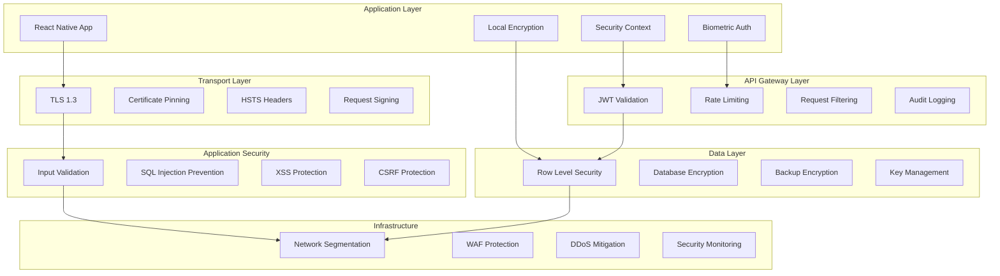

# Security Design & Privacy Architecture

<Info>
**Security-First Safety Platform:** Shelther implements defense-in-depth security with privacy-by-design principles, ensuring user data remains protected while maintaining critical safety functionality.
</Info>

## Security Architecture Overview

Shelther's security model is built on layered protection with special considerations for safety-critical applications:

<CardGroup cols={2}>
  <Card title="Zero-Trust Architecture" icon="shield">
    Never trust, always verify - every request is authenticated and authorized regardless of source
  </Card>
  <Card title="End-to-End Encryption" icon="lock">
    All sensitive data encrypted in transit and at rest with user-controlled keys
  </Card>
  <Card title="Privacy by Design" icon="eye-slash">
    Minimal data collection with granular user control over sharing and retention
  </Card>
  <Card title="Emergency Override" icon="key">
    Secure emergency access mechanisms that maintain security while enabling life-saving features
  </Card>
</CardGroup>

## Security Architecture Layers



## Threat Model & Risk Assessment

### Threat Categories

<Steps>
  <Step title="Data Breach Threats">
    Unauthorized access to personal information, location data, and emergency contacts
  </Step>
  <Step title="Emergency System Compromise">
    Attacks targeting emergency alert systems or preventing emergency responses
  </Step>
  <Step title="Privacy Violations">
    Unauthorized tracking, data collection, or sharing of sensitive information
  </Step>
  <Step title="Social Engineering">
    Attacks targeting users, emergency contacts, or support staff for unauthorized access
  </Step>
</Steps>

### Risk Assessment Matrix

<Note>
**Safety-First Risk Assessment:** Risks that could impact user safety receive the highest priority and most stringent mitigation measures.
</Note>

| Threat Category | Likelihood | Impact | Risk Level | Mitigation Priority |
|----------------|------------|--------|------------|-------------------|
| **Emergency System Failure** | Low | Critical | High | Immediate |
| **Location Data Breach** | Medium | High | High | Immediate |
| **Authentication Bypass** | Low | High | Medium | High |
| **Data Exfiltration** | Medium | Medium | Medium | High |
| **Denial of Service** | High | Medium | Medium | Medium |
| **Social Engineering** | Medium | Medium | Medium | Medium |

### Attack Surface Analysis

<Accordion title="Client-Side Attack Vectors">
**Mobile Application Threats:**
- Reverse engineering of application binaries
- Local data storage compromise
- Man-in-the-middle attacks on network communications
- Malicious apps accessing device sensors and location
- Physical device compromise and data extraction

**Mitigation Strategies:**
- Code obfuscation and anti-tampering measures
- Hardware-backed keystore for sensitive data
- Certificate pinning and TLS verification
- Minimal local data storage with encryption
- Biometric authentication with secure enclave integration

```typescript
// Example: Secure local storage implementation
import * as SecureStore from 'expo-secure-store';
import * as Crypto from 'expo-crypto';

class SecureLocalStorage {
  private static readonly ENCRYPTION_KEY = 'user_data_encryption_key';
  
  static async storeSecureData(key: string, data: any): Promise<void> {
    try {
      // Generate or retrieve encryption key
      let encryptionKey = await SecureStore.getItemAsync(this.ENCRYPTION_KEY);
      if (!encryptionKey) {
        encryptionKey = await Crypto.randomUUID();
        await SecureStore.setItemAsync(this.ENCRYPTION_KEY, encryptionKey, {
          requireAuthentication: true,
          authenticationPrompt: 'Authenticate to access safety data'
        });
      }
      
      // Encrypt data before storage
      const encryptedData = await this.encryptData(JSON.stringify(data), encryptionKey);
      
      // Store with biometric protection
      await SecureStore.setItemAsync(key, encryptedData, {
        requireAuthentication: true,
        authenticationPrompt: 'Access required for safety feature'
      });
    } catch (error) {
      throw new SecureStorageError('Failed to store secure data', error);
    }
  }

  static async retrieveSecureData(key: string): Promise<any> {
    try {
      const encryptionKey = await SecureStore.getItemAsync(this.ENCRYPTION_KEY, {
        requireAuthentication: true,
        authenticationPrompt: 'Authenticate to access safety data'
      });
      
      if (!encryptionKey) {
        throw new Error('Encryption key not found');
      }

      const encryptedData = await SecureStore.getItemAsync(key, {
        requireAuthentication: true
      });
      
      if (!encryptedData) {
        return null;
      }

      const decryptedData = await this.decryptData(encryptedData, encryptionKey);
      return JSON.parse(decryptedData);
    } catch (error) {
      throw new SecureStorageError('Failed to retrieve secure data', error);
    }
  }
}
```
</Accordion>

<Accordion title="Server-Side Attack Vectors">
**Backend Infrastructure Threats:**
- SQL injection and database attacks
- Server-side request forgery (SSRF)
- Remote code execution vulnerabilities
- Privilege escalation attacks
- Data center physical security breaches

**API Security Threats:**
- Authentication and authorization bypass
- Rate limiting bypass and DoS attacks
- Data exposure through API responses
- Injection attacks through API parameters
- Unauthorized access to admin functions

**Mitigation Implementation:**
```sql
-- Row Level Security policies for data protection
CREATE POLICY "users_isolation" ON users
  FOR ALL USING (auth.uid() = id);

CREATE POLICY "emergency_contacts_access" ON emergency_contacts
  FOR SELECT USING (
    auth.uid() = user_id OR 
    auth.uid() IN (
      SELECT contact_user_id FROM emergency_contacts 
      WHERE user_id = emergency_contacts.user_id 
        AND verification_status = 'verified'
        AND EXISTS (
          SELECT 1 FROM emergency_alerts 
          WHERE user_id = emergency_contacts.user_id 
            AND status = 'active'
            AND created_at > NOW() - INTERVAL '1 hour'
        )
    )
  );

-- Audit logging for security events
CREATE TABLE security_audit_log (
  id UUID DEFAULT gen_random_uuid() PRIMARY KEY,
  user_id UUID,
  event_type VARCHAR NOT NULL,
  event_details JSONB,
  ip_address INET,
  user_agent TEXT,
  timestamp TIMESTAMP WITH TIME ZONE DEFAULT NOW(),
  severity VARCHAR DEFAULT 'info' CHECK (severity IN ('info', 'warning', 'error', 'critical'))
);

-- Function to log security events
CREATE OR REPLACE FUNCTION log_security_event(
  p_user_id UUID,
  p_event_type VARCHAR,
  p_event_details JSONB,
  p_severity VARCHAR DEFAULT 'info'
) RETURNS void AS $$
BEGIN
  INSERT INTO security_audit_log (user_id, event_type, event_details, severity, ip_address, user_agent)
  VALUES (
    p_user_id,
    p_event_type,
    p_event_details,
    p_severity,
    inet_client_addr(),
    current_setting('request.header.user-agent', true)
  );
END;
$$ LANGUAGE plpgsql SECURITY DEFINER;
```
</Accordion>

## Authentication & Authorization

### Multi-Factor Authentication (MFA)

<CardGroup cols={3}>
  <Card title="Primary Authentication" icon="fingerprint">
    Biometric authentication (Face ID, Touch ID) with secure enclave storage
  </Card>
  <Card title="Secondary Factors" icon="smartphone">
    SMS OTP, authenticator apps, and hardware security keys
  </Card>
  <Card title="Emergency Access" icon="unlock">
    Secure emergency bypass with enhanced logging and verification
  </Card>
</CardGroup>

<CodeGroup>
```typescript Multi-Factor Authentication Implementation
import { authenticateAsync, hasHardwareAsync, isEnrolledAsync } from 'expo-local-authentication';
import * as SecureStore from 'expo-secure-store';

export class MFAManager {
  static async initializeBiometricAuth(): Promise<BiometricSetupResult> {
    try {
      // Check hardware availability
      const hasHardware = await hasHardwareAsync();
      if (!hasHardware) {
        return { available: false, reason: 'Hardware not available' };
      }

      // Check if biometrics are enrolled
      const isEnrolled = await isEnrolledAsync();
      if (!isEnrolled) {
        return { available: false, reason: 'No biometrics enrolled' };
      }

      return { available: true, types: await this.getAvailableBiometrics() };
    } catch (error) {
      return { available: false, reason: error.message };
    }
  }

  static async authenticateWithBiometrics(
    promptMessage: string = 'Authenticate to access Shelther'
  ): Promise<AuthenticationResult> {
    try {
      const result = await authenticateAsync({
        promptMessage,
        fallbackLabel: 'Use Passcode',
        cancelLabel: 'Cancel',
        disableDeviceFallback: false,
      });

      if (result.success) {
        await this.logAuthenticationEvent('biometric_success');
        return { success: true, method: 'biometric' };
      } else {
        await this.logAuthenticationEvent('biometric_failed', { error: result.error });
        return { success: false, error: result.error };
      }
    } catch (error) {
      await this.logAuthenticationEvent('biometric_error', { error: error.message });
      throw new AuthenticationError('Biometric authentication failed', error);
    }
  }

  static async setupTOTP(userId: string): Promise<TOTPSetupResult> {
    try {
      // Generate TOTP secret
      const secret = await this.generateTOTPSecret();
      
      // Store encrypted secret
      await SecureStore.setItemAsync(`totp_secret_${userId}`, secret, {
        requireAuthentication: true,
        authenticationPrompt: 'Setup two-factor authentication'
      });

      // Generate QR code data
      const qrData = `otpauth://totp/Shelther:${userId}?secret=${secret}&issuer=Shelther`;
      
      return {
        success: true,
        secret,
        qrCodeData: qrData,
        backupCodes: await this.generateBackupCodes(userId)
      };
    } catch (error) {
      throw new MFASetupError('TOTP setup failed', error);
    }
  }

  static async verifyTOTP(userId: string, token: string): Promise<boolean> {
    try {
      const secret = await SecureStore.getItemAsync(`totp_secret_${userId}`, {
        requireAuthentication: true
      });
      
      if (!secret) {
        throw new Error('TOTP not configured');
      }

      const isValid = await this.validateTOTPToken(secret, token);
      
      await this.logAuthenticationEvent(
        isValid ? 'totp_success' : 'totp_failed',
        { user_id: userId }
      );

      return isValid;
    } catch (error) {
      await this.logAuthenticationEvent('totp_error', { 
        user_id: userId, 
        error: error.message 
      });
      return false;
    }
  }

  // Emergency bypass with enhanced security
  static async emergencyBypass(
    userId: string, 
    emergencyCode: string,
    justification: string
  ): Promise<EmergencyBypassResult> {
    try {
      // Verify emergency code
      const isValidCode = await this.verifyEmergencyCode(userId, emergencyCode);
      if (!isValidCode) {
        await this.logSecurityEvent('emergency_bypass_failed', {
          user_id: userId,
          justification,
          ip_address: await this.getClientIP()
        }, 'warning');
        
        return { success: false, error: 'Invalid emergency code' };
      }

      // Log emergency bypass usage
      await this.logSecurityEvent('emergency_bypass_used', {
        user_id: userId,
        justification,
        timestamp: new Date().toISOString()
      }, 'critical');

      // Issue temporary session with limited privileges
      const emergencySession = await this.createEmergencySession(userId);
      
      // Notify security team
      await this.notifySecurityTeam('emergency_bypass', {
        user_id: userId,
        justification,
        session_id: emergencySession.id
      });

      return {
        success: true,
        session: emergencySession,
        expires_at: new Date(Date.now() + 30 * 60 * 1000) // 30 minutes
      };
    } catch (error) {
      throw new EmergencyBypassError('Emergency bypass failed', error);
    }
  }
}
```

```typescript Session Management
export class SessionManager {
  private static readonly SESSION_DURATION = 24 * 60 * 60 * 1000; // 24 hours
  private static readonly REFRESH_THRESHOLD = 2 * 60 * 60 * 1000; // 2 hours before expiry
  
  static async createSession(userId: string, authMethod: string): Promise<SessionData> {
    const sessionId = generateUUID();
    const expiresAt = new Date(Date.now() + this.SESSION_DURATION);
    
    const sessionData = {
      id: sessionId,
      user_id: userId,
      auth_method: authMethod,
      created_at: new Date(),
      expires_at: expiresAt,
      device_info: await this.getDeviceInfo(),
      ip_address: await this.getClientIP(),
      is_emergency_session: false
    };

    // Store session in database
    await supabase.from('user_sessions').insert(sessionData);
    
    // Create JWT token
    const token = await this.createJWTToken(sessionData);
    
    // Store session locally
    await SecureStore.setItemAsync('current_session', JSON.stringify({
      token,
      session_id: sessionId,
      expires_at: expiresAt.toISOString()
    }), {
      requireAuthentication: false // Session tokens don't need biometric for access
    });

    return { ...sessionData, token };
  }

  static async validateSession(token: string): Promise<SessionValidationResult> {
    try {
      // Verify JWT token
      const payload = await this.verifyJWTToken(token);
      
      // Check session in database
      const { data: session, error } = await supabase
        .from('user_sessions')
        .select('*')
        .eq('id', payload.session_id)
        .eq('is_active', true)
        .single();

      if (error || !session) {
        return { valid: false, reason: 'Session not found' };
      }

      // Check expiration
      if (new Date() > new Date(session.expires_at)) {
        await this.invalidateSession(session.id);
        return { valid: false, reason: 'Session expired' };
      }

      // Check for suspicious activity
      const suspiciousActivity = await this.detectSuspiciousActivity(session);
      if (suspiciousActivity.detected) {
        await this.handleSuspiciousActivity(session, suspiciousActivity);
        return { valid: false, reason: 'Suspicious activity detected' };
      }

      // Auto-refresh if near expiration
      let newToken = token;
      if (this.shouldRefreshSession(session)) {
        newToken = await this.refreshSession(session);
      }

      return {
        valid: true,
        session,
        token: newToken,
        user_id: session.user_id
      };
    } catch (error) {
      return { valid: false, reason: error.message };
    }
  }

  private static async detectSuspiciousActivity(session: SessionData): Promise<SuspiciousActivityResult> {
    // Check for unusual location patterns
    const currentIP = await this.getClientIP();
    const locationChange = await this.checkLocationChange(session.ip_address, currentIP);
    
    // Check for unusual access patterns
    const accessPattern = await this.analyzeAccessPattern(session.user_id);
    
    // Check for concurrent sessions from different devices
    const concurrentSessions = await this.checkConcurrentSessions(session.user_id, session.id);

    const riskScore = this.calculateRiskScore({
      locationChange,
      accessPattern,
      concurrentSessions
    });

    return {
      detected: riskScore > 0.7,
      risk_score: riskScore,
      factors: {
        location_change: locationChange,
        unusual_access: accessPattern.unusual,
        concurrent_sessions: concurrentSessions > 1
      }
    };
  }
}
```
</CodeGroup>

### Role-Based Access Control (RBAC)

<Steps>
  <Step title="User Roles">
    Standard users with access to their own safety data and shared data from verified contacts
  </Step>
  <Step title="Emergency Contact Permissions">
    Tiered access during emergency situations with automatic permission escalation
  </Step>
  <Step title="Admin Roles">
    Support staff with limited, audited access for troubleshooting and system maintenance
  </Step>
  <Step title="System Roles">
    Automated processes with minimal required permissions for emergency and maintenance functions
  </Step>
</Steps>

## Data Protection & Encryption

### Encryption Implementation

<Note>
**Multi-Layer Encryption:** Shelther implements encryption at multiple layers - transport, application, and database levels - ensuring data protection even if individual layers are compromised.
</Note>

<CardGroup cols={2}>
  <Card title="Transport Encryption" icon="shield">
    TLS 1.3 with certificate pinning and perfect forward secrecy
  </Card>
  <Card title="Application Encryption" icon="lock">
    Field-level encryption for sensitive data with user-controlled keys
  </Card>
  <Card title="Database Encryption" icon="database">
    Transparent data encryption (TDE) with encrypted backups and key rotation
  </Card>
  <Card title="Storage Encryption" icon="hard-drive">
    Hardware-backed keystores with biometric-protected access
  </Card>
</CardGroup>

<CodeGroup>
```typescript Field-Level Encryption Service
import { AES, enc, mode, pad } from 'crypto-js';
import * as SecureStore from 'expo-secure-store';

export class FieldEncryption {
  private static readonly KEY_PREFIX = 'field_encryption_';
  private static readonly ALGORITHM = 'AES-256-GCM';

  static async encryptSensitiveField(
    userId: string,
    fieldName: string,
    data: string
  ): Promise<EncryptedField> {
    try {
      // Get or create field-specific encryption key
      const encryptionKey = await this.getFieldEncryptionKey(userId, fieldName);
      
      // Generate random IV for this encryption
      const iv = enc.Hex.parse(require('crypto').randomBytes(16).toString('hex'));
      
      // Encrypt data
      const encrypted = AES.encrypt(data, encryptionKey, {
        iv: iv,
        mode: mode.GCM,
        padding: pad.Pkcs7
      });

      return {
        encrypted_data: encrypted.toString(),
        iv: iv.toString(),
        auth_tag: encrypted.tag?.toString(),
        algorithm: this.ALGORITHM,
        key_version: 1
      };
    } catch (error) {
      throw new EncryptionError('Field encryption failed', error);
    }
  }

  static async decryptSensitiveField(
    userId: string,
    fieldName: string,
    encryptedField: EncryptedField
  ): Promise<string> {
    try {
      // Get field encryption key
      const encryptionKey = await this.getFieldEncryptionKey(userId, fieldName);
      
      // Reconstruct IV
      const iv = enc.Hex.parse(encryptedField.iv);
      
      // Decrypt data
      const decrypted = AES.decrypt(encryptedField.encrypted_data, encryptionKey, {
        iv: iv,
        mode: mode.GCM,
        padding: pad.Pkcs7
      });

      return decrypted.toString(enc.Utf8);
    } catch (error) {
      throw new DecryptionError('Field decryption failed', error);
    }
  }

  private static async getFieldEncryptionKey(
    userId: string,
    fieldName: string
  ): Promise<string> {
    const keyName = `${this.KEY_PREFIX}${userId}_${fieldName}`;
    
    let key = await SecureStore.getItemAsync(keyName, {
      requireAuthentication: true,
      authenticationPrompt: `Access encryption key for ${fieldName}`
    });

    if (!key) {
      // Generate new key for this field
      key = require('crypto').randomBytes(32).toString('hex');
      
      await SecureStore.setItemAsync(keyName, key, {
        requireAuthentication: true,
        authenticationPrompt: `Create encryption key for ${fieldName}`
      });
    }

    return key;
  }

  // Example: Encrypt emergency contact phone numbers
  static async encryptEmergencyContact(
    userId: string,
    contact: EmergencyContact
  ): Promise<EncryptedEmergencyContact> {
    const encryptedPhone = await this.encryptSensitiveField(
      userId,
      'emergency_phone',
      contact.contact_phone
    );

    const encryptedEmail = contact.contact_email ? 
      await this.encryptSensitiveField(userId, 'emergency_email', contact.contact_email) :
      null;

    return {
      ...contact,
      contact_phone: null, // Remove plaintext
      contact_email: null, // Remove plaintext
      encrypted_phone: encryptedPhone,
      encrypted_email: encryptedEmail
    };
  }
}
```

```sql Database-Level Encryption
-- Enable transparent data encryption
ALTER DATABASE shelther_production SET encryption_key_id = 'main-encryption-key';

-- Create encrypted storage for sensitive fields
CREATE TABLE encrypted_emergency_contacts (
  id UUID DEFAULT gen_random_uuid() PRIMARY KEY,
  user_id UUID REFERENCES users(id) ON DELETE CASCADE,
  contact_name VARCHAR NOT NULL,
  encrypted_phone BYTEA, -- Encrypted phone number
  encrypted_email BYTEA, -- Encrypted email address
  relationship VARCHAR NOT NULL,
  priority_level INTEGER,
  verification_status VARCHAR DEFAULT 'pending',
  encryption_metadata JSONB, -- Store IV, algorithm, key version
  created_at TIMESTAMP WITH TIME ZONE DEFAULT NOW(),
  updated_at TIMESTAMP WITH TIME ZONE DEFAULT NOW()
);

-- Function to encrypt data before storage
CREATE OR REPLACE FUNCTION encrypt_sensitive_data(
  plaintext TEXT,
  encryption_key TEXT
) RETURNS BYTEA AS $$
BEGIN
  -- Use pgcrypto for database-level encryption
  RETURN pgp_sym_encrypt(plaintext, encryption_key, 'cipher-algo=aes256');
END;
$$ LANGUAGE plpgsql SECURITY DEFINER;

-- Function to decrypt data after retrieval
CREATE OR REPLACE FUNCTION decrypt_sensitive_data(
  ciphertext BYTEA,
  encryption_key TEXT
) RETURNS TEXT AS $$
BEGIN
  RETURN pgp_sym_decrypt(ciphertext, encryption_key);
EXCEPTION
  WHEN OTHERS THEN
    -- Log decryption failure
    INSERT INTO security_audit_log (event_type, event_details, severity)
    VALUES ('decryption_failed', jsonb_build_object('error', SQLERRM), 'error');
    RETURN NULL;
END;
$$ LANGUAGE plpgsql SECURITY DEFINER;

-- Trigger to automatically encrypt sensitive data
CREATE OR REPLACE FUNCTION encrypt_contact_data()
RETURNS TRIGGER AS $$
DECLARE
  user_key TEXT;
BEGIN
  -- Get user's encryption key (simplified - in reality, this would be more complex)
  SELECT encryption_key INTO user_key FROM user_encryption_keys WHERE user_id = NEW.user_id;
  
  -- Encrypt phone and email if provided
  IF NEW.contact_phone IS NOT NULL THEN
    NEW.encrypted_phone := encrypt_sensitive_data(NEW.contact_phone, user_key);
    NEW.contact_phone := NULL; -- Clear plaintext
  END IF;
  
  IF NEW.contact_email IS NOT NULL THEN
    NEW.encrypted_email := encrypt_sensitive_data(NEW.contact_email, user_key);
    NEW.contact_email := NULL; -- Clear plaintext
  END IF;
  
  RETURN NEW;
END;
$$ LANGUAGE plpgsql;

CREATE TRIGGER trigger_encrypt_contact_data
  BEFORE INSERT OR UPDATE ON emergency_contacts
  FOR EACH ROW EXECUTE FUNCTION encrypt_contact_data();
```
</CodeGroup>

### Key Management

<Accordion title="Encryption Key Hierarchy">
**Master Keys:**
- Hardware Security Module (HSM) protected master keys
- Automatic key rotation every 90 days
- Multi-party key recovery for emergency situations

**User Keys:**
- Individual user encryption keys derived from master keys
- Stored in device secure enclave with biometric protection
- User-controlled key rotation and recovery

**Field Keys:**
- Specific keys for different types of sensitive data
- Contact information, location data, emergency preferences
- Independent key rotation schedules based on sensitivity

**Session Keys:**
- Ephemeral keys for real-time communication encryption
- Perfect forward secrecy with key destruction after use
- Separate keys for emergency and normal communications
</Accordion>

## Privacy by Design

### Data Minimization

<CardGroup cols={3}>
  <Card title="Collection Minimization" icon="minimize">
    Only collect data necessary for safety functionality with user consent
  </Card>
  <Card title="Processing Minimization" icon="filter">
    Process only the minimum data required for specific safety purposes
  </Card>
  <Card title="Storage Minimization" icon="clock">
    Automatic data expiration based on safety requirements and user preferences
  </Card>
</CardGroup>

### User Privacy Controls

<Steps>
  <Step title="Granular Permissions">
    Fine-grained control over what data is shared with whom and for how long
  </Step>
  <Step title="Data Portability">
    Users can export all their data in standard formats at any time
  </Step>
  <Step title="Right to Deletion">
    Complete data deletion with cryptographic proof of removal
  </Step>
  <Step title="Anonymization">
    Option to anonymize historical data while maintaining safety insights
  </Step>
</Steps>

<CodeGroup>
```typescript Privacy Control Implementation
export class PrivacyManager {
  static async setLocationSharingPreferences(
    userId: string,
    preferences: LocationSharingPreferences
  ): Promise<void> {
    try {
      // Validate preferences
      const validation = this.validatePrivacyPreferences(preferences);
      if (!validation.valid) {
        throw new Error(validation.error);
      }

      // Apply preferences with immediate effect
      await supabase
        .from('privacy_settings')
        .upsert({
          user_id: userId,
          location_sharing: preferences.locationSharing,
          precision_level: preferences.precisionLevel,
          sharing_duration: preferences.sharingDuration,
          auto_expire: preferences.autoExpire,
          emergency_override: preferences.emergencyOverride,
          updated_at: new Date().toISOString()
        });

      // Update active sharing sessions
      await this.updateActiveShares(userId, preferences);
      
      // Log privacy preference change
      await this.logPrivacyEvent('preferences_updated', {
        user_id: userId,
        changes: preferences,
        timestamp: new Date().toISOString()
      });

    } catch (error) {
      throw new PrivacyError('Failed to update privacy preferences', error);
    }
  }

  static async exportUserData(userId: string): Promise<UserDataExport> {
    try {
      // Collect all user data across tables
      const [
        profile,
        emergencyContacts,
        locationHistory,
        emergencyAlerts,
        checkIns,
        privacySettings
      ] = await Promise.all([
        this.getUserProfile(userId),
        this.getEmergencyContacts(userId),
        this.getLocationHistory(userId),
        this.getEmergencyAlerts(userId),
        this.getCheckIns(userId),
        this.getPrivacySettings(userId)
      ]);

      // Decrypt sensitive data for export
      const decryptedContacts = await this.decryptContactsForExport(userId, emergencyContacts);
      const decryptedLocations = await this.decryptLocationsForExport(userId, locationHistory);

      const exportData = {
        export_timestamp: new Date().toISOString(),
        export_format: 'JSON',
        user_profile: profile,
        emergency_contacts: decryptedContacts,
        location_history: decryptedLocations,
        emergency_alerts: emergencyAlerts,
        check_ins: checkIns,
        privacy_settings: privacySettings,
        export_metadata: {
          total_records: this.countRecords([
            emergencyContacts, locationHistory, emergencyAlerts, checkIns
          ]),
          data_retention_status: await this.getDataRetentionStatus(userId),
          encryption_info: 'Data exported in decrypted format for portability'
        }
      };

      // Log data export event
      await this.logPrivacyEvent('data_exported', {
        user_id: userId,
        export_size: JSON.stringify(exportData).length,
        timestamp: new Date().toISOString()
      });

      return exportData;
    } catch (error) {
      throw new DataExportError('Data export failed', error);
    }
  }

  static async deleteUserData(
    userId: string,
    deletionType: 'complete' | 'anonymize' | 'retain_safety'
  ): Promise<DeletionResult> {
    try {
      const deletionPlan = await this.createDeletionPlan(userId, deletionType);
      
      // Execute deletion in phases
      const results = {
        phase1: await this.deletePersonalData(userId, deletionPlan),
        phase2: await this.deleteCommunicationData(userId, deletionPlan),
        phase3: await this.deleteLocationData(userId, deletionPlan),
        phase4: await this.handleEmergencyData(userId, deletionPlan)
      };

      // Generate cryptographic proof of deletion
      const deletionProof = await this.generateDeletionProof(userId, results);
      
      // Create anonymized record for safety analytics (if applicable)
      if (deletionType === 'anonymize') {
        await this.createAnonymizedRecord(userId, deletionPlan);
      }

      // Log deletion completion
      await this.logPrivacyEvent('data_deleted', {
        user_id: userId,
        deletion_type: deletionType,
        deletion_proof: deletionProof.hash,
        timestamp: new Date().toISOString()
      });

      return {
        success: true,
        deletion_proof: deletionProof,
        records_deleted: this.countDeletedRecords(results),
        retention_note: deletionType === 'retain_safety' ? 
          'Emergency data retained for 30 days per safety policy' : null
      };
    } catch (error) {
      throw new DataDeletionError('Data deletion failed', error);
    }
  }

  // Automatic data expiration based on user preferences
  static async enforceDataRetention(userId: string): Promise<void> {
    const settings = await this.getDataRetentionSettings(userId);
    
    const expirationTasks = [
      this.expireLocationData(userId, settings.location_retention_days),
      this.expireCheckInData(userId, settings.checkin_retention_days),
      this.expireActivityData(userId, settings.activity_retention_days)
    ];

    await Promise.all(expirationTasks);
  }
}
```
</CodeGroup>

### Compliance & Regulations

<Note>
**Global Privacy Compliance:** Shelther implements comprehensive privacy controls to meet GDPR, CCPA, and other global privacy regulations while maintaining safety functionality.
</Note>

| Regulation | Requirement | Implementation |
|------------|-------------|----------------|
| **GDPR** | Right to Access | Complete data export functionality |
| **GDPR** | Right to Rectification | User-controlled data editing |
| **GDPR** | Right to Erasure | Cryptographic deletion verification |
| **GDPR** | Data Portability | Structured data export in JSON format |
| **CCPA** | Right to Know | Detailed privacy dashboard |
| **CCPA** | Right to Delete | Complete data deletion with proof |
| **HIPAA** | Data Security | End-to-end encryption and audit trails |

## Security Monitoring & Incident Response

### Real-time Security Monitoring

<CardGroup cols={2}>
  <Card title="Anomaly Detection" icon="search">
    Machine learning-based detection of unusual access patterns and potential threats
  </Card>
  <Card title="Real-time Alerts" icon="bell">
    Immediate notification of security events with automated response capabilities
  </Card>
  <Card title="Audit Logging" icon="list">
    Comprehensive logging of all security-relevant events with tamper-proof storage
  </Card>
  <Card title="Threat Intelligence" icon="shield">
    Integration with threat intelligence feeds for proactive threat detection
  </Card>
</CardGroup>

### Incident Response Framework

<Steps>
  <Step title="Detection & Analysis">
    Automated detection of security incidents with immediate analysis and classification
  </Step>
  <Step title="Containment">
    Automatic containment measures to prevent spread of security incidents
  </Step>
  <Step title="Investigation">
    Detailed forensic investigation with preservation of evidence
  </Step>
  <Step title="Recovery & Lessons Learned">
    System recovery with implementation of preventive measures
  </Step>
</Steps>

---

## Next Steps

<CardGroup cols={3}>
  <Card title="Database Schema" icon="database" href="/architecture/database-schema">
    Explore the complete database schema with security considerations
  </Card>
  <Card title="Offline Capabilities" icon="wifi-slash" href="/architecture/offline-capabilities">
    Learn how security is maintained in offline scenarios
  </Card>
  <Card title="Emergency Model" icon="bell" href="/architecture/emergency-model">
    Understand emergency-specific security and privacy considerations
  </Card>
</CardGroup>

<Warning>
**Security-First Development:** All security measures are tested regularly with penetration testing and security audits. Emergency functionality includes special security provisions that maintain protection while enabling life-saving features.
</Warning>