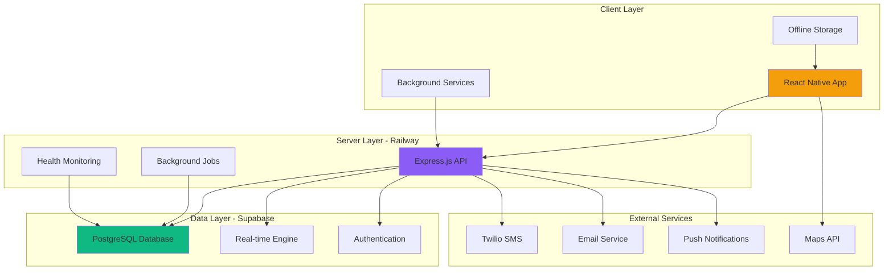

# Technology Stack

<Info>
**Modern Safety Stack:** Shelther leverages a cutting-edge three-tier architecture optimized for safety-critical applications, ensuring reliability, performance, and security for emergency situations with Express.js + Railway + Supabase.
</Info>

## Architecture Overview

Our technology stack follows a modern three-tier architecture designed for safety-critical applications:

<CardGroup cols={3}>
  <Card title="Client Tier" icon="mobile">
    React Native with Expo SDK 52+ for cross-platform mobile development with native performance
  </Card>
  <Card title="Server Tier" icon="server">
    Express.js on Railway platform providing custom business logic and safety-critical processing
  </Card>
  <Card title="Data Tier" icon="database">
    Supabase integration for PostgreSQL, real-time features, authentication, and secure data storage
  </Card>
</CardGroup>



## Client-Side Technologies

### React Native Ecosystem

<CodeGroup>
```json Core Mobile Framework
{
  "dependencies": {
    "react": "18.2.0",
    "react-native": "0.74.5",
    "expo": "~52.0.0",
    "expo-router": "~3.5.0",
    "@react-navigation/native": "^6.1.9",
    "@react-navigation/stack": "^6.3.20",
    "@react-navigation/bottom-tabs": "^6.5.11"
  },
  "rationale": {
    "react_native": "Latest stable with New Architecture support for performance",
    "expo_sdk": "Managed workflow with OTA updates for critical safety patches",
    "navigation": "Industry standard for mobile navigation with deep linking"
  }
}
```

```json Safety-Critical Native Modules
{
  "dependencies": {
    "expo-location": "~17.0.0",
    "expo-notifications": "~0.28.0",
    "expo-secure-store": "~13.0.0",
    "expo-task-manager": "~12.0.0",
    "expo-background-fetch": "~12.0.0",
    "expo-dev-client": "~4.0.0",
    "expo-audio": "~12.0.0"
  },
  "safety_features": {
    "location": "Background location tracking for emergency situations",
    "notifications": "Critical push notifications and local reminders",
    "secure_store": "Encrypted storage for emergency contact data",
    "background_tasks": "Continuous safety monitoring and check-in processing",
    "audio": "Emergency audio recording and voice activation"
  }
}
```
</CodeGroup>

#### Why React Native + Expo for Safety Apps?

<Steps>
  <Step title="Cross-Platform Safety">
    Single codebase for iOS and Android with 95% code reuse, ensuring consistent safety features across platforms
  </Step>
  <Step title="Background Processing">
    Proven background services for location tracking, check-in monitoring, and emergency detection essential for safety apps
  </Step>
  <Step title="Over-the-Air Updates">
    Critical security patches and safety feature updates without app store delays - essential for emergency fixes
  </Step>
  <Step title="Native Performance">
    Direct access to device APIs (location, sensors, notifications) with native-level performance for emergency response
  </Step>
</Steps>

### State Management Architecture

<CardGroup cols={2}>
  <Card title="Redux Toolkit" icon="layers">
    Global state for safety workflows with predictable updates and time-travel debugging
  </Card>
  <Card title="React Query" icon="refresh">
    Server state management with offline synchronization and optimistic updates for emergency data
  </Card>
  <Card title="MMKV Storage" icon="database">
    High-performance persistent storage for offline safety features and emergency contacts
  </Card>
  <Card title="Zustand" icon="box">
    Lightweight component state for UI interactions and temporary safety data
  </Card>
</CardGroup>

<CodeGroup>
```typescript Client State Management
// Redux Toolkit for safety-critical global state
import { configureStore } from '@reduxjs/toolkit';
import { emergencySlice } from './slices/emergencySlice';
import { locationSlice } from './slices/locationSlice';
import { contactsSlice } from './slices/contactsSlice';
import { checkInSlice } from './slices/checkInSlice';

export const store = configureStore({
  reducer: {
    emergency: emergencySlice.reducer,
    location: locationSlice.reducer,
    contacts: contactsSlice.reducer,
    checkIn: checkInSlice.reducer,
  },
  middleware: (getDefaultMiddleware) =>
    getDefaultMiddleware({
      serializableCheck: {
        ignoredActions: ['persist/PERSIST', 'persist/REHYDRATE'],
      },
    }),
});

// React Query for server state with safety optimizations
import { QueryClient } from '@tanstack/react-query';

export const queryClient = new QueryClient({
  defaultOptions: {
    queries: {
      staleTime: 5 * 60 * 1000, // 5 minutes
      cacheTime: 30 * 60 * 1000, // 30 minutes for safety data
      retry: (failureCount, error) => {
        // Aggressive retries for emergency endpoints
        if (error.request?.url?.includes('/emergency/')) {
          return failureCount < 5;
        }
        return failureCount < 3;
      },
      refetchOnWindowFocus: true, // Keep safety data fresh
      refetchOnReconnect: true,   // Sync when connection restored
    },
    mutations: {
      retry: 3, // Retry failed emergency operations
    },
  },
});
```

```typescript High-Performance Storage
// MMKV for fast, encrypted local storage
import { MMKV } from 'react-native-mmkv';

export const storage = new MMKV({
  id: 'shelther-storage',
  encryptionKey: 'your-encryption-key',
});

export const emergencyStorage = new MMKV({
  id: 'emergency-data',
  encryptionKey: 'emergency-encryption-key',
});

// Storage helpers for safety data
export const SafetyStorage = {
  setEmergencyContacts: (contacts: EmergencyContact[]) => {
    emergencyStorage.set('emergency_contacts', JSON.stringify(contacts));
  },
  
  getEmergencyContacts: (): EmergencyContact[] => {
    const data = emergencyStorage.getString('emergency_contacts');
    return data ? JSON.parse(data) : [];
  },
  
  setOfflineLocation: (location: LocationData) => {
    const locations = SafetyStorage.getOfflineLocations();
    locations.push(location);
    // Keep only last 100 locations for offline mode
    if (locations.length > 100) {
      locations.shift();
    }
    emergencyStorage.set('offline_locations', JSON.stringify(locations));
  },
  
  getOfflineLocations: (): LocationData[] => {
    const data = emergencyStorage.getString('offline_locations');
    return data ? JSON.parse(data) : [];
  }
};
```
</CodeGroup>

### UI and Design System

<Accordion title="Safety-Optimized Design System">
**Core Design Principles:**
- High contrast colors for emergency visibility
- Large touch targets (minimum 44px) for stress situations
- Clear visual hierarchy with safety status indicators
- Accessibility-first design with screen reader support
- Consistent iconography for emergency functions

**Component Library:**
- Custom safety components (emergency buttons, status indicators)
- React Native Elements for consistent, tested components
- React Native Reanimated 3 for smooth emergency transitions
- Gesture Handler for emergency gesture recognition (shake to alert)

**Accessibility Features:**
- Voice Control integration for hands-free emergency activation
- High contrast mode for various lighting conditions
- Dynamic text sizing supporting up to 200% scale
- Haptic feedback for critical actions and confirmations
</Accordion>

<CodeGroup>
```typescript Safety Design System
// Safety-first theme configuration
export const safetyTheme = {
  colors: {
    // Emergency color palette
    emergency: {
      primary: '#FF1744',      // Critical emergency red
      secondary: '#FF5722',    // Warning orange
      background: '#FFEBEE',   // Light emergency background
    },
    safety: {
      primary: '#4CAF50',      // Safe green
      secondary: '#8BC34A',    // Light green
      background: '#F1F8E9',   // Light safety background
    },
    status: {
      active: '#2196F3',       // Active monitoring blue
      inactive: '#9E9E9E',     // Inactive gray
      warning: '#FF9800',      // Caution orange
      error: '#F44336',        // Error red
    },
    text: {
      primary: '#212121',      // High contrast black
      secondary: '#757575',    // Medium gray
      onEmergency: '#FFFFFF',  // White on emergency
      onSafety: '#1B5E20',     // Dark green on safety
    },
  },
  spacing: {
    xs: 4,
    sm: 8,
    md: 16,
    lg: 24,
    xl: 32,
    xxl: 48,
  },
  accessibility: {
    minimumTouchTarget: 44,   // iOS/Android accessibility guidelines
    emergencyTouchTarget: 64, // Larger for emergency buttons
    textScaling: true,        // Support dynamic text sizing
    highContrast: true,       // High contrast mode support
    hapticFeedback: true,     // Haptic feedback for safety actions
  },
  emergency: {
    buttonSize: {
      small: 56,
      medium: 80,
      large: 120,             // Primary emergency button
    },
    animationDuration: 200,   // Fast animations for emergency UI
    vibrationPattern: [0, 100, 50, 100], // Emergency haptic pattern
  },
};

// Emergency component examples
export const EmergencyButton = styled.TouchableOpacity<{size: 'small' | 'medium' | 'large'}>`
  width: ${props => safetyTheme.emergency.buttonSize[props.size]}px;
  height: ${props => safetyTheme.emergency.buttonSize[props.size]}px;
  border-radius: ${props => safetyTheme.emergency.buttonSize[props.size] / 2}px;
  background-color: ${safetyTheme.colors.emergency.primary};
  justify-content: center;
  align-items: center;
  shadow-color: #000;
  shadow-offset: 0px 4px;
  shadow-opacity: 0.3;
  shadow-radius: 6px;
  elevation: 8;
`;
```
</CodeGroup>

## Server-Side Technologies

### Express.js on Railway Platform

<Note>
**Why Express.js + Railway:** Provides complete control over safety-critical business logic while maintaining always-warm servers essential for emergency response reliability.
</Note>

<CardGroup cols={3}>
  <Card title="Express.js 4.18+" icon="server">
    Production-ready Node.js framework with comprehensive middleware ecosystem for safety processing
  </Card>
  <Card title="Railway Platform" icon="cloud">
    Always-warm hosting with zero-downtime deployments and automatic scaling for emergency loads
  </Card>
  <Card title="Node.js 20 LTS" icon="gear">
    Long-term support runtime with enhanced security and performance for safety-critical applications
  </Card>
</CardGroup>

#### Server Technology Stack Rationale

| Feature | Express.js + Railway | Serverless Functions | Traditional VPS |
|---------|---------------------|----------------------|-----------------|
| **Cold Start Time** | ✅ Always warm (0ms) | ❌ 100-1000ms | ✅ Always warm |
| **Emergency Response** | ✅ &lt;500ms processing | ❌ Variable latency | ✅ Consistent |
| **Scaling** | ✅ Automatic | ✅ Automatic | ❌ Manual |
| **Maintenance** | ✅ Managed platform | ✅ No maintenance | ❌ High maintenance |
| **Cost** | ✅ Predictable | ⚠️ Variable | ⚠️ Fixed costs |
| **Deployment** | ✅ Zero-downtime | ✅ Instant | ❌ Downtime |
| **Monitoring** | ✅ Built-in | ⚠️ Limited | ❌ Self-managed |

**Winner: Express.js + Railway** - Optimal balance of performance, reliability, and maintainability for safety-critical applications.

<CodeGroup>
```json Server Dependencies - Production Ready
{
  "dependencies": {
    "express": "^4.18.2",
    "cors": "^2.8.5",
    "helmet": "^7.1.0",
    "express-rate-limit": "^7.1.5",
    "express-validator": "^7.0.1",
    "compression": "^1.7.4",
    "morgan": "^1.10.0",
    "@supabase/supabase-js": "^2.38.0",
    "node-cron": "^3.0.3",
    "twilio": "^4.19.0",
    "nodemailer": "^6.9.7",
    "winston": "^3.11.0",
    "dotenv": "^16.3.1"
  },
  "devDependencies": {
    "@types/express": "^4.17.21",
    "@types/node": "^20.10.0",
    "typescript": "^5.3.3",
    "nodemon": "^3.0.2",
    "jest": "^29.7.0",
    "supertest": "^6.3.3"
  },
  "engines": {
    "node": ">=20.0.0",
    "npm": ">=10.0.0"
  }
}
```

```typescript Express.js Safety Configuration
// Production Express.js setup for safety applications
import express from 'express';
import helmet from 'helmet';
import cors from 'cors';
import rateLimit from 'express-rate-limit';
import { emergencyRouter } from './routes/emergency';
import { locationRouter } from './routes/location';
import { healthRouter } from './routes/health';

const app = express();

// Security middleware optimized for safety apps
app.use(helmet({
  contentSecurityPolicy: {
    directives: {
      defaultSrc: ["'self'"],
      connectSrc: ["'self'", process.env.SUPABASE_URL || ''],
    },
  },
  crossOriginEmbedderPolicy: false,
}));

// CORS for mobile app integration
app.use(cors({
  origin: process.env.NODE_ENV === 'production' 
    ? ['exp://shelther.app', 'https://shelther.app']
    : true,
  credentials: true,
}));

// Rate limiting with emergency bypass
const emergencyRateLimit = rateLimit({
  windowMs: 15 * 60 * 1000, // 15 minutes
  max: (req) => {
    // Higher limits for emergency endpoints
    if (req.path.includes('/emergency/')) return 1000;
    return 100;
  },
  message: 'Too many requests',
  standardHeaders: true,
});

app.use('/api', emergencyRateLimit);

// Safety-critical routes
app.use('/health', healthRouter);           // Health checks (no auth)
app.use('/api/emergency', emergencyRouter); // Emergency alerts
app.use('/api/location', locationRouter);   // Location services

// Global error handling for safety
app.use((error, req, res, next) => {
  const isSafetyCritical = req.path.includes('/emergency/');
  
  if (isSafetyCritical) {
    // Log critical errors immediately
    console.error('SAFETY CRITICAL ERROR:', error);
    
    // Return safe fallback response
    res.status(500).json({
      error: 'Safety service temporarily unavailable',
      emergencyGuidance: 'Contact emergency services directly if urgent',
      timestamp: new Date().toISOString()
    });
  } else {
    res.status(500).json({ error: 'Internal server error' });
  }
});

export default app;
```
</CodeGroup>

### Railway Platform Integration

<Steps>
  <Step title="Always-Warm Architecture">
    Railway keeps servers warm to eliminate cold starts critical for emergency response
  </Step>
  <Step title="Zero-Downtime Deployments">
    Blue-green deployments ensure continuous availability during safety feature updates   
  </Step>
  <Step title="Automatic Scaling">
    Dynamic scaling based on emergency load with predefined scaling policies
  </Step>
  <Step title="Built-in Monitoring">
    Comprehensive monitoring with health checks and performance metrics for safety SLAs
  </Step>
</Steps>

<CodeGroup>
```json Railway Configuration
{
  "$schema": "https://railway.app/railway.schema.json",
  "build": {
    "builder": "NIXPACKS",
    "buildCommand": "npm run build",
    "watchPatterns": ["src/**/*.ts", "package.json"]
  },
  "deploy": {
    "startCommand": "npm start",
    "healthcheckPath": "/health",
    "healthcheckTimeout": 10,
    "healthcheckInterval": 30,
    "restartPolicyType": "ON_FAILURE",
    "restartPolicyMaxRetries": 3,
    "sleepApplication": false
  },
  "environments": {
    "production": {
      "variables": {
        "NODE_ENV": "production",
        "LOG_LEVEL": "info",
        "EMERGENCY_RESPONSE_TIMEOUT": "30000"
      }
    }
  }
}
```

```dockerfile Production Dockerfile
FROM node:20-alpine AS builder
WORKDIR /app
COPY package*.json ./
COPY tsconfig.json ./
RUN npm ci
COPY src/ ./src/
RUN npm run build

FROM node:20-alpine AS production
RUN addgroup -g 1001 -S shelther && \
    adduser -S shelther -u 1001
WORKDIR /app
COPY --from=builder --chown=shelther:shelther /app/dist ./dist
COPY --from=builder --chown=shelther:shelther /app/node_modules ./node_modules
COPY --from=builder --chown=shelther:shelther /app/package*.json ./

HEALTHCHECK --interval=30s --timeout=10s --start-period=5s --retries=3 \
  CMD node -e "
    const http = require('http');
    const options = { hostname: 'localhost', port: process.env.PORT || 3000, path: '/health' };
    const req = http.request(options, (res) => process.exit(res.statusCode === 200 ? 0 : 1));
    req.on('error', () => process.exit(1));
    req.end();
  "

USER shelther
EXPOSE 3000
ENV NODE_ENV=production
CMD ["node", "dist/server.js"]
```
</CodeGroup>

### Background Services & Job Processing

<CardGroup cols={2}>
  <Card title="Node-Cron Scheduler" icon="clock">
    Reliable job scheduling for check-in monitoring and safety alerts with failure recovery
  </Card>
  <Card title="Safety Monitoring Jobs" icon="shield-check">
    Continuous monitoring for missed check-ins, alert escalation, and emergency system health
  </Card>
  <Card title="Notification Services" icon="bell">
    Multi-channel notification delivery with SMS, email, and push notification failover
  </Card>
  <Card title="Performance Monitoring" icon="chart-line">
    Real-time performance tracking with automatic scaling and health reporting
  </Card>
</CardGroup>

<CodeGroup>
```typescript Safety Monitoring Jobs
// Background job processing for safety-critical operations
import cron from 'node-cron';
import { EmergencyService } from '../services/EmergencyService';
import { CheckInService } from '../services/CheckInService';

export class SafetyMonitoringJobs {
  constructor(
    private emergencyService: EmergencyService,
    private checkInService: CheckInService
  ) {}

  initializeJobs(): void {
    // Critical: Check for missed check-ins every 2 minutes
    cron.schedule('*/2 * * * *', async () => {
      await this.checkMissedCheckIns();
    });

    // Emergency alert escalation every 5 minutes
    cron.schedule('*/5 * * * *', async () => {
      await this.checkEmergencyEscalation();
    });

    // System health monitoring every minute
    cron.schedule('* * * * *', async () => {
      await this.performHealthCheck();
    });

    // Data cleanup daily at 2 AM
    cron.schedule('0 2 * * *', async () => {
      await this.performSystemCleanup();
    });
  }

  private async checkMissedCheckIns(): Promise<void> {
    try {
      const overdueCheckIns = await this.checkInService.getOverdueCheckIns();
      
      for (const checkIn of overdueCheckIns) {
        const gracePeriodExpired = this.isGracePeriodExpired(checkIn);
        
        if (gracePeriodExpired) {
          // Trigger emergency alert for missed check-in
          await this.emergencyService.triggerEmergencyAlert(
            checkIn.user_id,
            {
              alertType: 'check_in_missed',
              triggerMethod: 'auto_detection',
              message: `Missed check-in: ${checkIn.notes || 'No details'}`,
            }
          );

          await this.checkInService.markCheckInAsMissed(checkIn.id);
        }
      }
    } catch (error) {
      console.error('Check-in monitoring failed:', error);
    }
  }
}
```
</CodeGroup>

## Data Layer Technologies

### Supabase Integration

<CardGroup cols={3}>
  <Card title="PostgreSQL 15+" icon="database">
    ACID-compliant database with advanced indexing and PostGIS for location queries
  </Card>
  <Card title="Real-time Engine" icon="broadcast-tower">
    WebSocket subscriptions for instant emergency alerts with automatic reconnection
  </Card>
  <Card title="Row Level Security" icon="shield">
    Database-level security ensuring users access only authorized safety data
  </Card>
</CardGroup>

#### Database Technology for Safety Applications

<Warning>
**Safety Data Requirements:** Emergency data must be ACID-compliant with real-time capabilities and sub-100ms query performance for critical operations.
</Warning>

| Feature | PostgreSQL + Supabase | MongoDB | Firebase |
|---------|----------------------|----------|----------|
| **ACID Compliance** | ✅ Full ACID | ❌ Eventually consistent | ❌ Eventually consistent |
| **Real-time Updates** | ✅ Built-in WebSockets | ⚠️ Change streams | ✅ Real-time listeners |
| **Location Queries** | ✅ PostGIS extension | ✅ 2D indexes | ⚠️ Basic geo queries |
| **Query Performance** | ✅ Advanced indexing | ✅ Flexible indexes | ⚠️ Limited indexing |
| **Offline Sync** | ⚠️ Custom implementation | ✅ Native sync | ✅ Native sync |
| **Safety Compliance** | ✅ GDPR/HIPAA ready | ⚠️ Custom compliance | ✅ Compliance features |

**Winner: PostgreSQL + Supabase** - ACID compliance and advanced location queries essential for safety data integrity.

<CodeGroup>
```sql Safety Database Schema
-- Emergency alerts with comprehensive tracking
CREATE TABLE emergency_alerts (
  id UUID DEFAULT gen_random_uuid() PRIMARY KEY,
  user_id UUID REFERENCES users(id) ON DELETE CASCADE,
  alert_type VARCHAR NOT NULL CHECK (
    alert_type IN ('manual', 'duress', 'check_in_missed', 'automated')
  ),
  trigger_method VARCHAR CHECK (
    trigger_method IN ('button', 'shake', 'voice', 'widget', 'auto_detection')
  ),
  status VARCHAR DEFAULT 'active' CHECK (
    status IN ('active', 'acknowledged', 'resolved', 'false_alarm')
  ),
  severity VARCHAR DEFAULT 'high' CHECK (
    severity IN ('low', 'medium', 'high', 'critical')
  ),
  location_id UUID REFERENCES location_updates(id),
  message TEXT CHECK (LENGTH(message) <= 500),
  escalation_level INTEGER DEFAULT 1,
  created_at TIMESTAMP WITH TIME ZONE DEFAULT NOW(),
  resolved_at TIMESTAMP WITH TIME ZONE
);

-- Location tracking with spatial optimization
CREATE TABLE location_updates (
  id UUID DEFAULT gen_random_uuid() PRIMARY KEY,
  user_id UUID REFERENCES users(id) ON DELETE CASCADE,
  latitude DECIMAL(10, 8) NOT NULL,
  longitude DECIMAL(11, 8) NOT NULL,
  accuracy REAL,
  geolocation GEOGRAPHY(POINT, 4326) GENERATED ALWAYS AS (
    ST_SetSRID(ST_MakePoint(longitude, latitude), 4326)
  ) STORED,
  is_emergency BOOLEAN DEFAULT FALSE,
  battery_level INTEGER CHECK (battery_level BETWEEN 0 AND 100),
  timestamp TIMESTAMP WITH TIME ZONE DEFAULT NOW(),
  expires_at TIMESTAMP WITH TIME ZONE DEFAULT (NOW() + INTERVAL '24 hours')
);

-- Performance indexes for emergency response
CREATE INDEX CONCURRENTLY idx_emergency_alerts_active 
  ON emergency_alerts(user_id, status, created_at DESC) 
  WHERE status = 'active';

CREATE INDEX CONCURRENTLY idx_location_updates_emergency 
  ON location_updates(user_id, is_emergency, timestamp DESC) 
  WHERE is_emergency = TRUE;

CREATE INDEX CONCURRENTLY idx_location_geolocation_gist 
  ON location_updates USING GIST(geolocation);
```

```typescript Supabase Client Integration
// Supabase client configuration for safety applications
import { createClient } from '@supabase/supabase-js';
import AsyncStorage from '@react-native-async-storage/async-storage';

const supabaseUrl = process.env.EXPO_PUBLIC_SUPABASE_URL!;
const supabaseAnonKey = process.env.EXPO_PUBLIC_SUPABASE_ANON_KEY!;

export const supabase = createClient(supabaseUrl, supabaseAnonKey, {
  auth: {
    storage: AsyncStorage,
    autoRefreshToken: true,
    persistSession: true,
    detectSessionInUrl: false,
  },
  realtime: {
    params: {
      eventsPerSecond: 10, // Higher rate for emergency events
    },
  },
  global: {
    headers: {
      'x-client-info': 'shelther-mobile-v1.0',
    },
  },
});

// Real-time emergency alert subscription
export const subscribeToEmergencyAlerts = (userId: string, callback: (alert: EmergencyAlert) => void) => {
  return supabase
    .channel('emergency-alerts')
    .on(
      'postgres_changes',
      {
        event: 'INSERT',
        schema: 'public',
        table: 'emergency_alerts',
        filter: `user_id=eq.${userId}`,
      },
      (payload) => {
        callback(payload.new as EmergencyAlert);
      }
    )
    .on(
      'postgres_changes',
      {
        event: 'UPDATE',
        schema: 'public',  
        table: 'emergency_alerts',
        filter: `user_id=eq.${userId}`,
      },
      (payload) => {
        callback(payload.new as EmergencyAlert);
      }
    )
    .subscribe();
};
```
</CodeGroup>

## External Service Integrations

### Communication & Notification Services

<CardGroup cols={3}>
  <Card title="Twilio SMS" icon="message-square">
    Primary SMS service with automatic failover to backup providers for emergency notifications
  </Card>
  <Card title="Email Services" icon="mail">
    Production email delivery with emergency templates and delivery tracking
  </Card>
  <Card title="Expo Push Notifications" icon="smartphone">
    Real-time push notifications with badge management and silent emergency alerts
  </Card>
</CardGroup>

### Service Integration Architecture

<Accordion title="Multi-Channel Notification Strategy">
**Primary Communication Channels:**
- SMS via Twilio for immediate emergency alerts
- Email via SendGrid/Nodemailer for detailed emergency information
- Push notifications via Expo for app-based alerts
- Voice calls via Twilio for critical escalation

**Redundancy & Failover:**
- Automatic failover to backup SMS providers
- Multiple email service providers for reliability
- Push notification fallback to local notifications
- Emergency contact notification via multiple channels simultaneously

**Delivery Tracking:**
- SMS delivery receipts and read confirmations
- Email open and click tracking for emergency messages
- Push notification delivery confirmations
- Failed delivery automatic retry with exponential backoff
</Accordion>

<CodeGroup>
```typescript Multi-Channel Notification Service
// Production notification service with failover
import twilio from 'twilio';
import nodemailer from 'nodemailer';
import { Expo } from 'expo-server-sdk';

export class NotificationService {
  private twilioClient = twilio(
    process.env.TWILIO_ACCOUNT_SID,
    process.env.TWILIO_AUTH_TOKEN
  );
  
  private emailTransporter = nodemailer.createTransporter({
    service: 'gmail',
    auth: {
      user: process.env.EMAIL_USER,
      pass: process.env.EMAIL_PASS,
    },
  });
  
  private expoClient = new Expo();

  async sendEmergencyNotification(
    contact: EmergencyContact,
    alert: EmergencyAlert
  ): Promise<NotificationResult> {
    const results: NotificationResult = {
      sms: { success: false },
      email: { success: false },
      push: { success: false }
    };

    // Send SMS if enabled
    if (contact.notificationPreferences.sms) {
      try {
        const smsResult = await this.sendEmergencySMS(contact, alert);
        results.sms = { success: true, messageId: smsResult.sid };
      } catch (error) {
        results.sms = { success: false, error: error.message };
      }
    }

    // Send Email if enabled
    if (contact.notificationPreferences.email) {
      try {
        const emailResult = await this.sendEmergencyEmail(contact, alert);
        results.email = { success: true, messageId: emailResult.messageId };
      } catch (error) {
        results.email = { success: false, error: error.message };
      }
    }

    // Send Push Notification if user has app
    if (contact.pushToken) {
      try {
        const pushResult = await this.sendEmergencyPush(contact, alert);
        results.push = { success: true, messageId: pushResult.id };
      } catch (error) {
        results.push = { success: false, error: error.message };
      }
    }

    return results;
  }

  private async sendEmergencySMS(
    contact: EmergencyContact,
    alert: EmergencyAlert
  ) {
    const message = this.formatEmergencyMessage(contact, alert);
    
    return await this.twilioClient.messages.create({
      body: message,
      from: process.env.TWILIO_PHONE_NUMBER,
      to: contact.phoneNumber,
      statusCallback: `${process.env.BASE_URL}/webhooks/sms-status`,
    });
  }

  private formatEmergencyMessage(
    contact: EmergencyContact, 
    alert: EmergencyAlert
  ): string {
    const userName = contact.name;
    let message = `🚨 EMERGENCY ALERT 🚨\n\n`;
    message += `${userName} has triggered an emergency alert.\n\n`;
    
    if (alert.location) {
      message += `📍 Location: https://maps.google.com/maps?q=${alert.location.latitude},${alert.location.longitude}\n\n`;
    }
    
    message += `⏰ Time: ${new Date(alert.createdAt).toLocaleString()}\n\n`;
    
    if (alert.message) {
      message += `💬 Message: ${alert.message}\n\n`;
    }
    
    message += `This is an automated alert from Shelther.\n`;
    message += `Reply "OK" to acknowledge.`;
    
    return message;
  }
}
```
</CodeGroup>

### Maps & Location Services

<CardGroup cols={2}>
  <Card title="Google Maps Platform" icon="map">
    Comprehensive mapping services including geocoding, places, and directions for safety routing
  </Card>
  <Card title="Device Location APIs" icon="map-pin">
    Native device location services with background tracking and geofencing for safety zones
  </Card>
</CardGroup>

## Development & DevOps Technologies

### Development Tools & Quality Assurance

<CodeGroup>
```json Development Dependencies - Client
{
  "devDependencies": {
    "@typescript-eslint/eslint-plugin": "^7.7.0",
    "@typescript-eslint/parser": "^7.7.0",
    "eslint": "^8.57.0",
    "eslint-config-expo": "^7.0.0",
    "prettier": "^3.0.0",
    "jest": "^29.7.0",
    "@testing-library/react-native": "^12.4.0",
    "@testing-library/jest-native": "^5.4.3",
    "detox": "^20.13.0"
  },
  "testing": {
    "unit": "Jest + React Native Testing Library",
    "integration": "Detox for end-to-end mobile testing",
    "safety": "Custom safety scenario testing framework",
    "performance": "Flipper and React DevTools profiling"
  }
}
```

```json Development Dependencies - Server
{
  "devDependencies": {
    "@types/express": "^4.17.21",
    "@types/node": "^20.10.0",
    "@types/jest": "^29.5.0",
    "typescript": "^5.3.3", 
    "nodemon": "^3.0.2",
    "jest": "^29.7.0",
    "supertest": "^6.3.3",
    "ts-node": "^10.9.1"
  },
  "testing": {
    "unit": "Jest with TypeScript support",
    "integration": "Supertest for API testing",
    "safety": "Emergency endpoint testing framework",
    "performance": "Artillery for load testing"
  }
}
```
</CodeGroup>

### Build & Deployment Pipeline

<Steps>
  <Step title="Mobile App Deployment">
    EAS Build for iOS/Android with over-the-air updates for critical safety patches
  </Step>
  <Step title="Server Deployment">
    Railway platform with GitHub Actions CI/CD and zero-downtime deployments
  </Step>
  <Step title="Database Migrations">
    Supabase migrations with automated backup and rollback capabilities
  </Step>
  <Step title="Monitoring & Alerts">
    Comprehensive monitoring with Sentry error tracking and uptime monitoring
  </Step>
</Steps>

<CodeGroup>
```yml GitHub Actions - Safety CI/CD
name: Safety-Critical Deployment
on:
  push:
    branches: [main]
    paths: ['src/**', 'package*.json']

jobs:
  safety-tests:
    runs-on: ubuntu-latest
    steps:
    - uses: actions/checkout@v4
    - uses: actions/setup-node@v4
      with:
        node-version: '20'
        cache: 'npm'
    
    - name: Install dependencies
      run: npm ci
      
    - name: Run safety-critical tests
      run: |
        npm run test:safety
        npm run test:integration
        npm run test:e2e:critical
      
    - name: Security audit
      run: npm audit --audit-level moderate
      
    - name: Performance tests
      run: npm run test:performance

  deploy-server:
    needs: safety-tests
    runs-on: ubuntu-latest
    steps:
    - name: Deploy to Railway
      run: railway up --service shelther-backend
      env:
        RAILWAY_TOKEN: ${{ secrets.RAILWAY_TOKEN }}
        
    - name: Health check
      run: |
        sleep 60
        curl -f https://shelther-api.railway.app/health
        
  deploy-mobile:
    needs: safety-tests
    runs-on: ubuntu-latest
    steps:
    - name: Setup Expo
      uses: expo/expo-github-action@v8
      with:
        expo-version: latest
        token: ${{ secrets.EXPO_TOKEN }}
        
    - name: Build and deploy
      run: |
        eas build --platform all --non-interactive
        eas submit --platform all --non-interactive
```

```json EAS Configuration - Production Mobile
{
  "cli": {
    "version": ">= 5.4.0"
  },
  "build": {
    "development": {
      "distribution": "internal",
      "android": {
        "gradleCommand": ":app:assembleDebug"
      },
      "ios": {
        "buildConfiguration": "Debug"
      }
    },
    "preview": {
      "distribution": "internal",
      "channel": "preview"
    },
    "production": {
      "channel": "production",
      "android": {
        "buildType": "app-bundle"
      },
      "ios": {
        "buildConfiguration": "Release"
      }
    }
  },
  "submit": {
    "production": {}
  },
  "updates": {
    "url": "https://u.expo.dev/your-project-id"
  }
}
```
</CodeGroup>

## Performance & Monitoring Stack

### Performance Targets for Safety Applications

<Warning>
**Safety-Critical SLAs:** These performance targets ensure reliable emergency response. Any degradation triggers immediate alerts and scaling actions.
</Warning>

| **Operation** | **Target** | **Maximum** | **Monitoring** | **Scaling Trigger** |
|---------------|------------|-------------|----------------|-------------------|
| Emergency Alert Processing | &lt;500ms | &lt;1s | Real-time alerting | &gt;800ms average |
| Mobile App Cold Start | &lt;2s | &lt;3s | Performance monitoring | &gt;2.5s average |
| Database Queries | &lt;100ms | &lt;200ms | Query monitoring | &gt;150ms average |
| Real-time Message Delivery | &lt;1s | &lt;2s | WebSocket monitoring | &gt;1.5s average |
| Background Location Update | &lt;30s | &lt;60s | Location accuracy | &gt;45s interval |
| System Uptime | 99.9% | 99.5% | External monitoring | Any downtime |

### Monitoring & Analytics Stack

<CardGroup cols={3}>
  <Card title="Sentry Error Tracking" icon="bug">
    Real-time error monitoring with safety-critical error prioritization and alerting
  </Card>
  <Card title="Railway Monitoring" icon="chart-line">
    Built-in server monitoring with health checks, performance metrics, and auto-scaling
  </Card>
  <Card title="Custom Safety Metrics" icon="shield-check">
    Emergency response time tracking, location accuracy monitoring, and safety SLA reporting
  </Card>
</CardGroup>

<CodeGroup>
```typescript Sentry Configuration - Safety Focused
import * as Sentry from '@sentry/react-native';

Sentry.init({
  dsn: process.env.EXPO_PUBLIC_SENTRY_DSN,
  tracesSampleRate: 0.2,
  profilesSampleRate: 0.2,
  beforeSend(event) {
    // Filter out personal information for privacy
    if (event.extra?.location) {
      delete event.extra.location;
    }
    return event;
  },
  beforeSendTransaction(event) {
    // Prioritize safety-critical transactions
    if (event.transaction?.includes('emergency')) {
      event.level = 'fatal';
    }
    return event;
  },
});

// Custom safety error logging
export const logSafetyError = (error: Error, context: SafetyContext) => {
  Sentry.withScope((scope) => {
    scope.setTag('safety_critical', true);
    scope.setLevel('error');
    scope.setContext('safety_context', {
      feature: context.feature,
      userId: context.userId,
      emergencyType: context.emergencyType,
      timestamp: new Date().toISOString(),
    });
    Sentry.captureException(error);
  });
};

// Performance monitoring for safety features
export const trackSafetyPerformance = (operation: string, duration: number) => {
  Sentry.addBreadcrumb({
    message: `Safety operation: ${operation}`,
    category: 'safety',
    level: 'info',
    data: {
      duration,
      operation,
      timestamp: Date.now(),
    },
  });
  
  // Alert if emergency operations are slow
  if (operation.includes('emergency') && duration > 1000) {
    Sentry.captureMessage('Slow emergency operation detected', 'warning');
  }
};
```
</CodeGroup>

## Version Management & Technology Roadmap

### Current Technology Versions

<Note>
**Version Strategy:** We maintain compatibility with the latest stable versions while ensuring thorough testing for safety-critical features before any upgrades.
</Note>

| Technology | Current Version | Minimum Version | Update Cadence | Security Updates |
|------------|----------------|-----------------|----------------|------------------|
| **React Native** | 0.74.5 | 0.72.0 | Quarterly | Immediate |
| **Expo SDK** | 52.0.0 | 51.0.0 | Semi-annually | Immediate |
| **Express.js** | 4.18.2 | 4.17.0 | As needed | Immediate |
| **Node.js** | 20.10.0 | 20.0.0 | LTS releases | Immediate |
| **TypeScript** | 5.3.3 | 5.0.0 | Minor updates | As needed |
| **Supabase** | 2.38.0 | 2.30.0 | Monthly | Immediate |

### Technology Upgrade Strategy

<Steps>
  <Step title="Safety Testing Environment">
    All upgrades tested in isolated environment with complete safety feature validation
  </Step>
  <Step title="Phased Rollout">
    Gradual deployment: internal testing → limited beta → staged production → full release
  </Step>
  <Step title="Automatic Rollback">
    Immediate rollback capability if safety features are compromised during upgrades
  </Step>
  <Step title="Emergency Patch Process">
    Fast-track deployment for security and safety-critical updates bypassing normal cycles
  </Step>
</Steps>

### Future Technology Roadmap

<CardGroup cols={2}>
  <Card title="2025 Initiatives" icon="calendar">
    **Q1-Q2 2025:**
    - React Native New Architecture migration
    - Expo SDK 53+ adoption
    - Express.js performance optimizations
    - Advanced offline synchronization
  </Card>
  <Card title="Emerging Technologies" icon="rocket">
    **Under Evaluation:**
    - WebAssembly for location processing
    - AI/ML integration for predictive safety
    - Edge computing for regional processing
    - Advanced biometric authentication
  </Card>
</CardGroup>

## Technology Decision Framework

### Safety-First Technology Evaluation

When evaluating new technologies for Shelther, we use this safety-first decision matrix:

| Criteria | Weight | Evaluation Questions |
|----------|--------|---------------------|
| **Safety Impact** | 40% | Does this improve emergency response reliability? |
| **Reliability** | 25% | What is the uptime and failure rate in production? |
| **Performance** | 20% | Does this meet our &lt;500ms emergency response target? |
| **Security** | 10% | Does this enhance or compromise user data protection? |
| **Maintainability** | 5% | How does this affect long-term maintenance burden? |

### Architecture Evolution Path

<Steps>
  <Step title="Current State (2025)">
    Three-tier architecture with React Native + Express.js + Supabase optimized for safety
  </Step>
  <Step title="Near-term Evolution (2025-2026)">
    Enhanced offline capabilities, AI-powered risk assessment, and advanced location processing
  </Step>
  <Step title="Long-term Vision (2026+)">
    Microservices architecture with edge computing and predictive safety analytics
  </Step>
</Steps>

---

## Implementation Priorities

<Info>
**Safety-First Implementation:** Core safety features take precedence over performance optimizations or feature additions. Emergency functionality must be bulletproof before adding enhancements.
</Info>

### Phase 1: Foundation (Weeks 1-4)
- ✅ React Native + Expo development build setup
- ✅ Express.js server with Railway deployment
- ✅ Supabase database with safety schema
- ✅ Basic emergency alert and location tracking

### Phase 2: Safety Features (Weeks 5-8)
- 🔄 Multi-channel notification system
- 🔄 Background job processing for check-ins
- 🔄 Real-time emergency alert subscriptions
- 🔄 Comprehensive health monitoring

### Phase 3: Production Hardening (Weeks 9-12)
- ⏳ Performance optimization and scaling
- ⏳ Security hardening and compliance
- ⏳ Comprehensive testing and monitoring
- ⏳ CI/CD pipeline with safety validations

## Next Steps

<CardGroup cols={3}>
  <Card title="Client Development" icon="mobile" href="/development/expo-configuration">
    Set up React Native development environment with Expo and safety-critical features
  </Card>
  <Card title="Server Development" icon="server" href="/development/express-setup">
    Configure Express.js server with Railway deployment and Supabase integration
  </Card>
  <Card title="Database Setup" icon="database" href="/development/supabase-integration">
    Initialize Supabase with safety-optimized schema and real-time subscriptions  
  </Card>
</CardGroup>

This comprehensive technology stack provides the foundation for building a world-class safety platform that users can depend on in critical situations. Every technology choice has been made with safety, reliability, and user protection as the primary considerations.