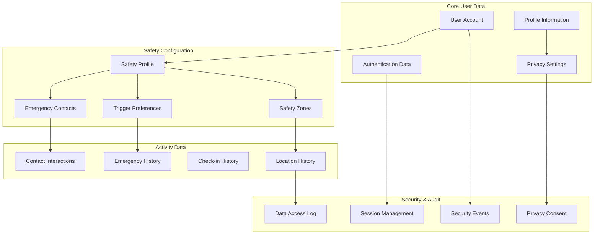

# User Data Model & Authentication

<Info>
**User-Centric Safety Design:** Shelther's user model prioritizes safety and privacy with granular control over personal data, flexible authentication options, and emergency access mechanisms that work when users need them most.
</Info>

## User Model Overview

The user model encompasses identity management, safety preferences, privacy controls, and emergency configurations:

<CardGroup cols={2}>
  <Card title="Identity & Authentication" icon="user">
    Secure user accounts with multi-factor authentication and emergency access options
  </Card>
  <Card title="Safety Profile" icon="shield">
    Personalized safety settings, emergency contacts, and risk preferences
  </Card>
  <Card title="Privacy Controls" icon="eye-slash">
    Granular privacy settings with user-controlled data sharing and retention
  </Card>
  <Card title="Emergency Configuration" icon="bell">
    Emergency triggers, escalation preferences, and safety zone definitions
  </Card>
</CardGroup>

## User Data Architecture



## Core User Entity

### User Account Structure

<CodeGroup>
```typescript User Interface Definition
export interface User {
  // Core identity
  id: string;
  email: string;
  phone_number?: string;
  full_name?: string;
  
  // Account status
  is_active: boolean;
  is_verified: boolean;
  verification_token?: string;
  
  // Privacy and emergency settings
  privacy_settings: PrivacySettings;
  emergency_settings: EmergencySettings;
  
  // Timestamps
  created_at: string;
  updated_at: string;
  last_seen: string;
  
  // Relationships
  safety_profile?: SafetyProfile;
  emergency_contacts?: EmergencyContact[];
  active_sessions?: UserSession[];
}

export interface PrivacySettings {
  // Location sharing preferences
  location_sharing: 'none' | 'contacts_only' | 'emergency_only' | 'custom';
  location_precision: 'exact' | 'approximate' | 'city_only';
  
  // Data retention preferences
  data_retention_days: number; // 30, 60, 90, 365, or 'indefinite'
  auto_delete_enabled: boolean;
  
  // Sharing and visibility
  anonymous_reporting: boolean;
  public_profile: boolean;
  contact_discovery: 'email' | 'phone' | 'none';
  
  // Communication preferences
  marketing_emails: boolean;
  safety_notifications: boolean;
  product_updates: boolean;
}

export interface EmergencySettings {
  // Escalation preferences
  auto_escalation_minutes: number; // 5, 10, 15, 30, 60
  escalation_enabled: boolean;
  
  // Emergency access
  silent_alarm_enabled: boolean;
  emergency_bypass_enabled: boolean;
  voice_activation: boolean;
  
  // Trigger sensitivity
  shake_sensitivity: 'low' | 'medium' | 'high' | 'disabled';
  button_sequence: 'volume_power' | 'power_triple' | 'volume_hold' | 'disabled';
  
  // Context awareness
  location_required: boolean;
  evidence_collection: 'audio' | 'photo' | 'both' | 'none';
  
  // Notification preferences
  local_alerts: boolean;
  contact_notification: 'immediate' | 'escalated' | 'manual';
}
```

```typescript User Management Service
export class UserService {
  // Create new user with safety-first defaults
  static async createUser(userData: CreateUserRequest): Promise<User> {
    try {
      // Validate input data
      const validation = await this.validateUserData(userData);
      if (!validation.valid) {
        throw new ValidationError('Invalid user data', validation.errors);
      }

      // Create user with secure defaults
      const user = {
        id: generateUUID(),
        email: userData.email.toLowerCase().trim(),
        phone_number: this.normalizePhoneNumber(userData.phone_number),
        full_name: userData.full_name?.trim(),
        
        // Security defaults
        is_active: true,
        is_verified: false,
        verification_token: generateSecureToken(),
        
        // Privacy-first defaults
        privacy_settings: {
          location_sharing: 'contacts_only',
          location_precision: 'exact',
          data_retention_days: 90,
          auto_delete_enabled: true,
          anonymous_reporting: true,
          public_profile: false,
          contact_discovery: 'email',
          marketing_emails: false,
          safety_notifications: true,
          product_updates: true
        },
        
        // Safety-optimized defaults
        emergency_settings: {
          auto_escalation_minutes: 15,
          escalation_enabled: true,
          silent_alarm_enabled: true,
          emergency_bypass_enabled: false,
          voice_activation: true,
          shake_sensitivity: 'medium',
          button_sequence: 'volume_power',
          location_required: true,
          evidence_collection: 'audio',
          local_alerts: true,
          contact_notification: 'immediate'
        },
        
        created_at: new Date().toISOString(),
        updated_at: new Date().toISOString(),
        last_seen: new Date().toISOString()
      };

      // Store in database
      const { data, error } = await supabase
        .from('users')
        .insert(user)
        .select()
        .single();

      if (error) throw error;

      // Create associated safety profile
      await this.createSafetyProfile(user.id);
      
      // Send verification email
      await this.sendVerificationEmail(user);
      
      // Log user creation
      await this.logSecurityEvent('user_created', {
        user_id: user.id,
        email: user.email,
        verification_required: true
      });

      return data;
    } catch (error) {
      console.error('User creation failed:', error);
      throw new UserCreationError('Failed to create user', error);
    }
  }

  // Update user with privacy and safety validation
  static async updateUser(
    userId: string, 
    updates: Partial<User>,
    requestingUserId: string
  ): Promise<User> {
    try {
      // Authorization check
      if (userId !== requestingUserId) {
        throw new AuthorizationError('Users can only update their own data');
      }

      // Get current user data for comparison
      const currentUser = await this.getUser(userId);
      if (!currentUser) {
        throw new NotFoundError('User not found');
      }

      // Validate updates
      const validation = await this.validateUserUpdates(updates, currentUser);
      if (!validation.valid) {
        throw new ValidationError('Invalid update data', validation.errors);
      }

      // Apply privacy-preserving updates
      const sanitizedUpdates = this.sanitizeUserUpdates(updates);
      
      // Check for sensitive changes that require re-verification
      const requiresVerification = this.checkVerificationRequired(updates, currentUser);
      if (requiresVerification) {
        sanitizedUpdates.is_verified = false;
        sanitizedUpdates.verification_token = generateSecureToken();
      }

      // Update timestamp
      sanitizedUpdates.updated_at = new Date().toISOString();

      // Perform update
      const { data, error } = await supabase
        .from('users')
        .update(sanitizedUpdates)
        .eq('id', userId)
        .select()
        .single();

      if (error) throw error;

      // Log significant changes
      await this.logUserUpdate(userId, updates, currentUser);
      
      // Send verification if needed
      if (requiresVerification) {
        await this.sendVerificationEmail(data);
      }

      return data;
    } catch (error) {
      console.error('User update failed:', error);
      throw new UserUpdateError('Failed to update user', error);
    }
  }

  // Privacy-compliant user deletion
  static async deleteUser(
    userId: string,
    deletionType: 'complete' | 'anonymize' | 'retain_safety' = 'complete',
    requestingUserId: string
  ): Promise<DeletionResult> {
    try {
      // Authorization check
      if (userId !== requestingUserId) {
        throw new AuthorizationError('Users can only delete their own accounts');
      }

      // Get user data for deletion planning
      const user = await this.getUserWithRelatedData(userId);
      if (!user) {
        throw new NotFoundError('User not found');
      }

      // Create deletion plan
      const deletionPlan = await this.createDeletionPlan(user, deletionType);
      
      // Execute deletion in phases
      const deletionResult = await this.executeDeletion(deletionPlan);
      
      // Generate cryptographic proof of deletion
      const deletionProof = await this.generateDeletionProof(deletionResult);
      
      // Log deletion completion
      await this.logSecurityEvent('user_deleted', {
        user_id: userId,
        deletion_type: deletionType,
        deletion_proof: deletionProof.hash,
        records_affected: deletionResult.total_records
      });

      return {
        success: true,
        deletion_type: deletionType,
        deletion_proof: deletionProof,
        records_deleted: deletionResult.total_records,
        anonymized_records: deletionResult.anonymized_records,
        retained_records: deletionResult.retained_records
      };
    } catch (error) {
      console.error('User deletion failed:', error);
      throw new UserDeletionError('Failed to delete user', error);
    }
  }

  // User search with privacy controls
  static async searchUsers(
    query: string,
    searchType: 'email' | 'phone' | 'name',
    requestingUserId: string
  ): Promise<PublicUserProfile[]> {
    try {
      // Rate limiting check
      await this.checkSearchRateLimit(requestingUserId);
      
      // Privacy validation
      const searchPermissions = await this.getUserSearchPermissions(requestingUserId);
      if (!searchPermissions.can_search) {
        throw new AuthorizationError('Search not permitted');
      }

      let searchResults: User[] = [];
      
      switch (searchType) {
        case 'email':
          if (!searchPermissions.can_search_by_email) {
            throw new AuthorizationError('Email search not permitted');
          }
          searchResults = await this.searchByEmail(query);
          break;
          
        case 'phone':
          if (!searchPermissions.can_search_by_phone) {
            throw new AuthorizationError('Phone search not permitted');
          }
          searchResults = await this.searchByPhone(query);
          break;
          
        case 'name':
          searchResults = await this.searchByName(query);
          break;
          
        default:
          throw new ValidationError('Invalid search type');
      }

      // Filter results based on privacy settings
      const filteredResults = searchResults.filter(user => 
        user.privacy_settings.contact_discovery !== 'none' &&
        (searchType === 'email' ? user.privacy_settings.contact_discovery === 'email' : true) &&
        user.privacy_settings.public_profile
      );

      // Return only public profile information
      const publicProfiles = filteredResults.map(user => ({
        id: user.id,
        full_name: user.full_name,
        email: searchType === 'email' ? user.email : undefined,
        can_add_as_contact: true,
        mutual_connections: 0 // TODO: Implement mutual connection counting
      }));

      // Log search activity
      await this.logSecurityEvent('user_search', {
        requesting_user: requestingUserId,
        search_type: searchType,
        query_length: query.length,
        results_count: publicProfiles.length
      });

      return publicProfiles;
    } catch (error) {
      console.error('User search failed:', error);
      throw new UserSearchError('Search failed', error);
    }
  }
}
```
</CodeGroup>

## Authentication System

### Multi-Factor Authentication

<Steps>
  <Step title="Primary Authentication">
    Email/password with secure password requirements and optional social login
  </Step>
  <Step title="Second Factor">
    TOTP, SMS, or biometric authentication with emergency bypass options
  </Step>
  <Step title="Device Trust">
    Device registration and trust management with anomaly detection
  </Step>
  <Step title="Emergency Access">
    Special authentication flows for emergency situations with enhanced logging
  </Step>
</Steps>

<CodeGroup>
```typescript Authentication Service
export class AuthenticationService {
  // Primary authentication with security enhancements
  static async authenticateUser(
    credentials: AuthCredentials,
    deviceInfo: DeviceInfo
  ): Promise<AuthenticationResult> {
    try {
      // Rate limiting check
      await this.checkAuthRateLimit(credentials.email, deviceInfo.ip_address);
      
      // Primary authentication
      const { data, error } = await supabase.auth.signInWithPassword({
        email: credentials.email,
        password: credentials.password,
      });

      if (error) {
        await this.logFailedAuth(credentials.email, deviceInfo, error.message);
        throw new AuthenticationError('Authentication failed', error);
      }

      const user = data.user!;
      
      // Check if MFA is required
      const mfaRequired = await this.checkMFARequirement(user.id, deviceInfo);
      
      if (mfaRequired) {
        // Generate and send MFA challenge
        const mfaChallenge = await this.createMFAChallenge(user.id);
        
        return {
          success: false,
          requires_mfa: true,
          mfa_challenge_id: mfaChallenge.id,
          available_methods: mfaChallenge.available_methods,
          backup_methods: mfaChallenge.backup_methods
        };
      }

      // Complete authentication without MFA
      const session = await this.createUserSession(user.id, deviceInfo, 'password');
      
      await this.logSuccessfulAuth(user.id, deviceInfo, 'password');
      
      return {
        success: true,
        user: await this.getUserProfile(user.id),
        session: session,
        access_token: data.session!.access_token,
        refresh_token: data.session!.refresh_token
      };

    } catch (error) {
      console.error('Authentication error:', error);
      throw error;
    }
  }

  // MFA verification
  static async verifyMFA(
    challengeId: string,
    method: MFAMethod,
    code: string,
    deviceInfo: DeviceInfo
  ): Promise<AuthenticationResult> {
    try {
      // Get MFA challenge
      const challenge = await this.getMFAChallenge(challengeId);
      if (!challenge || challenge.expires_at < new Date()) {
        throw new AuthenticationError('Invalid or expired MFA challenge');
      }

      // Verify code based on method
      let isValid = false;
      switch (method) {
        case 'totp':
          isValid = await this.verifyTOTP(challenge.user_id, code);
          break;
        case 'sms':
          isValid = await this.verifySMS(challenge.id, code);
          break;
        case 'backup_code':
          isValid = await this.verifyBackupCode(challenge.user_id, code);
          break;
        default:
          throw new AuthenticationError('Invalid MFA method');
      }

      if (!isValid) {
        await this.incrementMFAFailures(challengeId);
        throw new AuthenticationError('Invalid MFA code');
      }

      // Complete authentication
      const session = await this.createUserSession(challenge.user_id, deviceInfo, 'mfa');
      
      // Clean up challenge
      await this.completeMFAChallenge(challengeId);
      
      await this.logSuccessfulAuth(challenge.user_id, deviceInfo, `mfa_${method}`);
      
      return {
        success: true,
        user: await this.getUserProfile(challenge.user_id),
        session: session,
        access_token: session.access_token,
        refresh_token: session.refresh_token
      };

    } catch (error) {
      console.error('MFA verification error:', error);
      throw error;
    }
  }

  // Emergency bypass authentication
  static async emergencyBypass(
    email: string,
    emergencyCode: string,
    justification: string,
    deviceInfo: DeviceInfo
  ): Promise<EmergencyAuthResult> {
    try {
      // Get user by email
      const user = await this.getUserByEmail(email);
      if (!user) {
        throw new AuthenticationError('User not found');
      }

      // Check if emergency bypass is enabled
      if (!user.emergency_settings.emergency_bypass_enabled) {
        throw new AuthenticationError('Emergency bypass not enabled for this account');
      }

      // Verify emergency code
      const isValidCode = await this.verifyEmergencyCode(user.id, emergencyCode);
      if (!isValidCode) {
        await this.logFailedEmergencyBypass(user.id, deviceInfo, 'invalid_code');
        throw new AuthenticationError('Invalid emergency code');
      }

      // Create limited emergency session
      const emergencySession = await this.createEmergencySession(
        user.id, 
        deviceInfo, 
        justification
      );

      // Log emergency bypass usage
      await this.logSecurityEvent('emergency_bypass_used', {
        user_id: user.id,
        justification,
        device_info: deviceInfo,
        session_id: emergencySession.id
      }, 'critical');

      // Notify security team
      await this.notifySecurityTeam('emergency_bypass', {
        user_id: user.id,
        user_email: user.email,
        justification,
        device_info: deviceInfo,
        timestamp: new Date().toISOString()
      });

      // Send notification to user's emergency contacts
      await this.notifyEmergencyContacts(user.id, 'emergency_access_used', {
        access_time: new Date().toISOString(),
        device_info: deviceInfo.device_description,
        justification
      });

      return {
        success: true,
        session: emergencySession,
        limitations: [
          'Session expires in 30 minutes',
          'Limited to emergency functions only',
          'All actions are logged and monitored',
          'Security team has been notified'
        ],
        expires_at: emergencySession.expires_at
      };

    } catch (error) {
      console.error('Emergency bypass error:', error);
      throw error;
    }
  }

  // Biometric authentication (mobile)
  static async authenticateWithBiometrics(
    userId: string,
    biometricData: BiometricAuthData,
    deviceInfo: DeviceInfo
  ): Promise<AuthenticationResult> {
    try {
      // Verify biometric data with secure enclave
      const biometricResult = await LocalAuthentication.authenticateAsync({
        promptMessage: 'Authenticate to access Shelther',
        fallbackLabel: 'Use Passcode',
        cancelLabel: 'Cancel',
        disableDeviceFallback: false,
      });

      if (!biometricResult.success) {
        throw new AuthenticationError('Biometric authentication failed');
      }

      // Get stored biometric template hash
      const storedTemplate = await SecureStore.getItemAsync(
        `biometric_template_${userId}`,
        { requireAuthentication: true }
      );

      if (!storedTemplate) {
        throw new AuthenticationError('No biometric template found');
      }

      // Verify biometric template matches
      const templateMatch = await this.verifyBiometricTemplate(
        biometricData.template,
        storedTemplate
      );

      if (!templateMatch) {
        throw new AuthenticationError('Biometric verification failed');
      }

      // Create session
      const session = await this.createUserSession(userId, deviceInfo, 'biometric');
      
      await this.logSuccessfulAuth(userId, deviceInfo, 'biometric');
      
      return {
        success: true,
        user: await this.getUserProfile(userId),
        session: session,
        access_token: session.access_token,
        refresh_token: session.refresh_token
      };

    } catch (error) {
      console.error('Biometric authentication error:', error);
      throw error;
    }
  }
}
```

```typescript Session Management
export class SessionManager {
  // Create secure user session
  static async createUserSession(
    userId: string,
    deviceInfo: DeviceInfo,
    authMethod: string,
    isEmergencySession: boolean = false
  ): Promise<UserSession> {
    try {
      const sessionId = generateUUID();
      const now = new Date();
      const expiresAt = new Date(
        now.getTime() + (isEmergencySession ? 30 * 60 * 1000 : 24 * 60 * 60 * 1000)
      );

      const session = {
        id: sessionId,
        user_id: userId,
        session_token: generateSecureToken(),
        device_info: deviceInfo,
        ip_address: deviceInfo.ip_address,
        user_agent: deviceInfo.user_agent,
        created_at: now.toISOString(),
        expires_at: expiresAt.toISOString(),
        last_activity: now.toISOString(),
        is_active: true,
        is_emergency_session: isEmergencySession,
        auth_method: authMethod
      };

      // Store session in database
      const { data, error } = await supabase
        .from('user_sessions')
        .insert(session)
        .select()
        .single();

      if (error) throw error;

      // Generate JWT tokens
      const accessToken = await this.generateAccessToken(session);
      const refreshToken = await this.generateRefreshToken(session);

      // Store tokens securely on device
      await this.storeSessionTokens(sessionId, accessToken, refreshToken);

      return {
        ...data,
        access_token: accessToken,
        refresh_token: refreshToken
      };

    } catch (error) {
      console.error('Session creation failed:', error);
      throw new SessionError('Failed to create session', error);
    }
  }

  // Validate and refresh session
  static async validateSession(
    sessionToken: string,
    deviceInfo: DeviceInfo
  ): Promise<SessionValidation> {
    try {
      // Verify JWT token
      const tokenPayload = await this.verifyJWTToken(sessionToken);
      
      // Get session from database
      const { data: session, error } = await supabase
        .from('user_sessions')
        .select('*')
        .eq('id', tokenPayload.session_id)
        .eq('is_active', true)
        .single();

      if (error || !session) {
        return { valid: false, reason: 'Session not found' };
      }

      // Check expiration
      if (new Date() > new Date(session.expires_at)) {
        await this.invalidateSession(session.id, 'expired');
        return { valid: false, reason: 'Session expired' };
      }

      // Device fingerprint validation
      const deviceMatch = await this.validateDeviceFingerprint(
        session.device_info,
        deviceInfo
      );

      if (!deviceMatch.matches && !deviceMatch.acceptable_variance) {
        await this.flagSuspiciousActivity(session.id, 'device_mismatch', {
          original_device: session.device_info,
          current_device: deviceInfo,
          variance: deviceMatch.variance
        });
        
        return { 
          valid: false, 
          reason: 'Device fingerprint mismatch',
          requires_verification: true
        };
      }

      // Update last activity
      await this.updateSessionActivity(session.id);

      // Check if session needs refresh
      const shouldRefresh = this.shouldRefreshSession(session);
      if (shouldRefresh) {
        const newTokens = await this.refreshSessionTokens(session);
        return {
          valid: true,
          session: session,
          refreshed_tokens: newTokens
        };
      }

      return {
        valid: true,
        session: session
      };

    } catch (error) {
      console.error('Session validation failed:', error);
      return { valid: false, reason: 'Validation error' };
    }
  }

  // Detect suspicious session activity
  static async detectSuspiciousActivity(
    session: UserSession,
    deviceInfo: DeviceInfo
  ): Promise<SuspiciousActivityReport> {
    try {
      const suspiciousFactors = [];
      let riskScore = 0;

      // Check for location changes
      const locationChange = await this.checkLocationChange(
        session.ip_address,
        deviceInfo.ip_address
      );
      
      if (locationChange.distance_km > 500) {
        suspiciousFactors.push('significant_location_change');
        riskScore += 0.4;
      }

      // Check for unusual access patterns
      const accessPattern = await this.analyzeAccessPattern(session.user_id);
      if (accessPattern.unusual) {
        suspiciousFactors.push('unusual_access_pattern');
        riskScore += 0.3;
      }

      // Check for concurrent sessions
      const concurrentSessions = await this.getConcurrentSessions(
        session.user_id,
        session.id
      );
      
      if (concurrentSessions.length > 2) {
        suspiciousFactors.push('multiple_concurrent_sessions');
        riskScore += 0.2;
      }

      // Check device characteristics
      const deviceChanges = this.analyzeDeviceChanges(
        session.device_info,
        deviceInfo
      );
      
      if (deviceChanges.significant_changes > 3) {
        suspiciousFactors.push('device_fingerprint_change');
        riskScore += 0.3;
      }

      return {
        is_suspicious: riskScore > 0.6,
        risk_score: riskScore,
        factors: suspiciousFactors,
        recommended_action: riskScore > 0.8 ? 'require_mfa' : 
                           riskScore > 0.6 ? 'log_and_monitor' : 'none',
        confidence: this.calculateConfidence(suspiciousFactors)
      };

    } catch (error) {
      console.error('Suspicious activity detection failed:', error);
      return {
        is_suspicious: false,
        risk_score: 0,
        factors: [],
        recommended_action: 'none',
        confidence: 0
      };
    }
  }
}
```
</CodeGroup>

## Privacy Controls & Data Management

### Granular Privacy Settings

<CardGroup cols={3}>
  <Card title="Data Sharing Control" icon="share">
    Fine-grained control over what data is shared with whom and for how long
  </Card>
  <Card title="Retention Management" icon="clock">
    User-controlled data retention periods with automatic cleanup
  </Card>
  <Card title="Anonymization Options" icon="mask">
    Options to anonymize historical data while preserving safety insights
  </Card>
</CardGroup>

<CodeGroup>
```typescript Privacy Management
export class PrivacyManager {
  // Update user privacy preferences
  static async updatePrivacySettings(
    userId: string,
    newSettings: Partial<PrivacySettings>,
    requestingUserId: string
  ): Promise<PrivacySettings> {
    try {
      // Authorization check
      if (userId !== requestingUserId) {
        throw new AuthorizationError('Users can only update their own privacy settings');
      }

      // Get current settings
      const currentUser = await UserService.getUser(userId);
      if (!currentUser) {
        throw new NotFoundError('User not found');
      }

      // Validate new settings
      const validation = await this.validatePrivacySettings(newSettings);
      if (!validation.valid) {
        throw new ValidationError('Invalid privacy settings', validation.errors);
      }

      // Merge with current settings
      const updatedSettings = {
        ...currentUser.privacy_settings,
        ...newSettings,
        updated_at: new Date().toISOString()
      };

      // Apply settings with immediate effect
      await this.applyPrivacySettings(userId, updatedSettings);

      // Update user record
      const { data, error } = await supabase
        .from('users')
        .update({
          privacy_settings: updatedSettings,
          updated_at: new Date().toISOString()
        })
        .eq('id', userId)
        .select()
        .single();

      if (error) throw error;

      // Log privacy changes
      await this.logPrivacyChange(userId, currentUser.privacy_settings, updatedSettings);

      // Update active data sharing based on new settings
      await this.updateActiveDataSharing(userId, updatedSettings);

      return updatedSettings;

    } catch (error) {
      console.error('Privacy settings update failed:', error);
      throw new PrivacyError('Failed to update privacy settings', error);
    }
  }

  // Apply privacy settings to existing data
  private static async applyPrivacySettings(
    userId: string,
    settings: PrivacySettings
  ): Promise<void> {
    try {
      // Update location data precision
      if (settings.location_precision !== 'exact') {
        await this.adjustLocationPrecision(userId, settings.location_precision);
      }

      // Apply data retention rules
      if (settings.auto_delete_enabled) {
        await this.enforceDataRetention(userId, settings.data_retention_days);
      }

      // Update sharing sessions based on new sharing preferences
      if (settings.location_sharing === 'none') {
        await this.terminateAllLocationSharing(userId);
      } else if (settings.location_sharing === 'emergency_only') {
        await this.restrictLocationSharingToEmergencies(userId);
      }

      // Update contact discovery settings
      await this.updateContactDiscovery(userId, settings.contact_discovery);

    } catch (error) {
      console.error('Failed to apply privacy settings:', error);
      throw error;
    }
  }

  // Export user data in portable format
  static async exportUserData(
    userId: string,
    requestingUserId: string,
    exportFormat: 'json' | 'csv' = 'json'
  ): Promise<UserDataExport> {
    try {
      // Authorization check
      if (userId !== requestingUserId) {
        throw new AuthorizationError('Users can only export their own data');
      }

      // Gather all user data
      const exportData = await this.gatherUserDataForExport(userId);
      
      // Decrypt sensitive data for export
      const decryptedData = await this.decryptSensitiveDataForExport(userId, exportData);
      
      // Format data according to requested format
      const formattedData = exportFormat === 'json' ? 
        this.formatAsJSON(decryptedData) :
        this.formatAsCSV(decryptedData);

      // Create export record
      const exportRecord = {
        id: generateUUID(),
        user_id: userId,
        export_format: exportFormat,
        export_timestamp: new Date().toISOString(),
        data_size_bytes: JSON.stringify(formattedData).length,
        includes_sensitive_data: true,
        retention_days: 30 // Export available for 30 days
      };

      await supabase.from('data_exports').insert(exportRecord);

      // Log export activity
      await this.logSecurityEvent('data_exported', {
        user_id: userId,
        export_format: exportFormat,
        data_size: exportRecord.data_size_bytes,
        export_id: exportRecord.id
      });

      return {
        export_id: exportRecord.id,
        data: formattedData,
        metadata: {
          export_timestamp: exportRecord.export_timestamp,
          format: exportFormat,
          total_records: this.countRecords(decryptedData),
          data_categories: Object.keys(decryptedData),
          retention_notice: 'Export data will be automatically deleted after 30 days'
        }
      };

    } catch (error) {
      console.error('Data export failed:', error);
      throw new DataExportError('Failed to export user data', error);
    }
  }

  // Delete user data with various options
  static async deleteUserData(
    userId: string,
    deletionType: 'complete' | 'anonymize' | 'retain_safety',
    requestingUserId: string
  ): Promise<DeletionResult> {
    try {
      // Authorization check
      if (userId !== requestingUserId) {
        throw new AuthorizationError('Users can only delete their own data');
      }

      // Create deletion plan
      const deletionPlan = await this.createComprehensiveDeletionPlan(userId, deletionType);
      
      // Execute deletion in phases for safety
      const results = await this.executePhasedDeletion(deletionPlan);
      
      // Generate cryptographic proof of deletion
      const deletionProof = await this.generateCryptographicProof(results);
      
      // Handle anonymization if requested
      if (deletionType === 'anonymize') {
        await this.createAnonymizedDataset(userId, results);
      }

      // Clean up any remaining references
      await this.cleanupDataReferences(userId, deletionType);

      // Log deletion completion
      await this.logSecurityEvent('user_data_deleted', {
        user_id: deletionType === 'complete' ? null : userId,
        deletion_type: deletionType,
        deletion_proof: deletionProof.hash,
        records_affected: results.total_records_processed
      });

      return {
        success: true,
        deletion_type: deletionType,
        deletion_proof: deletionProof,
        summary: {
          records_deleted: results.deleted_records,
          records_anonymized: results.anonymized_records,
          records_retained: results.retained_records,
          tables_affected: results.tables_affected
        },
        completion_timestamp: new Date().toISOString()
      };

    } catch (error) {
      console.error('Data deletion failed:', error);
      throw new DataDeletionError('Failed to delete user data', error);
    }
  }

  // Anonymize user data while preserving safety insights
  static async anonymizeUserData(
    userId: string,
    preservePatterns: string[] = ['emergency_frequency', 'location_patterns']
  ): Promise<AnonymizationResult> {
    try {
      // Create anonymization plan
      const anonymizationPlan = await this.createAnonymizationPlan(userId, preservePatterns);
      
      // Execute anonymization
      const results = await this.executeAnonymization(anonymizationPlan);
      
      // Verify anonymization completeness
      const verification = await this.verifyAnonymization(userId, results);
      
      return {
        success: true,
        anonymized_records: results.processed_records,
        preserved_patterns: preservePatterns,
        anonymization_method: 'differential_privacy',
        verification: verification,
        anonymization_timestamp: new Date().toISOString()
      };

    } catch (error) {
      console.error('Data anonymization failed:', error);
      throw new AnonymizationError('Failed to anonymize user data', error);
    }
  }
}
```
</CodeGroup>

## Emergency User Configuration

### Emergency Settings & Triggers

<Note>
**Emergency-Optimized Defaults:** User emergency settings default to the most effective safety configurations while allowing customization for individual needs and preferences.
</Note>

<Steps>
  <Step title="Trigger Configuration">
    Customize emergency triggers including shake sensitivity, button combinations, and voice activation
  </Step>
  <Step title="Escalation Preferences">
    Set automatic escalation timelines and contact notification preferences
  </Step>
  <Step title="Evidence Collection">
    Configure automatic evidence collection including audio, photos, and location data
  </Step>
  <Step title="Emergency Access">
    Set up emergency bypass codes and special access mechanisms for crisis situations
  </Step>
</Steps>

<CodeGroup>
```typescript Emergency Configuration
export class EmergencyConfigurationService {
  // Update emergency settings with safety validation
  static async updateEmergencySettings(
    userId: string,
    newSettings: Partial<EmergencySettings>,
    requestingUserId: string
  ): Promise<EmergencySettings> {
    try {
      // Authorization check
      if (userId !== requestingUserId) {
        throw new AuthorizationError('Users can only update their own emergency settings');
      }

      // Get current settings
      const currentUser = await UserService.getUser(userId);
      if (!currentUser) {
        throw new NotFoundError('User not found');
      }

      // Validate new settings for safety
      const validation = await this.validateEmergencySettings(newSettings);
      if (!validation.valid) {
        throw new ValidationError('Invalid emergency settings', validation.errors);
      }

      // Safety check: ensure at least one trigger method is enabled
      const updatedSettings = {
        ...currentUser.emergency_settings,
        ...newSettings
      };

      const enabledTriggers = this.countEnabledTriggers(updatedSettings);
      if (enabledTriggers === 0) {
        throw new SafetyError('At least one emergency trigger must be enabled');
      }

      // Update settings
      const { data, error } = await supabase
        .from('users')
        .update({
          emergency_settings: updatedSettings,
          updated_at: new Date().toISOString()
        })
        .eq('id', userId)
        .select()
        .single();

      if (error) throw error;

      // Update device-side trigger configurations
      await this.updateDeviceTriggers(userId, updatedSettings);

      // Log emergency settings change
      await this.logSecurityEvent('emergency_settings_updated', {
        user_id: userId,
        changes: this.getSettingsChanges(currentUser.emergency_settings, updatedSettings),
        enabled_triggers: this.getEnabledTriggers(updatedSettings)
      });

      return updatedSettings;

    } catch (error) {
      console.error('Emergency settings update failed:', error);
      throw new EmergencyConfigurationError('Failed to update emergency settings', error);
    }
  }

  // Test emergency configuration
  static async testEmergencyConfiguration(
    userId: string,
    testType: 'trigger_test' | 'contact_test' | 'full_test'
  ): Promise<EmergencyTestResult> {
    try {
      const testId = generateUUID();
      const testResults: EmergencyTestResult = {
        test_id: testId,
        test_type: testType,
        started_at: new Date().toISOString(),
        results: {},
        success: false
      };

      switch (testType) {
        case 'trigger_test':
          testResults.results.trigger_test = await this.testEmergencyTriggers(userId);
          break;
          
        case 'contact_test':
          testResults.results.contact_test = await this.testEmergencyContacts(userId);
          break;
          
        case 'full_test':
          testResults.results.trigger_test = await this.testEmergencyTriggers(userId);
          testResults.results.contact_test = await this.testEmergencyContacts(userId);
          testResults.results.location_test = await this.testLocationCapture(userId);
          testResults.results.escalation_test = await this.testEscalationLogic(userId);
          break;
      }

      // Determine overall success
      testResults.success = this.evaluateTestResults(testResults.results);
      testResults.completed_at = new Date().toISOString();

      // Store test results
      await supabase.from('emergency_tests').insert({
        id: testId,
        user_id: userId,
        test_type: testType,
        test_results: testResults.results,
        success: testResults.success,
        created_at: testResults.started_at
      });

      // Log test activity
      await this.logSecurityEvent('emergency_test_completed', {
        user_id: userId,
        test_id: testId,
        test_type: testType,
        success: testResults.success,
        duration_ms: new Date().getTime() - new Date(testResults.started_at).getTime()
      });

      return testResults;

    } catch (error) {
      console.error('Emergency configuration test failed:', error);
      throw new EmergencyTestError('Emergency test failed', error);
    }
  }

  // Set up emergency bypass codes
  static async setupEmergencyBypass(
    userId: string,
    bypassCode: string,
    confirmationCode: string
  ): Promise<EmergencyBypassSetup> {
    try {
      // Validate bypass code strength
      const codeValidation = this.validateBypassCode(bypassCode);
      if (!codeValidation.valid) {
        throw new ValidationError('Invalid bypass code', codeValidation.errors);
      }

      // Verify confirmation
      if (bypassCode !== confirmationCode) {
        throw new ValidationError('Bypass codes do not match');
      }

      // Hash bypass code for storage
      const hashedCode = await this.hashBypassCode(bypassCode);
      
      // Generate backup codes
      const backupCodes = await this.generateBackupCodes(userId);

      // Store emergency bypass configuration
      const bypassConfig = {
        user_id: userId,
        bypass_code_hash: hashedCode,
        backup_codes: backupCodes.map(code => ({ code: code.hash, used: false })),
        enabled: true,
        created_at: new Date().toISOString(),
        last_used: null,
        usage_count: 0
      };

      await supabase.from('emergency_bypass_configs').upsert(bypassConfig);

      // Update user emergency settings
      await supabase
        .from('users')
        .update({
          emergency_settings: {
            ...await this.getCurrentEmergencySettings(userId),
            emergency_bypass_enabled: true
          },
          updated_at: new Date().toISOString()
        })
        .eq('id', userId);

      // Log bypass setup
      await this.logSecurityEvent('emergency_bypass_configured', {
        user_id: userId,
        backup_codes_generated: backupCodes.length
      });

      return {
        success: true,
        backup_codes: backupCodes.map(code => code.plaintext),
        setup_timestamp: bypassConfig.created_at,
        important_notes: [
          'Store backup codes in a secure location',
          'Backup codes can only be used once',
          'Emergency bypass usage is logged and monitored',
          'Disable bypass if you suspect compromise'
        ]
      };

    } catch (error) {
      console.error('Emergency bypass setup failed:', error);
      throw new EmergencyBypassError('Failed to setup emergency bypass', error);
    }
  }
}
```
</CodeGroup>

---

## Next Steps

<CardGroup cols={3}>
  <Card title="Emergency Model" icon="bell" href="/architecture/emergency-model">
    Explore the emergency alert system and user emergency workflows
  </Card>
  <Card title="Safety Model" icon="shield" href="/architecture/safety-model">
    Learn about safety profiles, contacts, and protection mechanisms
  </Card>
  <Card title="Location Model" icon="map-pin" href="/architecture/location-model">
    Understand location tracking and user location data management
  </Card>
</CardGroup>

<Warning>
**Security & Privacy First:** All user data operations implement security-first principles with comprehensive audit trails, privacy controls, and emergency access mechanisms that maintain safety while protecting user autonomy.
</Warning>