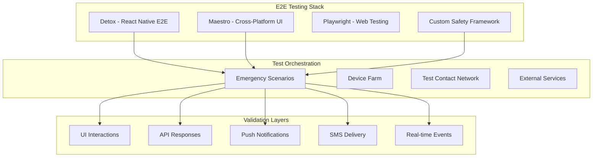

# End-to-End Testing

<Info>
**Complete Scenario Validation:** End-to-end testing ensures that entire emergency workflows function correctly from the user's perspective across real devices, networks, and emergency contact chains. These tests validate that safety features work when lives depend on them.
</Info>

## Overview

E2E testing for safety applications goes beyond typical app testing by simulating real emergency scenarios across multiple devices, testing with actual emergency contacts, and validating the complete safety ecosystem under stress conditions.

<CardGroup cols={2}>
  <Card title="Real Emergency Scenarios" icon="siren">
    Complete emergency workflows tested from trigger through resolution with actual contact notifications
  </Card>
  <Card title="Cross-Platform Validation" icon="devices">
    Test scenarios across iOS, Android, and web platforms with device-specific behaviors
  </Card>
  <Card title="Multi-User Workflows" icon="users">
    Emergency scenarios involving multiple participants with real notification chains
  </Card>
  <Card title="Production-Like Conditions" icon="cloud">
    Testing under real network conditions, battery constraints, and app store builds
  </Card>
</CardGroup>

## E2E Testing Architecture

### Testing Framework Stack



## Framework Setup and Configuration

### Detox Configuration for React Native

<CodeGroup>
```json .detoxrc.js
module.exports = {
  testRunner: {
    args: {
      '$0': 'jest',
      config: 'e2e/jest.config.js'
    },
    jest: {
      setupTimeout: 120000
    }
  },
  apps: {
    'ios.debug': {
      type: 'ios.app',
      binaryPath: 'ios/build/Build/Products/Debug-iphonesimulator/Shelther.app',
      build: 'xcodebuild -workspace ios/Shelther.xcworkspace -scheme Shelther -configuration Debug -sdk iphonesimulator -derivedDataPath ios/build'
    },
    'ios.release': {
      type: 'ios.app',
      binaryPath: 'ios/build/Build/Products/Release-iphonesimulator/Shelther.app',
      build: 'xcodebuild -workspace ios/Shelther.xcworkspace -scheme Shelther -configuration Release -sdk iphonesimulator -derivedDataPath ios/build'
    },
    'android.debug': {
      type: 'android.apk',
      binaryPath: 'android/app/build/outputs/apk/debug/app-debug.apk',
      build: 'cd android && ./gradlew assembleDebug assembleAndroidTest -DtestBuildType=debug'
    },
    'android.release': {
      type: 'android.apk',
      binaryPath: 'android/app/build/outputs/apk/release/app-release.apk',
      build: 'cd android && ./gradlew assembleRelease assembleAndroidTest -DtestBuildType=release'
    }
  },
  devices: {
    simulator: {
      type: 'ios.simulator',
      device: {
        type: 'iPhone 14 Pro'
      }
    },
    emulator: {
      type: 'android.emulator',
      device: {
        avdName: 'Pixel_4_API_30'
      }
    },
    physical: {
      type: 'android.attached',
      device: {
        adbName: '.*'
      }
    }
  },
  configurations: {
    'ios.sim.debug': {
      device: 'simulator',
      app: 'ios.debug'
    },
    'ios.sim.release': {
      device: 'simulator',
      app: 'ios.release'
    },
    'android.emu.debug': {
      device: 'emulator',
      app: 'android.debug'
    },
    'android.emu.release': {
      device: 'emulator',
      app: 'android.release'
    }
  }
};
```

```javascript e2e/jest.config.js
module.exports = {
  preset: '@testing-library/react-native',
  testTimeout: 120000,
  testRegex: '\\.e2e\\.(js|ts)$',
  verbose: true,
  setupFilesAfterEnv: [
    '<rootDir>/e2e/setup.ts'
  ],
  globalSetup: '<rootDir>/e2e/globalSetup.ts',
  globalTeardown: '<rootDir>/e2e/globalTeardown.ts',
  testEnvironment: 'node',
  reporters: [
    'default',
    ['jest-html-reporters', {
      publicPath: './e2e/reports',
      filename: 'report.html',
      expand: true
    }]
  ]
};
```
</CodeGroup>

### Maestro Configuration for Cross-Platform Testing

<Accordion title="Maestro Test Configuration">
Maestro provides a simpler, more reliable approach to mobile UI testing with better cross-platform support.

```yaml
# e2e/maestro/emergency-alert-flow.yaml
appId: com.shelther.app
tags:
  - emergency
  - critical
---
- launchApp
- assertVisible: "Welcome to Shelther"
- tapOn: "Skip Tutorial"

# Setup emergency contacts
- tapOn: "Emergency Contacts"
- tapOn: "Add Contact"
- inputText: 
    text: "Test Emergency Contact"
    element: "Contact Name"
- inputText:
    text: "+1234567890"
    element: "Phone Number"
- tapOn: "Save Contact"
- assertVisible: "Contact added successfully"

# Test emergency alert flow
- tapOn: "Emergency"
- longPressOn:
    element: "SOS Button"
    duration: 3000
- assertVisible: "Emergency Alert Active"
- assertVisible: "Contacting emergency contacts..."

# Verify location capture
- assertVisible: "Location captured"
- assertVisible: 
    text: "Accuracy: .*m"
    regex: true

# Test cancellation
- tapOn: "Cancel Alert"
- tapOn: "Confirm Cancel"
- assertVisible: "Emergency alert cancelled"
- assertVisible: "You are safe"

# Verify cleanup
- assertNotVisible: "Emergency Alert Active"
```

```yaml
# e2e/maestro/location-sharing-flow.yaml
appId: com.shelther.app
tags:
  - location
  - sharing
---
- launchApp
- tapOn: "Location Sharing"

# Start location sharing
- tapOn: "Share Location"
- tapOn: "Select Contact"
- tapOn: "Test Emergency Contact"
- tapOn: "Share for 1 hour"
- tapOn: "Start Sharing"

- assertVisible: "Location sharing active"
- assertVisible: "Sharing with Test Emergency Contact"

# Verify location updates
- runFlow: 
    file: location-update.yaml
    times: 3
    interval: 10000  # 10 seconds

# Stop sharing
- tapOn: "Stop Sharing"
- tapOn: "Confirm Stop"
- assertVisible: "Location sharing stopped"
- assertNotVisible: "Location sharing active"
```
</Accordion>

## Emergency Scenario Testing

### Complete Emergency Alert Workflow

<Accordion title="Multi-Device Emergency Scenario">
This comprehensive test simulates a real emergency scenario with actual contact notifications and device interactions.

```typescript
// e2e/scenarios/EmergencyAlertWorkflow.e2e.ts
import { device, element, by, expect as detoxExpect } from 'detox';
import { EmergencyTestOrchestrator } from '../utils/EmergencyTestOrchestrator';
import { TestContactDevice } from '../utils/TestContactDevice';
import { SMSVerificationService } from '../utils/SMSVerificationService';

describe('Complete Emergency Alert Workflow', () => {
  let orchestrator: EmergencyTestOrchestrator;
  let userDevice: any;
  let contactDevice1: TestContactDevice;
  let contactDevice2: TestContactDevice;
  let smsVerifier: SMSVerificationService;

  beforeAll(async () => {
    orchestrator = new EmergencyTestOrchestrator();
    smsVerifier = new SMSVerificationService();
    
    // Setup test devices and contacts
    await orchestrator.setupTestScenario({
      devices: 3,
      contacts: 2,
      realSMS: true // Use real SMS for validation
    });
    
    userDevice = orchestrator.getUserDevice();
    contactDevice1 = orchestrator.getContactDevice(0);
    contactDevice2 = orchestrator.getContactDevice(1);
  });

  afterAll(async () => {
    await orchestrator.cleanup();
  });

  it('should complete emergency alert workflow across multiple devices within 10 seconds', async () => {
    const startTime = Date.now();
    
    // Step 1: User launches app and sets up emergency contacts
    await userDevice.launchApp();
    await userDevice.setupEmergencyContacts([
      {
        name: 'Contact One',
        phone: contactDevice1.getPhoneNumber(),
        priority: 1
      },
      {
        name: 'Contact Two', 
        phone: contactDevice2.getPhoneNumber(),
        priority: 2
      }
    ]);

    // Step 2: Contacts install and setup their apps
    await contactDevice1.launchApp();
    await contactDevice1.addUserAsContact(userDevice.getUserId());
    
    await contactDevice2.launchApp();
    await contactDevice2.addUserAsContact(userDevice.getUserId());

    // Step 3: User triggers emergency alert
    await userDevice.navigateToEmergency();
    await userDevice.element(by.id('emergency-button')).longPress(3000);

    // Step 4: Verify immediate UI feedback on user device
    await detoxExpect(userDevice.element(by.id('emergency-active-indicator'))).toBeVisible();
    await detoxExpect(userDevice.element(by.text('Emergency Alert Active'))).toBeVisible();
    await detoxExpect(userDevice.element(by.id('location-captured-indicator'))).toBeVisible();

    // Step 5: Verify contacts receive push notifications
    await contactDevice1.waitForPushNotification('Emergency Alert', 5000);
    await contactDevice2.waitForPushNotification('Emergency Alert', 5000);

    // Step 6: Verify SMS notifications sent
    const smsMessage1 = await smsVerifier.waitForSMS(contactDevice1.getPhoneNumber(), 8000);
    const smsMessage2 = await smsVerifier.waitForSMS(contactDevice2.getPhoneNumber(), 8000);
    
    expect(smsMessage1).toContain('EMERGENCY ALERT');
    expect(smsMessage1).toContain('Contact One');
    expect(smsMessage1).toMatch(/Location: https:\/\/maps\.google\.com/);
    
    expect(smsMessage2).toContain('EMERGENCY ALERT');
    expect(smsMessage2).toContain('Contact Two');

    // Step 7: Contact 1 acknowledges the alert
    await contactDevice1.openNotification();
    await contactDevice1.element(by.id('acknowledge-alert-button')).tap();
    await contactDevice1.element(by.id('confirm-acknowledgment')).tap();

    // Step 8: Verify acknowledgment appears on user device
    await userDevice.waitForElement(by.text('Contact One acknowledged'), 3000);
    await detoxExpected(userDevice.element(by.id('acknowledgment-indicator'))).toBeVisible();

    // Step 9: User cancels the alert
    await userDevice.element(by.id('cancel-alert-button')).tap();
    await userDevice.element(by.id('confirm-cancel')).tap();

    // Step 10: Verify cancellation notifications
    await contactDevice1.waitForPushNotification('Alert Cancelled', 3000);
    await contactDevice2.waitForPushNotification('Alert Cancelled', 3000);

    // Step 11: Verify final state
    await detoxExpect(userDevice.element(by.text('Emergency alert cancelled'))).toBeVisible();
    await detoxExpect(userDevice.element(by.text('You are safe'))).toBeVisible();
    await detoxExpect(userDevice.element(by.id('emergency-active-indicator'))).not.toBeVisible();

    // Verify total workflow time
    const totalTime = Date.now() - startTime;
    expect(totalTime).toBeLessThan(10000); // Complete workflow under 10 seconds
    
    // Log performance metrics
    console.log(`Emergency workflow completed in ${totalTime}ms`);
  });

  it('should handle offline emergency scenario with sync', async () => {
    // Step 1: User goes offline
    await userDevice.setNetworkCondition('offline');
    
    // Step 2: Trigger emergency alert while offline
    await userDevice.navigateToEmergency();
    await userDevice.element(by.id('emergency-button')).longPress(3000);

    // Step 3: Verify offline indicators
    await detoxExpect(userDevice.element(by.id('offline-mode-indicator'))).toBeVisible();
    await detoxExpect(userDevice.element(by.text('Emergency stored locally'))).toBeVisible();
    await detoxExpect(userDevice.element(by.id('will-sync-indicator'))).toBeVisible();

    // Step 4: Verify no notifications sent yet
    await contactDevice1.ensureNoNotifications(3000);
    await contactDevice2.ensureNoNotifications(3000);

    // Step 5: User comes back online
    await userDevice.setNetworkCondition('online');

    // Step 6: Verify automatic sync
    await detoxExpect(userDevice.element(by.text('Syncing emergency alert...'))).toBeVisible();
    await userDevice.waitForElement(by.text('Emergency alert sent'), 5000);

    // Step 7: Verify contacts now receive notifications
    await contactDevice1.waitForPushNotification('Emergency Alert', 5000);
    await contactDevice2.waitForPushNotification('Emergency Alert', 5000);

    // Step 8: Verify database consistency
    const alertData = await orchestrator.verifyAlertInDatabase(userDevice.getUserId());
    expect(alertData.status).toBe('active');
    expect(alertData.sync_status).toBe('synced');
    expect(alertData.offline_created).toBe(true);
  });

  it('should escalate when contacts do not respond', async () => {
    jest.setTimeout(15 * 60 * 1000); // 15 minutes for escalation test
    
    // Step 1: Trigger emergency alert
    await userDevice.navigateToEmergency();
    await userDevice.element(by.id('emergency-button')).longPress(3000);

    // Step 2: Verify initial notifications
    await contactDevice1.waitForPushNotification('Emergency Alert', 5000);
    await contactDevice2.waitForPushNotification('Emergency Alert', 5000);

    // Step 3: Wait for escalation timeout (simulate 10 minutes)
    await orchestrator.fastForwardTime(10 * 60 * 1000);

    // Step 4: Verify escalation triggers
    await detoxExpect(userDevice.element(by.text('Escalating alert...'))).toBeVisible();
    
    // Step 5: Verify escalation notifications
    const escalationSMS1 = await smsVerifier.waitForSMS(contactDevice1.getPhoneNumber(), 5000);
    const escalationSMS2 = await smsVerifier.waitForSMS(contactDevice2.getPhoneNumber(), 5000);
    
    expect(escalationSMS1).toContain('URGENT: No response to emergency alert');
    expect(escalationSMS2).toContain('URGENT: No response to emergency alert');

    // Step 6: Verify emergency services notification (if configured)
    if (process.env.ENABLE_EMERGENCY_SERVICES_TEST === 'true') {
      const emergencyCallLog = await orchestrator.verifyEmergencyServicesNotification();
      expect(emergencyCallLog.called).toBe(true);
      expect(emergencyCallLog.location).toBeDefined();
    }
  });
});
```
</Accordion>

### Location Sharing E2E Tests

<CodeGroup>
```typescript Location Sharing E2E Tests
// e2e/scenarios/LocationSharing.e2e.ts
import { device, element, by, expect as detoxExpect } from 'detox';
import { LocationTestOrchestrator } from '../utils/LocationTestOrchestrator';
import { RealtimeVerificationService } from '../utils/RealtimeVerificationService';

describe('Location Sharing E2E Workflow', () => {
  let orchestrator: LocationTestOrchestrator;
  let userDevice: any;
  let contactDevice: any;
  let realtimeVerifier: RealtimeVerificationService;

  beforeAll(async () => {
    orchestrator = new LocationTestOrchestrator();
    realtimeVerifier = new RealtimeVerificationService();
    
    await orchestrator.setupLocationSharingScenario({
      userDevice: true,
      contactDevice: true,
      realLocation: true
    });
    
    userDevice = orchestrator.getUserDevice();
    contactDevice = orchestrator.getContactDevice();
  });

  afterAll(async () => {
    await orchestrator.cleanup();
  });

  it('should share location in real-time with contact', async () => {
    // Step 1: Setup location sharing
    await userDevice.launchApp();
    await userDevice.navigateToLocationSharing();
    
    await userDevice.element(by.id('start-sharing-button')).tap();
    await userDevice.element(by.id('select-contact-button')).tap();
    await userDevice.element(by.text('Test Contact')).tap();
    await userDevice.element(by.id('duration-1-hour')).tap();
    await userDevice.element(by.id('confirm-sharing')).tap();

    // Step 2: Verify sharing started
    await detoxExpect(userDevice.element(by.text('Location sharing active'))).toBeVisible();
    await detoxExpect(userDevice.element(by.id('sharing-timer'))).toBeVisible();

    // Step 3: Contact launches app and verifies they can see location
    await contactDevice.launchApp();
    await contactDevice.navigateToSharedLocations();
    
    await detoxExpect(contactDevice.element(by.text('Test User is sharing location'))).toBeVisible();
    await detoxExpect(contactDevice.element(by.id('live-location-indicator'))).toBeVisible();

    // Step 4: User moves location and verify real-time updates
    const initialLocation = await userDevice.getCurrentLocation();
    await userDevice.simulateLocationChange({
      latitude: initialLocation.latitude + 0.001,
      longitude: initialLocation.longitude + 0.001
    });

    // Step 5: Verify contact receives location update within 2 seconds
    await contactDevice.waitForLocationUpdate(2000);
    const displayedLocation = await contactDevice.getDisplayedLocation();
    
    expect(displayedLocation.latitude).toBeCloseTo(initialLocation.latitude + 0.001, 5);
    expect(displayedLocation.longitude).toBeCloseTo(initialLocation.longitude + 0.001, 5);

    // Step 6: Verify real-time subscription is working
    const realtimeData = await realtimeVerifier.getLocationUpdates(userDevice.getUserId());
    expect(realtimeData.length).toBeGreaterThan(0);
    expect(realtimeData[0].delivered_to).toContain(contactDevice.getUserId());

    // Step 7: User stops sharing
    await userDevice.element(by.id('stop-sharing-button')).tap();
    await userDevice.element(by.id('confirm-stop')).tap();

    // Step 8: Verify sharing stopped
    await detoxExpect(userDevice.element(by.text('Location sharing stopped'))).toBeVisible();
    await contactDevice.waitForElement(by.text('Test User stopped sharing'), 3000);
  });

  it('should handle permission changes during sharing', async () => {
    // Step 1: Start basic location sharing
    await userDevice.startLocationSharing({
      contact: 'Test Contact',
      permissions: ['location']
    });

    await contactDevice.verifyLocationSharingActive();

    // Step 2: Upgrade permissions to include emergency alerts
    await userDevice.navigateToLocationSharing();
    await userDevice.element(by.id('manage-sharing-button')).tap();
    await userDevice.element(by.id('edit-permissions')).tap();
    await userDevice.element(by.id('add-emergency-alerts')).tap();
    await userDevice.element(by.id('save-permissions')).tap();

    // Step 3: Verify contact sees permission update
    await contactDevice.waitForElement(by.text('Permissions updated'), 3000);
    await detoxExpect(contactDevice.element(by.text('Can receive emergency alerts'))).toBeVisible();

    // Step 4: Test emergency alert with location sharing
    await userDevice.triggerEmergencyAlert();

    // Step 5: Verify contact receives both location and emergency alert
    await contactDevice.waitForPushNotification('Emergency Alert', 5000);
    await detoxExpect(contactDevice.element(by.text('Emergency location received'))).toBeVisible();
    await detoxExpect(contactDevice.element(by.id('emergency-location-map'))).toBeVisible();
  });

  it('should handle battery optimization for long sharing sessions', async () => {
    // Step 1: Start long-term sharing (8 hours)
    await userDevice.startLocationSharing({
      contact: 'Test Contact',
      duration: 8 * 60 * 60 * 1000 // 8 hours
    });

    // Step 2: Simulate low battery condition
    await userDevice.setBatteryLevel(15);

    // Step 3: Verify battery optimization kicks in
    await detoxExpect(userDevice.element(by.text('Battery optimization active'))).toBeVisible();
    await detoxExpect(userDevice.element(by.text('Location updates reduced'))).toBeVisible();

    // Step 4: Verify sharing continues with reduced accuracy
    const sharingStatus = await userDevice.getSharingStatus();
    expect(sharingStatus.batteryOptimized).toBe(true);
    expect(sharingStatus.updateInterval).toBeGreaterThan(60000); // > 1 minute

    // Step 5: Contact should see battery status
    await detoxExpect(contactDevice.element(by.text('Low battery mode'))).toBeVisible();
    await detoxExpected(contactDevice.element(by.id('battery-warning-icon'))).toBeVisible();

    // Step 6: Restore battery and verify normal operation
    await userDevice.setBatteryLevel(80);
    
    await userDevice.waitForElement(by.text('Normal location sharing resumed'), 5000);
    const normalStatus = await userDevice.getSharingStatus();
    expect(normalStatus.batteryOptimized).toBe(false);
  });
});
```
</CodeGroup>

## Cross-Platform Testing

### iOS vs Android Feature Parity

<Accordion title="Platform-Specific E2E Tests">
Testing that ensures feature parity and platform-specific behaviors work correctly across iOS and Android.

```typescript
// e2e/scenarios/CrossPlatform.e2e.ts
import { device, element, by, expect as detoxExpect } from 'detox';
import { PlatformTestRunner } from '../utils/PlatformTestRunner';

describe('Cross-Platform Feature Parity', () => {
  let platformRunner: PlatformTestRunner;

  beforeAll(async () => {
    platformRunner = new PlatformTestRunner();
  });

  afterAll(async () => {
    await platformRunner.cleanup();
  });

  it('should have identical emergency alert behavior on iOS and Android', async () => {
    const testScenario = async (platform: 'ios' | 'android') => {
      await device.selectApp(platform);
      await device.launchApp();

      // Test emergency alert timing
      const startTime = Date.now();
      await element(by.id('emergency-button')).longPress(3000);
      await waitFor(element(by.id('emergency-active-indicator'))).toBeVisible().withTimeout(3000);
      const alertTime = Date.now() - startTime;

      // Test location capture
      await waitFor(element(by.id('location-captured-indicator'))).toBeVisible().withTimeout(5000);
      
      // Test cancellation
      await element(by.id('cancel-alert-button')).tap();
      await element(by.id('confirm-cancel')).tap();
      await waitFor(element(by.text('Emergency alert cancelled'))).toBeVisible().withTimeout(3000);

      return { alertTime, platform };
    };

    // Run identical test on both platforms
    const iosResult = await testScenario('ios');
    const androidResult = await testScenario('android');

    // Verify timing is similar (within 500ms)
    expect(Math.abs(iosResult.alertTime - androidResult.alertTime)).toBeLessThan(500);
    
    console.log(`iOS alert time: ${iosResult.alertTime}ms`);
    console.log(`Android alert time: ${androidResult.alertTime}ms`);
  });

  it('should handle platform-specific permissions correctly', async () => {
    const testPermissions = async (platform: 'ios' | 'android') => {
      await device.selectApp(platform);
      await device.launchApp();

      // Navigate to location setup
      await element(by.id('setup-location')).tap();

      if (platform === 'ios') {
        // iOS-specific permission flow
        await waitFor(element(by.text('Allow While Using App'))).toBeVisible().withTimeout(5000);
        await element(by.text('Allow While Using App')).tap();
        
        // Background permission request
        await waitFor(element(by.text('Change to Always Allow'))).toBeVisible().withTimeout(3000);
        await element(by.text('Change to Always Allow')).tap();
        
      } else {
        // Android-specific permission flow
        await waitFor(element(by.text('Allow all the time'))).toBeVisible().withTimeout(5000);
        await element(by.text('Allow all the time')).tap();
        
        // Battery optimization dialog
        await waitFor(element(by.text('Allow'))).toBeVisible().withTimeout(3000);
        await element(by.text('Allow')).tap();
      }

      // Verify permissions granted
      await waitFor(element(by.text('Location permissions granted'))).toBeVisible().withTimeout(3000);
      
      return platform;
    };

    await testPermissions('ios');
    await testPermissions('android');
  });

  it('should handle background processing correctly on both platforms', async () => {
    const testBackgroundBehavior = async (platform: 'ios' | 'android') => {
      await device.selectApp(platform);
      await device.launchApp();

      // Start location sharing
      await element(by.id('start-location-sharing')).tap();
      await element(by.id('share-for-1-hour')).tap();
      await element(by.id('confirm-sharing')).tap();

      // Put app in background
      await device.sendToHome();
      
      // Wait for background processing
      await new Promise(resolve => setTimeout(resolve, 30000)); // 30 seconds

      // Bring app back to foreground
      await device.launchApp();

      // Verify background location updates continued
      await waitFor(element(by.text('Background updates: active'))).toBeVisible().withTimeout(3000);
      
      // Check location update count
      const updateCount = await element(by.id('location-update-count')).getAttributes();
      expect(parseInt(updateCount.text)).toBeGreaterThan(0);

      return { platform, updateCount: parseInt(updateCount.text) };
    };

    const iosResult = await testBackgroundBehavior('ios');
    const androidResult = await testBackgroundBehavior('android');

    // Both platforms should have location updates
    expect(iosResult.updateCount).toBeGreaterThan(0);
    expect(androidResult.updateCount).toBeGreaterThan(0);
    
    console.log(`iOS background updates: ${iosResult.updateCount}`);
    console.log(`Android background updates: ${androidResult.updateCount}`);
  });
});
```
</Accordion>

## Performance and Load Testing

### Stress Testing Emergency Scenarios

<CodeGroup>
```typescript Emergency Load Testing
// e2e/scenarios/EmergencyLoadTest.e2e.ts
import { device, element, by } from 'detox';
import { LoadTestOrchestrator } from '../utils/LoadTestOrchestrator';
import { PerformanceMonitor } from '../utils/PerformanceMonitor';

describe('Emergency System Load Testing', () => {
  let loadOrchestrator: LoadTestOrchestrator;
  let perfMonitor: PerformanceMonitor;

  beforeAll(async () => {
    loadOrchestrator = new LoadTestOrchestrator();
    perfMonitor = new PerformanceMonitor();
    
    await loadOrchestrator.setupLoadTestEnvironment({
      concurrentUsers: 100,
      realDevices: 5,
      simulatedDevices: 95
    });
  });

  afterAll(async () => {
    await loadOrchestrator.cleanup();
  });

  it('should handle 100 concurrent emergency alerts', async () => {
    await perfMonitor.startMonitoring();

    // Trigger 100 concurrent emergency alerts
    const alertPromises = Array.from({ length: 100 }, async (_, index) => {
      const userDevice = loadOrchestrator.getDevice(index);
      return userDevice.triggerEmergencyAlert();
    });

    const startTime = Date.now();
    const results = await Promise.allSettled(alertPromises);
    const endTime = Date.now();

    // Analyze results
    const successful = results.filter(r => r.status === 'fulfilled').length;
    const failed = results.filter(r => r.status === 'rejected').length;

    expect(successful).toBeGreaterThan(95); // 95% success rate minimum
    expect(endTime - startTime).toBeLessThan(10000); // All alerts within 10 seconds

    // Check performance metrics
    const metrics = await perfMonitor.getMetrics();
    expect(metrics.avgResponseTime).toBeLessThan(3000);
    expect(metrics.memoryUsage).toBeLessThan(200 * 1024 * 1024); // 200MB max
    expect(metrics.cpuUsage).toBeLessThan(80); // 80% max CPU

    console.log(`Load test results: ${successful}/${100} successful, ${endTime - startTime}ms total`);
    console.log(`Performance: ${metrics.avgResponseTime}ms avg response, ${metrics.memoryUsage / 1024 / 1024}MB memory`);
  });

  it('should maintain real-time performance under load', async () => {
    // Setup 50 location sharing sessions
    const sharingPromises = Array.from({ length: 50 }, async (_, index) => {
      const userDevice = loadOrchestrator.getDevice(index);
      const contactDevice = loadOrchestrator.getDevice(index + 50);
      
      return userDevice.startLocationSharing({
        contactDevice: contactDevice.getUserId(),
        duration: 30 * 60 * 1000 // 30 minutes
      });
    });

    await Promise.all(sharingPromises);

    // Monitor real-time update latency
    const latencyResults: number[] = [];
    
    for (let i = 0; i < 10; i++) {
      const testDevice = loadOrchestrator.getDevice(i);
      const contactDevice = loadOrchestrator.getDevice(i + 50);
      
      const updateTime = Date.now();
      await testDevice.updateLocation({
        latitude: 40.7128 + (i * 0.001),
        longitude: -74.0060 + (i * 0.001)
      });
      
      const receivedTime = await contactDevice.waitForLocationUpdate();
      const latency = receivedTime - updateTime;
      latencyResults.push(latency);
    }

    // Verify latency remains acceptable under load
    const avgLatency = latencyResults.reduce((a, b) => a + b) / latencyResults.length;
    const maxLatency = Math.max(...latencyResults);

    expect(avgLatency).toBeLessThan(2000); // 2 second average
    expect(maxLatency).toBeLessThan(5000); // 5 second maximum

    console.log(`Real-time latency under load: ${avgLatency}ms avg, ${maxLatency}ms max`);
  });

  it('should handle network degradation gracefully', async () => {
    // Start with normal network conditions
    await loadOrchestrator.setNetworkConditions('3g'); // Simulate 3G network
    
    const device1 = loadOrchestrator.getDevice(0);
    await device1.launchApp();

    // Test emergency alert under poor network
    const alertStart = Date.now();
    await device1.triggerEmergencyAlert();
    
    await waitFor(element(by.id('emergency-active-indicator')))
      .toBeVisible()
      .withTimeout(10000); // Allow more time for poor network

    const alertTime = Date.now() - alertStart;
    expect(alertTime).toBeLessThan(8000); // Should still complete within 8 seconds on 3G

    // Test offline scenario
    await loadOrchestrator.setNetworkConditions('offline');
    
    await device1.triggerEmergencyAlert();
    await waitFor(element(by.text('Emergency stored locally')))
      .toBeVisible()
      .withTimeout(5000);

    // Restore network and verify sync
    await loadOrchestrator.setNetworkConditions('wifi');
    
    await waitFor(element(by.text('Emergency alert sent')))
      .toBeVisible()
      .withTimeout(10000);

    console.log(`Emergency alert on 3G: ${alertTime}ms`);
  });
});
```
</CodeGroup>

## Accessibility E2E Testing

### Screen Reader and Assistive Technology Testing

<Accordion title="Accessibility E2E Validation">
Comprehensive testing to ensure emergency features work correctly with assistive technologies.

```typescript
// e2e/scenarios/Accessibility.e2e.ts
import { device, element, by, expect as detoxExpect } from 'detox';
import { AccessibilityTestRunner } from '../utils/AccessibilityTestRunner';

describe('Emergency Features Accessibility E2E', () => {
  let accessibilityRunner: AccessibilityTestRunner;

  beforeAll(async () => {
    accessibilityRunner = new AccessibilityTestRunner();
    await accessibilityRunner.enableScreenReader();
    await accessibilityRunner.enableVoiceControl();
  });

  afterAll(async () => {
    await accessibilityRunner.disableAssistiveTechnologies();
  });

  it('should trigger emergency alert using VoiceOver', async () => {
    await device.launchApp();
    
    // Navigate using VoiceOver
    await accessibilityRunner.voiceOverNavigate('Emergency');
    await accessibilityRunner.voiceOverNavigate('SOS Button');
    
    // Verify accessibility labels
    const sosButton = element(by.id('emergency-button'));
    await detoxExpect(sosButton).toHaveAccessibilityLabel('Emergency SOS Button');
    await detoxExpect(sosButton).toHaveAccessibilityHint('Double tap and hold for 3 seconds to trigger emergency alert');

    // Trigger alert with VoiceOver gesture
    await accessibilityRunner.voiceOverDoubleThreeTapAndHold('emergency-button', 3000);

    // Verify VoiceOver announces alert activation
    const announcement = await accessibilityRunner.getLastVoiceOverAnnouncement();
    expect(announcement).toContain('Emergency alert activated');

    // Verify screen reader can navigate alert screen
    await accessibilityRunner.voiceOverNavigate('Cancel Alert');
    await accessibilityRunner.voiceOverNavigate('Emergency Timer');
    await accessibilityRunner.voiceOverNavigate('Location Status');

    // Cancel alert using VoiceOver
    await accessibilityRunner.voiceOverActivate('Cancel Alert');
    await accessibilityRunner.voiceOverActivate('Confirm Cancel');

    // Verify cancellation announcement
    const cancelAnnouncement = await accessibilityRunner.getLastVoiceOverAnnouncement();
    expect(cancelAnnouncement).toContain('Emergency alert cancelled');
  });

  it('should support voice commands for emergency activation', async () => {
    await device.launchApp();
    
    // Test voice command activation
    await accessibilityRunner.speakCommand('Hey Shelther, emergency');
    
    // Verify voice recognition worked
    await waitFor(element(by.text('Voice command recognized')))
      .toBeVisible()
      .withTimeout(5000);

    // Confirm with voice
    await accessibilityRunner.speakCommand('Confirm emergency');
    
    // Verify alert activated
    await waitFor(element(by.id('emergency-active-indicator')))
      .toBeVisible()
      .withTimeout(3000);

    // Cancel with voice
    await accessibilityRunner.speakCommand('Cancel emergency');
    await accessibilityRunner.speakCommand('Confirm cancel');

    // Verify cancellation
    await waitFor(element(by.text('Emergency alert cancelled')))
      .toBeVisible()
      .withTimeout(3000);
  });

  it('should be navigable with Switch Control', async () => {
    await accessibilityRunner.enableSwitchControl();
    
    await device.launchApp();

    // Navigate to emergency screen using switch control
    await accessibilityRunner.switchControlNext(); // Navigate to Emergency tab
    await accessibilityRunner.switchControlNext(); // Navigate to SOS button
    await accessibilityRunner.switchControlSelect(); // Select SOS button
    
    // Hold switch for long press
    await accessibilityRunner.switchControlLongPress(3000);

    // Verify alert triggered
    await waitFor(element(by.id('emergency-active-indicator')))
      .toBeVisible()
      .withTimeout(5000);

    // Navigate to cancel button with switch control
    await accessibilityRunner.switchControlNext();
    await accessibilityRunner.switchControlNext();
    await accessibilityRunner.switchControlSelect(); // Cancel button
    
    await accessibilityRunner.switchControlNext();
    await accessibilityRunner.switchControlSelect(); // Confirm cancel

    await accessibilityRunner.disableSwitchControl();
  });

  it('should have appropriate contrast and text scaling', async () => {
    // Test with large text
    await accessibilityRunner.setTextSize('extraLarge');
    await device.launchApp();

    // Verify all emergency UI elements are still accessible
    await detoxExpect(element(by.id('emergency-button'))).toBeVisible();
    await detoxExpect(element(by.text('Emergency'))).toBeVisible();

    // Test with high contrast
    await accessibilityRunner.enableHighContrast();
    
    // Verify emergency button has sufficient contrast
    const buttonContrast = await accessibilityRunner.measureContrast('emergency-button');
    expect(buttonContrast.ratio).toBeGreaterThan(7.0); // AAA compliance

    // Test with reduced motion
    await accessibilityRunner.enableReducedMotion();
    
    // Trigger alert and verify no problematic animations
    await element(by.id('emergency-button')).longPress(3000);
    
    const animationCount = await accessibilityRunner.countAnimations();
    expect(animationCount).toBeLessThan(3); // Minimal animations with reduced motion
  });
});
```
</Accordion>

## Test Utilities and Infrastructure

### Custom E2E Testing Framework

<CodeGroup>
```typescript Emergency Test Orchestrator
// e2e/utils/EmergencyTestOrchestrator.ts
export class EmergencyTestOrchestrator {
  private devices: Map<string, TestDevice> = new Map();
  private contacts: TestContact[] = [];
  private smsService: TestSMSService;
  private realtimeService: TestRealtimeService;

  constructor() {
    this.smsService = new TestSMSService();
    this.realtimeService = new TestRealtimeService();
  }

  async setupTestScenario(config: {
    devices: number;
    contacts: number;
    realSMS: boolean;
  }): Promise<void> {
    // Setup test devices
    for (let i = 0; i < config.devices; i++) {
      const device = new TestDevice(`device-${i}`);
      await device.initialize();
      this.devices.set(`device-${i}`, device);
    }

    // Setup test contacts
    for (let i = 0; i < config.contacts; i++) {
      const contact = new TestContact({
        id: `contact-${i}`,
        name: `Test Contact ${i + 1}`,
        phone: config.realSMS ? this.generateRealTestPhone() : this.generateMockPhone(),
        deviceId: `device-${i + 1}`
      });
      this.contacts.push(contact);
    }

    // Setup SMS service
    if (config.realSMS) {
      await this.smsService.enableRealSMS();
    }

    // Setup real-time monitoring
    await this.realtimeService.initialize();
  }

  getUserDevice(): TestDevice {
    return this.devices.get('device-0')!;
  }

  getContactDevice(index: number): TestContactDevice {
    const contact = this.contacts[index];
    const device = this.devices.get(contact.deviceId)!;
    return new TestContactDevice(device, contact);
  }

  async verifyAlertInDatabase(userId: string): Promise<any> {
    // Query test database for alert
    const alert = await this.realtimeService.getLatestAlert(userId);
    return alert;
  }

  async fastForwardTime(milliseconds: number): Promise<void> {
    // Mock time advancement for testing escalation
    await this.realtimeService.advanceTime(milliseconds);
  }

  async verifyEmergencyServicesNotification(): Promise<any> {
    // Check emergency services mock for notification
    return await this.smsService.getEmergencyServicesLog();
  }

  async cleanup(): Promise<void> {
    // Cleanup all test devices and services
    for (const device of this.devices.values()) {
      await device.cleanup();
    }
    
    await this.smsService.cleanup();
    await this.realtimeService.cleanup();
    
    this.devices.clear();
    this.contacts = [];
  }

  private generateRealTestPhone(): string {
    // Return actual test phone numbers for real SMS testing
    const testPhones = [
      process.env.TEST_PHONE_1,
      process.env.TEST_PHONE_2,
      process.env.TEST_PHONE_3
    ].filter(Boolean);
    
    return testPhones[Math.floor(Math.random() * testPhones.length)] || '+15551234567';
  }

  private generateMockPhone(): string {
    return `+1555${Math.floor(Math.random() * 9000000 + 1000000)}`;
  }
}

export class TestDevice {
  constructor(public id: string) {}

  async initialize(): Promise<void> {
    await device.installApp();
    await device.launchApp();
  }

  async launchApp(): Promise<void> {
    await device.launchApp();
  }

  async setupEmergencyContacts(contacts: any[]): Promise<void> {
    await element(by.id('emergency-contacts')).tap();
    
    for (const contact of contacts) {
      await element(by.id('add-contact')).tap();
      await element(by.id('contact-name')).typeText(contact.name);
      await element(by.id('contact-phone')).typeText(contact.phone);
      await element(by.id('contact-priority')).tap();
      await element(by.text(`Priority ${contact.priority}`)).tap();
      await element(by.id('save-contact')).tap();
    }
  }

  async navigateToEmergency(): Promise<void> {
    await element(by.id('emergency-tab')).tap();
  }

  async triggerEmergencyAlert(): Promise<{ success: boolean; alertId?: string }> {
    await this.navigateToEmergency();
    await element(by.id('emergency-button')).longPress(3000);
    
    try {
      await waitFor(element(by.id('emergency-active-indicator')))
        .toBeVisible()
        .withTimeout(5000);
      
      const alertId = await element(by.id('alert-id')).getAttributes();
      return { success: true, alertId: alertId.text };
    } catch (error) {
      return { success: false };
    }
  }

  async setNetworkCondition(condition: 'online' | 'offline' | '3g' | 'wifi'): Promise<void> {
    await device.setURLBlacklist(condition === 'offline' ? ['.*'] : []);
  }

  async setBatteryLevel(percentage: number): Promise<void> {
    // Mock battery level for testing
    await device.setLocation(40.7128, -74.0060); // Also mock location for context
  }

  async cleanup(): Promise<void> {
    await device.uninstallApp();
  }
}
```

```typescript SMS Verification Service
// e2e/utils/SMSVerificationService.ts
export class SMSVerificationService {
  private twilioClient: any;
  private receivedMessages: Map<string, any[]> = new Map();

  constructor() {
    if (process.env.ENABLE_REAL_SMS === 'true') {
      this.twilioClient = require('twilio')(
        process.env.TWILIO_TEST_SID,
        process.env.TWILIO_TEST_TOKEN
      );
    }
  }

  async waitForSMS(phoneNumber: string, timeoutMs: number = 10000): Promise<string> {
    const startTime = Date.now();
    
    while (Date.now() - startTime < timeoutMs) {
      const messages = await this.checkForNewMessages(phoneNumber);
      
      if (messages.length > 0) {
        const latestMessage = messages[messages.length - 1];
        return latestMessage.body;
      }
      
      await new Promise(resolve => setTimeout(resolve, 1000));
    }
    
    throw new Error(`No SMS received for ${phoneNumber} within ${timeoutMs}ms`);
  }

  private async checkForNewMessages(phoneNumber: string): Promise<any[]> {
    if (!this.twilioClient) {
      // Return mock messages for non-real SMS testing
      return this.getMockMessages(phoneNumber);
    }

    try {
      const messages = await this.twilioClient.messages.list({
        to: phoneNumber,
        limit: 10,
        dateSentAfter: new Date(Date.now() - 60000) // Last minute
      });

      return messages.map((msg: any) => ({
        body: msg.body,
        from: msg.from,
        to: msg.to,
        dateSent: msg.dateSent
      }));
    } catch (error) {
      console.error('Error fetching SMS messages:', error);
      return [];
    }
  }

  private getMockMessages(phoneNumber: string): any[] {
    // Return mock messages based on test scenario
    const mockMessages = this.receivedMessages.get(phoneNumber) || [];
    return mockMessages;
  }

  async addMockMessage(phoneNumber: string, message: string): Promise<void> {
    const messages = this.receivedMessages.get(phoneNumber) || [];
    messages.push({
      body: message,
      from: '+15551234567',
      to: phoneNumber,
      dateSent: new Date()
    });
    this.receivedMessages.set(phoneNumber, messages);
  }

  async cleanup(): Promise<void> {
    this.receivedMessages.clear();
  }
}
```
</CodeGroup>

## CI/CD Integration for E2E Testing

### Automated E2E Testing Pipeline

<Accordion title="GitHub Actions E2E Workflow">
Comprehensive CI/CD pipeline for running E2E tests across multiple platforms and environments.

```yaml
# .github/workflows/e2e-testing.yml
name: E2E Testing Pipeline

on:
  pull_request:
    branches: [main, develop]
  push:
    branches: [main]
  schedule:
    - cron: '0 2 * * *' # Run nightly at 2 AM

env:
  EXPO_TOKEN: ${{ secrets.EXPO_TOKEN }}
  SUPABASE_TEST_URL: ${{ secrets.SUPABASE_TEST_URL }}
  SUPABASE_TEST_KEY: ${{ secrets.SUPABASE_TEST_KEY }}

jobs:
  build-apps:
    runs-on: ubuntu-latest
    strategy:
      matrix:
        platform: [ios, android]
    steps:
      - uses: actions/checkout@v4
      
      - name: Setup Node.js
        uses: actions/setup-node@v4
        with:
          node-version: '18'
          cache: 'npm'
      
      - name: Install dependencies
        run: npm ci
      
      - name: Setup Expo CLI
        run: npm install -g @expo/cli
      
      - name: Build test app
        run: |
          eas build --platform ${{ matrix.platform }} --profile test --non-interactive
        env:
          EXPO_TOKEN: ${{ secrets.EXPO_TOKEN }}
      
      - name: Upload build artifact
        uses: actions/upload-artifact@v3
        with:
          name: app-${{ matrix.platform }}
          path: |
            *.apk
            *.ipa

  e2e-ios:
    needs: build-apps
    runs-on: macos-latest
    steps:
      - uses: actions/checkout@v4
      
      - name: Download iOS build
        uses: actions/download-artifact@v3
        with:
          name: app-ios
      
      - name: Setup iOS Simulator
        run: |
          xcrun simctl create "iPhone 14 Pro" "iPhone 14 Pro"
          xcrun simctl boot "iPhone 14 Pro"
      
      - name: Install dependencies
        run: npm ci
      
      - name: Run Detox iOS tests
        run: |
          npx detox build --configuration ios.sim.release
          npx detox test --configuration ios.sim.release --cleanup
        env:
          DETOX_CONFIGURATION: ios.sim.release
      
      - name: Upload test results
        uses: actions/upload-artifact@v3
        if: always()
        with:
          name: e2e-results-ios
          path: |
            e2e/reports/
            e2e/screenshots/
            e2e/videos/

  e2e-android:
    needs: build-apps
    runs-on: ubuntu-latest
    steps:
      - uses: actions/checkout@v4
      
      - name: Download Android build
        uses: actions/download-artifact@v3
        with:
          name: app-android
      
      - name: Setup Android Emulator
        uses: reactivecircus/android-emulator-runner@v2
        with:
          api-level: 30
          target: google_apis
          arch: x86_64
          profile: pixel_4
          script: |
            npx detox build --configuration android.emu.release
            npx detox test --configuration android.emu.release --cleanup
        env:
          DETOX_CONFIGURATION: android.emu.release
      
      - name: Upload test results
        uses: actions/upload-artifact@v3
        if: always()
        with:
          name: e2e-results-android
          path: |
            e2e/reports/
            e2e/screenshots/
            e2e/videos/

  e2e-emergency-scenarios:
    needs: [e2e-ios, e2e-android]
    runs-on: ubuntu-latest
    if: github.event_name == 'schedule' || contains(github.event.pull_request.labels.*.name, 'test-emergency')
    steps:
      - uses: actions/checkout@v4
      
      - name: Setup test environment
        run: |
          npm ci
          npm run test:setup-emergency-env
        env:
          ENABLE_REAL_SMS: 'true'
          TWILIO_TEST_SID: ${{ secrets.TWILIO_TEST_SID }}
          TWILIO_TEST_TOKEN: ${{ secrets.TWILIO_TEST_TOKEN }}
          TEST_PHONE_1: ${{ secrets.TEST_PHONE_1 }}
          TEST_PHONE_2: ${{ secrets.TEST_PHONE_2 }}
      
      - name: Run emergency scenario tests
        run: |
          npm run test:e2e:emergency
        timeout-minutes: 30
      
      - name: Upload emergency test results
        uses: actions/upload-artifact@v3
        if: always()
        with:
          name: emergency-test-results
          path: |
            e2e/reports/emergency/
            e2e/logs/

  e2e-load-testing:
    needs: [e2e-ios, e2e-android]
    runs-on: ubuntu-latest
    if: github.event_name == 'schedule'
    steps:
      - uses: actions/checkout@v4
      
      - name: Setup load testing environment
        run: |
          npm ci
          npm run test:setup-load-env
      
      - name: Run load tests
        run: |
          npm run test:e2e:load
        timeout-minutes: 45
        env:
          LOAD_TEST_CONCURRENT_USERS: 100
          LOAD_TEST_DURATION: 30m
      
      - name: Generate load test report
        run: |
          npm run test:generate-load-report
      
      - name: Upload load test results
        uses: actions/upload-artifact@v3
        if: always()
        with:
          name: load-test-results
          path: |
            e2e/reports/load/
            e2e/performance/

  report-results:
    needs: [e2e-ios, e2e-android, e2e-emergency-scenarios, e2e-load-testing]
    runs-on: ubuntu-latest
    if: always()
    steps:
      - name: Download all test results
        uses: actions/download-artifact@v3
      
      - name: Generate consolidated report
        run: |
          npm run test:generate-consolidated-report
      
      - name: Comment on PR
        if: github.event_name == 'pull_request'
        uses: actions/github-script@v6
        with:
          script: |
            const fs = require('fs');
            const report = fs.readFileSync('e2e/reports/consolidated-report.md', 'utf8');
            
            github.rest.issues.createComment({
              issue_number: context.issue.number,
              owner: context.repo.owner,
              repo: context.repo.repo,
              body: report
            });
      
      - name: Upload final report
        uses: actions/upload-artifact@v3
        with:
          name: consolidated-e2e-report
          path: e2e/reports/consolidated-report.md
```
</Accordion>

## Best Practices for E2E Testing

### Guidelines for Safety-Critical E2E Testing

<Steps>
  <Step title="Test Real Emergency Scenarios">
    Always test complete emergency workflows with actual contact notifications and device interactions
  </Step>
  <Step title="Use Production-Like Data">
    Test with realistic user data, contact networks, and location patterns
  </Step>
  <Step title="Validate Cross-Device Behavior">
    Ensure emergency scenarios work correctly across multiple devices and platforms
  </Step>
  <Step title="Test Under Stress Conditions">
    Include testing with poor network, low battery, and high-load scenarios
  </Step>
</Steps>

### Common E2E Testing Pitfalls

<Warning>
**Avoid These E2E Testing Mistakes:**
- Testing only in perfect network conditions
- Not testing with real emergency contact notifications
- Ignoring platform-specific behaviors and permissions
- Skipping accessibility testing for emergency features
- Not testing complete user journeys from start to finish
- Missing load testing and performance validation
- Not testing offline-to-online synchronization scenarios
</Warning>

---

## Next Steps

<Note>
**Complete Testing Coverage:** E2E testing completes our testing pyramid. Next, we'll cover performance testing to ensure the system works reliably under stress conditions.
</Note>

<CardGroup cols={3}>
  <Card title="Performance Testing" icon="zap" href="/development/performance-testing">
    Learn how to validate system performance under stress and emergency conditions
  </Card>
  <Card title="Testing Strategy" icon="strategy" href="/development/testing-strategy">
    Review the overall testing strategy and how E2E testing completes the picture
  </Card>
  <Card title="Deployment" icon="rocket" href="/deployment/overview">
    Move to deployment after ensuring comprehensive test coverage
  </Card>
</CardGroup>

<Info>
**E2E Testing Success:** Focus on testing complete user journeys that mirror real emergency situations. Every E2E test should validate that the app provides reliable safety protection when users need it most.
</Info>