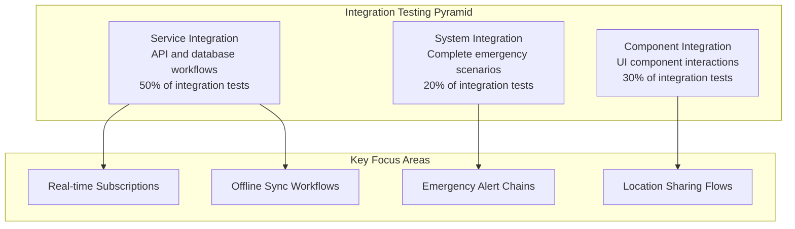

# Integration Testing

<Info>
**Workflow-Focused Testing:** Integration testing validates that safety-critical components work together seamlessly in real emergency scenarios. This level of testing ensures that the complete user journey functions reliably when lives depend on it.
</Info>

## Overview

Integration testing in safety applications focuses on testing complete workflows rather than isolated components. These tests validate that emergency alerts flow properly from trigger to contact notification, location sharing works across devices, and all safety features integrate correctly.

<CardGroup cols={2}>
  <Card title="Complete Workflows" icon="workflow">
    Test entire emergency scenarios from trigger to resolution including all stakeholders
  </Card>
  <Card title="Real-time Features" icon="bolt">
    Validate real-time subscriptions, live location sharing, and instant notifications
  </Card>
  <Card title="Cross-Device Testing" icon="mobile">
    Test emergency scenarios across multiple devices and platforms simultaneously
  </Card>
  <Card title="Third-Party Integration" icon="plug">
    Validate integrations with Supabase, Google Maps, SMS services, and push notifications
  </Card>
</CardGroup>

## Integration Testing Strategy

### Testing Levels



## Component Integration Testing

### Emergency Flow Integration

<Accordion title="Complete Emergency Alert Workflow">
This test validates the entire emergency alert process from trigger to contact notification, ensuring all components work together properly.

```typescript
// src/__tests__/integration/EmergencyAlertFlow.integration.test.tsx
import React from 'react';
import { render, fireEvent, waitFor } from '@testing-library/react-native';
import { TestProvider } from '../../test/TestProvider';
import { EmergencyScreen } from '../../screens/EmergencyScreen';
import { createTestUser, createTestContacts } from '../../test/factories';
import { supabase } from '../../services/supabase';
import { NotificationService } from '../../services/NotificationService';
import { LocationService } from '../../services/LocationService';

// Mock services but allow real interactions between components
jest.mock('../../services/NotificationService');
jest.mock('../../services/LocationService');

describe('Emergency Alert Flow Integration', () => {
  let mockNotificationService: jest.Mocked<typeof NotificationService>;
  let mockLocationService: jest.Mocked<typeof LocationService>;
  let testUser: any;
  let testContacts: any[];

  beforeEach(async () => {
    // Setup test data
    testUser = createTestUser();
    testContacts = createTestContacts(3);
    
    // Setup mocks
    mockNotificationService = NotificationService as jest.Mocked<typeof NotificationService>;
    mockLocationService = LocationService as jest.Mocked<typeof LocationService>;
    
    mockLocationService.getCurrentPosition.mockResolvedValue({
      latitude: 40.7128,
      longitude: -74.0060,
      accuracy: 10,
      timestamp: Date.now()
    });
    
    // Setup Supabase test state
    await supabase.auth.signInWithPassword({
      email: testUser.email,
      password: 'test-password'
    });
    
    // Insert test contacts
    await supabase.from('emergency_contacts').insert(
      testContacts.map(contact => ({
        ...contact,
        user_id: testUser.id
      }))
    );
  });

  afterEach(async () => {
    // Cleanup test data
    await supabase.from('emergency_alerts').delete().match({});
    await supabase.from('emergency_contacts').delete().match({});
    await supabase.auth.signOut();
  });

  it('should complete full emergency alert workflow within 5 seconds', async () => {
    const startTime = Date.now();
    
    const { getByTestId } = render(
      <TestProvider user={testUser}>
        <EmergencyScreen />
      </TestProvider>
    );

    // Step 1: Trigger emergency alert
    fireEvent.press(getByTestId('emergency-button'));

    // Step 2: Verify location capture
    await waitFor(() => {
      expect(mockLocationService.getCurrentPosition).toHaveBeenCalledWith({
        accuracy: 'high',
        timeout: 10000,
        maximumAge: 0
      });
    }, { timeout: 3000 });

    // Step 3: Verify database record creation
    await waitFor(async () => {
      const { data: alerts } = await supabase
        .from('emergency_alerts')
        .select('*')
        .eq('user_id', testUser.id)
        .eq('status', 'active');
      
      expect(alerts).toHaveLength(1);
      expect(alerts[0].location).toEqual({
        latitude: 40.7128,
        longitude: -74.0060,
        accuracy: 10
      });
    }, { timeout: 2000 });

    // Step 4: Verify contact notifications
    await waitFor(() => {
      testContacts.forEach((contact, index) => {
        expect(mockNotificationService.sendEmergencyNotification).toHaveBeenCalledWith({
          contactId: contact.id,
          alertId: expect.any(String),
          location: {
            latitude: 40.7128,
            longitude: -74.0060,
            accuracy: 10
          },
          priority: contact.priority
        });
      });
    }, { timeout: 2000 });

    // Step 5: Verify UI feedback
    expect(getByTestId('emergency-active-indicator')).toBeTruthy();
    expect(getByTestId('emergency-timer')).toBeTruthy();

    const totalTime = Date.now() - startTime;
    expect(totalTime).toBeLessThan(5000); // Complete workflow under 5 seconds
  });

  it('should handle offline emergency scenario', async () => {
    // Simulate offline condition
    jest.spyOn(global, 'fetch').mockRejectedValue(new Error('Network unavailable'));
    
    const { getByTestId } = render(
      <TestProvider user={testUser}>
        <EmergencyScreen />
      </TestProvider>
    );

    fireEvent.press(getByTestId('emergency-button'));

    // Should store emergency alert locally
    await waitFor(() => {
      expect(getByTestId('emergency-offline-indicator')).toBeTruthy();
    });

    // Verify local storage
    const pendingAlerts = await AsyncStorage.getItem('pending_emergency_alerts');
    expect(JSON.parse(pendingAlerts || '[]')).toHaveLength(1);

    // Simulate going back online
    jest.restoreAllMocks();
    
    // Trigger sync
    fireEvent.press(getByTestId('sync-button'));

    // Verify sync to database
    await waitFor(async () => {
      const { data: alerts } = await supabase
        .from('emergency_alerts')
        .select('*')
        .eq('user_id', testUser.id);
      
      expect(alerts).toHaveLength(1);
    });
  });

  it('should escalate when contacts do not respond', async () => {
    jest.useFakeTimers();
    
    const { getByTestId } = render(
      <TestProvider user={testUser}>
        <EmergencyScreen />
      </TestProvider>
    );

    // Trigger alert
    fireEvent.press(getByTestId('emergency-button'));

    await waitFor(() => {
      expect(getByTestId('emergency-active-indicator')).toBeTruthy();
    });

    // Simulate no contact response for 10 minutes
    act(() => {
      jest.advanceTimersByTime(10 * 60 * 1000);
    });

    // Should trigger escalation
    await waitFor(() => {
      expect(mockNotificationService.sendEscalationNotification).toHaveBeenCalled();
    });

    jest.useRealTimers();
  });
});
```
</Accordion>

### Location Sharing Integration

<CodeGroup>
```typescript Location Sharing Integration Tests
// src/__tests__/integration/LocationSharing.integration.test.tsx
import React from 'react';
import { render, fireEvent, waitFor } from '@testing-library/react-native';
import { TestProvider } from '../../test/TestProvider';
import { LocationSharingScreen } from '../../screens/LocationSharingScreen';
import { createTestUser, createTestContacts } from '../../test/factories';
import { supabase } from '../../services/supabase';

describe('Location Sharing Integration', () => {
  let testUser: any;
  let testContact: any;

  beforeEach(async () => {
    testUser = createTestUser();
    testContact = createTestContacts(1)[0];
    
    await supabase.auth.signInWithPassword({
      email: testUser.email,
      password: 'test-password'
    });
  });

  afterEach(async () => {
    await supabase.from('location_shares').delete().match({});
    await supabase.auth.signOut();
  });

  it('should create and sync location sharing session', async () => {
    const { getByTestId } = render(
      <TestProvider user={testUser}>
        <LocationSharingScreen />
      </TestProvider>
    );

    // Start location sharing
    fireEvent.press(getByTestId('start-location-sharing'));
    
    // Select contact
    fireEvent.press(getByTestId(`contact-${testContact.id}`));
    
    // Set duration
    fireEvent.press(getByTestId('duration-24h'));
    
    // Confirm sharing
    fireEvent.press(getByTestId('confirm-sharing'));

    // Verify database record
    await waitFor(async () => {
      const { data: shares } = await supabase
        .from('location_shares')
        .select('*')
        .eq('user_id', testUser.id)
        .eq('shared_with_user_id', testContact.id);
      
      expect(shares).toHaveLength(1);
      expect(shares[0].is_active).toBe(true);
      expect(new Date(shares[0].expires_at).getTime()).toBeGreaterThan(Date.now());
    });

    // Verify real-time subscription setup
    expect(getByTestId('location-sharing-active')).toBeTruthy();
    expect(getByTestId('sharing-status-indicator')).toBeTruthy();
  });

  it('should stop location sharing and cleanup', async () => {
    // First create an active sharing session
    const { data: share } = await supabase
      .from('location_shares')
      .insert({
        user_id: testUser.id,
        shared_with_user_id: testContact.id,
        permissions: ['location'],
        expires_at: new Date(Date.now() + 24 * 60 * 60 * 1000).toISOString(),
        is_active: true
      })
      .select()
      .single();

    const { getByTestId } = render(
      <TestProvider user={testUser}>
        <LocationSharingScreen />
      </TestProvider>
    );

    // Stop sharing
    fireEvent.press(getByTestId('stop-location-sharing'));
    fireEvent.press(getByTestId('confirm-stop'));

    // Verify database update
    await waitFor(async () => {
      const { data: updatedShare } = await supabase
        .from('location_shares')
        .select('*')
        .eq('id', share.id)
        .single();
      
      expect(updatedShare.is_active).toBe(false);
    });

    // Verify UI update
    expect(getByTestId('location-sharing-inactive')).toBeTruthy();
  });

  it('should handle permission changes', async () => {
    const { getByTestId } = render(
      <TestProvider user={testUser}>
        <LocationSharingScreen />
      </TestProvider>
    );

    // Create sharing session with basic permissions
    fireEvent.press(getByTestId('start-location-sharing'));
    fireEvent.press(getByTestId(`contact-${testContact.id}`));
    fireEvent.press(getByTestId('permissions-location-only'));
    fireEvent.press(getByTestId('confirm-sharing'));

    await waitFor(async () => {
      const { data: shares } = await supabase
        .from('location_shares')
        .select('*')
        .eq('user_id', testUser.id)
        .single();
      
      expect(shares.permissions).toEqual(['location']);
    });

    // Update permissions to include emergency alerts
    fireEvent.press(getByTestId('edit-permissions'));
    fireEvent.press(getByTestId('add-emergency-alerts'));
    fireEvent.press(getByTestId('save-permissions'));

    // Verify permission update
    await waitFor(async () => {
      const { data: updatedShare } = await supabase
        .from('location_shares')
        .select('*')
        .eq('user_id', testUser.id)
        .single();
      
      expect(updatedShare.permissions).toContain('emergency_alerts');
    });
  });
});
```
</CodeGroup>

## Service Integration Testing

### Supabase Real-time Integration

<Accordion title="Real-time Subscription Testing">
Testing real-time features requires simulating multi-user scenarios and validating that subscriptions work correctly under various conditions.

```typescript
// src/__tests__/integration/RealtimeSubscriptions.integration.test.ts
import { supabase } from '../../services/supabase';
import { RealtimeChannel } from '@supabase/supabase-js';
import { createTestUser, createTestEmergencyAlert } from '../../test/factories';

describe('Supabase Real-time Integration', () => {
  let testUser1: any;
  let testUser2: any;
  let channel: RealtimeChannel;

  beforeEach(async () => {
    testUser1 = createTestUser();
    testUser2 = createTestUser();
    
    // Setup users in database
    await supabase.from('users').insert([testUser1, testUser2]);
  });

  afterEach(async () => {
    if (channel) {
      await channel.unsubscribe();
    }
    
    await supabase.from('emergency_alerts').delete().match({});
    await supabase.from('users').delete().match({});
  });

  it('should receive emergency alert notifications in real-time', async () => {
    const receivedUpdates: any[] = [];
    
    // Setup real-time subscription
    channel = supabase
      .channel('emergency-alerts')
      .on('postgres_changes', {
        event: 'INSERT',
        schema: 'public',
        table: 'emergency_alerts',
        filter: `contacts_notified.cs.["${testUser2.id}"]`
      }, (payload) => {
        receivedUpdates.push(payload);
      })
      .subscribe();

    // Wait for subscription to be ready
    await new Promise(resolve => setTimeout(resolve, 1000));

    // Create emergency alert that notifies testUser2
    const emergencyAlert = createTestEmergencyAlert({
      user_id: testUser1.id,
      contacts_notified: [{ id: testUser2.id, notified_at: new Date().toISOString() }]
    });

    await supabase.from('emergency_alerts').insert(emergencyAlert);

    // Wait for real-time notification
    await waitFor(() => {
      expect(receivedUpdates).toHaveLength(1);
      expect(receivedUpdates[0].new.id).toBe(emergencyAlert.id);
    }, { timeout: 5000 });
  });

  it('should handle location updates in real-time', async () => {
    const locationUpdates: any[] = [];
    
    // Setup location sharing between users
    await supabase.from('location_shares').insert({
      user_id: testUser1.id,
      shared_with_user_id: testUser2.id,
      permissions: ['location'],
      expires_at: new Date(Date.now() + 24 * 60 * 60 * 1000).toISOString(),
      is_active: true
    });

    // Subscribe to location updates as testUser2
    channel = supabase
      .channel('location-updates')
      .on('postgres_changes', {
        event: 'INSERT',
        schema: 'public',
        table: 'location_updates',
        filter: `user_id=eq.${testUser1.id}`
      }, (payload) => {
        locationUpdates.push(payload);
      })
      .subscribe();

    await new Promise(resolve => setTimeout(resolve, 1000));

    // Insert location update for testUser1
    await supabase.from('location_updates').insert({
      user_id: testUser1.id,
      latitude: 40.7128,
      longitude: -74.0060,
      accuracy: 10,
      timestamp: new Date().toISOString()
    });

    // Verify real-time update received
    await waitFor(() => {
      expect(locationUpdates).toHaveLength(1);
      expect(locationUpdates[0].new.latitude).toBe(40.7128);
    }, { timeout: 5000 });
  });

  it('should handle subscription reconnection', async () => {
    const updates: any[] = [];
    
    channel = supabase
      .channel('test-reconnection')
      .on('postgres_changes', {
        event: 'INSERT',
        schema: 'public',
        table: 'emergency_alerts'
      }, (payload) => {
        updates.push(payload);
      })
      .subscribe();

    await new Promise(resolve => setTimeout(resolve, 1000));

    // Simulate connection loss and reconnection
    channel.socket.disconnect();
    
    // Wait for reconnection
    await new Promise(resolve => setTimeout(resolve, 2000));
    
    // Insert test data after reconnection
    const alert = createTestEmergencyAlert({ user_id: testUser1.id });
    await supabase.from('emergency_alerts').insert(alert);

    // Should receive update after reconnection
    await waitFor(() => {
      expect(updates).toHaveLength(1);
    }, { timeout: 10000 });
  });
});
```
</Accordion>

### Third-Party Service Integration

<CodeGroup>
```typescript Google Maps Integration Tests
// src/__tests__/integration/GoogleMapsIntegration.integration.test.ts
import { GoogleMapsService } from '../../services/GoogleMapsService';
import { LocationService } from '../../services/LocationService';

// Use real Google Maps API for integration testing
describe('Google Maps Integration', () => {
  let mapsService: GoogleMapsService;
  let locationService: LocationService;

  beforeEach(() => {
    mapsService = new GoogleMapsService();
    locationService = new LocationService();
  });

  it('should geocode address and get emergency services', async () => {
    const testAddress = '1600 Amphitheatre Parkway, Mountain View, CA';
    
    // Geocode address
    const coordinates = await mapsService.geocodeAddress(testAddress);
    
    expect(coordinates.latitude).toBeCloseTo(37.4224764, 4);
    expect(coordinates.longitude).toBeCloseTo(-122.0842499, 4);

    // Find nearby emergency services
    const emergencyServices = await mapsService.findNearbyEmergencyServices(coordinates);
    
    expect(emergencyServices.hospitals).toBeDefined();
    expect(emergencyServices.hospitals.length).toBeGreaterThan(0);
    expect(emergencyServices.police).toBeDefined();
    expect(emergencyServices.fire_stations).toBeDefined();

    // Verify emergency service data structure
    emergencyServices.hospitals.forEach(hospital => {
      expect(hospital).toHaveProperty('name');
      expect(hospital).toHaveProperty('location');
      expect(hospital).toHaveProperty('distance');
      expect(hospital.distance).toBeGreaterThan(0);
    });
  });

  it('should calculate safe routes', async () => {
    const origin = { latitude: 37.4224764, longitude: -122.0842499 };
    const destination = { latitude: 37.4419, longitude: -122.1430 };
    
    const routes = await mapsService.calculateRoutes(origin, destination, {
      avoidTolls: true,
      avoidHighways: false,
      includeSafetyData: true
    });

    expect(routes).toHaveLength.greaterThan(0);
    
    const primaryRoute = routes[0];
    expect(primaryRoute).toHaveProperty('duration');
    expect(primaryRoute).toHaveProperty('distance');
    expect(primaryRoute).toHaveProperty('polyline');
    expect(primaryRoute).toHaveProperty('safetyRating');
    
    // Verify safety rating is within expected range
    expect(primaryRoute.safetyRating).toBeGreaterThanOrEqual(1);
    expect(primaryRoute.safetyRating).toBeLessThanOrEqual(5);
  });

  it('should handle API rate limits gracefully', async () => {
    const requests = Array.from({ length: 50 }, (_, i) => 
      mapsService.geocodeAddress(`${i} Main Street, Anytown, USA`)
    );

    // Should handle rate limiting without throwing errors
    const results = await Promise.allSettled(requests);
    
    const fulfilled = results.filter(r => r.status === 'fulfilled');
    const rejected = results.filter(r => r.status === 'rejected');
    
    // Some requests should succeed, rate-limited requests should fail gracefully
    expect(fulfilled.length).toBeGreaterThan(0);
    
    // Rejected requests should have appropriate error messages
    rejected.forEach(result => {
      if (result.status === 'rejected') {
        expect(result.reason.message).toMatch(/rate limit|quota/i);
      }
    });
  });
});
```

```typescript SMS Service Integration Tests
// src/__tests__/integration/SMSIntegration.integration.test.ts
import { SMSService } from '../../services/SMSService';
import { createTestEmergencyContact } from '../../test/factories';

describe('SMS Service Integration', () => {
  let smsService: SMSService;
  let testContact: any;

  beforeEach(() => {
    smsService = new SMSService();
    testContact = createTestEmergencyContact({
      phone: process.env.TEST_PHONE_NUMBER // Use actual test phone number
    });
  });

  it('should send emergency SMS notification', async () => {
    const emergencyMessage = {
      contact: testContact,
      location: {
        latitude: 40.7128,
        longitude: -74.0060,
        accuracy: 10
      },
      alertId: 'test-alert-123',
      timestamp: new Date().toISOString()
    };

    const result = await smsService.sendEmergencyNotification(emergencyMessage);

    expect(result.success).toBe(true);
    expect(result.messageId).toBeDefined();
    expect(result.deliveryStatus).toBe('sent');

    // Verify message content
    expect(result.message).toContain('EMERGENCY ALERT');
    expect(result.message).toContain(testContact.name);
    expect(result.message).toContain('40.7128');
    expect(result.message).toContain('-74.0060');
  });

  it('should handle international phone numbers', async () => {
    const internationalContact = createTestEmergencyContact({
      phone: '+44 20 7946 0958' // UK number
    });

    const result = await smsService.sendEmergencyNotification({
      contact: internationalContact,
      location: { latitude: 51.5074, longitude: -0.1278, accuracy: 15 },
      alertId: 'test-alert-456',
      timestamp: new Date().toISOString()
    });

    expect(result.success).toBe(true);
    expect(result.internationalDelivery).toBe(true);
  });

  it('should handle SMS delivery failures', async () => {
    const invalidContact = createTestEmergencyContact({
      phone: '+1234567890' // Invalid phone number
    });

    const result = await smsService.sendEmergencyNotification({
      contact: invalidContact,
      location: { latitude: 40.7128, longitude: -74.0060, accuracy: 10 },
      alertId: 'test-alert-789',
      timestamp: new Date().toISOString()
    });

    expect(result.success).toBe(false);
    expect(result.error).toBeDefined();
    expect(result.error.code).toBe('INVALID_PHONE_NUMBER');
  });

  it('should respect SMS rate limits', async () => {
    const contacts = Array.from({ length: 10 }, () => 
      createTestEmergencyContact({ phone: process.env.TEST_PHONE_NUMBER })
    );

    const sendPromises = contacts.map(contact => 
      smsService.sendEmergencyNotification({
        contact,
        location: { latitude: 40.7128, longitude: -74.0060, accuracy: 10 },
        alertId: 'rate-limit-test',
        timestamp: new Date().toISOString()
      })
    );

    const results = await Promise.allSettled(sendPromises);
    
    // Should handle rate limiting gracefully
    const successful = results.filter(r => 
      r.status === 'fulfilled' && r.value.success
    );
    const rateLimited = results.filter(r => 
      r.status === 'fulfilled' && r.value.error?.code === 'RATE_LIMITED'
    );

    expect(successful.length + rateLimited.length).toBe(10);
    expect(successful.length).toBeGreaterThan(0); // At least some should succeed
  });
});
```
</CodeGroup>

## System Integration Testing

### Multi-Device Emergency Scenarios

<Accordion title="Cross-Device Emergency Testing">
System-level integration tests that simulate real emergency scenarios across multiple devices and users.

```typescript
// src/__tests__/integration/MultiDeviceEmergency.system.test.ts
import { TestDeviceSimulator } from '../../test/utils/TestDeviceSimulator';
import { createTestUser, createTestContacts } from '../../test/factories';
import { supabase } from '../../services/supabase';

describe('Multi-Device Emergency Scenarios', () => {
  let userDevice: TestDeviceSimulator;
  let contact1Device: TestDeviceSimulator;
  let contact2Device: TestDeviceSimulator;
  let testUser: any;
  let emergencyContacts: any[];

  beforeEach(async () => {
    // Setup test users and contacts
    testUser = createTestUser();
    emergencyContacts = createTestContacts(2);
    
    // Create device simulators
    userDevice = new TestDeviceSimulator('user-device', testUser);
    contact1Device = new TestDeviceSimulator('contact1-device', emergencyContacts[0]);
    contact2Device = new TestDeviceSimulator('contact2-device', emergencyContacts[1]);
    
    // Setup relationships
    await userDevice.addEmergencyContacts(emergencyContacts);
    await contact1Device.addContactRelationship(testUser);
    await contact2Device.addContactRelationship(testUser);
  });

  afterEach(async () => {
    await userDevice.cleanup();
    await contact1Device.cleanup();
    await contact2Device.cleanup();
  });

  it('should handle complete emergency scenario across devices', async () => {
    // Setup real-time listeners on contact devices
    const contact1Notifications: any[] = [];
    const contact2Notifications: any[] = [];
    
    contact1Device.onEmergencyAlert((alert) => {
      contact1Notifications.push(alert);
    });
    
    contact2Device.onEmergencyAlert((alert) => {
      contact2Notifications.push(alert);
    });

    // User triggers emergency alert
    const alertResult = await userDevice.triggerEmergencyAlert({
      type: 'manual',
      location: { latitude: 40.7128, longitude: -74.0060, accuracy: 10 }
    });

    expect(alertResult.success).toBe(true);

    // Verify contacts receive notifications within 5 seconds
    await waitFor(() => {
      expect(contact1Notifications).toHaveLength(1);
      expect(contact2Notifications).toHaveLength(1);
    }, { timeout: 5000 });

    // Verify notification content
    const contact1Alert = contact1Notifications[0];
    expect(contact1Alert.user_id).toBe(testUser.id);
    expect(contact1Alert.location.latitude).toBe(40.7128);
    expect(contact1Alert.alert_type).toBe('manual');

    // Contact 1 acknowledges the alert
    await contact1Device.acknowledgeEmergencyAlert(contact1Alert.id);

    // Verify acknowledgment is recorded
    await waitFor(async () => {
      const { data: alert } = await supabase
        .from('emergency_alerts')
        .select('acknowledgments')
        .eq('id', contact1Alert.id)
        .single();
      
      expect(alert.acknowledgments).toContainEqual({
        contact_id: emergencyContacts[0].id,
        acknowledged_at: expect.any(String)
      });
    });

    // User cancels alert
    await userDevice.cancelEmergencyAlert(alertResult.alertId);

    // Verify contacts receive cancellation
    await waitFor(() => {
      expect(contact1Device.getLastNotification().type).toBe('alert_cancelled');
      expect(contact2Device.getLastNotification().type).toBe('alert_cancelled');
    }, { timeout: 3000 });
  });

  it('should handle location sharing across devices', async () => {
    const contact1LocationUpdates: any[] = [];
    
    // Setup location sharing
    await userDevice.startLocationSharing({
      contactId: emergencyContacts[0].id,
      duration: 2 * 60 * 60 * 1000, // 2 hours
      permissions: ['location', 'emergency_alerts']
    });

    // Contact subscribes to location updates
    contact1Device.onLocationUpdate(testUser.id, (update) => {
      contact1LocationUpdates.push(update);
    });

    // User moves to new location
    await userDevice.updateLocation({
      latitude: 40.7589,
      longitude: -73.9851,
      accuracy: 8
    });

    // Verify contact receives location update
    await waitFor(() => {
      expect(contact1LocationUpdates).toHaveLength(1);
      expect(contact1LocationUpdates[0].latitude).toBe(40.7589);
    }, { timeout: 3000 });

    // User stops location sharing
    await userDevice.stopLocationSharing(emergencyContacts[0].id);

    // Move again - contact should not receive update
    await userDevice.updateLocation({
      latitude: 40.7505,
      longitude: -73.9934,
      accuracy: 12
    });

    // Wait to ensure no new updates
    await new Promise(resolve => setTimeout(resolve, 2000));
    expect(contact1LocationUpdates).toHaveLength(1); // Still only the first update
  });

  it('should handle offline-online scenarios', async () => {
    // User goes offline
    await userDevice.setNetworkState(false);

    // Trigger emergency while offline
    const alertResult = await userDevice.triggerEmergencyAlert({
      type: 'manual',
      location: { latitude: 40.7128, longitude: -74.0060, accuracy: 10 }
    });

    expect(alertResult.success).toBe(true);
    expect(alertResult.storedLocally).toBe(true);

    // Contacts should not receive notification yet
    await new Promise(resolve => setTimeout(resolve, 2000));
    expect(contact1Device.getNotificationCount()).toBe(0);

    // User comes back online
    await userDevice.setNetworkState(true);

    // Trigger sync
    await userDevice.syncPendingData();

    // Contacts should now receive the emergency notification
    await waitFor(() => {
      expect(contact1Device.getNotificationCount()).toBe(1);
      expect(contact2Device.getNotificationCount()).toBe(1);
    }, { timeout: 10000 });
  });
});
```
</Accordion>

## Performance Integration Testing

### Load Testing for Real-time Features

<CodeGroup>
```typescript Real-time Performance Tests
// src/__tests__/integration/RealtimePerformance.integration.test.ts
import { supabase } from '../../services/supabase';
import { createTestUsers } from '../../test/factories';
import { measureExecutionTime, measureMemoryUsage } from '../../test/utils/performance';

describe('Real-time Performance Integration', () => {
  it('should handle 100 concurrent emergency alerts', async () => {
    const testUsers = createTestUsers(100);
    
    // Setup users
    await supabase.from('users').insert(testUsers);

    // Measure performance of concurrent alerts
    const { result: alerts, memoryDelta } = await measureMemoryUsage(async () => {
      const alertPromises = testUsers.map(async (user, index) => {
        return supabase.from('emergency_alerts').insert({
          user_id: user.id,
          alert_type: 'manual',
          status: 'active',
          location: {
            latitude: 40.7128 + (index * 0.001),
            longitude: -74.0060 + (index * 0.001),
            accuracy: 10
          },
          timestamp: new Date().toISOString()
        });
      });

      return Promise.all(alertPromises);
    });

    // Verify all alerts were created successfully
    expect(alerts.every(result => result.error === null)).toBe(true);

    // Memory usage should be reasonable (less than 50MB for 100 alerts)
    expect(memoryDelta).toBeLessThan(50 * 1024 * 1024);

    // Cleanup
    await supabase.from('emergency_alerts').delete().match({});
    await supabase.from('users').delete().match({});
  });

  it('should maintain real-time performance under load', async () => {
    const channels: any[] = [];
    const receivedUpdates: any[] = [];
    
    try {
      // Create 50 concurrent real-time subscriptions
      for (let i = 0; i < 50; i++) {
        const channel = supabase
          .channel(`test-channel-${i}`)
          .on('postgres_changes', {
            event: 'INSERT',
            schema: 'public',
            table: 'emergency_alerts'
          }, (payload) => {
            receivedUpdates.push({
              channelId: i,
              timestamp: Date.now(),
              data: payload
            });
          })
          .subscribe();
        
        channels.push(channel);
      }

      // Wait for all subscriptions to be ready
      await new Promise(resolve => setTimeout(resolve, 2000));

      // Insert test alert and measure delivery time
      const insertTime = Date.now();
      
      await supabase.from('emergency_alerts').insert({
        user_id: 'load-test-user',
        alert_type: 'manual',
        status: 'active',
        location: { latitude: 40.7128, longitude: -74.0060, accuracy: 10 },
        timestamp: new Date().toISOString()
      });

      // Wait for all subscriptions to receive the update
      await waitFor(() => {
        expect(receivedUpdates).toHaveLength(50);
      }, { timeout: 10000 });

      // Calculate delivery times
      const deliveryTimes = receivedUpdates.map(update => 
        update.timestamp - insertTime
      );

      // 95% of updates should be delivered within 2 seconds
      const sortedTimes = deliveryTimes.sort((a, b) => a - b);
      const p95Time = sortedTimes[Math.floor(sortedTimes.length * 0.95)];
      expect(p95Time).toBeLessThan(2000);

      console.log(`P95 delivery time: ${p95Time}ms`);
      console.log(`Average delivery time: ${deliveryTimes.reduce((a, b) => a + b) / deliveryTimes.length}ms`);

    } finally {
      // Cleanup all channels
      await Promise.all(channels.map(channel => channel.unsubscribe()));
    }
  });
});
```
</CodeGroup>

## Data Consistency Integration Testing

### Database Transaction Testing

<Accordion title="ACID Compliance Testing">
Testing database transactions and data consistency in emergency scenarios where data integrity is critical.

```typescript
// src/__tests__/integration/DatabaseConsistency.integration.test.ts
import { supabase } from '../../services/supabase';
import { createTestUser, createTestEmergencyAlert } from '../../test/factories';

describe('Database Consistency Integration', () => {
  it('should maintain data consistency during concurrent emergency alerts', async () => {
    const testUser = createTestUser();
    await supabase.from('users').insert(testUser);

    // Create 10 concurrent emergency alerts for the same user
    const alertPromises = Array.from({ length: 10 }, (_, index) =>
      supabase.from('emergency_alerts').insert({
        user_id: testUser.id,
        alert_type: 'manual',
        status: 'active',
        location: {
          latitude: 40.7128 + (index * 0.0001),
          longitude: -74.0060 + (index * 0.0001),
          accuracy: 10
        },
        sequence_number: index + 1,
        timestamp: new Date(Date.now() + index * 1000).toISOString()
      })
    );

    const results = await Promise.allSettled(alertPromises);

    // All inserts should succeed
    expect(results.every(r => r.status === 'fulfilled')).toBe(true);

    // Verify all alerts exist with correct sequence
    const { data: alerts } = await supabase
      .from('emergency_alerts')
      .select('sequence_number')
      .eq('user_id', testUser.id)
      .order('sequence_number');

    expect(alerts).toHaveLength(10);
    expect(alerts.map(a => a.sequence_number)).toEqual([1, 2, 3, 4, 5, 6, 7, 8, 9, 10]);
  });

  it('should handle emergency alert cancellation with proper cleanup', async () => {
    const testUser = createTestUser();
    const testAlert = createTestEmergencyAlert({ user_id: testUser.id });
    
    await supabase.from('users').insert(testUser);
    
    // Insert emergency alert
    const { data: insertedAlert } = await supabase
      .from('emergency_alerts')
      .insert(testAlert)
      .select()
      .single();

    // Create related records
    await supabase.from('alert_acknowledgments').insert([
      { alert_id: insertedAlert.id, contact_id: 'contact-1', acknowledged_at: new Date().toISOString() },
      { alert_id: insertedAlert.id, contact_id: 'contact-2', acknowledged_at: new Date().toISOString() }
    ]);

    await supabase.from('alert_notifications').insert([
      { alert_id: insertedAlert.id, contact_id: 'contact-1', sent_at: new Date().toISOString() },
      { alert_id: insertedAlert.id, contact_id: 'contact-2', sent_at: new Date().toISOString() }
    ]);

    // Cancel alert (should update status and preserve related data)
    await supabase
      .from('emergency_alerts')
      .update({ 
        status: 'cancelled',
        cancelled_at: new Date().toISOString(),
        cancellation_reason: 'user_cancelled'
      })
      .eq('id', insertedAlert.id);

    // Verify alert is cancelled but related data preserved
    const { data: cancelledAlert } = await supabase
      .from('emergency_alerts')
      .select('*')
      .eq('id', insertedAlert.id)
      .single();

    expect(cancelledAlert.status).toBe('cancelled');
    expect(cancelledAlert.cancelled_at).toBeDefined();

    // Related data should still exist
    const { data: acknowledgments } = await supabase
      .from('alert_acknowledgments')
      .select('*')
      .eq('alert_id', insertedAlert.id);

    const { data: notifications } = await supabase
      .from('alert_notifications')
      .select('*')
      .eq('alert_id', insertedAlert.id);

    expect(acknowledgments).toHaveLength(2);
    expect(notifications).toHaveLength(2);
  });

  it('should handle location sharing permission changes atomically', async () => {
    const testUser = createTestUser();
    const testContact = createTestUser();
    
    await supabase.from('users').insert([testUser, testContact]);

    // Create location sharing relationship
    const { data: share } = await supabase
      .from('location_shares')
      .insert({
        user_id: testUser.id,
        shared_with_user_id: testContact.id,
        permissions: ['location'],
        expires_at: new Date(Date.now() + 24 * 60 * 60 * 1000).toISOString(),
        is_active: true
      })
      .select()
      .single();

    // Atomically update permissions and log the change
    const { error } = await supabase.rpc('update_sharing_permissions', {
      share_id: share.id,
      new_permissions: ['location', 'emergency_alerts'],
      change_reason: 'user_requested'
    });

    expect(error).toBeNull();

    // Verify permissions updated
    const { data: updatedShare } = await supabase
      .from('location_shares')
      .select('permissions')
      .eq('id', share.id)
      .single();

    expect(updatedShare.permissions).toEqual(['location', 'emergency_alerts']);

    // Verify change was logged
    const { data: logs } = await supabase
      .from('permission_change_logs')
      .select('*')
      .eq('share_id', share.id);

    expect(logs).toHaveLength(1);
    expect(logs[0].old_permissions).toEqual(['location']);
    expect(logs[0].new_permissions).toEqual(['location', 'emergency_alerts']);
  });
});
```
</Accordion>

## Testing Infrastructure

### Test Environment Management

<CodeGroup>
```typescript Test Environment Setup
// src/test/TestEnvironment.ts
import { supabase } from '../services/supabase';

export class TestEnvironment {
  private static instance: TestEnvironment;
  private isSetup = false;

  static getInstance(): TestEnvironment {
    if (!TestEnvironment.instance) {
      TestEnvironment.instance = new TestEnvironment();
    }
    return TestEnvironment.instance;
  }

  async setup(): Promise<void> {
    if (this.isSetup) return;

    // Setup test database with fresh schema
    await this.resetDatabase();
    await this.seedTestData();
    
    this.isSetup = true;
  }

  async cleanup(): Promise<void> {
    if (!this.isSetup) return;

    await this.clearTestData();
    this.isSetup = false;
  }

  private async resetDatabase(): Promise<void> {
    // Clear all test data but preserve schema
    const tables = [
      'emergency_alerts',
      'location_updates',
      'location_shares',
      'emergency_contacts',
      'users'
    ];

    for (const table of tables) {
      await supabase.from(table).delete().neq('id', '00000000-0000-0000-0000-000000000000');
    }
  }

  private async seedTestData(): Promise<void> {
    // Insert any required seed data for testing
    await supabase.from('system_config').upsert([
      { key: 'max_emergency_contacts', value: '10' },
      { key: 'alert_timeout_minutes', value: '30' },
      { key: 'location_accuracy_threshold', value: '50' }
    ]);
  }

  private async clearTestData(): Promise<void> {
    await this.resetDatabase();
  }

  async createIsolatedTest(): Promise<TestSession> {
    return new TestSession();
  }
}

export class TestSession {
  private createdData: { table: string; id: string }[] = [];

  async createUser(userData: any): Promise<any> {
    const { data: user } = await supabase
      .from('users')
      .insert(userData)
      .select()
      .single();
    
    this.createdData.push({ table: 'users', id: user.id });
    return user;
  }

  async createEmergencyAlert(alertData: any): Promise<any> {
    const { data: alert } = await supabase
      .from('emergency_alerts')
      .insert(alertData)
      .select()
      .single();
    
    this.createdData.push({ table: 'emergency_alerts', id: alert.id });
    return alert;
  }

  async cleanup(): Promise<void> {
    // Clean up in reverse order to handle foreign key constraints
    for (const item of this.createdData.reverse()) {
      await supabase.from(item.table).delete().eq('id', item.id);
    }
    this.createdData = [];
  }
}
```
</CodeGroup>

## Best Practices for Integration Testing

### Guidelines for Safety-Critical Integration Testing

<Steps>
  <Step title="Test Complete Workflows">
    Always test entire user journeys rather than just component interactions
  </Step>
  <Step title="Use Real Services">
    Test against actual Supabase instances and third-party services when possible
  </Step>
  <Step title="Simulate Real Conditions">
    Include network latency, offline scenarios, and device constraints in tests
  </Step>
  <Step title="Validate Data Consistency">
    Ensure emergency data maintains integrity across all system components
  </Step>
</Steps>

### Common Integration Testing Pitfalls

<Warning>
**Avoid These Integration Testing Mistakes:**
- Testing only happy paths in emergency scenarios
- Not testing real-time features under load
- Ignoring cross-device and multi-user scenarios
- Skipping offline-to-online sync testing
- Not validating third-party service integrations
- Missing data consistency validation during concurrent operations
</Warning>

---

## Next Steps

<Note>
**Testing Progression:** Integration testing validates that components work together correctly. The next step is end-to-end testing to validate complete user scenarios from start to finish.
</Note>

<CardGroup cols={3}>
  <Card title="End-to-End Testing" icon="monitor" href="/development/e2e-testing">
    Learn how to implement comprehensive E2E testing for complete emergency scenarios
  </Card>
  <Card title="Performance Testing" icon="zap" href="/development/performance-testing">
    Validate system performance under stress and emergency conditions
  </Card>
  <Card title="Testing Strategy" icon="strategy" href="/development/testing-strategy">
    Review the overall testing strategy and how integration testing fits
  </Card>
</CardGroup>

<Info>
**Integration Testing Success:** Focus on testing the critical paths that users will take during emergency situations. Every integration test should answer "Does this workflow keep users safe?"
</Info>