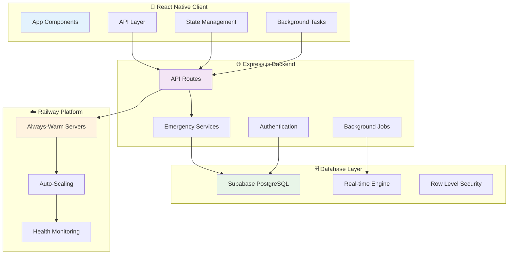
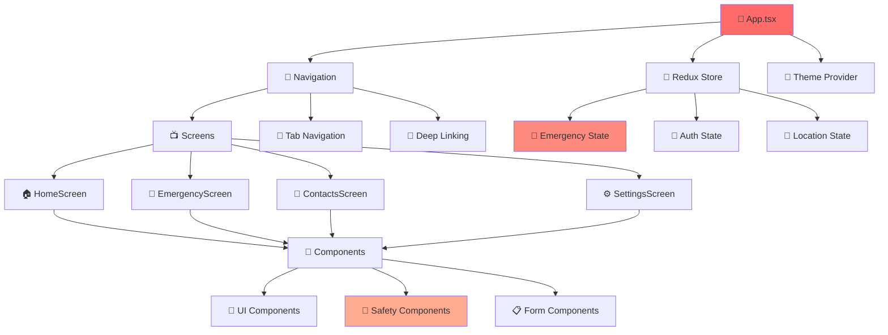
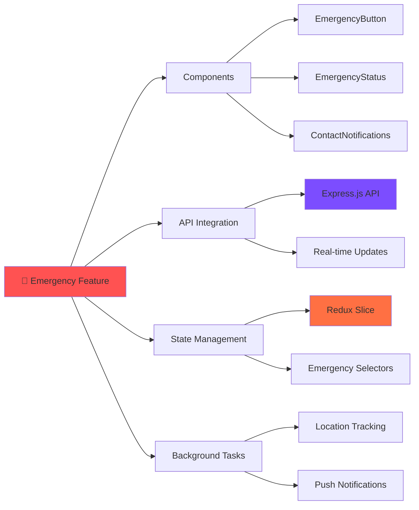
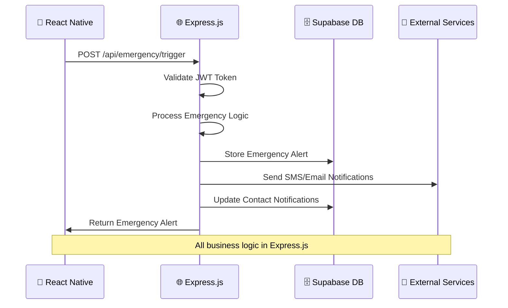
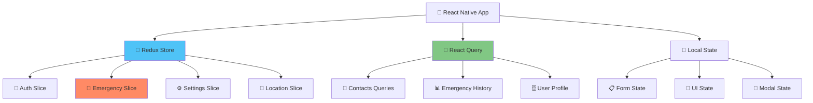
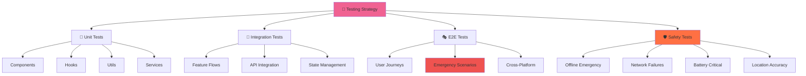

# Project Structure 🏗️

<Info>
**Enterprise-Grade Safety Architecture:** Shelther follows a production-ready structure with clear separation between React Native client, Express.js backend, and Supabase database - designed for 99.9% uptime and safety-critical reliability.
</Info>

## Architecture Overview



<CardGroup cols={3}>
  <Card title="🎯 Separation of Concerns" icon="layers">
    **Client:** UI, state management, background tasks  
    **Backend:** Business logic, authentication, emergency processing  
    **Database:** Data storage, real-time subscriptions, security
  </Card>
  <Card title="⚡ Performance First" icon="zap">
    **Always-warm servers** eliminate cold starts  
    **Optimized bundles** with tree-shaking  
    **Efficient state management** with minimal re-renders
  </Card>
  <Card title="🛡️ Safety Architecture" icon="shield">
    **Critical features isolated** in dedicated modules  
    **100% test coverage** for emergency functions  
    **Graceful degradation** for non-critical failures
  </Card>
</CardGroup>

## 📁 Complete Project Structure

### React Native Client Structure

<CodeGroup>
```bash Mobile App Structure (shelther-mobile/)
shelther-mobile/
├── 📁 .expo/                          # Expo development cache
├── 📁 .vscode/                        # VS Code workspace settings
├── 📁 assets/                         # 🎨 Static assets
│   ├── 📁 images/
│   │   ├── 📁 icons/                  # UI icons & app icons
│   │   ├── 📁 emergency/              # Emergency visuals
│   │   ├── 📁 onboarding/             # Onboarding screens
│   │   └── 📁 illustrations/          # Safety illustrations
│   ├── 📁 fonts/                      # Custom typography
│   ├── 📁 sounds/                     # 🔊 Audio alerts
│   │   ├── emergency-alert.mp3
│   │   ├── check-in-reminder.mp3
│   │   └── panic-button.mp3
│   └── 📁 animations/                 # Lottie animations
├── 📁 src/                           # 🧠 Application source
│   ├── 📁 components/                 # Reusable UI components
│   ├── 📁 screens/                    # Screen components
│   ├── 📁 features/                   # Feature modules
│   ├── 📁 api/                        # Express.js API layer
│   ├── 📁 hooks/                      # Custom React hooks
│   ├── 📁 store/                      # Redux state management
│   ├── 📁 utils/                      # Utility functions
│   ├── 📁 types/                      # TypeScript definitions
│   ├── 📁 constants/                  # App constants
│   └── 📁 styles/                     # Global styles
├── 📄 app.json                       # Expo configuration
├── 📄 eas.json                       # Build configuration
├── 📄 package.json                   # Dependencies & scripts
└── 📄 tsconfig.json                  # TypeScript config
```

```bash Express.js Backend Structure (shelther-backend/)
shelther-backend/
├── 📁 src/
│   ├── 📁 routes/                     # 🛣️ API endpoints
│   │   ├── auth.ts                    # Authentication routes
│   │   ├── emergency.ts               # Emergency alert routes
│   │   ├── location.ts                # Location tracking routes
│   │   ├── contacts.ts                # Emergency contacts routes
│   │   └── health.ts                  # Health check routes
│   ├── 📁 services/                   # 🔧 Business logic
│   │   ├── EmergencyService.ts        # Emergency alert processing
│   │   ├── LocationService.ts         # Location tracking service
│   │   ├── NotificationService.ts     # Multi-channel notifications
│   │   ├── AuthService.ts             # Authentication service
│   │   └── CheckInService.ts          # Check-in monitoring
│   ├── 📁 middleware/                 # 🛡️ Express middleware
│   │   ├── auth.ts                    # JWT authentication
│   │   ├── validation.ts              # Request validation
│   │   ├── rateLimiting.ts            # Rate limiting
│   │   └── errorHandler.ts            # Error handling
│   ├── 📁 config/                     # ⚙️ Configuration
│   │   ├── database.ts                # PostgreSQL connection
│   │   ├── supabase.ts                # Supabase client
│   │   └── railway.ts                 # Railway deployment
│   ├── 📁 jobs/                       # ⏰ Background jobs
│   │   ├── CheckInMonitor.ts          # Check-in monitoring
│   │   ├── LocationCleanup.ts         # Data cleanup
│   │   └── HealthCheck.ts             # System health
│   ├── 📁 utils/                      # 🛠️ Utilities
│   │   ├── logger.ts                  # Structured logging
│   │   ├── errors.ts                  # Custom error classes
│   │   └── validators.ts              # Data validation
│   └── 📁 types/                      # 📝 TypeScript types
├── 📄 package.json                   # Backend dependencies
├── 📄 tsconfig.json                  # TypeScript config
├── 📄 railway.json                   # Railway deployment
└── 📄 Dockerfile                     # Docker configuration
```
</CodeGroup>

### Database Structure

<Steps>
  <Step title="🗄️ PostgreSQL Schema">
    Supabase provides the PostgreSQL database with spatial queries, real-time subscriptions, and RLS security
  </Step>
  <Step title="📊 Migration System">
    Version-controlled database schema changes with rollback capability
  </Step>
  <Step title="🔐 Security Policies">
    Row Level Security policies protecting user data and emergency information
  </Step>
  <Step title="⚡ Real-time Features">
    WebSocket-based real-time updates for location sharing and emergency alerts
  </Step>
</Steps>

## 🏗️ Client Architecture Deep Dive

### Component Organization

<Note>
**Component Hierarchy:** Components organized by complexity and reusability - from basic UI elements to complex safety-specific components.
</Note>



<CardGroup cols={2}>
  <Card title="🔘 UI Components" icon="palette">
    **Basic building blocks:** Button, Input, Card, Modal, Loading  
    **Reusable across features:** Consistent design system  
    **Accessibility first:** Screen reader support, high contrast
  </Card>
  <Card title="🚨 Safety Components" icon="shield-check">
    **Emergency-specific:** EmergencyButton, LocationSharing, CheckInReminder  
    **Critical isolation:** Separate testing and review processes  
    **Performance optimized:** Sub-100ms response times
  </Card>
</CardGroup>

<Accordion title="Component Directory Structure">
```bash
src/components/
├── 📁 ui/                             # 🎨 Basic UI components
│   ├── 📁 Button/
│   │   ├── Button.tsx                 # Main component
│   │   ├── Button.test.tsx            # Unit tests
│   │   ├── Button.stories.tsx         # Storybook stories
│   │   ├── types.ts                   # TypeScript interfaces
│   │   ├── styles.ts                  # Component styles
│   │   └── index.ts                   # Export file
│   ├── 📁 Input/
│   ├── 📁 Card/
│   ├── 📁 Modal/
│   └── 📁 Loading/
├── 📁 safety/                         # 🚨 Safety-critical components
│   ├── 📁 EmergencyButton/
│   │   ├── EmergencyButton.tsx        # Main emergency trigger
│   │   ├── EmergencyCountdown.tsx     # Countdown timer
│   │   ├── DuressMode.tsx             # Silent alert mode
│   │   ├── types.ts                   # Emergency types
│   │   ├── hooks.ts                   # Emergency hooks
│   │   └── index.ts
│   ├── 📁 LocationSharing/
│   ├── 📁 CheckInReminder/
│   └── 📁 SafetyStatus/
├── 📁 forms/                          # 📋 Form components
│   ├── 📁 ContactForm/
│   ├── 📁 EmergencyContactForm/
│   └── 📁 SettingsForm/
└── 📁 navigation/                     # 🧭 Navigation components
    ├── 📁 TabBar/
    ├── 📁 HeaderActions/
    └── 📁 DrawerContent/
```

**Component Template:**
```typescript
// src/components/safety/EmergencyButton/EmergencyButton.tsx
import React, { useState, useCallback } from 'react';
import { Pressable, Text, View, Haptics } from 'react-native';
import { useEmergencyAlert } from '@/features/emergency';
import { useLocationTracking } from '@/features/location';
import { EmergencyCountdown } from './EmergencyCountdown';
import { styles } from './styles';
import type { EmergencyButtonProps } from './types';

export const EmergencyButton: React.FC<EmergencyButtonProps> = ({
  type = 'manual',
  countdown = 10,
  onTrigger,
  onCancel,
  disabled = false,
  style,
}) => {
  const [isPressed, setIsPressed] = useState(false);
  const [showCountdown, setShowCountdown] = useState(false);
  const { triggerEmergency, isTriggering } = useEmergencyAlert();
  const { getCurrentLocation } = useLocationTracking();

  const handlePress = useCallback(async () => {
    if (disabled || isTriggering) return;

    // Haptic feedback for emergency activation
    Haptics.impactAsync(Haptics.ImpactFeedbackStyle.Heavy);
    
    setShowCountdown(true);
  }, [disabled, isTriggering]);

  const handleCountdownComplete = useCallback(async () => {
    try {
      const location = await getCurrentLocation();
      
      const alert = await triggerEmergency({
        type,
        location,
        timestamp: new Date().toISOString(),
      });

      onTrigger?.(alert);
      setShowCountdown(false);
    } catch (error) {
      console.error('Emergency trigger failed:', error);
      setShowCountdown(false);
    }
  }, [type, triggerEmergency, getCurrentLocation, onTrigger]);

  const handleCountdownCancel = useCallback(() => {
    setShowCountdown(false);
    onCancel?.();
  }, [onCancel]);

  if (showCountdown) {
    return (
      <EmergencyCountdown
        duration={countdown}
        onComplete={handleCountdownComplete}
        onCancel={handleCountdownCancel}
      />
    );
  }

  return (
    <Pressable
      style={[
        styles.emergencyButton,
        isPressed && styles.pressed,
        disabled && styles.disabled,
        style,
      ]}
      onPress={handlePress}
      onPressIn={() => setIsPressed(true)}
      onPressOut={() => setIsPressed(false)}
      disabled={disabled}
      testID="emergency-button"
      accessibilityRole="button"
      accessibilityLabel="Emergency Alert Button"
      accessibilityHint="Double tap to trigger emergency alert"
    >
      <View style={styles.buttonContent}>
        <Text style={styles.buttonText}>
          {isTriggering ? 'TRIGGERING...' : 'EMERGENCY'}
        </Text>
        <Text style={styles.subText}>Tap to Alert Contacts</Text>
      </View>
    </Pressable>
  );
};
```
</Accordion>

### Feature-Based Architecture

<Warning>
**Safety Feature Isolation:** Critical emergency features are completely isolated to prevent accidental modifications and ensure clear ownership boundaries.
</Warning>



<CodeGroup>
```bash Feature Module Structure
src/features/
├── 📁 emergency/                      # 🚨 Emergency management
│   ├── 📁 components/                 # UI components
│   │   ├── EmergencyButton/
│   │   ├── EmergencyCountdown/
│   │   ├── EmergencyHistory/
│   │   └── EmergencyStatus/
│   ├── 📁 api/                        # Express.js API integration
│   │   ├── emergencyAPI.ts            # API client methods
│   │   ├── types.ts                   # API request/response types
│   │   └── index.ts
│   ├── 📁 hooks/                      # React hooks
│   │   ├── useEmergencyAlert.ts
│   │   ├── useEmergencyContacts.ts
│   │   └── useEmergencyHistory.ts
│   ├── 📁 store/                      # Redux state
│   │   ├── emergencySlice.ts
│   │   ├── selectors.ts
│   │   └── index.ts
│   ├── 📁 utils/                      # Utilities
│   │   ├── emergencyValidation.ts
│   │   └── emergencyFormatters.ts
│   └── index.ts                       # Public API
├── 📁 location/                       # 📍 Location services
├── 📁 contacts/                       # 👥 Contact management
├── 📁 notifications/                  # 🔔 Notifications
├── 📁 checkins/                      # ⏰ Check-in system
├── 📁 auth/                          # 🔐 Authentication
└── 📁 settings/                      # ⚙️ User settings
```

```typescript API Integration Layer
// src/features/emergency/api/emergencyAPI.ts
import { apiClient } from '@/api/client';
import type { 
  EmergencyAlert, 
  CreateEmergencyRequest, 
  EmergencyContact 
} from './types';

class EmergencyAPI {
  private baseURL = '/api/emergency';

  async createEmergencyAlert(data: CreateEmergencyRequest): Promise<EmergencyAlert> {
    const response = await apiClient.post<EmergencyAlert>(
      `${this.baseURL}/trigger`,
      data
    );
    return response.data;
  }

  async cancelEmergencyAlert(alertId: string): Promise<void> {
    await apiClient.patch(`${this.baseURL}/${alertId}/cancel`);
  }

  async getEmergencyHistory(userId: string): Promise<EmergencyAlert[]> {
    const response = await apiClient.get<EmergencyAlert[]>(
      `${this.baseURL}/history/${userId}`
    );
    return response.data;
  }

  async getEmergencyContacts(userId: string): Promise<EmergencyContact[]> {
    const response = await apiClient.get<EmergencyContact[]>(
      `/api/contacts/${userId}/emergency`
    );
    return response.data;
  }

  async updateAlertStatus(
    alertId: string, 
    status: 'resolved' | 'false_alarm'
  ): Promise<EmergencyAlert> {
    const response = await apiClient.patch<EmergencyAlert>(
      `${this.baseURL}/${alertId}/status`,
      { status }
    );
    return response.data;
  }
}

export const emergencyAPI = new EmergencyAPI();

// src/features/emergency/hooks/useEmergencyAlert.ts
import { useCallback } from 'react';
import { useAppDispatch, useAppSelector } from '@/store';
import { emergencyAPI } from '../api';
import { emergencySlice } from '../store';
import type { CreateEmergencyRequest } from '../api/types';

export const useEmergencyAlert = () => {
  const dispatch = useAppDispatch();
  const { activeAlert, isLoading, error } = useAppSelector(
    state => state.emergency
  );

  const triggerEmergency = useCallback(async (
    request: CreateEmergencyRequest
  ) => {
    dispatch(emergencySlice.actions.setLoading(true));
    
    try {
      const alert = await emergencyAPI.createEmergencyAlert(request);
      dispatch(emergencySlice.actions.setActiveAlert(alert));
      return alert;
    } catch (error) {
      dispatch(emergencySlice.actions.setError(error.message));
      throw error;
    } finally {
      dispatch(emergencySlice.actions.setLoading(false));
    }
  }, [dispatch]);

  const cancelEmergency = useCallback(async (alertId: string) => {
    await emergencyAPI.cancelEmergencyAlert(alertId);
    dispatch(emergencySlice.actions.clearActiveAlert());
  }, [dispatch]);

  return {
    activeAlert,
    isLoading,
    error,
    triggerEmergency,
    cancelEmergency,
  };
};
```
</CodeGroup>

## 🔗 API Integration Architecture

### Express.js Backend Communication

<Note>
**Centralized Backend:** All business logic, authentication, and external service integrations happen in the Express.js backend, not directly in the mobile client.
</Note>



<CardGroup cols={2}>
  <Card title="🎯 Client Responsibilities" icon="mobile">
    **UI/UX:** User interface and interactions  
    **State Management:** Local app state with Redux  
    **Background Tasks:** Location tracking, push notifications  
    **Offline Support:** Cache critical data locally
  </Card>
  <Card title="⚙️ Backend Responsibilities" icon="server">
    **Business Logic:** Emergency processing, validation  
    **Authentication:** JWT tokens, session management  
    **External Services:** SMS, email, third-party APIs  
    **Database Operations:** All CRUD operations
  </Card>
</CardGroup>

<CodeGroup>
```typescript API Client Configuration
// src/api/client.ts
import axios, { AxiosInstance, AxiosRequestConfig } from 'axios';
import { tokenManager } from '@/features/auth';
import { config } from '@/constants';

class APIClient {
  private client: AxiosInstance;
  
  constructor() {
    this.client = axios.create({
      baseURL: config.api.baseURL, // Railway Express.js backend
      timeout: config.api.timeout,
      headers: {
        'Content-Type': 'application/json',
        'X-Client-Version': config.app.version,
      },
    });

    this.setupInterceptors();
  }

  private setupInterceptors() {
    // Request interceptor - add JWT token
    this.client.interceptors.request.use(
      async (config) => {
        const token = await tokenManager.getAccessToken();
        if (token) {
          config.headers.Authorization = `Bearer ${token}`;
        }
        return config;
      },
      (error) => Promise.reject(error)
    );

    // Response interceptor - handle auth errors
    this.client.interceptors.response.use(
      (response) => response,
      async (error) => {
        if (error.response?.status === 401) {
          // Token expired, try to refresh
          const refreshed = await tokenManager.refreshToken();
          if (refreshed) {
            // Retry original request
            return this.client.request(error.config);
          } else {
            // Redirect to login
            await tokenManager.clearTokens();
            // Handle logout logic
          }
        }
        return Promise.reject(error);
      }
    );
  }

  async get<T>(url: string, config?: AxiosRequestConfig): Promise<T> {
    const response = await this.client.get(url, config);
    return response.data;
  }

  async post<T>(url: string, data?: any, config?: AxiosRequestConfig): Promise<T> {
    const response = await this.client.post(url, data, config);
    return response.data;
  }

  async patch<T>(url: string, data?: any, config?: AxiosRequestConfig): Promise<T> {
    const response = await this.client.patch(url, data, config);
    return response.data;
  }

  async delete<T>(url: string, config?: AxiosRequestConfig): Promise<T> {
    const response = await this.client.delete(url, config);
    return response.data;
  }
}

export const apiClient = new APIClient();
```

```typescript Real-time Integration
// src/features/emergency/api/realtime.ts
import { createClient } from '@supabase/supabase-js';
import { config } from '@/constants';
import type { EmergencyAlert } from './types';

class EmergencyRealtimeService {
  private supabase;
  private subscription: any;

  constructor() {
    this.supabase = createClient(
      config.supabase.url,
      config.supabase.anonKey
    );
  }

  subscribeToEmergencyUpdates(
    userId: string,
    onUpdate: (alert: EmergencyAlert) => void
  ) {
    this.subscription = this.supabase
      .channel('emergency-updates')
      .on(
        'postgres_changes',
        {
          event: '*',
          schema: 'public',
          table: 'emergency_alerts',
          filter: `user_id=eq.${userId}`,
        },
        (payload) => {
          if (payload.eventType === 'INSERT' || payload.eventType === 'UPDATE') {
            onUpdate(payload.new as EmergencyAlert);
          }
        }
      )
      .subscribe();

    return () => {
      this.subscription?.unsubscribe();
    };
  }

  subscribeToLocationSharing(
    contactIds: string[],
    onLocationUpdate: (location: any) => void
  ) {
    const channels = contactIds.map(contactId => 
      this.supabase
        .channel(`location-${contactId}`)
        .on(
          'postgres_changes',
          {
            event: 'INSERT',
            schema: 'public',
            table: 'location_updates',
            filter: `user_id=eq.${contactId}`,
          },
          (payload) => {
            onLocationUpdate(payload.new);
          }
        )
        .subscribe()
    );

    return () => {
      channels.forEach(channel => channel.unsubscribe());
    };
  }
}

export const emergencyRealtimeService = new EmergencyRealtimeService();
```
</CodeGroup>

## 📊 State Management Architecture

### Redux Toolkit + React Query

<Steps>
  <Step title="🏪 Redux for App State">
    Global application state like authentication, user preferences, and current emergency status
  </Step>
  <Step title="🔄 React Query for Server State">
    Server data caching, background updates, and optimistic updates for API operations
  </Step>
  <Step title="📱 Local State for UI">
    Component-level state for forms, modals, and temporary UI interactions
  </Step>
  <Step title="💾 Offline State">
    Critical data cached locally for offline emergency functionality
  </Step>
</Steps>



<CardGroup cols={3}>
  <Card title="🏪 Redux Store" icon="database">
    **Global App State:** Authentication, emergency status, user settings  
    **Persistent:** Survives app restarts with redux-persist  
    **Predictable:** Time-travel debugging with Redux DevTools
  </Card>
  <Card title="🔄 React Query" icon="refresh-cw">
    **Server State:** API data caching and synchronization  
    **Background Updates:** Automatic data refresh and invalidation  
    **Optimistic Updates:** Instant UI feedback with rollback capability
  </Card>
  <Card title="💾 Offline Support" icon="wifi-off">
    **Critical Data Cached:** Emergency contacts, user profile, last known location  
    **Queue System:** Offline actions queued and synced when online  
    **Graceful Degradation:** Core safety features work without internet
  </Card>
</CardGroup>

## 🧪 Testing Architecture

### Comprehensive Testing Strategy

<Warning>
**Safety-Critical Testing:** Emergency and safety features require 100% test coverage with specialized testing scenarios including offline conditions, network failures, and edge cases.
</Warning>



<Accordion title="Testing Directory Structure">
```bash
__tests__/
├── 📁 unit/                          # 🔬 Unit tests (95% coverage)
│   ├── 📁 components/
│   │   ├── EmergencyButton.test.tsx   # Critical component testing
│   │   ├── LocationSharing.test.tsx
│   │   └── ContactForm.test.tsx
│   ├── 📁 hooks/
│   │   ├── useEmergencyAlert.test.ts  # Hook behavior testing
│   │   ├── useLocation.test.ts
│   │   └── useAuth.test.ts
│   ├── 📁 api/
│   │   ├── emergencyAPI.test.ts       # API client testing
│   │   ├── locationAPI.test.ts
│   │   └── authAPI.test.ts
│   └── 📁 utils/
│       ├── validators.test.ts
│       └── formatters.test.ts
├── 📁 integration/                   # 🔗 Integration tests
│   ├── 📁 features/
│   │   ├── emergency-flow.test.tsx    # Complete feature testing
│   │   ├── location-sharing.test.tsx
│   │   └── contact-management.test.tsx
│   ├── 📁 store/
│   │   ├── emergency-store.test.ts    # Redux integration
│   │   └── auth-store.test.ts
│   └── 📁 api/
│       └── backend-integration.test.ts
├── 📁 e2e/                          # 🎭 End-to-end tests
│   ├── 📁 emergency/
│   │   ├── trigger-emergency.e2e.ts   # Critical user journeys
│   │   ├── cancel-emergency.e2e.ts
│   │   └── emergency-contacts.e2e.ts
│   ├── 📁 onboarding/
│   │   └── complete-setup.e2e.ts
│   └── 📁 settings/
│       └── safety-preferences.e2e.ts
├── 📁 safety/                       # 🛡️ Safety-specific tests
│   ├── offline-emergency.test.ts     # Offline functionality
│   ├── network-failures.test.ts     # Network resilience
│   ├── battery-critical.test.ts     # Low battery scenarios
│   ├── location-accuracy.test.ts    # GPS accuracy testing
│   └── notification-delivery.test.ts # Alert delivery testing
├── 📁 __mocks__/                    # 🎭 Global mocks
│   ├── @react-native-async-storage/
│   ├── expo-location/
│   ├── expo-notifications/
│   └── axios/
├── 📁 fixtures/                     # 📊 Test data
│   ├── users.ts
│   ├── emergencyAlerts.ts
│   ├── locations.ts
│   └── contacts.ts
├── 📁 helpers/                      # 🛠️ Test utilities
│   ├── renderWithProviders.tsx      # React Testing Library wrapper
│   ├── mockAPI.ts                   # API mocking utilities
│   ├── testStore.ts                 # Redux store for testing
│   └── emergencyHelpers.ts          # Emergency testing utilities
└── setup.ts                        # Test environment setup
```

**Safety Testing Example:**
```typescript
// __tests__/safety/offline-emergency.test.ts
import { renderHook, act } from '@testing-library/react-hooks';
import { useEmergencyAlert } from '@/features/emergency';
import { apiClient } from '@/api/client';
import { mockLocation, mockEmergencyContacts } from '../fixtures';

// Mock network conditions
jest.mock('@react-native-community/netinfo', () => ({
  useNetInfo: () => ({ isConnected: false }),
}));

describe('Offline Emergency Functionality', () => {
  beforeEach(() => {
    // Clear all mocks
    jest.clearAllMocks();
    
    // Mock AsyncStorage for offline data
    jest.spyOn(require('@react-native-async-storage/async-storage'), 'setItem')
      .mockResolvedValue(undefined);
  });

  test('should trigger emergency alert while offline', async () => {
    const { result } = renderHook(() => useEmergencyAlert());

    await act(async () => {
      const alert = await result.current.triggerEmergency({
        type: 'manual',
        message: 'Test offline emergency',
      });

      expect(alert).toBeDefined();
      expect(alert.status).toBe('active');
    });

    // Verify offline storage
    expect(require('@react-native-async-storage/async-storage').setItem)
      .toHaveBeenCalledWith(
        expect.stringMatching(/emergency_alert_/),
        expect.any(String)
      );
  });

  test('should queue notifications for when online', async () => {
    const mockSMSQueue = jest.spyOn(require('@/services/notifications'), 'queueSMS');
    
    const { result } = renderHook(() => useEmergencyAlert());

    await act(async () => {
      await result.current.triggerEmergency({
        type: 'panic',
        location: mockLocation,
      });
    });

    expect(mockSMSQueue).toHaveBeenCalledWith(
      expect.objectContaining({
        type: 'emergency_alert',
        contacts: expect.any(Array),
        location: mockLocation,
      })
    );
  });

  test('should maintain location tracking during offline emergency', async () => {
    const mockLocationService = jest.spyOn(
      require('@/services/location'), 
      'startContinuousTracking'
    );

    const { result } = renderHook(() => useEmergencyAlert());

    await act(async () => {
      await result.current.triggerEmergency({ type: 'manual' });
    });

    expect(mockLocationService).toHaveBeenCalledWith({
      highAccuracy: true,
      interval: 30000, // 30 seconds
      storeLocally: true, // Store offline
    });
  });
});
```
</Accordion>

## ⚙️ Configuration Management

### Environment-Specific Settings

<Note>
**Security First:** All sensitive configuration stored in environment variables with different settings for development, staging, and production environments.
</Note>

<CardGroup cols={3}>
  <Card title="🔧 Development" icon="code">
    **Debug Mode:** Enabled with verbose logging  
    **Mock Services:** Optional API mocking  
    **Hot Reload:** Fast development iteration
  </Card>
  <Card title="🧪 Staging" icon="test-tube">
    **Production-like:** Same architecture as production  
    **Test Data:** Safe test environment  
    **Performance Testing:** Load testing environment
  </Card>
  <Card title="🚀 Production" icon="rocket">
    **Optimized:** Minified bundles, tree-shaking  
    **Monitoring:** Full analytics and error tracking  
    **Security:** All security features enabled
  </Card>
</CardGroup>

<CodeGroup>
```typescript Configuration Management
// src/constants/config.ts
interface AppConfig {
  app: {
    name: string;
    version: string;
    environment: 'development' | 'staging' | 'production';
  };
  api: {
    baseURL: string;        // Railway Express.js backend
    timeout: number;
    retryAttempts: number;
  };
  supabase: {
    url: string;           // Direct Supabase for real-time
    anonKey: string;
  };
  features: {
    crashReporting: boolean;
    analytics: boolean;
    debugMode: boolean;
    offlineMode: boolean;
  };
  safety: {
    emergencyTimeoutSeconds: number;
    locationAccuracyMeters: number;
    maxEmergencyContacts: number;
    autoEscalationMinutes: number;
  };
}

const createConfig = (): AppConfig => {
  const environment = process.env.EXPO_PUBLIC_APP_ENV as AppConfig['app']['environment'] || 'development';
  const isDevelopment = environment === 'development';
  
  return {
    app: {
      name: 'Shelther',
      version: process.env.EXPO_PUBLIC_APP_VERSION || '1.0.0',
      environment,
    },
    api: {
      baseURL: process.env.EXPO_PUBLIC_API_BASE_URL || 'http://localhost:3000',
      timeout: isDevelopment ? 15000 : 8000,
      retryAttempts: isDevelopment ? 1 : 3,
    },
    supabase: {
      url: process.env.EXPO_PUBLIC_SUPABASE_URL!,
      anonKey: process.env.EXPO_PUBLIC_SUPABASE_ANON_KEY!,
    },
    features: {
      crashReporting: !isDevelopment,
      analytics: !isDevelopment,
      debugMode: isDevelopment,
      offlineMode: true,
    },
    safety: {
      emergencyTimeoutSeconds: 10,
      locationAccuracyMeters: 10,
      maxEmergencyContacts: 5,
      autoEscalationMinutes: 30,
    },
  };
};

export const config = createConfig();

// Validate required environment variables
const requiredEnvVars = [
  'EXPO_PUBLIC_API_BASE_URL',
  'EXPO_PUBLIC_SUPABASE_URL',
  'EXPO_PUBLIC_SUPABASE_ANON_KEY',
];

for (const envVar of requiredEnvVars) {
  if (!process.env[envVar]) {
    throw new Error(`❌ Missing required environment variable: ${envVar}`);
  }
}
```

```json Environment Files
// .env.development
EXPO_PUBLIC_APP_ENV=development
EXPO_PUBLIC_API_BASE_URL=http://localhost:3000
EXPO_PUBLIC_SUPABASE_URL=https://your-project.supabase.co
EXPO_PUBLIC_SUPABASE_ANON_KEY=your-anon-key
EXPO_PUBLIC_APP_VERSION=1.0.0-dev

// .env.staging  
EXPO_PUBLIC_APP_ENV=staging
EXPO_PUBLIC_API_BASE_URL=https://shelther-staging.railway.app
EXPO_PUBLIC_SUPABASE_URL=https://your-project.supabase.co
EXPO_PUBLIC_SUPABASE_ANON_KEY=your-anon-key
EXPO_PUBLIC_APP_VERSION=1.0.0-staging

// .env.production
EXPO_PUBLIC_APP_ENV=production
EXPO_PUBLIC_API_BASE_URL=https://shelther-api.railway.app
EXPO_PUBLIC_SUPABASE_URL=https://your-project.supabase.co
EXPO_PUBLIC_SUPABASE_ANON_KEY=your-anon-key
EXPO_PUBLIC_APP_VERSION=1.0.0
```
</CodeGroup>

## 🚀 Best Practices Summary

### Safety-Critical Development Guidelines

<Steps>
  <Step title="🔒 Security First">
    Never store sensitive data in client code, use environment variables, implement proper authentication flows
  </Step>
  <Step title="🧪 Test Everything">
    100% coverage for safety features, offline testing, network failure scenarios, edge case validation
  </Step>
  <Step title="📊 Monitor Performance">
    Track emergency response times, location accuracy, notification delivery rates, battery usage
  </Step>
  <Step title="🛡️ Graceful Degradation">
    Core safety features work offline, fallback mechanisms for service failures, clear user feedback
  </Step>
</Steps>

<CardGroup cols={2}>
  <Card title="✅ Do This" icon="check-circle">
    **Isolate safety features** in dedicated modules  
    **Use TypeScript strictly** with no `any` types  
    **Test offline scenarios** for all critical features  
    **Document complex logic** especially emergency flows  
    **Monitor performance** of safety-critical operations
  </Card>
  <Card title="❌ Avoid This" icon="x-circle">
    **Direct database access** from client code  
    **Storing secrets** in client-side code  
    **Skipping tests** for emergency functionality  
    **Complex state mutations** without proper validation  
    **Ignoring offline scenarios** in safety features
  </Card>
</CardGroup>

---

## 🎯 Next Steps

<CardGroup cols={3}>
  <Card title="🏗️ Backend Setup" icon="server" href="/development/express-setup">
    Set up your Express.js backend with Railway deployment and Supabase integration
  </Card>
  <Card title="📱 Component Development" icon="components" href="/development/component-development">
    Build React Native components with proper testing and accessibility support
  </Card>
  <Card title="🧪 Testing Strategy" icon="test-tube" href="/development/testing-strategy">
    Implement comprehensive testing for safety-critical mobile applications
  </Card>
</CardGroup>

<Info>
**Architecture Foundation:** This structure provides a scalable, maintainable foundation for building safety-critical applications with clear separation of concerns and comprehensive testing coverage.
</Info>