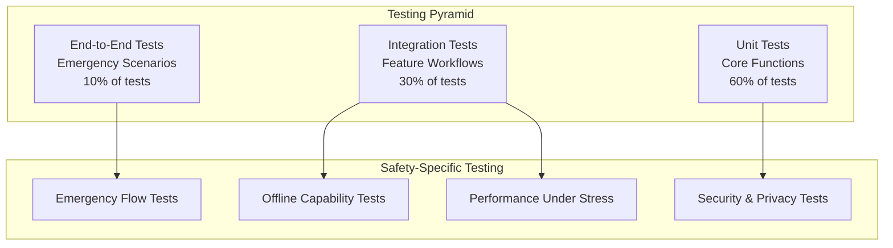

# Testing Strategy

<Info>
**Safety-First Testing:** Testing safety-critical applications requires specialized approaches that go beyond standard mobile app testing. Our strategy prioritizes reliability, emergency scenario coverage, and user safety above all else.
</Info>

## Testing Philosophy

For safety applications like Shelther, testing isn't just about preventing bugs—it's about ensuring life-critical features work flawlessly when users need them most.

<CardGroup cols={2}>
  <Card title="Zero-Tolerance Approach" icon="shield-alert">
    Emergency features must achieve 99.9% reliability with comprehensive edge case coverage
  </Card>
  <Card title="Real-World Simulation" icon="globe">
    Testing scenarios mirror actual emergency situations and stress conditions
  </Card>
  <Card title="Continuous Validation" icon="refresh">
    Automated testing runs on every commit with safety-specific validation rules
  </Card>
  <Card title="User-Centric Focus" icon="users">
    Testing scenarios based on real user feedback and emergency response data
  </Card>
</CardGroup>

## Testing Pyramid for Safety Apps

Our testing strategy follows a modified testing pyramid optimized for safety-critical features:



## Testing Categories

### 1. Unit Testing (60% Coverage Target)

<Accordion title="Core Function Testing">
**Critical Safety Functions:**
- Location accuracy and error handling
- Emergency alert triggers and validation
- Contact notification systems
- Data encryption and security
- Offline data persistence

**Testing Approach:**
```typescript
// Example: Emergency alert unit tests
describe('EmergencyAlertService', () => {
  describe('triggerAlert', () => {
    it('should capture location within 3 seconds', async () => {
      const startTime = Date.now();
      const alert = await emergencyService.triggerAlert();
      const duration = Date.now() - startTime;
      
      expect(duration).toBeLessThan(3000);
      expect(alert.location).toBeDefined();
      expect(alert.location.accuracy).toBeLessThan(50); // 50m accuracy
    });
    
    it('should work offline', async () => {
      // Simulate offline condition
      jest.spyOn(NetInfo, 'fetch').mockResolvedValue({
        isConnected: false,
        isInternetReachable: false
      });
      
      const alert = await emergencyService.triggerAlert();
      
      expect(alert.status).toBe('pending_sync');
      expect(AsyncStorage.getItem).toHaveBeenCalledWith('pending_alerts');
    });
  });
});
```
</Accordion>

<Accordion title="State Management Testing">
**Redux Store Testing:**
- Emergency state transitions
- Location sharing permissions
- Contact management actions
- Offline data synchronization

**React Query Testing:**
- Cache invalidation during emergencies
- Optimistic updates for safety features
- Error retry mechanisms
- Background sync behavior
</Accordion>

### 2. Integration Testing (30% Coverage Target)

<Steps>
  <Step title="Feature Workflow Testing">
    Test complete user journeys including happy paths and error scenarios for all safety features
  </Step>
  <Step title="API Integration Testing">
    Validate Supabase real-time subscriptions, authentication flows, and data consistency
  </Step>
  <Step title="Third-Party Service Testing">
    Test Google Maps integration, SMS services, and push notification delivery
  </Step>
  <Step title="Cross-Platform Testing">
    Ensure feature parity and performance consistency between iOS and Android
  </Step>
</Steps>

<CodeGroup>
```typescript Integration Test Example
// Emergency flow integration test
describe('Emergency Alert Flow', () => {
  beforeEach(async () => {
    await setupTestEnvironment();
    await authenticateTestUser();
  });

  it('should complete full emergency alert workflow', async () => {
    const mockContacts = await setupMockContacts();
    
    // Step 1: Trigger emergency
    const { getByTestId } = render(<EmergencyScreen />);
    fireEvent.press(getByTestId('emergency-button'));
    
    // Step 2: Verify location capture
    await waitFor(() => {
      expect(LocationService.getCurrentPosition).toHaveBeenCalled();
    });
    
    // Step 3: Verify database update
    await waitFor(() => {
      expect(supabase.from('emergency_alerts').insert).toHaveBeenCalled();
    });
    
    // Step 4: Verify contact notifications
    await waitFor(() => {
      mockContacts.forEach(contact => {
        expect(NotificationService.sendToContact).toHaveBeenCalledWith(contact.id);
      });
    });
    
    // Step 5: Verify UI feedback
    expect(getByTestId('emergency-active-indicator')).toBeTruthy();
  });
});
```

```typescript Offline Integration Test
// Offline functionality integration
describe('Offline Emergency Features', () => {
  it('should handle emergency alerts when offline', async () => {
    // Simulate offline state
    mockNetworkState({ isConnected: false });
    
    const { getByTestId } = render(<EmergencyScreen />);
    fireEvent.press(getByTestId('emergency-button'));
    
    // Verify local storage
    await waitFor(() => {
      expect(AsyncStorage.setItem).toHaveBeenCalledWith(
        expect.stringMatching(/pending_alert_/),
        expect.any(String)
      );
    });
    
    // Simulate going back online
    mockNetworkState({ isConnected: true });
    
    // Verify sync
    await waitFor(() => {
      expect(SyncService.syncPendingAlerts).toHaveBeenCalled();
    });
  });
});
```
</CodeGroup>

### 3. End-to-End Testing (10% Coverage Target)

<CardGroup cols={2}>
  <Card title="Critical User Journeys" icon="route">
    Complete emergency scenarios from trigger to resolution including all stakeholders
  </Card>
  <Card title="Cross-Device Testing" icon="mobile">
    Multi-device scenarios where contacts receive and respond to emergency alerts
  </Card>
  <Card title="Performance Testing" icon="zap">
    System behavior under stress with multiple concurrent emergency situations
  </Card>
  <Card title="Accessibility Testing" icon="accessibility">
    Emergency features work with screen readers and accessibility tools
  </Card>
</CardGroup>

## Safety-Critical Testing Patterns

### Emergency Scenario Testing

<Warning>
**Critical Testing Requirements:** Every emergency scenario must be tested with multiple failure modes and edge cases to ensure reliable operation when lives depend on it.
</Warning>

<CodeGroup>
```typescript Emergency Scenario Matrix
const emergencyScenarios = [
  {
    name: 'Basic Emergency Alert',
    triggers: ['button_press', 'voice_command', 'shake_gesture'],
    conditions: ['normal', 'low_battery', 'poor_signal'],
    expectations: {
      locationCapture: '< 3 seconds',
      notificationDelivery: '< 5 seconds',
      uiResponse: '< 1 second'
    }
  },
  {
    name: 'Offline Emergency',
    triggers: ['button_press'],
    conditions: ['no_internet', 'no_cellular', 'airplane_mode'],
    expectations: {
      localStorage: 'immediate',
      autoSync: 'when_connected',
      smsFailover: 'if_available'
    }
  },
  {
    name: 'Battery Critical Emergency',
    triggers: ['button_press'],
    conditions: ['battery_5_percent', 'power_save_mode'],
    expectations: {
      reducedAccuracy: 'acceptable',
      prioritizedNotifications: 'emergency_only',
      extendedOperation: '> 10 minutes'
    }
  }
];

// Automated scenario testing
emergencyScenarios.forEach(scenario => {
  describe(`Emergency Scenario: ${scenario.name}`, () => {
    scenario.triggers.forEach(trigger => {
      scenario.conditions.forEach(condition => {
        it(`should handle ${trigger} under ${condition}`, async () => {
          await simulateCondition(condition);
          const result = await triggerEmergency(trigger);
          
          Object.entries(scenario.expectations).forEach(([metric, expected]) => {
            expect(result[metric]).toMeetExpectation(expected);
          });
        });
      });
    });
  });
});
```
</CodeGroup>

### Performance Stress Testing

<Accordion title="Load Testing Scenarios">
**High-Stress Conditions:**
- Multiple simultaneous emergency alerts
- Large emergency contact networks (50+ contacts)
- Extended location tracking sessions (8+ hours)
- Background operation with multiple apps

**Performance Benchmarks:**
- Emergency alert processing: &lt;3 seconds end-to-end
- Location accuracy: &gt;95% within 10 meters
- Battery usage: &lt;15% drain per hour of active monitoring
- Memory usage: &lt;150MB average, &lt;200MB peak
</Accordion>

## Automated Testing Infrastructure

### Continuous Integration Pipeline

<Steps>
  <Step title="Pre-Commit Hooks">
    ESLint, Prettier, TypeScript compilation, and basic safety checks run before each commit
  </Step>
  <Step title="Pull Request Testing">
    Full test suite including integration tests and basic emergency scenarios
  </Step>
  <Step title="Staging Deployment">
    Comprehensive testing with real devices and actual emergency contact networks
  </Step>
  <Step title="Production Deployment">
    Phased rollout with monitoring and instant rollback capabilities
  </Step>
</Steps>

<CodeGroup>
```yaml GitHub Actions Workflow
name: Safety App Testing Pipeline

on:
  pull_request:
    branches: [main]
  push:
    branches: [main]

jobs:
  unit-tests:
    runs-on: ubuntu-latest
    steps:
      - uses: actions/checkout@v4
      - uses: actions/setup-node@v4
        with:
          node-version: '18'
          cache: 'npm'
      
      - name: Install dependencies
        run: npm ci
      
      - name: Run unit tests
        run: npm run test:unit -- --coverage
      
      - name: Safety-critical test validation
        run: npm run test:safety-critical
        
      - name: Upload coverage
        uses: codecov/codecov-action@v3

  integration-tests:
    runs-on: ubuntu-latest
    needs: unit-tests
    steps:
      - uses: actions/checkout@v4
      
      - name: Start test services
        run: |
          docker-compose up -d supabase-test
          npm run test:wait-for-services
      
      - name: Run integration tests
        run: npm run test:integration
        env:
          SUPABASE_TEST_URL: ${{ secrets.SUPABASE_TEST_URL }}
          SUPABASE_TEST_KEY: ${{ secrets.SUPABASE_TEST_KEY }}

  e2e-tests:
    runs-on: ubuntu-latest
    needs: integration-tests
    steps:
      - uses: actions/checkout@v4
      
      - name: Build test app
        run: |
          npm run build:test
          npx expo export:web
      
      - name: Run emergency scenario tests
        run: npm run test:e2e:emergency
        
      - name: Performance benchmark tests
        run: npm run test:performance
```
</CodeGroup>

### Device Testing Strategy

<CardGroup cols={3}>
  <Card title="Physical Device Testing" icon="smartphone">
    Critical emergency features tested on real devices with various OS versions and hardware configurations
  </Card>
  <Card title="Simulator Testing" icon="computer">
    Rapid iteration testing for UI components and basic functionality
  </Card>
  <Card title="Cloud Device Testing" icon="cloud">
    Automated testing across hundreds of device configurations using Firebase Test Lab
  </Card>
</CardGroup>

## Quality Assurance Processes

### Code Quality Gates

<Note>
**Safety Code Standards:** All safety-critical code must pass enhanced quality gates including peer review, security analysis, and performance validation.
</Note>

| Quality Gate | Threshold | Safety-Critical |
|--------------|-----------|----------------|
| **Test Coverage** | &gt;80% overall | &gt;95% emergency features |
| **Performance** | &lt;2s startup | &lt;1s emergency response |
| **Security Scan** | Zero high-risk | Zero vulnerabilities |
| **Accessibility** | WCAG 2.1 AA | Emergency features 100% |
| **Code Review** | 1+ approver | 2+ approvers |

### Testing Environment Management

<Accordion title="Environment Configuration">
**Development Environment:**
- Local Supabase instance with test data
- Mock emergency contacts and scenarios
- Simulated location services
- Debug logging enabled

**Staging Environment:**
- Production-like Supabase setup
- Real device testing capabilities
- Limited emergency contact testing
- Performance monitoring enabled

**Production Environment:**
- Live monitoring and alerting
- Real-time error tracking
- Performance metrics collection
- A/B testing for non-critical features
</Accordion>

## Test Data Management

### Safety Test Scenarios

<CodeGroup>
```typescript Test Data Factory
// Emergency contact test data
export const createTestEmergencyContact = (overrides = {}) => ({
  id: uuid(),
  name: 'Test Emergency Contact',
  phone: '+1234567890',
  email: 'test@example.com',
  relationship: 'family',
  priority: 1,
  verified: true,
  ...overrides
});

// Emergency alert test data
export const createTestEmergencyAlert = (overrides = {}) => ({
  id: uuid(),
  user_id: 'test-user-id',
  alert_type: 'manual',
  status: 'active',
  location: {
    latitude: 40.7128,
    longitude: -74.0060,
    accuracy: 10
  },
  timestamp: new Date().toISOString(),
  contacts_notified: [],
  evidence: [],
  ...overrides
});

// Location sharing test data
export const createTestLocationShare = (overrides = {}) => ({
  id: uuid(),
  user_id: 'test-user-id',
  shared_with_user_id: 'test-contact-id',
  permissions: ['location', 'emergency_alerts'],
  expires_at: new Date(Date.now() + 24 * 60 * 60 * 1000).toISOString(),
  is_active: true,
  ...overrides
});
```

```typescript Mock Services
// Mock location service for testing
export const mockLocationService = {
  getCurrentPosition: jest.fn(() => Promise.resolve({
    coords: {
      latitude: 40.7128,
      longitude: -74.0060,
      accuracy: 10,
      altitude: null,
      altitudeAccuracy: null,
      heading: null,
      speed: null
    },
    timestamp: Date.now()
  })),
  
  watchPosition: jest.fn((callback) => {
    const watchId = setInterval(() => {
      callback({
        coords: {
          latitude: 40.7128 + (Math.random() - 0.5) * 0.001,
          longitude: -74.0060 + (Math.random() - 0.5) * 0.001,
          accuracy: 10 + Math.random() * 20
        },
        timestamp: Date.now()
      });
    }, 1000);
    return watchId;
  }),
  
  clearWatch: jest.fn((watchId) => {
    clearInterval(watchId);
  })
};
```
</CodeGroup>

## Monitoring & Metrics

### Test Metrics Dashboard

<CardGroup cols={2}>
  <Card title="Test Execution Metrics" icon="chart-bar">
    Track test success rates, execution times, and failure patterns across all test categories
  </Card>
  <Card title="Emergency Feature Reliability" icon="shield-check">
    Monitor specific metrics for emergency alert success rate and response times
  </Card>
  <Card title="Performance Benchmarks" icon="zap">
    Track app performance metrics including startup time and emergency response speed
  </Card>
  <Card title="Quality Trends" icon="trending-up">
    Long-term quality metrics showing improvement or degradation over time
  </Card>
</CardGroup>

### Real-Time Test Monitoring

<CodeGroup>
```typescript Test Metrics Collection
// Custom test reporter for safety metrics
export class SafetyTestReporter {
  onRunComplete(contexts: Set<Context>, results: AggregatedResult) {
    const safetyMetrics = this.extractSafetyMetrics(results);
    
    // Report to monitoring service
    this.reportMetrics({
      timestamp: new Date().toISOString(),
      totalTests: results.numTotalTests,
      passedTests: results.numPassedTests,
      failedTests: results.numFailedTests,
      emergencyTestsPassed: safetyMetrics.emergencyTests.passed,
      emergencyTestsFailed: safetyMetrics.emergencyTests.failed,
      averageEmergencyResponseTime: safetyMetrics.averageResponseTime,
      coverage: {
        overall: results.coverageMap.getCoverageSummary().toJSON(),
        emergencyFeatures: safetyMetrics.emergencyCoverage
      }
    });
    
    // Alert on emergency test failures
    if (safetyMetrics.emergencyTests.failed > 0) {
      this.sendAlert({
        level: 'critical',
        message: `${safetyMetrics.emergencyTests.failed} emergency tests failed`,
        details: safetyMetrics.failureDetails
      });
    }
  }
}
```
</CodeGroup>

## Best Practices for Safety Testing

### Testing Guidelines

<Steps>
  <Step title="Test Emergency Scenarios First">
    Always prioritize testing emergency features and edge cases over general app functionality
  </Step>
  <Step title="Use Real-World Data">
    Test with realistic location data, contact networks, and usage patterns
  </Step>
  <Step title="Simulate Stress Conditions">
    Test under low battery, poor network, and high-stress user scenarios
  </Step>
  <Step title="Validate Accessibility">
    Ensure emergency features work with screen readers and accessibility tools
  </Step>
</Steps>

### Common Testing Pitfalls

<Warning>
**Avoid These Testing Mistakes:**
- Testing only happy paths for emergency features
- Ignoring offline scenarios and network failures
- Not testing with real device constraints (battery, memory, CPU)
- Skipping accessibility testing for critical features
- Testing in isolation without considering the full emergency workflow
</Warning>

## Testing Tool Configuration

### Jest Configuration for Safety Apps

<CodeGroup>
```javascript jest.config.js
module.exports = {
  preset: 'react-native',
  setupFilesAfterEnv: [
    '@testing-library/jest-native/extend-expect',
    '<rootDir>/src/test/setup.ts'
  ],
  testMatch: [
    '**/__tests__/**/*.(ts|tsx|js)',
    '**/*.(test|spec).(ts|tsx|js)'
  ],
  collectCoverageFrom: [
    'src/**/*.{ts,tsx}',
    '!src/**/*.d.ts',
    '!src/**/*.test.{ts,tsx}',
    '!src/test/**/*'
  ],
  coverageThreshold: {
    global: {
      branches: 80,
      functions: 80,
      lines: 80,
      statements: 80
    },
    // Higher thresholds for safety-critical modules
    'src/services/emergency/': {
      branches: 95,
      functions: 95,
      lines: 95,
      statements: 95
    },
    'src/services/location/': {
      branches: 90,
      functions: 90,
      lines: 90,
      statements: 90
    }
  },
  testTimeout: 10000, // Longer timeout for integration tests
  
  // Custom test environments for different scenarios
  projects: [
    {
      displayName: 'unit',
      testMatch: ['<rootDir>/src/**/*.test.(ts|tsx)']
    },
    {
      displayName: 'integration',
      testMatch: ['<rootDir>/src/**/*.integration.test.(ts|tsx)'],
      setupFilesAfterEnv: ['<rootDir>/src/test/integration-setup.ts']
    },
    {
      displayName: 'emergency',
      testMatch: ['<rootDir>/src/**/*.emergency.test.(ts|tsx)'],
      setupFilesAfterEnv: ['<rootDir>/src/test/emergency-setup.ts']
    }
  ]
};
```
</CodeGroup>

---

## Next Steps

<Note>
**Testing Implementation Order:** Start with unit tests for emergency features, then build integration tests for complete workflows, and finally implement E2E tests for critical user journeys.
</Note>

<CardGroup cols={3}>
  <Card title="Unit Testing Setup" icon="puzzle" href="/development/unit-testing">
    Learn how to implement unit tests for safety-critical components and services
  </Card>
  <Card title="Integration Testing" icon="link" href="/development/integration-testing">
    Build comprehensive integration tests for emergency workflows and real-time features
  </Card>
  <Card title="E2E Testing" icon="monitor" href="/development/e2e-testing">
    Implement end-to-end testing for complete emergency scenarios and user journeys
  </Card>
</CardGroup>

<Info>
**Remember:** Testing safety applications requires a different mindset than standard app testing. Every test should consider "What if this fails when someone's life depends on it?" and build comprehensive coverage around those scenarios.
</Info>