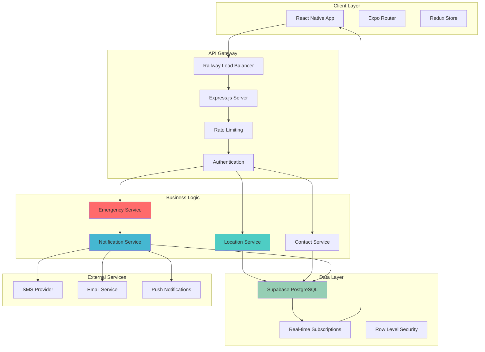
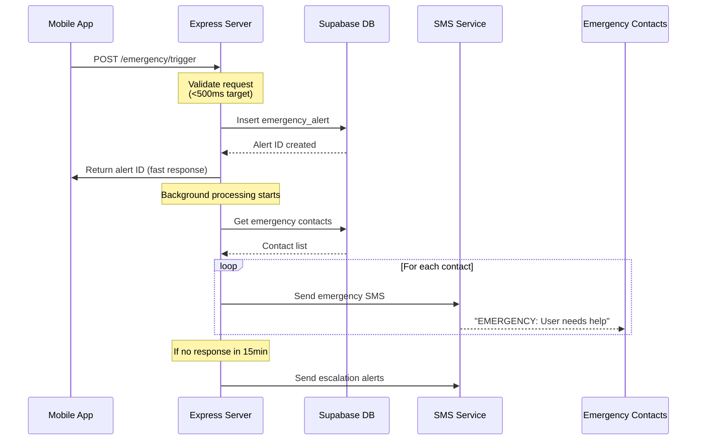

# Backend Setup - Express.js + Railway + Supabase

<Info>
**Thoughtful Backend Development:** This guide takes you from concept to production, explaining not just *how* to build Shelther's backend, but *why* each decision matters for safety-critical applications. We'll build understanding first, then implement with confidence.
</Info>

## Understanding Shelther's Backend Architecture

Before diving into code, let's understand what we're building and why each piece matters for a safety platform.

### The Big Picture

Shelther's backend serves as the critical nervous system for emergency response. Unlike typical apps where a few seconds of downtime might be annoying, here it could be life-threatening.

<CardGroup cols={2}>
  <Card title="What Makes Safety Different" icon="shield-alert">
    **Response Time Critical:** Emergency alerts must process in &lt;500ms
    **Always Available:** 99.9% uptime isn't aspirational—it's mandatory
    **Data Integrity:** Location and emergency data must never be lost
    **Scalable Under Stress:** System must handle crisis scenarios
  </Card>
  <Card title="Our Solution Stack" icon="stack">
    **Express.js:** Battle-tested Node.js framework with TypeScript
    **Railway:** Always-warm hosting that eliminates cold starts
    **Supabase:** PostgreSQL + real-time features for location/alerts
    **WebSockets:** Instant communication for emergency coordination
  </Card>
</CardGroup>

### Architecture Decision Tree

When building a safety platform, every architectural choice has consequences. Here's our reasoning:

<Steps>
  <Step title="Why Express.js over alternatives?">
    **Maturity & Ecosystem:** 10+ years of production hardening, extensive middleware
    **Performance:** V8 engine performance with non-blocking I/O for real-time features  
    **Team Knowledge:** Easier to hire developers, extensive documentation
    **Flexibility:** Can adapt to safety-specific requirements without framework constraints
  </Step>
  <Step title="Why Railway over other hosts?">
    **Always-Warm:** No cold starts that could delay emergency responses
    **Developer Experience:** Git-based deployments with instant preview environments
    **Built-in Monitoring:** Health checks and performance monitoring included
    **Cost Effective:** Predictable pricing that scales with usage, not complexity
  </Step>
  <Step title="Why Supabase over pure PostgreSQL?">
    **Real-time Built-in:** WebSocket subscriptions for live location/alert updates
    **Row Level Security:** Database-level permissions perfect for user data isolation
    **Type Generation:** Auto-generated TypeScript types from schema changes
    **Admin Tools:** Built-in dashboard for monitoring and database management
  </Step>
</Steps>

## System Architecture Overview

Let's visualize how all the pieces fit together:



<Note>
**Understanding the Flow:** Emergency requests (red) get priority routing through the system, while regular location updates (teal) and notifications (blue) follow standard paths. Everything flows through Railway's always-warm servers to our PostgreSQL database.
</Note>

## Planning Your Development Approach

### Development Phases

Rather than building everything at once, we'll develop in phases that each deliver working functionality:

<CardGroup cols={3}>
  <Card title="Phase 1: Foundation" icon="foundation">
    **Goal:** Basic API server with health checks
    **Duration:** 1-2 days
    **Deliverable:** Server responds to requests, deploys to Railway
    **Value:** Proves infrastructure works before adding complexity
  </Card>
  <Card title="Phase 2: Core Safety Features" icon="heart-pulse">
    **Goal:** Emergency alerts and location tracking
    **Duration:** 3-4 days  
    **Deliverable:** Can trigger alerts and store locations
    **Value:** Core safety functionality working end-to-end
  </Card>
  <Card title="Phase 3: Production Ready" icon="shield-check">
    **Goal:** Real-time features, monitoring, and scale
    **Duration:** 2-3 days
    **Deliverable:** WebSockets, comprehensive logging, performance optimization
    **Value:** Ready for real users in emergency situations
  </Card>
</CardGroup>

### Development Environment Strategy

<Warning>
**Critical Decision Point:** How you set up your development environment affects your ability to test safety features realistically.
</Warning>

We recommend a three-environment approach:

<Accordion title="Local Development Environment">
**Purpose:** Fast iteration and feature development
**Components:**
- Express.js server running on localhost:3001
- Local Supabase instance via Docker
- Mock external services (SMS, email)
- Hot reload for rapid development

**Pros:** Instant feedback, no external dependencies, works offline
**Cons:** Can't test real SMS/email, not identical to production
**Best for:** Feature development, unit testing, initial integration testing
</Accordion>

<Accordion title="Staging Environment">
**Purpose:** Production-like testing with real external services
**Components:**
- Railway deployment with staging environment variables
- Staging Supabase project
- Real external services in test mode
- Production-like data volumes

**Pros:** Tests real integrations, simulates production load, safe for experiments
**Cons:** Slower deployment cycle, costs money, requires internet
**Best for:** Integration testing, load testing, pre-production validation
</Accordion>

<Accordion title="Production Environment">
**Purpose:** Serving real users in real emergencies
**Components:**
- Railway production deployment
- Production Supabase with backups
- Production external services
- Full monitoring and alerting

**Pros:** Real performance, real users, real impact
**Cons:** Downtime affects users, changes need careful testing, limited debugging
**Best for:** Serving users, monitoring real usage patterns, final validation
</Accordion>

## Phase 1: Foundation Setup

Let's start by building a solid foundation. This phase focuses on getting the basic infrastructure working correctly.

### Project Structure Philosophy

Good project structure makes safety-critical code easier to understand and maintain:

```
shelther-backend/
├── src/
│   ├── config/          # Environment and service configuration
│   ├── controllers/     # HTTP request handlers (thin layer)
│   ├── services/        # Business logic (where safety rules live)
│   ├── middleware/      # Express middleware (auth, validation, etc.)
│   ├── types/          # TypeScript type definitions
│   ├── utils/          # Shared utilities and helpers
│   └── server.ts       # Application entry point
├── tests/              # Test files mirroring src structure
├── scripts/            # Deployment and utility scripts
└── docs/              # API documentation and guides
```

<Note>
**Why This Structure:** Controllers stay thin and focused on HTTP concerns. Business logic lives in services where we can unit test safety-critical code easily. Configuration is centralized so environment changes are predictable.
</Note>

### Setting Up the Foundation

<CodeGroup>
```bash Project Initialization
# Create and enter project directory
mkdir shelther-backend && cd shelther-backend

# Initialize package.json with safety-focused metadata
npm init -y

# Update package.json with safety-specific information
npm pkg set name="shelther-backend"
npm pkg set description="Shelther Safety Platform Backend API"
npm pkg set main="dist/server.js"
npm pkg set engines.node=">=20.0.0"
npm pkg set engines.npm=">=10.0.0"
npm pkg set keywords='["safety", "emergency", "express", "typescript"]'
```

```bash Essential Dependencies
# Core server dependencies
npm install express@4.18.2 \
            cors@2.8.5 \
            helmet@7.1.0 \
            dotenv@16.3.1 \
            winston@3.11.0

# TypeScript and development tools
npm install -D typescript@5.3.3 \
               @types/node@20.10.0 \
               @types/express@4.17.21 \
               ts-node@10.9.1 \
               nodemon@3.0.2

# Why these specific versions?
# - Express 4.18.2: Latest stable with security patches
# - TypeScript 5.3.3: Latest with strict type checking
# - Node 20 LTS: Required for Expo SDK 53 compatibility
```
</CodeGroup>

### Your First Safety-Aware Server

Let's build a minimal server that demonstrates safety-first principles:

<CodeGroup>
```typescript Basic Server (src/server.ts)
import express from 'express';
import cors from 'cors';
import helmet from 'helmet';
import { config } from './config/environment';
import { logger } from './utils/logger';

const app = express();
const PORT = config.PORT || 3001;

// Security first - always
app.use(helmet());
app.use(cors({
  origin: config.CORS_ORIGINS,
  credentials: true
}));

// Parse requests
app.use(express.json({ limit: '10mb' }));

// Health check - critical for Railway deployment
app.get('/health', (req, res) => {
  res.json({
    status: 'healthy',
    timestamp: new Date().toISOString(),
    uptime: process.uptime(),
    environment: config.NODE_ENV
  });
});

// Start server with graceful shutdown
const server = app.listen(PORT, () => {
  logger.info(`🚀 Shelther API server running on port ${PORT}`);
  logger.info(`📊 Environment: ${config.NODE_ENV}`);
});

// Graceful shutdown for zero-downtime deployments
process.on('SIGTERM', () => {
  logger.info('SIGTERM received, shutting down gracefully');
  server.close(() => {
    logger.info('Process terminated');
    process.exit(0);
  });
});

export default app;
```

```typescript Environment Configuration (src/config/environment.ts)
import dotenv from 'dotenv';

// Load environment variables from .env file
dotenv.config();

interface Config {
  NODE_ENV: string;
  PORT: number;
  CORS_ORIGINS: string[];
  LOG_LEVEL: string;
}

function validateConfig(): Config {
  // Fail fast if critical config is missing
  if (!process.env.NODE_ENV) {
    throw new Error('NODE_ENV environment variable is required');
  }

  return {
    NODE_ENV: process.env.NODE_ENV,
    PORT: parseInt(process.env.PORT || '3001', 10),
    CORS_ORIGINS: process.env.CORS_ORIGINS?.split(',') || ['http://localhost:8081'],
    LOG_LEVEL: process.env.LOG_LEVEL || 'info',
  };
}

export const config = validateConfig();
```
</CodeGroup>

<Info>
**What We Just Built:** A secure Express.js server with proper CORS, security headers, health checks, and graceful shutdown. This foundation handles the basics correctly so we can focus on safety features next.
</Info>

### Testing Your Foundation

Before moving forward, let's verify everything works:

<CodeGroup>
```bash Development Commands
# Add these scripts to package.json
npm pkg set scripts.dev="nodemon src/server.ts"
npm pkg set scripts.start="node dist/server.js"
npm pkg set scripts.build="tsc"

# Start development server
npm run dev

# Test health endpoint
curl http://localhost:3001/health
```

```json Expected Health Response
{
  "status": "healthy",
  "timestamp": "2025-01-XX:XX:XX.XXXZ",
  "uptime": 1.234,
  "environment": "development"
}
```
</CodeGroup>

<Note>
**Success Indicators:** 
✅ Server starts without errors  
✅ Health endpoint returns 200 status  
✅ CORS headers are present  
✅ Graceful shutdown works (Ctrl+C)  
✅ Hot reload works when you change code
</Note>

## Phase 2: Core Safety Features

Now that our foundation is solid, let's add the safety-critical features that make Shelther valuable.

### Understanding Emergency Alert Flow

Before implementing, let's understand what happens during an emergency:



<Warning>
**Critical Design Decision:** We return success to the mobile app immediately (within 500ms) but process notifications in the background. This ensures the user gets confirmation quickly even if SMS services are slow.
</Warning>

### Database Schema Design for Safety

Safety applications have unique database requirements:

<Accordion title="Emergency Alerts Table">
**Purpose:** Store all emergency events with full audit trail

**Key Design Decisions:**
- `created_at` with millisecond precision for forensic analysis
- `location` as JSONB for flexible geographic data
- `contacts_notified` to track who was alerted and when
- `status` enum for clear state management
- Row-level security to prevent cross-user data access

**Why These Choices:**
- JSONB for location allows storing GPS accuracy, altitude, speed
- Audit trail is critical for safety analysis and legal requirements
- Status tracking enables proper escalation workflows
</Accordion>

<Accordion title="Location Updates Table">
**Purpose:** Track user locations with automatic expiration

**Key Design Decisions:**
- `expires_at` for automatic cleanup of sensitive location data
- `is_emergency` flag for priority processing
- `accuracy` and `battery_level` for context
- PostGIS integration for spatial queries

**Why These Choices:**
- Automatic expiration protects user privacy
- Battery level helps understand reliability of location data
- Spatial indexes enable "nearby" queries for community features
</Accordion>

### Implementing Emergency Alerts

Let's build the emergency alert system step by step:

<CodeGroup>
```typescript Emergency Service Interface (src/services/emergencyService.ts)
// Start with clear interfaces that define what safety means
export interface EmergencyRequest {
  alertType: 'manual' | 'duress' | 'check_in_missed' | 'automatic';
  triggerMethod?: 'button' | 'shake' | 'widget' | 'voice';
  location?: {
    latitude: number;
    longitude: number;
    accuracy?: number;
  };
  message?: string;
}

export interface EmergencyResponse {
  alertId: string;
  status: 'active';
  contactsNotified: number;
  processingTime: number;
}

export class EmergencyService {
  async triggerAlert(userId: string, request: EmergencyRequest): Promise<EmergencyResponse> {
    const startTime = Date.now();
    
    // Step 1: Validate the request (fail fast)
    this.validateRequest(request);
    
    // Step 2: Store alert in database immediately
    const alert = await this.createAlert(userId, request);
    
    // Step 3: Start background notification process
    this.processNotifications(alert).catch(error => {
      logger.error('Notification processing failed', { alertId: alert.id, error });
    });
    
    // Step 4: Return success quickly
    return {
      alertId: alert.id,
      status: 'active',
      contactsNotified: 0, // Will be updated by background process
      processingTime: Date.now() - startTime
    };
  }
  
  private validateRequest(request: EmergencyRequest): void {
    // Validation logic here - keep it fast but thorough
  }
  
  private async createAlert(userId: string, request: EmergencyRequest) {
    // Database insertion logic
  }
  
  private async processNotifications(alert: any): Promise<void> {
    // Background notification processing
  }
}
```

```typescript Emergency Controller (src/controllers/emergencyController.ts)
import { Request, Response } from 'express';
import { EmergencyService } from '../services/emergencyService';
import { logger } from '../utils/logger';

// Controllers should be thin - just handle HTTP concerns
export class EmergencyController {
  constructor(private emergencyService: EmergencyService) {}

  async triggerAlert(req: Request, res: Response): Promise<void> {
    try {
      const userId = req.user.id; // From auth middleware
      const emergencyRequest = req.body;
      
      // Log the emergency request for audit trail
      logger.info('Emergency alert requested', {
        userId,
        alertType: emergencyRequest.alertType,
        ip: req.ip,
        userAgent: req.get('User-Agent')
      });
      
      const result = await this.emergencyService.triggerAlert(userId, emergencyRequest);
      
      res.status(201).json(result);
    } catch (error) {
      logger.error('Emergency alert failed', {
        userId: req.user?.id,
        error: error instanceof Error ? error.message : 'Unknown error',
        body: req.body
      });
      
      res.status(500).json({
        error: 'Emergency alert processing failed',
        message: 'Please try again or contact emergency services directly'
      });
    }
  }
}
```
</CodeGroup>

<Info>
**Architecture Note:** The controller handles HTTP concerns (request/response) while the service handles business logic (safety rules). This separation makes testing easier and keeps safety logic focused.
</Info>

## Phase 3: Production-Ready Features

With core functionality working, let's add the features that make this production-ready for real emergencies.

### Real-time Communication Strategy

Safety applications need instant communication. Here's our approach:

<CardGroup cols={2}>
  <Card title="WebSocket for Instant Updates" icon="zap">
    **Use Cases:**
    - Emergency alert confirmations
    - Real-time location sharing during active alerts
    - Contact acknowledgment notifications
    
    **Implementation:**
    - Authenticated WebSocket connections
    - Room-based subscriptions (user-specific channels)
    - Automatic reconnection with exponential backoff
  </Card>
  <Card title="Supabase Realtime for Data Sync" icon="database">
    **Use Cases:**
    - Database change notifications
    - Multi-device synchronization
    - Offline-to-online data sync
    
    **Implementation:**
    - PostgreSQL NOTIFY/LISTEN via Supabase
    - Row-level security ensures users only see their data
    - Automatic type generation for real-time payloads
  </Card>
</CardGroup>

### Production Monitoring Strategy

<Warning>
**Monitoring is Not Optional:** For safety applications, you need to know about problems before users do. Silent failures can literally be life-threatening.
</Warning>

Our monitoring approach covers four levels:

<Steps>
  <Step title="Application Health Monitoring">
    **What:** Server status, response times, error rates
    **How:** Built-in `/health` endpoint with dependency checks
    **Alerts:** Response time > 1s, error rate > 1%, any dependency down
    **Action:** Automatic Railway deployment rollback if health fails
  </Step>
  <Step title="Business Logic Monitoring">
    **What:** Emergency alert processing, notification delivery, user behavior
    **How:** Custom metrics logged through Winston with structured data
    **Alerts:** Alert processing > 500ms, notification failures > 5%
    **Action:** Page on-call engineer for emergency processing issues
  </Step>
  <Step title="Infrastructure Monitoring">
    **What:** Database performance, external service availability, resource usage
    **How:** Railway built-in metrics + Supabase dashboard + external service status
    **Alerts:** Database response > 200ms, external service downtime
    **Action:** Switch to backup services, scale resources
  </Step>
  <Step title="User Experience Monitoring">
    **What:** End-to-end emergency response times, user success rates
    **How:** Client-side timing + server-side correlation IDs
    **Alerts:** End-to-end emergency time > 2s, user error reports
    **Action:** Investigate user experience issues, improve UX flows
  </Step>
</Steps>

### Security Hardening for Production

Safety apps are attractive targets for malicious actors. Here's our security layering:

<Accordion title="Authentication & Authorization">
**Strategy:** Defense in depth with multiple validation layers

**Implementation:**
- JWT tokens with short expiration (15 minutes)
- Refresh tokens stored securely
- Rate limiting on auth endpoints (30 requests/15 minutes)
- Multi-factor authentication for sensitive operations
- Row-level security in PostgreSQL

**Monitoring:** Failed login attempts, suspicious IP patterns, token replay attacks
</Accordion>

<Accordion title="Input Validation & Sanitization">
**Strategy:** Validate everything, trust nothing

**Implementation:**
- Express-validator for all incoming data
- SQL injection prevention through parameterized queries
- XSS prevention through input sanitization
- File upload restrictions and scanning
- Geographic coordinate validation

**Monitoring:** Malformed requests, injection attempts, unusual data patterns
</Accordion>

<Accordion title="Network Security">
**Strategy:** Encrypt everything, minimize attack surface

**Implementation:**
- HTTPS only (HTTP redirects to HTTPS)
- CORS restricted to known origins
- Helmet.js for security headers
- Certificate pinning for external API calls
- VPN access for admin operations

**Monitoring:** Unusual traffic patterns, certificate issues, CORS violations
</Accordion>

## Railway Deployment Guide

### Understanding Railway's Benefits for Safety Apps

Railway solves several critical problems for safety applications:

<CardGroup cols={2}>
  <Card title="Always-Warm Architecture" icon="flame">
    **Problem:** Cold starts delay emergency responses
    **Solution:** Railway keeps containers warm, eliminating startup delays
    **Benefit:** Consistent sub-500ms response times even after periods of low traffic
  </Card>
  <Card title="Git-Based Deployments" icon="git-branch">
    **Problem:** Complex deployment processes increase risk of errors
    **Solution:** Push to GitHub automatically deploys to Railway
    **Benefit:** Every change is tracked, rollbacks are instant, team collaboration is seamless
  </Card>
</CardGroup>

### Deployment Strategy

<Steps>
  <Step title="Environment Setup">
    Configure three environments (development, staging, production) with appropriate variable isolation and access controls
  </Step>
  <Step title="Database Migration Strategy">
    Use Supabase migrations to handle schema changes safely across environments without data loss
  </Step>
  <Step title="Zero-Downtime Deployment">
    Configure Railway health checks to ensure new deployments are healthy before switching traffic
  </Step>
  <Step title="Monitoring & Alerting">
    Set up comprehensive monitoring that alerts on both infrastructure and business logic issues
  </Step>
</Steps>

## Development Best Practices

### Code Organization for Safety

<Note>
**Safety Principle:** Code that's easy to understand is easier to debug during emergencies. Prioritize clarity over cleverness.
</Note>

**File Naming Conventions:**
- `services/` - Business logic (e.g., `emergencyService.ts`)
- `controllers/` - HTTP handlers (e.g., `emergencyController.ts`)
- `middleware/` - Request processing (e.g., `authMiddleware.ts`)
- `types/` - TypeScript definitions (e.g., `emergency.types.ts`)

**Code Style Guidelines:**
- Explicit error handling (no silent failures)
- Comprehensive logging with context
- Unit tests for all safety-critical functions
- Integration tests for API endpoints
- Performance tests for emergency scenarios

### Testing Strategy for Safety Applications

<Warning>
**Testing is Critical:** In safety applications, bugs can literally be life-threatening. Our testing strategy reflects this reality.
</Warning>

<CardGroup cols={3}>
  <Card title="Unit Tests" icon="microscope">
    **Focus:** Individual function correctness
    **Coverage:** 90%+ for safety-critical functions
    **Tools:** Jest with comprehensive mocking
    **Example:** Validate emergency alert processing logic
  </Card>
  <Card title="Integration Tests" icon="link">
    **Focus:** Service interaction correctness
    **Coverage:** All API endpoints and database operations
    **Tools:** Supertest with test database
    **Example:** End-to-end emergency alert flow
  </Card>
  <Card title="Load Tests" icon="gauge">
    **Focus:** Performance under emergency scenarios
    **Coverage:** High-traffic emergency situations
    **Tools:** Artillery or k6 for realistic load simulation
    **Example:** 100 simultaneous emergency alerts
  </Card>
</CardGroup>

## Troubleshooting Guide

### Common Development Issues

<Accordion title="Server Won't Start">
**Symptoms:** Error on `npm run dev`, port conflicts, dependency issues

**Diagnosis Steps:**
1. Check if port 3001 is already in use: `lsof -i :3001`
2. Verify Node.js version: `node --version` (should be 20+)
3. Check environment variables: missing required config
4. Review dependency conflicts: `npm ls` for version issues

**Solutions:**
- Kill existing processes: `kill -9 <PID>`
- Use different port: `PORT=3002 npm run dev`
- Reinstall dependencies: `rm -rf node_modules && npm install`
- Fix environment config: copy `.env.example` to `.env`
</Accordion>

<Accordion title="Database Connection Issues">
**Symptoms:** Supabase connection failures, authentication errors, query timeouts

**Diagnosis Steps:**
1. Verify Supabase credentials in environment variables
2. Check Supabase project status in dashboard
3. Test connection manually: `psql $DATABASE_URL`
4. Review network connectivity and firewall settings

**Solutions:**
- Regenerate Supabase API keys if expired
- Check IP allowlist in Supabase settings
- Verify SSL certificate issues with database connection
- Test with local Supabase instance for development
</Accordion>

<Accordion title="Deployment Failures">
**Symptoms:** Railway build errors, health check failures, environment issues

**Diagnosis Steps:**
1. Check Railway build logs for specific error messages
2. Verify environment variables are set correctly
3. Test health endpoint locally before deployment
4. Review resource limits and quotas

**Solutions:**
- Fix TypeScript compilation errors before deployment
- Set all required environment variables in Railway dashboard
- Ensure health check endpoint responds within timeout
- Upgrade Railway plan if hitting resource limits
</Accordion>

## Next Steps & Integration

<Note>
**You're Building Something Important:** Emergency response systems save lives. The extra care we put into architecture, testing, and monitoring reflects the critical nature of this work.
</Note>

### Immediate Next Steps

<CardGroup cols={3}>
  <Card title="Supabase Integration" icon="database" href="/quickstart/supabase-setup">
    Set up your database schema, authentication, and real-time subscriptions
  </Card>
  <Card title="Frontend Integration" icon="mobile" href="/quickstart/first-app">
    Connect your React Native app to the new Express.js backend
  </Card>
  <Card title="Production Configuration" icon="settings" href="/quickstart/configuration">
    Configure monitoring, logging, and performance optimization
  </Card>
</CardGroup>

### Long-term Considerations

As your safety platform grows, consider these advanced topics:

<Steps>
  <Step title="Scaling Strategy">
    Plan for handling thousands of simultaneous emergencies during crisis situations
  </Step>
  <Step title="Multi-Region Deployment">
    Consider deploying to multiple regions for better response times and disaster recovery
  </Step>
  <Step title="Advanced Analytics">
    Implement analytics to understand usage patterns and improve emergency response
  </Step>
  <Step title="Integration Ecosystem">
    Plan integrations with emergency services, IoT devices, and third-party safety services
  </Step>
</Steps>

## Summary & Checklist

<Info>
**Backend Foundation Complete:** You now have a solid understanding of Shelther's backend architecture and the reasoning behind each decision. This foundation will serve you well as you build out the full safety platform.
</Info>

### What You've Learned

✅ **Architecture Reasoning:** Why Express.js + Railway + Supabase for safety applications  
✅ **Development Strategy:** Three-phase approach from foundation to production  
✅ **Safety-First Design:** How safety requirements influence technical decisions  
✅ **Production Considerations:** Monitoring, security, and deployment for critical systems  
✅ **Troubleshooting Skills:** How to diagnose and fix common backend issues  

### Ready for Next Phase

Your backend foundation is ready when you can:
- [ ] Start the server without errors
- [ ] Health check endpoint returns success
- [ ] Environment configuration works across development/staging/production
- [ ] Basic logging and error handling functions correctly
- [ ] You understand the emergency alert flow and can explain it to others

**Remember:** Building safety systems is both a technical challenge and a responsibility. Take time to understand each decision, test thoroughly, and always prioritize user safety over feature velocity.

---

**Ready to continue?** Your backend foundation is solid. Let's move on to setting up the database schema and real-time features in the [Supabase Setup](/quickstart/supabase-setup) guide.