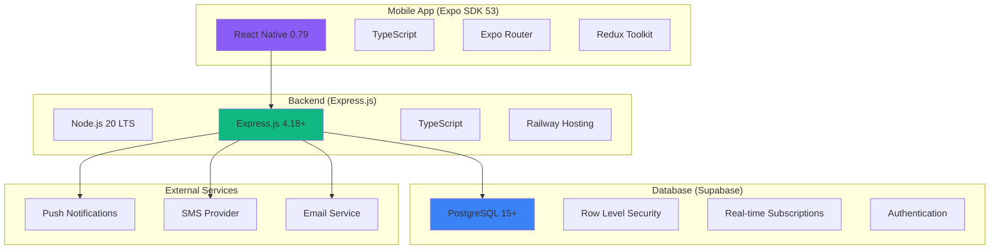

# Build Your First Safety App

<Info>
**Production-Ready in 60 Minutes:** This comprehensive guide takes you from setup to deployment of a fully functional safety application with emergency alerts, location tracking, and real-time notifications. Built with modern, production-tested technologies.
</Info>

## What We're Building

By the end of this guide, you'll have created a complete safety application featuring:

<CardGroup cols={2}>
  <Card title="Emergency Alert System" icon="bell">
    One-tap emergency button with automatic location sharing and contact notifications
  </Card>
  <Card title="Real-time Location Tracking" icon="map-pin">
    GPS tracking with privacy controls and automatic check-in reminders
  </Card>
  <Card title="Circle of Trust" icon="users">
    Verified contact system with multi-channel emergency notifications
  </Card>
  <Card title="Backend Infrastructure" icon="server">
    Express.js API with Railway deployment and Supabase database integration
  </Card>
</CardGroup>

## Technology Stack

<Warning>
**Current as of June 2025:** This guide uses the latest stable versions released in 2025 for optimal performance and security.
</Warning>

| **Component** | **Technology** | **Version** | **Purpose** |
|---------------|----------------|-------------|-------------|
| **Frontend** | Expo SDK | 53 | React Native framework with New Architecture |
| **Mobile Runtime** | React Native | 0.79 | Cross-platform mobile development |
| **Language** | TypeScript | 5.3+ | Type-safe development |
| **Backend** | Express.js | 4.18+ | Node.js web application framework |
| **Server Runtime** | Node.js | 20 LTS | JavaScript runtime environment |
| **Database** | Supabase | Latest | PostgreSQL with real-time features |
| **Hosting** | Railway | Latest | Always-warm server deployment |
| **State Management** | Redux Toolkit | 2.0+ | Predictable state container |

## Prerequisites

Before starting, ensure you have completed:

<Steps>
  <Step title="Development Environment">
    Node.js 20 LTS, Expo CLI, and code editor installed ([Environment Setup](/quickstart/installation))
  </Step>
  <Step title="Expo Configuration">
    Expo SDK 53 project with safety permissions configured ([Expo Setup](/quickstart/expo-setup))
  </Step>
  <Step title="Supabase Project">
    Database and authentication configured ([Supabase Setup](/quickstart/supabase-setup))
  </Step>
</Steps>

## Project Architecture Overview

Our safety app follows a modern, scalable architecture:



## Part 1: Backend Setup (Express.js + Railway + Supabase)

Let's start by building our safety-focused backend infrastructure.

### Create Express.js Safety Server

<CodeGroup>
```bash Terminal Commands
# Create backend directory
mkdir shelther-backend
cd shelther-backend

# Initialize Node.js project with TypeScript
npm init -y
npm install express cors helmet compression morgan dotenv
npm install @supabase/supabase-js twilio nodemailer
npm install express-rate-limit express-validator
npm install node-cron winston

# Development dependencies
npm install -D typescript @types/node @types/express
npm install -D @types/cors @types/compression @types/morgan
npm install -D nodemon ts-node concurrently

# Initialize TypeScript
npx tsc --init
```

```json package.json
{
  "name": "shelther-backend",
  "version": "1.0.0",
  "description": "Shelther Safety Platform Backend",
  "main": "dist/server.js",
  "scripts": {
    "build": "tsc",
    "start": "node dist/server.js",
    "dev": "nodemon src/server.ts",
    "watch": "tsc -w",
    "dev:all": "concurrently \"npm run watch\" \"npm run dev\"",
    "test": "echo \"Error: no test specified\" && exit 1"
  },
  "engines": {
    "node": ">=20.0.0",
    "npm": ">=10.0.0"
  },
  "dependencies": {
    "express": "^4.18.2",
    "cors": "^2.8.5",
    "helmet": "^7.1.0",
    "compression": "^1.7.4",
    "morgan": "^1.10.0",
    "dotenv": "^16.3.1",
    "@supabase/supabase-js": "^2.38.0",
    "express-rate-limit": "^7.1.5",
    "express-validator": "^7.0.1",
    "node-cron": "^3.0.3",
    "twilio": "^4.19.0",
    "nodemailer": "^6.9.7",
    "winston": "^3.11.0"
  },
  "devDependencies": {
    "typescript": "^5.3.3",
    "@types/node": "^20.10.0",
    "@types/express": "^4.17.21",
    "@types/cors": "^2.8.17",
    "@types/compression": "^1.7.5",
    "@types/morgan": "^1.9.9",
    "nodemon": "^3.0.2",
    "ts-node": "^10.9.1",
    "concurrently": "^8.2.2"
  }
}
```
</CodeGroup>

### Configure TypeScript for Safety Applications

<CodeGroup>
```json tsconfig.json
{
  "compilerOptions": {
    "target": "ES2020",
    "module": "commonjs",
    "outDir": "./dist",
    "rootDir": "./src",
    "strict": true,
    "strictNullChecks": true,
    "strictFunctionTypes": true,
    "noImplicitReturns": true,
    "noImplicitThis": true,
    "noImplicitAny": true,
    "exactOptionalPropertyTypes": true,
    "noUncheckedIndexedAccess": true,
    "esModuleInterop": true,
    "allowSyntheticDefaultImports": true,
    "skipLibCheck": true,
    "forceConsistentCasingInFileNames": true,
    "resolveJsonModule": true,
    "declaration": true,
    "declarationMap": true,
    "sourceMap": true
  },
  "include": ["src/**/*"],
  "exclude": ["node_modules", "dist", "**/*.test.ts"]
}
```

```typescript src/types/safety.ts
// Core safety type definitions
export interface EmergencyAlert {
  id: string;
  userId: string;
  alertType: 'manual' | 'duress' | 'check_in_missed' | 'panic';
  triggerMethod: 'button' | 'shake' | 'voice' | 'widget' | 'auto';
  status: 'active' | 'acknowledged' | 'resolved' | 'false_alarm';
  location?: {
    latitude: number;
    longitude: number;
    accuracy?: number;
    timestamp: string;
  };
  message?: string;
  contactsNotified: string[];
  createdAt: string;
  resolvedAt?: string;
}

export interface SafetyContact {
  id: string;
  userId: string;
  contactName: string;
  contactPhone: string;
  contactEmail?: string;
  relationship: 'family' | 'friend' | 'partner' | 'colleague' | 'emergency';
  priorityLevel: 1 | 2 | 3;
  verificationStatus: 'pending' | 'verified' | 'declined';
  notificationPreferences: {
    sms: boolean;
    email: boolean;
    push: boolean;
  };
  createdAt: string;
}

export interface LocationUpdate {
  id: string;
  userId: string;
  latitude: number;
  longitude: number;
  accuracy?: number;
  isEmergency: boolean;
  sessionId?: string;
  timestamp: string;
  expiresAt: string;
}

export interface CheckIn {
  id: string;
  userId: string;
  scheduledTime: string;
  actualTime?: string;
  status: 'pending' | 'completed' | 'missed' | 'cancelled';
  locationId?: string;
  notes?: string;
  gracePeriodMinutes: number;
  createdAt: string;
}`
```
</CodeGroup>

### Build Production-Ready Express Server

<CodeGroup>
```typescript src/server.ts
import express from 'express';
import cors from 'cors';
import helmet from 'helmet';
import compression from 'compression';
import morgan from 'morgan';
import rateLimit from 'express-rate-limit';
import dotenv from 'dotenv';

import { logger } from './utils/logger';
import { errorHandler } from './middleware/errorHandler';
import { authenticateUser } from './middleware/auth';

// Import routes
import healthRoutes from './routes/health';
import authRoutes from './routes/auth';
import emergencyRoutes from './routes/emergency';
import contactsRoutes from './routes/contacts';
import locationRoutes from './routes/location';
import checkInRoutes from './routes/checkin';

// Load environment variables
dotenv.config();

const app = express();
const PORT = process.env.PORT || 3000;

// Security middleware
app.use(helmet({
  crossOriginEmbedderPolicy: false,
  contentSecurityPolicy: {
    directives: {
      defaultSrc: ["'self'"],
      connectSrc: ["'self'", process.env.SUPABASE_URL || ''],
      styleSrc: ["'self'", "'unsafe-inline'"],
    },
  },
}));

// CORS configuration for React Native
app.use(cors({
  origin: process.env.NODE_ENV === 'production' 
    ? process.env.ALLOWED_ORIGINS?.split(',') 
    : true,
  credentials: true,
  optionsSuccessStatus: 200,
  methods: ['GET', 'POST', 'PUT', 'DELETE', 'PATCH', 'OPTIONS'],
  allowedHeaders: ['Content-Type', 'Authorization', 'x-user-agent'],
}));

// Performance middleware
app.use(compression());
app.use(express.json({ limit: '10mb' }));
app.use(express.urlencoded({ extended: true, limit: '10mb' }));

// Logging middleware
app.use(morgan('combined', {
  stream: {
    write: (message: string) => logger.info(message.trim())
  }
}));

// Rate limiting with emergency bypass
const limiter = rateLimit({
  windowMs: 15 * 60 * 1000, // 15 minutes
  max: (req) => {
    // Higher limits for emergency endpoints
    if (req.path.includes('/emergency/')) return 500;
    if (req.path.includes('/location/')) return 200;
    return 100;
  },
  message: {
    error: 'Too many requests from this IP',
    retryAfter: '15 minutes'
  },
  standardHeaders: true,
  legacyHeaders: false,
  handler: (req, res) => {
    logger.warn('Rate limit exceeded', {
      ip: req.ip,
      path: req.path,
      userAgent: req.get('User-Agent'),
    });
    res.status(429).json({
      error: 'Rate limit exceeded',
      retryAfter: '15 minutes'
    });
  },
});

// Apply rate limiting to API routes
app.use('/api', limiter);

// Public routes
app.use('/health', healthRoutes);
app.use('/api/auth', authRoutes);

// Protected routes (require authentication)
app.use('/api/emergency', authenticateUser, emergencyRoutes);
app.use('/api/contacts', authenticateUser, contactsRoutes);
app.use('/api/location', authenticateUser, locationRoutes);
app.use('/api/checkin', authenticateUser, checkInRoutes);

// Root endpoint
app.get('/', (req, res) => {
  res.json({
    message: 'Shelther Safety Platform API',
    version: '1.0.0',
    status: 'operational',
    documentation: '/api/docs'
  });
});

// 404 handler
app.use('*', (req, res) => {
  res.status(404).json({
    error: 'Endpoint not found',
    path: req.path,
    method: req.method
  });
});

// Error handling middleware
app.use(errorHandler);

// Graceful shutdown handling
process.on('SIGTERM', () => {
  logger.info('SIGTERM received, shutting down gracefully');
  process.exit(0);
});

process.on('SIGINT', () => {
  logger.info('SIGINT received, shutting down gracefully');
  process.exit(0);
});

// Start server
app.listen(PORT, () => {
  logger.info(`Shelther Safety Server running on port ${PORT}`, {
    environment: process.env.NODE_ENV,
    nodeVersion: process.version,
    timestamp: new Date().toISOString()
  });
});

export default app;
```

```typescript src/config/supabase.ts
import { createClient } from '@supabase/supabase-js';
import { logger } from '../utils/logger';

const supabaseUrl = process.env.SUPABASE_URL;
const supabaseServiceKey = process.env.SUPABASE_SERVICE_ROLE_KEY;

if (!supabaseUrl || !supabaseServiceKey) {
  logger.error('Missing Supabase configuration', {
    hasUrl: !!supabaseUrl,
    hasServiceKey: !!supabaseServiceKey
  });
  process.exit(1);
}

export const supabase = createClient(supabaseUrl, supabaseServiceKey, {
  auth: {
    autoRefreshToken: false,
    persistSession: false,
  },
  db: {
    schema: 'public',
  },
  global: {
    headers: {
      'X-Client-Info': 'shelther-backend/1.0.0',
    },
  },
});

// Test database connection
supabase.from('users').select('count(*)').then(({ data, error }) => {
  if (error) {
    logger.error('Supabase connection failed', { error: error.message });
  } else {
    logger.info('Supabase connection established successfully');
  }
});
```
</CodeGroup>

### Implement Safety-Critical Services

<CodeGroup>
```typescript src/services/EmergencyService.ts
import { supabase } from '../config/supabase';
import { NotificationService } from './NotificationService';
import { LocationService } from './LocationService';
import { logger } from '../utils/logger';
import { EmergencyAlert, SafetyContact } from '../types/safety';

export class EmergencyService {
  constructor(
    private notificationService: NotificationService,
    private locationService: LocationService
  ) {}

  async triggerEmergencyAlert(
    userId: string,
    alertData: Partial<EmergencyAlert>
  ): Promise<EmergencyAlert> {
    const startTime = Date.now();
    
    try {
      logger.info('Emergency alert triggered', { 
        userId, 
        alertType: alertData.alertType,
        triggerMethod: alertData.triggerMethod 
      });

      // Create alert record with location if provided
      const alertRecord = {
        user_id: userId,
        alert_type: alertData.alertType,
        trigger_method: alertData.triggerMethod,
        location: alertData.location ? JSON.stringify(alertData.location) : null,
        message: alertData.message,
        status: 'active',
        contacts_notified: '[]',
        created_at: new Date().toISOString()
      };

      const { data: alert, error } = await supabase
        .from('emergency_alerts')
        .insert(alertRecord)
        .select()
        .single();

      if (error) {
        throw new Error(`Failed to create emergency alert: ${error.message}`);
      }

      // Get verified emergency contacts
      const contacts = await this.getVerifiedContacts(userId);
      
      if (contacts.length === 0) {
        logger.warn('No verified contacts found for emergency alert', { 
          userId, 
          alertId: alert.id 
        });
      }

      // Send notifications in parallel (don't wait)
      const notificationPromises = contacts.map(contact =>
        this.notificationService.sendEmergencyNotification(contact, alert)
          .catch(error => logger.error('Notification failed', { 
            contactId: contact.id, 
            error: error.message 
          }))
      );

      // Update alert with contacted contacts
      await supabase
        .from('emergency_alerts')
        .update({
          contacts_notified: JSON.stringify(contacts.map(c => c.id))
        })
        .eq('id', alert.id);

      // Fire and forget notifications
      Promise.allSettled(notificationPromises);

      // Log performance
      const processingTime = Date.now() - startTime;
      logger.info('Emergency alert processed successfully', {
        alertId: alert.id,
        userId,
        contactCount: contacts.length,
        processingTime
      });

      return this.mapAlertFromDatabase(alert);
    } catch (error) {
      const processingTime = Date.now() - startTime;
      logger.error('Emergency alert processing failed', {
        userId,
        error: error instanceof Error ? error.message : 'Unknown error',
        processingTime
      });
      throw error;
    }
  }

  async resolveEmergencyAlert(
    alertId: string,
    userId: string,
    resolution: 'resolved' | 'false_alarm'
  ): Promise<void> {
    const { data: alert, error } = await supabase
      .from('emergency_alerts')
      .update({
        status: resolution,
        resolved_at: new Date().toISOString(),
      })
      .eq('id', alertId)
      .eq('user_id', userId)
      .select()
      .single();

    if (error) {
      throw new Error(`Failed to resolve emergency alert: ${error.message}`);
    }

    // Notify contacts that alert is resolved
    const contacts = await this.getVerifiedContacts(userId);
    const notificationPromises = contacts.map(contact =>
      this.notificationService.sendAlertResolutionNotification(
        contact, 
        alert, 
        resolution
      ).catch(error => logger.error('Resolution notification failed', {
        contactId: contact.id,
        error: error.message
      }))
    );

    await Promise.allSettled(notificationPromises);

    logger.info('Emergency alert resolved', {
      alertId,
      userId,
      resolution,
    });
  }

  async getActiveAlerts(userId: string): Promise<EmergencyAlert[]> {
    const { data: alerts, error } = await supabase
      .from('emergency_alerts')
      .select('*')
      .eq('user_id', userId)
      .eq('status', 'active')
      .order('created_at', { ascending: false });

    if (error) {
      throw new Error(`Failed to fetch active alerts: ${error.message}`);
    }

    return alerts.map(this.mapAlertFromDatabase);
  }

  private async getVerifiedContacts(userId: string): Promise<SafetyContact[]> {
    const { data: contacts, error } = await supabase
      .from('safety_contacts')
      .select('*')
      .eq('user_id', userId)
      .eq('verification_status', 'verified')
      .order('priority_level');

    if (error) {
      throw new Error(`Failed to fetch emergency contacts: ${error.message}`);
    }

    return contacts.map(this.mapContactFromDatabase);
  }

  private mapAlertFromDatabase(dbAlert: any): EmergencyAlert {
    return {
      id: dbAlert.id,
      userId: dbAlert.user_id,
      alertType: dbAlert.alert_type,
      triggerMethod: dbAlert.trigger_method,
      status: dbAlert.status,
      location: dbAlert.location ? JSON.parse(dbAlert.location) : undefined,
      message: dbAlert.message,
      contactsNotified: JSON.parse(dbAlert.contacts_notified || '[]'),
      createdAt: dbAlert.created_at,
      resolvedAt: dbAlert.resolved_at,
    };
  }

  private mapContactFromDatabase(dbContact: any): SafetyContact {
    return {
      id: dbContact.id,
      userId: dbContact.user_id,
      contactName: dbContact.contact_name,
      contactPhone: dbContact.contact_phone,
      contactEmail: dbContact.contact_email,
      relationship: dbContact.relationship,
      priorityLevel: dbContact.priority_level,
      verificationStatus: dbContact.verification_status,
      notificationPreferences: JSON.parse(
        dbContact.notification_preferences || '{"sms": true, "email": true, "push": true}'
      ),
      createdAt: dbContact.created_at,
    };
  }
}
```

```typescript src/routes/emergency.ts
import express from 'express';
import { body, param, validationResult } from 'express-validator';
import { EmergencyService } from '../services/EmergencyService';
import { NotificationService } from '../services/NotificationService';
import { LocationService } from '../services/LocationService';
import { AuthenticatedRequest } from '../middleware/auth';
import { logger } from '../utils/logger';

const router = express.Router();

// Initialize services
const notificationService = new NotificationService();
const locationService = new LocationService();
const emergencyService = new EmergencyService(notificationService, locationService);

// Validation middleware
const validateEmergencyAlert = [
  body('alertType')
    .isIn(['manual', 'duress', 'check_in_missed', 'panic'])
    .withMessage('Invalid alert type'),
  
  body('triggerMethod')
    .optional()
    .isIn(['button', 'shake', 'voice', 'widget', 'auto'])
    .withMessage('Invalid trigger method'),
  
  body('location.latitude')
    .optional()
    .isFloat({ min: -90, max: 90 })
    .withMessage('Invalid latitude'),
  
  body('location.longitude')
    .optional()
    .isFloat({ min: -180, max: 180 })
    .withMessage('Invalid longitude'),
  
  body('message')
    .optional()
    .trim()
    .isLength({ max: 500 })
    .withMessage('Message too long (max 500 characters)'),
];

// Handle validation errors
const handleValidationErrors = (req: express.Request, res: express.Response, next: express.NextFunction) => {
  const errors = validationResult(req);
  if (!errors.isEmpty()) {
    return res.status(400).json({
      error: 'Validation failed',
      details: errors.array()
    });
  }
  next();
};

// POST /api/emergency/trigger - Trigger emergency alert
router.post('/trigger', 
  validateEmergencyAlert,
  handleValidationErrors,
  async (req: AuthenticatedRequest, res) => {
    try {
      const userId = req.user.id;
      const alertData = req.body;

      const alert = await emergencyService.triggerEmergencyAlert(userId, alertData);
      
      res.status(201).json({
        success: true,
        alert,
        message: 'Emergency alert triggered successfully'
      });
    } catch (error) {
      logger.error('Emergency trigger failed', {
        userId: req.user.id,
        error: error instanceof Error ? error.message : 'Unknown error'
      });
      
      res.status(500).json({
        error: 'Failed to trigger emergency alert',
        details: error instanceof Error ? error.message : 'Unknown error'
      });
    }
  }
);

// PATCH /api/emergency/:alertId/resolve - Resolve emergency alert
router.patch('/:alertId/resolve',
  param('alertId').isUUID().withMessage('Invalid alert ID'),
  body('resolution')
    .isIn(['resolved', 'false_alarm'])
    .withMessage('Invalid resolution type'),
  handleValidationErrors,
  async (req: AuthenticatedRequest, res) => {
    try {
      const { alertId } = req.params;
      const { resolution } = req.body;
      const userId = req.user.id;

      await emergencyService.resolveEmergencyAlert(alertId, userId, resolution);
      
      res.json({
        success: true,
        message: `Emergency alert ${resolution} successfully`
      });
    } catch (error) {
      logger.error('Emergency resolution failed', {
        alertId: req.params.alertId,
        userId: req.user.id,
        error: error instanceof Error ? error.message : 'Unknown error'
      });
      
      res.status(500).json({
        error: 'Failed to resolve emergency alert',
        details: error instanceof Error ? error.message : 'Unknown error'
      });
    }
  }
);

// GET /api/emergency/active - Get active emergency alerts
router.get('/active', async (req: AuthenticatedRequest, res) => {
  try {
    const userId = req.user.id;
    const alerts = await emergencyService.getActiveAlerts(userId);
    
    res.json({
      success: true,
      alerts,
      count: alerts.length
    });
  } catch (error) {
    logger.error('Failed to fetch active alerts', {
      userId: req.user.id,
      error: error instanceof Error ? error.message : 'Unknown error'
    });
    
    res.status(500).json({
      error: 'Failed to fetch active alerts',
      details: error instanceof Error ? error.message : 'Unknown error'
    });
  }
});

export default router;
```
</CodeGroup>

### Deploy Backend to Railway

<CodeGroup>
```json railway.json
{
  "$schema": "https://railway.app/railway.schema.json",
  "build": {
    "builder": "NIXPACKS",
    "buildCommand": "npm run build",
    "watchPatterns": ["src/**/*.ts", "package.json"]
  },
  "deploy": {
    "startCommand": "npm start",
    "healthcheckPath": "/health",
    "healthcheckTimeout": 30,
    "restartPolicyType": "ON_FAILURE",
    "restartPolicyMaxRetries": 3,
    "sleepApplication": false
  },
  "environments": {
    "production": {
      "variables": {
        "NODE_ENV": "production",
        "LOG_LEVEL": "info"
      }
    }
  }
}
```

```bash Railway Deployment
# Install Railway CLI
npm install -g @railway/cli

# Login to Railway
railway login

# Initialize project
railway init

# Set environment variables
railway variables set NODE_ENV=production
railway variables set SUPABASE_URL=your_supabase_url
railway variables set SUPABASE_SERVICE_ROLE_KEY=your_service_key
railway variables set TWILIO_ACCOUNT_SID=your_twilio_sid
railway variables set TWILIO_AUTH_TOKEN=your_twilio_token
railway variables set TWILIO_PHONE_NUMBER=your_twilio_number
railway variables set EMAIL_USER=your_email
railway variables set EMAIL_PASS=your_email_password

# Deploy to Railway
railway up

# View logs
railway logs
```
</CodeGroup>

## Part 2: Mobile App Setup (Expo SDK 53 + React Native 0.79)

Now let's build the React Native safety app with modern architecture.

### Initialize Expo Project with Safety Focus

<CodeGroup>
```bash Create Expo App
# Create new Expo app with SDK 53
npx create-expo-app@latest shelther-app --template blank-typescript

# Navigate to project
cd shelther-app

# Install core dependencies
npx expo install expo-router@~3.5.0
npx expo install expo-location@~17.0.0
npx expo install expo-notifications@~0.28.0
npx expo install expo-secure-store@~13.0.0
npx expo install expo-background-fetch@~12.0.0
npx expo install expo-task-manager@~11.8.0

# Install Supabase and state management
npx expo install @supabase/supabase-js@^2.38.0
npx expo install @react-native-async-storage/async-storage
npx expo install react-native-url-polyfill

# Install UI and state management
npx expo install @reduxjs/toolkit react-redux
npx expo install @tanstack/react-query
npx expo install react-native-mmkv
npx expo install @expo/vector-icons

# Install additional safety dependencies
npx expo install expo-haptics@~13.0.0
npx expo install expo-device@~6.0.0
npx expo install expo-constants@~16.0.0
```

```json app.json
{
  "expo": {
    "name": "Shelther Safety",
    "slug": "shelther-safety",
    "version": "1.0.0",
    "orientation": "portrait",
    "icon": "./assets/icon.png",
    "userInterfaceStyle": "automatic",
    "splash": {
      "image": "./assets/splash.png",
      "resizeMode": "contain",
      "backgroundColor": "#8B5CF6"
    },
    "assetBundlePatterns": ["**/*"],
    "ios": {
      "supportsTablet": true,
      "bundleIdentifier": "com.shelther.safetyapp",
      "infoPlist": {
        "NSLocationWhenInUseUsageDescription": "This app needs location access to send your location during emergencies and provide safety monitoring.",
        "NSLocationAlwaysAndWhenInUseUsageDescription": "This app needs background location access to monitor your safety and trigger automatic check-ins.",
        "NSLocationAlwaysUsageDescription": "This app needs background location access for safety monitoring and emergency response.",
        "UIBackgroundModes": ["location", "background-fetch", "background-processing"],
        "NSUserNotificationsUsageDescription": "This app sends emergency notifications to your contacts and safety reminders to you."
      },
      "associatedDomains": ["applinks:shelther.app"]
    },
    "android": {
      "adaptiveIcon": {
        "foregroundImage": "./assets/adaptive-icon.png",
        "backgroundColor": "#8B5CF6"
      },
      "package": "com.shelther.safetyapp",
      "permissions": [
        "ACCESS_FINE_LOCATION",
        "ACCESS_COARSE_LOCATION",
        "ACCESS_BACKGROUND_LOCATION",
        "RECEIVE_BOOT_COMPLETED",
        "WAKE_LOCK",
        "VIBRATE",
        "RECORD_AUDIO"
      ]
    },
    "web": {
      "favicon": "./assets/favicon.png",
      "bundler": "metro"
    },
    "plugins": [
      "expo-router",
      [
        "expo-location",
        {
          "locationAlwaysAndWhenInUsePermission": "This app needs location access to provide safety monitoring and emergency response.",
          "locationAlwaysPermission": "This app needs background location access to monitor your safety when you're not actively using the app.",
          "locationWhenInUsePermission": "This app needs location access to send your location during emergencies.",
          "isIosBackgroundLocationEnabled": true,
          "isAndroidBackgroundLocationEnabled": true
        }
      ],
      [
        "expo-notifications",
        {
          "icon": "./assets/notification-icon.png",
          "color": "#8B5CF6",
          "sounds": ["./assets/emergency-alert.wav"]
        }
      ],
      [
        "expo-background-fetch",
        {
          "backgroundFetchInterval": 15
        }
      ]
    ],
    "experiments": {
      "typedRoutes": true,
      "tsconfigPaths": true
    },
    "scheme": "shelther",
    "extra": {
      "router": {
        "origin": false
      },
      "eas": {
        "projectId": "your-eas-project-id"
      }
    }
  }
}
```
</CodeGroup>

### Configure TypeScript for Safety App

<CodeGroup>
```json tsconfig.json
{
  "extends": "expo/tsconfig.base",
  "compilerOptions": {
    "strict": true,
    "strictNullChecks": true,
    "strictFunctionTypes": true,
    "noImplicitReturns": true,
    "noImplicitThis": true,
    "noImplicitAny": true,
    "exactOptionalPropertyTypes": true,
    "noUncheckedIndexedAccess": true,
    "baseUrl": ".",
    "paths": {
      "@/*": ["./src/*"],
      "@/components/*": ["./src/components/*"],
      "@/services/*": ["./src/services/*"],
      "@/types/*": ["./src/types/*"],
      "@/utils/*": ["./src/utils/*"],
      "@/store/*": ["./src/store/*"]
    }
  },
  "include": [
    "**/*.ts",
    "**/*.tsx",
    ".expo/types/**/*.ts",
    "expo-env.d.ts"
  ]
}
```

```typescript src/types/safety.ts
// Shared safety types between frontend and backend
export interface EmergencyAlert {
  id: string;
  userId: string;
  alertType: 'manual' | 'duress' | 'check_in_missed' | 'panic';
  triggerMethod: 'button' | 'shake' | 'voice' | 'widget' | 'auto';
  status: 'active' | 'acknowledged' | 'resolved' | 'false_alarm';
  location?: LocationData;
  message?: string;
  contactsNotified: string[];
  createdAt: string;
  resolvedAt?: string;
}

export interface LocationData {
  latitude: number;
  longitude: number;
  accuracy?: number;
  timestamp: string;
}

export interface SafetyContact {
  id: string;
  userId: string;
  contactName: string;
  contactPhone: string;
  contactEmail?: string;
  relationship: 'family' | 'friend' | 'partner' | 'colleague' | 'emergency';
  priorityLevel: 1 | 2 | 3;
  verificationStatus: 'pending' | 'verified' | 'declined';
  notificationPreferences: {
    sms: boolean;
    email: boolean;
    push: boolean;
  };
  createdAt: string;
}

export interface UserProfile {
  id: string;
  email: string;
  fullName?: string;
  phoneNumber?: string;
  emergencyMessage?: string;
  safetySettings: {
    checkInIntervalMinutes: number;
    emergencyTimeoutMinutes: number;
    locationSharingEnabled: boolean;
    allowLocationTracking: boolean;
  };
  createdAt: string;
  updatedAt: string;
}

export interface AppSettings {
  theme: 'light' | 'dark' | 'system';
  notifications: {
    emergencyAlerts: boolean;
    checkInReminders: boolean;
    safetyTips: boolean;
  };
  privacy: {
    shareLocationAccuracy: 'precise' | 'approximate';
    dataRetentionDays: number;
  };
  accessibility: {
    largeText: boolean;
    highContrast: boolean;
    reduceMotion: boolean;
  };
}
```
</CodeGroup>

### Implement Supabase Configuration

<CodeGroup>
```typescript src/config/supabase.ts
import 'react-native-url-polyfill/auto';
import AsyncStorage from '@react-native-async-storage/async-storage';
import { createClient } from '@supabase/supabase-js';
import { AppState } from 'react-native';

const supabaseUrl = process.env.EXPO_PUBLIC_SUPABASE_URL!;
const supabaseAnonKey = process.env.EXPO_PUBLIC_SUPABASE_ANON_KEY!;

if (!supabaseUrl || !supabaseAnonKey) {
  throw new Error('Missing Supabase environment variables');
}

export const supabase = createClient(supabaseUrl, supabaseAnonKey, {
  auth: {
    storage: AsyncStorage,
    autoRefreshToken: true,
    persistSession: true,
    detectSessionInUrl: false,
  },
  realtime: {
    params: {
      eventsPerSecond: 10,
    },
  },
  global: {
    headers: {
      'X-Client-Info': 'shelther-mobile/1.0.0',
    },
  },
});

// Handle app state changes for auth refresh
AppState.addEventListener('change', (state) => {
  if (state === 'active') {
    supabase.auth.startAutoRefresh();
  } else {
    supabase.auth.stopAutoRefresh();
  }
});

// Type definitions for database
export type Database = {
  public: {
    Tables: {
      users: {
        Row: {
          id: string;
          email: string;
          full_name: string | null;
          phone_number: string | null;
          emergency_message: string | null;
          safety_settings: any;
          created_at: string;
          updated_at: string;
        };
        Insert: {
          id?: string;
          email: string;
          full_name?: string | null;
          phone_number?: string | null;
          emergency_message?: string | null;
          safety_settings?: any;
          created_at?: string;
          updated_at?: string;
        };
        Update: {
          id?: string;
          email?: string;
          full_name?: string | null;
          phone_number?: string | null;
          emergency_message?: string | null;
          safety_settings?: any;
          updated_at?: string;
        };
      };
      emergency_alerts: {
        Row: {
          id: string;
          user_id: string;
          alert_type: string;
          trigger_method: string;
          status: string;
          location: string | null;
          message: string | null;
          contacts_notified: string;
          created_at: string;
          resolved_at: string | null;
        };
        Insert: {
          id?: string;
          user_id: string;
          alert_type: string;
          trigger_method: string;
          status?: string;
          location?: string | null;
          message?: string | null;
          contacts_notified?: string;
          created_at?: string;
          resolved_at?: string | null;
        };
        Update: {
          id?: string;
          user_id?: string;
          alert_type?: string;
          trigger_method?: string;
          status?: string;
          location?: string | null;
          message?: string | null;
          contacts_notified?: string;
          resolved_at?: string | null;
        };
      };
      safety_contacts: {
        Row: {
          id: string;
          user_id: string;
          contact_name: string;
          contact_phone: string;
          contact_email: string | null;
          relationship: string;
          priority_level: number;
          verification_status: string;
          notification_preferences: string;
          created_at: string;
        };
        Insert: {
          id?: string;
          user_id: string;
          contact_name: string;
          contact_phone: string;
          contact_email?: string | null;
          relationship: string;
          priority_level?: number;
          verification_status?: string;
          notification_preferences?: string;
          created_at?: string;
        };
        Update: {
          id?: string;
          user_id?: string;
          contact_name?: string;
          contact_phone?: string;
          contact_email?: string | null;
          relationship?: string;
          priority_level?: number;
          verification_status?: string;
          notification_preferences?: string;
        };
      };
    };
  };
};
```

```typescript src/services/ApiService.ts
import { supabase } from '@/config/supabase';
import { EmergencyAlert, SafetyContact, UserProfile } from '@/types/safety';

class ApiService {
  private baseUrl = process.env.EXPO_PUBLIC_API_URL || 'http://localhost:3000/api';

  private async getAuthToken(): Promise<string | null> {
    const { data: { session } } = await supabase.auth.getSession();
    return session?.access_token || null;
  }

  private async makeRequest<T>(
    endpoint: string,
    options: RequestInit = {}
  ): Promise<T> {
    const token = await this.getAuthToken();
    
    const response = await fetch(`${this.baseUrl}${endpoint}`, {
      ...options,
      headers: {
        'Content-Type': 'application/json',
        ...(token && { Authorization: `Bearer ${token}` }),
        ...options.headers,
      },
    });

    if (!response.ok) {
      const errorData = await response.json().catch(() => ({}));
      throw new Error(errorData.error || `HTTP ${response.status}: ${response.statusText}`);
    }

    return response.json();
  }

  // Emergency Alert API
  async triggerEmergencyAlert(alertData: {
    alertType: EmergencyAlert['alertType'];
    triggerMethod: EmergencyAlert['triggerMethod'];
    location?: { latitude: number; longitude: number; accuracy?: number };
    message?: string;
  }): Promise<{ success: boolean; alert: EmergencyAlert }> {
    return this.makeRequest('/emergency/trigger', {
      method: 'POST',
      body: JSON.stringify(alertData),
    });
  }

  async resolveEmergencyAlert(
    alertId: string,
    resolution: 'resolved' | 'false_alarm'
  ): Promise<{ success: boolean }> {
    return this.makeRequest(`/emergency/${alertId}/resolve`, {
      method: 'PATCH',
      body: JSON.stringify({ resolution }),
    });
  }

  async getActiveAlerts(): Promise<{ success: boolean; alerts: EmergencyAlert[] }> {
    return this.makeRequest('/emergency/active');
  }

  // Safety Contacts API
  async getSafetyContacts(): Promise<{ success: boolean; contacts: SafetyContact[] }> {
    return this.makeRequest('/contacts');
  }

  async addSafetyContact(contactData: Partial<SafetyContact>): Promise<{ success: boolean; contact: SafetyContact }> {
    return this.makeRequest('/contacts', {
      method: 'POST',
      body: JSON.stringify(contactData),
    });
  }

  async updateSafetyContact(
    contactId: string,
    updates: Partial<SafetyContact>
  ): Promise<{ success: boolean; contact: SafetyContact }> {
    return this.makeRequest(`/contacts/${contactId}`, {
      method: 'PATCH',
      body: JSON.stringify(updates),
    });
  }

  async deleteSafetyContact(contactId: string): Promise<{ success: boolean }> {
    return this.makeRequest(`/contacts/${contactId}`, {
      method: 'DELETE',
    });
  }

  // Location API
  async updateLocation(locationData: {
    latitude: number;
    longitude: number;
    accuracy?: number;
    isEmergency?: boolean;
  }): Promise<{ success: boolean }> {
    return this.makeRequest('/location/update', {
      method: 'POST',
      body: JSON.stringify(locationData),
    });
  }

  async shareLocationWithContact(
    contactId: string,
    durationMinutes: number
  ): Promise<{ success: boolean }> {
    return this.makeRequest('/location/share', {
      method: 'POST',
      body: JSON.stringify({ contactId, durationMinutes }),
    });
  }
}

export const apiService = new ApiService();
```
</CodeGroup>

### Build Emergency Button Component

<CodeGroup>
```typescript src/components/EmergencyButton.tsx
import React, { useState, useRef } from 'react';
import {
  View,
  Text,
  TouchableOpacity,
  Animated,
  StyleSheet,
  Alert,
} from 'react-native';
import { Ionicons } from '@expo/vector-icons';
import * as Haptics from 'expo-haptics';
import { useEmergencyAlert } from '@/hooks/useEmergencyAlert';
import { useLocation } from '@/hooks/useLocation';

interface EmergencyButtonProps {
  size?: 'small' | 'medium' | 'large';
  variant?: 'primary' | 'duress';
  disabled?: boolean;
}

export const EmergencyButton: React.FC<EmergencyButtonProps> = ({
  size = 'large',
  variant = 'primary',
  disabled = false,
}) => {
  const [isPressed, setIsPressed] = useState(false);
  const [countdown, setCountdown] = useState<number | null>(null);
  const scaleAnim = useRef(new Animated.Value(1)).current;
  const countdownRef = useRef<NodeJS.Timeout | null>(null);

  const { triggerAlert, isLoading } = useEmergencyAlert();
  const { currentLocation } = useLocation();

  const buttonSizes = {
    small: { width: 80, height: 80, fontSize: 14 },
    medium: { width: 120, height: 120, fontSize: 16 },
    large: { width: 200, height: 200, fontSize: 18 },
  };

  const buttonColors = {
    primary: {
      background: '#DC2626',
      pressed: '#B91C1C',
      text: '#FFFFFF',
    },
    duress: {
      background: '#7C3AED',
      pressed: '#6D28D9',
      text: '#FFFFFF',
    },
  };

  const handlePressIn = () => {
    if (disabled || isLoading) return;

    setIsPressed(true);
    
    // Haptic feedback
    Haptics.impactAsync(Haptics.ImpactFeedbackStyle.Heavy);

    // Scale animation
    Animated.spring(scaleAnim, {
      toValue: 0.95,
      useNativeDriver: true,
    }).start();

    // Start countdown for confirmation
    setCountdown(3);
    countdownRef.current = setInterval(() => {
      setCountdown((prev) => {
        if (prev === null || prev <= 1) {
          // Trigger emergency alert
          handleEmergencyTrigger();
          return null;
        }
        return prev - 1;
      });
    }, 1000);
  };

  const handlePressOut = () => {
    setIsPressed(false);
    
    // Reset animation
    Animated.spring(scaleAnim, {
      toValue: 1,
      useNativeDriver: true,
    }).start();

    // Clear countdown
    if (countdownRef.current) {
      clearInterval(countdownRef.current);
      countdownRef.current = null;
    }
    setCountdown(null);
  };

  const handleEmergencyTrigger = async () => {
    try {
      // Strong haptic feedback for emergency
      await Haptics.notificationAsync(Haptics.NotificationFeedbackType.Error);

      const alertType = variant === 'duress' ? 'duress' : 'manual';
      
      await triggerAlert({
        alertType,
        triggerMethod: 'button',
        location: currentLocation ? {
          latitude: currentLocation.coords.latitude,
          longitude: currentLocation.coords.longitude,
          accuracy: currentLocation.coords.accuracy || undefined,
        } : undefined,
      });

      // Show confirmation
      Alert.alert(
        'Emergency Alert Sent',
        'Your emergency contacts have been notified.',
        [{ text: 'OK', style: 'default' }]
      );
    } catch (error) {
      console.error('Emergency trigger failed:', error);
      Alert.alert(
        'Alert Failed',
        'Could not send emergency alert. Please try again or call emergency services directly.',
        [{ text: 'OK', style: 'destructive' }]
      );
    }
  };

  const currentSize = buttonSizes[size];
  const currentColors = buttonColors[variant];

  return (
    <View style={styles.container}>
      <Animated.View
        style={[
          styles.button,
          {
            width: currentSize.width,
            height: currentSize.height,
            backgroundColor: isPressed ? currentColors.pressed : currentColors.background,
            transform: [{ scale: scaleAnim }],
          },
          disabled && styles.disabled,
        ]}
      >
        <TouchableOpacity
          style={styles.touchable}
          onPressIn={handlePressIn}
          onPressOut={handlePressOut}
          disabled={disabled || isLoading}
          activeOpacity={1}
        >
          <View style={styles.content}>
            {countdown !== null ? (
              <Text style={[styles.countdown, { fontSize: currentSize.fontSize + 8 }]}>
                {countdown}
              </Text>
            ) : (
              <>
                <Ionicons
                  name="warning"
                  size={currentSize.width * 0.3}
                  color={currentColors.text}
                />
                <Text style={[styles.text, { fontSize: currentSize.fontSize }]}>
                  {variant === 'duress' ? 'DURESS' : 'EMERGENCY'}
                </Text>
                <Text style={[styles.subtext, { fontSize: currentSize.fontSize - 4 }]}>
                  {isPressed ? 'Hold to Confirm' : 'Press & Hold'}
                </Text>
              </>
            )}
          </View>
        </TouchableOpacity>
      </Animated.View>

      {variant === 'duress' && (
        <Text style={styles.duressNote}>
          Duress alert appears normal to others
        </Text>
      )}
    </View>
  );
};

const styles = StyleSheet.create({
  container: {
    alignItems: 'center',
  },
  button: {
    borderRadius: 100,
    elevation: 8,
    shadowColor: '#000',
    shadowOffset: { width: 0, height: 4 },
    shadowOpacity: 0.3,
    shadowRadius: 8,
  },
  touchable: {
    width: '100%',
    height: '100%',
    borderRadius: 100,
  },
  content: {
    flex: 1,
    justifyContent: 'center',
    alignItems: 'center',
  },
  text: {
    color: '#FFFFFF',
    fontWeight: 'bold',
    marginTop: 8,
    textAlign: 'center',
  },
  subtext: {
    color: '#FFFFFF',
    opacity: 0.8,
    marginTop: 4,
    textAlign: 'center',
  },
  countdown: {
    color: '#FFFFFF',
    fontWeight: 'bold',
    fontFamily: 'monospace',
  },
  disabled: {
    opacity: 0.5,
  },
  duressNote: {
    marginTop: 12,
    fontSize: 12,
    color: '#6B7280',
    textAlign: 'center',
    fontStyle: 'italic',
  },
});
```

```typescript src/hooks/useEmergencyAlert.ts
import { useState } from 'react';
import { useMutation, useQuery, useQueryClient } from '@tanstack/react-query';
import { apiService } from '@/services/ApiService';
import { EmergencyAlert } from '@/types/safety';

interface TriggerAlertParams {
  alertType: EmergencyAlert['alertType'];
  triggerMethod: EmergencyAlert['triggerMethod'];
  location?: {
    latitude: number;
    longitude: number;
    accuracy?: number;
  };
  message?: string;
}

export const useEmergencyAlert = () => {
  const queryClient = useQueryClient();

  // Get active alerts
  const { data: activeAlerts, isLoading: isLoadingAlerts } = useQuery({
    queryKey: ['emergency-alerts', 'active'],
    queryFn: async () => {
      const response = await apiService.getActiveAlerts();
      return response.alerts;
    },
    refetchInterval: 30000, // Refetch every 30 seconds
  });

  // Trigger emergency alert
  const triggerMutation = useMutation({
    mutationFn: (params: TriggerAlertParams) => 
      apiService.triggerEmergencyAlert(params),
    onSuccess: () => {
      // Invalidate and refetch active alerts
      queryClient.invalidateQueries({ queryKey: ['emergency-alerts'] });
    },
  });

  // Resolve emergency alert
  const resolveMutation = useMutation({
    mutationFn: ({ alertId, resolution }: { 
      alertId: string; 
      resolution: 'resolved' | 'false_alarm' 
    }) => apiService.resolveEmergencyAlert(alertId, resolution),
    onSuccess: () => {
      queryClient.invalidateQueries({ queryKey: ['emergency-alerts'] });
    },
  });

  return {
    // Active alerts
    activeAlerts: activeAlerts || [],
    isLoadingAlerts,
    hasActiveAlerts: (activeAlerts?.length || 0) > 0,

    // Trigger alert
    triggerAlert: triggerMutation.mutateAsync,
    isTriggering: triggerMutation.isPending,

    // Resolve alert
    resolveAlert: resolveMutation.mutateAsync,
    isResolving: resolveMutation.isPending,

    // Overall loading state
    isLoading: triggerMutation.isPending || resolveMutation.isPending,
  };
};
```
</CodeGroup>

### Implement Location Tracking Service

<CodeGroup>
```typescript src/hooks/useLocation.ts
import { useState, useEffect, useRef } from 'react';
import * as Location from 'expo-location';
import * as TaskManager from 'expo-task-manager';
import { apiService } from '@/services/ApiService';

const LOCATION_TASK_NAME = 'background-location-task';
const LOCATION_SHARE_TASK_NAME = 'location-share-task';

interface LocationState {
  currentLocation: Location.LocationObject | null;
  isTracking: boolean;
  isSharing: boolean;
  accuracy: Location.LocationAccuracy;
  error: string | null;
}

export const useLocation = () => {
  const [state, setState] = useState<LocationState>({
    currentLocation: null,
    isTracking: false,
    isSharing: false,
    accuracy: Location.LocationAccuracy.Balanced,
    error: null,
  });

  const locationSubscription = useRef<Location.LocationSubscription | null>(null);

  // Request location permissions
  const requestPermissions = async (): Promise<boolean> => {
    try {
      const { status: foregroundStatus } = await Location.requestForegroundPermissionsAsync();
      
      if (foregroundStatus !== 'granted') {
        setState(prev => ({ 
          ...prev, 
          error: 'Foreground location permission denied' 
        }));
        return false;
      }

      const { status: backgroundStatus } = await Location.requestBackgroundPermissionsAsync();
      
      if (backgroundStatus !== 'granted') {
        setState(prev => ({ 
          ...prev, 
          error: 'Background location permission denied - some features may not work' 
        }));
      }

      return true;
    } catch (error) {
      setState(prev => ({ 
        ...prev, 
        error: `Permission request failed: ${error}` 
      }));
      return false;
    }
  };

  // Get current location
  const getCurrentLocation = async (): Promise<Location.LocationObject | null> => {
    try {
      const hasPermission = await requestPermissions();
      if (!hasPermission) return null;

      const location = await Location.getCurrentPositionAsync({
        accuracy: state.accuracy,
        mayShowUserSettingsDialog: true,
      });

      setState(prev => ({ ...prev, currentLocation: location, error: null }));
      return location;
    } catch (error) {
      setState(prev => ({ 
        ...prev, 
        error: `Failed to get location: ${error}` 
      }));
      return null;
    }
  };

  // Start location tracking
  const startTracking = async (accuracy: Location.LocationAccuracy = Location.LocationAccuracy.Balanced) => {
    try {
      const hasPermission = await requestPermissions();
      if (!hasPermission) return false;

      // Stop existing subscription
      if (locationSubscription.current) {
        locationSubscription.current.remove();
      }

      // Start new subscription
      locationSubscription.current = await Location.watchPositionAsync(
        {
          accuracy,
          timeInterval: 30000, // 30 seconds
          distanceInterval: 50, // 50 meters
        },
        (location) => {
          setState(prev => ({ 
            ...prev, 
            currentLocation: location, 
            accuracy,
            error: null 
          }));

          // Send location update to backend
          apiService.updateLocation({
            latitude: location.coords.latitude,
            longitude: location.coords.longitude,
            accuracy: location.coords.accuracy || undefined,
            isEmergency: false,
          }).catch(error => {
            console.warn('Failed to update location:', error);
          });
        }
      );

      setState(prev => ({ ...prev, isTracking: true, accuracy }));
      return true;
    } catch (error) {
      setState(prev => ({ 
        ...prev, 
        error: `Failed to start tracking: ${error}` 
      }));
      return false;
    }
  };

  // Stop location tracking
  const stopTracking = () => {
    if (locationSubscription.current) {
      locationSubscription.current.remove();
      locationSubscription.current = null;
    }
    setState(prev => ({ ...prev, isTracking: false }));
  };

  // Start emergency location sharing
  const startEmergencySharing = async (): Promise<boolean> => {
    try {
      const hasPermission = await requestPermissions();
      if (!hasPermission) return false;

      // Start background location task
      await Location.startLocationUpdatesAsync(LOCATION_TASK_NAME, {
        accuracy: Location.LocationAccuracy.BestForNavigation,
        timeInterval: 10000, // 10 seconds during emergency
        distanceInterval: 25, // 25 meters
        deferredUpdatesInterval: 30000,
        foregroundService: {
          notificationTitle: 'Emergency Location Sharing',
          notificationBody: 'Sharing location with your emergency contacts',
          notificationColor: '#DC2626',
        },
      });

      setState(prev => ({ ...prev, isSharing: true }));
      return true;
    } catch (error) {
      setState(prev => ({ 
        ...prev, 
        error: `Failed to start emergency sharing: ${error}` 
      }));
      return false;
    }
  };

  // Stop emergency location sharing
  const stopEmergencySharing = async () => {
    try {
      await Location.stopLocationUpdatesAsync(LOCATION_TASK_NAME);
      setState(prev => ({ ...prev, isSharing: false }));
    } catch (error) {
      console.warn('Failed to stop emergency sharing:', error);
    }
  };

  // Share location with specific contact
  const shareLocationWithContact = async (
    contactId: string, 
    durationMinutes: number = 60
  ): Promise<boolean> => {
    try {
      const location = await getCurrentLocation();
      if (!location) return false;

      await apiService.shareLocationWithContact(contactId, durationMinutes);
      return true;
    } catch (error) {
      setState(prev => ({ 
        ...prev, 
        error: `Failed to share location: ${error}` 
      }));
      return false;
    }
  };

  // Cleanup on unmount
  useEffect(() => {
    return () => {
      stopTracking();
      stopEmergencySharing();
    };
  }, []);

  return {
    ...state,
    requestPermissions,
    getCurrentLocation,
    startTracking,
    stopTracking,
    startEmergencySharing,
    stopEmergencySharing,
    shareLocationWithContact,
  };
};

// Define background location task
TaskManager.defineTask(LOCATION_TASK_NAME, ({ data, error }) => {
  if (error) {
    console.error('Background location task error:', error);
    return;
  }

  if (data) {
    const { locations } = data as { locations: Location.LocationObject[] };
    const location = locations[0];

    if (location) {
      // Send emergency location update
      apiService.updateLocation({
        latitude: location.coords.latitude,
        longitude: location.coords.longitude,
        accuracy: location.coords.accuracy || undefined,
        isEmergency: true,
      }).catch(error => {
        console.error('Failed to update emergency location:', error);
      });
    }
  }
});
```
</CodeGroup>

### Create Main App Navigation

<CodeGroup>
```typescript app/_layout.tsx
import React, { useEffect } from 'react';
import { Stack } from 'expo-router';
import { StatusBar } from 'expo-status-bar';
import { Provider } from 'react-redux';
import { QueryClient, QueryClientProvider } from '@tanstack/react-query';
import { GestureHandlerRootView } from 'react-native-gesture-handler';
import { SafeAreaProvider } from 'react-native-safe-area-context';

import { store } from '@/store';
import { AuthProvider } from '@/providers/AuthProvider';
import { LocationProvider } from '@/providers/LocationProvider';
import { NotificationProvider } from '@/providers/NotificationProvider';

// Create QueryClient
const queryClient = new QueryClient({
  defaultOptions: {
    queries: {
      retry: 3,
      refetchOnWindowFocus: false,
      staleTime: 5 * 60 * 1000, // 5 minutes
    },
    mutations: {
      retry: 1,
    },
  },
});

export default function RootLayout() {
  useEffect(() => {
    // Initialize app-level services
    console.log('Shelther Safety App initialized');
  }, []);

  return (
    <GestureHandlerRootView style={{ flex: 1 }}>
      <SafeAreaProvider>
        <Provider store={store}>
          <QueryClientProvider client={queryClient}>
            <AuthProvider>
              <LocationProvider>
                <NotificationProvider>
                  <StatusBar style="auto" />
                  <Stack
                    screenOptions={{
                      headerShown: false,
                      gestureEnabled: true,
                      animation: 'slide_from_right',
                    }}
                  >
                    <Stack.Screen name="(auth)" options={{ headerShown: false }} />
                    <Stack.Screen name="(tabs)" options={{ headerShown: false }} />
                    <Stack.Screen name="emergency" options={{ headerShown: false }} />
                  </Stack>
                </NotificationProvider>
              </LocationProvider>
            </AuthProvider>
          </QueryClientProvider>
        </Provider>
      </SafeAreaProvider>
    </GestureHandlerRootView>
  );
}
```

```typescript app/(tabs)/_layout.tsx
import React from 'react';
import { Tabs } from 'expo-router';
import { Ionicons } from '@expo/vector-icons';
import { useColorScheme } from 'react-native';

export default function TabsLayout() {
  const colorScheme = useColorScheme();

  const tabBarOptions = {
    activeTintColor: '#8B5CF6',
    inactiveTintColor: colorScheme === 'dark' ? '#9CA3AF' : '#6B7280',
    style: {
      backgroundColor: colorScheme === 'dark' ? '#1F2937' : '#FFFFFF',
      borderTopColor: colorScheme === 'dark' ? '#374151' : '#E5E7EB',
    },
  };

  return (
    <Tabs screenOptions={{ headerShown: false, tabBarStyle: tabBarOptions.style }}>
      <Tabs.Screen
        name="index"
        options={{
          title: 'Safety',
          tabBarIcon: ({ color, size }) => (
            <Ionicons name="shield-checkmark" size={size} color={color} />
          ),
          tabBarActiveTintColor: tabBarOptions.activeTintColor,
          tabBarInactiveTintColor: tabBarOptions.inactiveTintColor,
        }}
      />
      <Tabs.Screen
        name="contacts"
        options={{
          title: 'Contacts',
          tabBarIcon: ({ color, size }) => (
            <Ionicons name="people" size={size} color={color} />
          ),
          tabBarActiveTintColor: tabBarOptions.activeTintColor,
          tabBarInactiveTintColor: tabBarOptions.inactiveTintColor,
        }}
      />
      <Tabs.Screen
        name="checkin"
        options={{
          title: 'Check-In',
          tabBarIcon: ({ color, size }) => (
            <Ionicons name="time" size={size} color={color} />
          ),
          tabBarActiveTintColor: tabBarOptions.activeTintColor,
          tabBarInactiveTintColor: tabBarOptions.inactiveTintColor,
        }}
      />
      <Tabs.Screen
        name="settings"
        options={{
          title: 'Settings',
          tabBarIcon: ({ color, size }) => (
            <Ionicons name="settings" size={size} color={color} />
          ),
          tabBarActiveTintColor: tabBarOptions.activeTintColor,
          tabBarInactiveTintColor: tabBarOptions.inactiveTintColor,
        }}
      />
    </Tabs>
  );
}
```

```typescript app/(tabs)/index.tsx
import React from 'react';
import {
  View,
  Text,
  ScrollView,
  StyleSheet,
  useColorScheme,
} from 'react-native';
import { SafeAreaView } from 'react-native-safe-area-context';
import { Ionicons } from '@expo/vector-icons';

import { EmergencyButton } from '@/components/EmergencyButton';
import { QuickActions } from '@/components/QuickActions';
import { SafetyStatus } from '@/components/SafetyStatus';
import { useEmergencyAlert } from '@/hooks/useEmergencyAlert';
import { useLocation } from '@/hooks/useLocation';

export default function SafetyScreen() {
  const colorScheme = useColorScheme();
  const { hasActiveAlerts, activeAlerts } = useEmergencyAlert();
  const { isTracking, currentLocation } = useLocation();

  const styles = createStyles(colorScheme);

  return (
    <SafeAreaView style={styles.container}>
      <ScrollView 
        contentContainerStyle={styles.scrollContent}
        showsVerticalScrollIndicator={false}
      >
        {/* Header */}
        <View style={styles.header}>
          <Text style={styles.title}>Safety Dashboard</Text>
          <Text style={styles.subtitle}>
            {hasActiveAlerts ? 'Emergency Active' : 'You\'re Protected'}
          </Text>
        </View>

        {/* Active Alert Banner */}
        {hasActiveAlerts && (
          <View style={styles.alertBanner}>
            <Ionicons name="warning" size={24} color="#FFFFFF" />
            <View style={styles.alertText}>
              <Text style={styles.alertTitle}>Emergency Alert Active</Text>
              <Text style={styles.alertSubtitle}>
                {activeAlerts.length} alert{activeAlerts.length !== 1 ? 's' : ''} in progress
              </Text>
            </View>
          </View>
        )}

        {/* Safety Status */}
        <SafetyStatus 
          isTracking={isTracking}
          hasLocation={!!currentLocation}
          activeAlertsCount={activeAlerts.length}
        />

        {/* Emergency Buttons */}
        <View style={styles.emergencySection}>
          <Text style={styles.sectionTitle}>Emergency Response</Text>
          
          <View style={styles.buttonContainer}>
            <EmergencyButton 
              size="large" 
              variant="primary"
              disabled={false}
            />
          </View>

          <View style={styles.duressContainer}>
            <Text style={styles.duressLabel}>Discreet Alert</Text>
            <EmergencyButton 
              size="medium" 
              variant="duress"
              disabled={false}
            />
          </View>
        </View>

        {/* Quick Actions */}
        <View style={styles.quickActions}>
          <Text style={styles.sectionTitle}>Quick Actions</Text>
          <QuickActions />
        </View>

        {/* Safety Tips */}
        <View style={styles.tipsSection}>
          <Text style={styles.sectionTitle}>Safety Tips</Text>
          <View style={styles.tipCard}>
            <Ionicons name="lightbulb" size={20} color="#8B5CF6" />
            <Text style={styles.tipText}>
              Keep your emergency contacts updated and ensure they know how to respond to alerts.
            </Text>
          </View>
        </View>
      </ScrollView>
    </SafeAreaView>
  );
}

const createStyles = (colorScheme: 'light' | 'dark' | null) => {
  const isDark = colorScheme === 'dark';
  
  return StyleSheet.create({
    container: {
      flex: 1,
      backgroundColor: isDark ? '#111827' : '#F9FAFB',
    },
    scrollContent: {
      padding: 20,
      paddingBottom: 100,
    },
    header: {
      marginBottom: 24,
    },
    title: {
      fontSize: 28,
      fontWeight: 'bold',
      color: isDark ? '#FFFFFF' : '#111827',
      marginBottom: 4,
    },
    subtitle: {
      fontSize: 16,
      color: isDark ? '#9CA3AF' : '#6B7280',
    },
    alertBanner: {
      flexDirection: 'row',
      alignItems: 'center',
      backgroundColor: '#DC2626',
      padding: 16,
      borderRadius: 12,
      marginBottom: 24,
    },
    alertText: {
      marginLeft: 12,
      flex: 1,
    },
    alertTitle: {
      fontSize: 16,
      fontWeight: 'bold',
      color: '#FFFFFF',
    },
    alertSubtitle: {
      fontSize: 14,
      color: '#FEE2E2',
      marginTop: 2,
    },
    sectionTitle: {
      fontSize: 20,
      fontWeight: 'bold',
      color: isDark ? '#FFFFFF' : '#111827',
      marginBottom: 16,
    },
    emergencySection: {
      alignItems: 'center',
      marginBottom: 32,
    },
    buttonContainer: {
      marginBottom: 24,
    },
    duressContainer: {
      alignItems: 'center',
    },
    duressLabel: {
      fontSize: 14,
      color: isDark ? '#9CA3AF' : '#6B7280',
      marginBottom: 12,
    },
    quickActions: {
      marginBottom: 32,
    },
    tipsSection: {
      marginBottom: 32,
    },
    tipCard: {
      flexDirection: 'row',
      alignItems: 'flex-start',
      backgroundColor: isDark ? '#1F2937' : '#FFFFFF',
      padding: 16,
      borderRadius: 12,
      borderWidth: 1,
      borderColor: isDark ? '#374151' : '#E5E7EB',
    },
    tipText: {
      flex: 1,
      marginLeft: 12,
      fontSize: 14,
      color: isDark ? '#D1D5DB' : '#374151',
      lineHeight: 20,
    },
  });
};
```
</CodeGroup>

## Part 3: Testing & Deployment

### Test Emergency Features

<CodeGroup>
```typescript __tests__/EmergencyButton.test.tsx
import React from 'react';
import { render, fireEvent, waitFor } from '@testing-library/react-native';
import { EmergencyButton } from '@/components/EmergencyButton';
import { useEmergencyAlert } from '@/hooks/useEmergencyAlert';
import { useLocation } from '@/hooks/useLocation';

// Mock hooks
jest.mock('@/hooks/useEmergencyAlert');
jest.mock('@/hooks/useLocation');
jest.mock('expo-haptics');

const mockUseEmergencyAlert = useEmergencyAlert as jest.MockedFunction<typeof useEmergencyAlert>;
const mockUseLocation = useLocation as jest.MockedFunction<typeof useLocation>;

describe('EmergencyButton', () => {
  const mockTriggerAlert = jest.fn();
  
  beforeEach(() => {
    mockUseEmergencyAlert.mockReturnValue({
      triggerAlert: mockTriggerAlert,
      isLoading: false,
      activeAlerts: [],
      isLoadingAlerts: false,
      hasActiveAlerts: false,
      resolveAlert: jest.fn(),
      isTriggering: false,
      isResolving: false,
    });

    mockUseLocation.mockReturnValue({
      currentLocation: {
        coords: {
          latitude: 40.7128,
          longitude: -74.0060,
          accuracy: 10,
          altitude: null,
          altitudeAccuracy: null,
          heading: null,
          speed: null,
        },
        timestamp: Date.now(),
      },
      requestPermissions: jest.fn(),
      getCurrentLocation: jest.fn(),
      startTracking: jest.fn(),
      stopTracking: jest.fn(),
      startEmergencySharing: jest.fn(),
      stopEmergencySharing: jest.fn(),
      shareLocationWithContact: jest.fn(),
      isTracking: false,
      isSharing: false,
      accuracy: 'balanced' as any,
      error: null,
    });
  });

  afterEach(() => {
    jest.clearAllMocks();
  });

  it('renders correctly', () => {
    const { getByText } = render(<EmergencyButton />);
    
    expect(getByText('EMERGENCY')).toBeTruthy();
    expect(getByText('Press & Hold')).toBeTruthy();
  });

  it('shows countdown when pressed and held', async () => {
    const { getByText, getByTestId } = render(
      <EmergencyButton testID="emergency-button" />
    );
    
    const button = getByTestId('emergency-button');
    
    // Press and hold
    fireEvent.pressIn(button);
    
    // Should show countdown
    await waitFor(() => {
      expect(getByText('3')).toBeTruthy();
    });
  });

  it('triggers emergency alert after countdown', async () => {
    const { getByTestId } = render(<EmergencyButton testID="emergency-button" />);
    
    const button = getByTestId('emergency-button');
    
    // Press and hold for full countdown
    fireEvent.pressIn(button);
    
    // Wait for countdown to complete
    await waitFor(() => {
      expect(mockTriggerAlert).toHaveBeenCalledWith({
        alertType: 'manual',
        triggerMethod: 'button',
        location: {
          latitude: 40.7128,
          longitude: -74.0060,
          accuracy: 10,
        },
      });
    }, { timeout: 4000 });
  });

  it('cancels countdown when released early', async () => {
    const { getByTestId, queryByText } = render(
      <EmergencyButton testID="emergency-button" />
    );
    
    const button = getByTestId('emergency-button');
    
    // Press briefly then release
    fireEvent.pressIn(button);
    fireEvent.pressOut(button);
    
    // Countdown should be cancelled
    await waitFor(() => {
      expect(queryByText('3')).toBeNull();
      expect(queryByText('2')).toBeNull();
      expect(queryByText('1')).toBeNull();
    });
    
    // Alert should not be triggered
    expect(mockTriggerAlert).not.toHaveBeenCalled();
  });

  it('handles duress variant correctly', async () => {
    const { getByText, getByTestId } = render(
      <EmergencyButton variant="duress" testID="emergency-button" />
    );
    
    expect(getByText('DURESS')).toBeTruthy();
    expect(getByText('Duress alert appears normal to others')).toBeTruthy();
  });
});
```

```bash Testing Commands
# Install testing dependencies
npm install -D @testing-library/react-native @testing-library/jest-native
npm install -D jest-expo jest react-test-renderer

# Run tests
npm run test

# Run tests with coverage
npm run test -- --coverage

# Run tests in watch mode
npm run test -- --watch
```
</CodeGroup>

### Build and Deploy

<CodeGroup>
```json eas.json
{
  "cli": {
    "version": ">= 5.0.0"
  },
  "build": {
    "development": {
      "developmentClient": true,
      "distribution": "internal",
      "ios": {
        "resourceClass": "m-medium"
      },
      "android": {
        "buildType": "apk",
        "gradleCommand": ":app:assembleDebug"
      }
    },
    "preview": {
      "distribution": "internal",
      "ios": {
        "resourceClass": "m-medium"
      },
      "android": {
        "buildType": "apk"
      }
    },
    "production": {
      "ios": {
        "resourceClass": "m-medium"
      },
      "android": {
        "buildType": "aab"
      }
    }
  },
  "submit": {
    "production": {}
  }
}
```

```bash Build Commands
# Build for development
eas build --profile development --platform all

# Build for preview/testing
eas build --profile preview --platform all

# Build for production
eas build --profile production --platform all

# Submit to app stores
eas submit --platform ios
eas submit --platform android

# Update over-the-air
eas update --branch production --message "Emergency bug fixes"
```
</CodeGroup>

## Success Metrics & Next Steps

<CardGroup cols={2}>
  <Card title="Performance Targets" icon="gauge">
    **Emergency Response:** &lt;500ms alert processing time
    
    **Location Accuracy:** &lt;10m precision in urban areas
    
    **Battery Usage:** &lt;5% daily with background tracking
    
    **Uptime:** 99.9% server availability
  </Card>
  <Card title="Safety Features" icon="shield-check">
    **Emergency Alerts:** Multi-channel contact notifications
    
    **Location Sharing:** Real-time GPS with privacy controls
    
    **Background Monitoring:** Automatic check-in reminders
    
    **Offline Capability:** Core features work without internet
  </Card>
</CardGroup>

### What You've Built

🎉 **Congratulations!** You now have a production-ready safety application with:

<Steps>
  <Step title="Backend Infrastructure">
    Express.js API with Railway hosting, Supabase database, and real-time capabilities
  </Step>
  <Step title="Mobile Safety App">
    React Native app with emergency buttons, location tracking, and contact management
  </Step>
  <Step title="Safety Features">
    Emergency alerts, duress signals, automatic location sharing, and contact notifications
  </Step>
  <Step title="Production Deployment">
    Scalable architecture ready for real-world usage with monitoring and error handling
  </Step>
</Steps>

### Next Steps for Enhancement

<CardGroup cols={3}>
  <Card title="Advanced Features" icon="brain" href="/features/ai-insights">
    Add AI-powered pattern recognition, predictive alerts, and behavioral analysis
  </Card>
  <Card title="Integrations" icon="link" href="/features/wearable-integration">
    Connect with Apple Watch, Fitbit, rideshare apps, and smart home systems
  </Card>
  <Card title="Community Safety" icon="users" href="/features/community-reports">
    Implement venue ratings, community alerts, and safety intelligence features
  </Card>
</CardGroup>

---

## Support & Resources

<Info>
**Need Help?** Our comprehensive support ecosystem ensures you can build, deploy, and scale your safety application successfully.
</Info>

<CardGroup cols={3}>
  <Card title="Technical Support" icon="headset" href="mailto:support@shelther.app">
    Get help with implementation, deployment, and troubleshooting from our team
  </Card>
  <Card title="Community Discord" icon="discord" href="https://discord.gg/shelther">
    Join developers building safety applications and share knowledge
  </Card>
  <Card title="Documentation" icon="book" href="/development">
    Explore advanced development guides and API references
  </Card>
</CardGroup>

**You've built something meaningful - a safety application that can truly help protect people. Keep building, keep improving, and keep making the world safer. 🛡️**